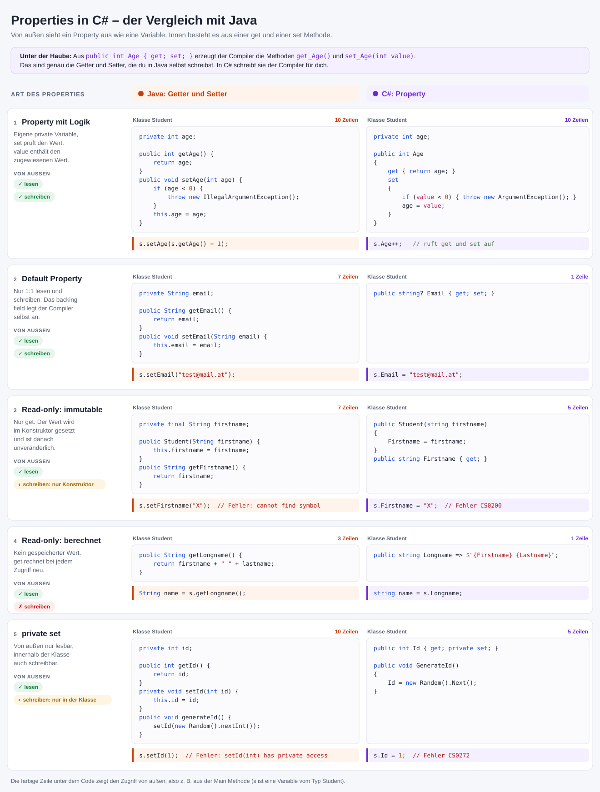

# Properties und Initializer in C#

## Erstellen einer Visual Studio Solution

Um die Beispiele mitmachen zu können, muss eine .NET Konsolenapplikation erstellt werden. Führe
dafür die folgenden Befehle in der Konsole aus. Unter macOs müssen md und rd durch die entsprechenden
Befehle ersetzt werden.

```text
rd /S /Q PropertiesDemo
md PropertiesDemo
cd PropertiesDemo
md PropertiesDemo.Application
cd PropertiesDemo.Application
dotnet new console
cd ..
dotnet new sln -f sln
dotnet sln add PropertiesDemo.Application
start PropertiesDemo.sln

```

Öffne danach durch Doppelklick auf das Projekt (*PropertiesDemo.Application*) die Datei
*PropertiesDemo.Application.csproj* und füge die Optionen für
*Nullable* und *TreatWarningsAsError* hinzu. Die gesamte Konfiguration muss nun so aussehen:

```xml
<Project Sdk="Microsoft.NET.Sdk">

  <PropertyGroup>
    <OutputType>Exe</OutputType>
    <TargetFramework>net10.0</TargetFramework>
    <Nullable>enable</Nullable>
    <TreatWarningsAsErrors>true</TreatWarningsAsErrors>
  </PropertyGroup>

</Project>
```
## Wozu Properties?

Betrachten wir eine Klasse *Student*, mit den get und set Methoden, wie wir sie aus Java kennen:

```c#
class Student
{
    string firstname;
    string lastname;
    int age;

    public Student(string firstname, string lastname)
    {
        this.firstname = firstname;
        this.lastname = lastname;
        setAge(0);
    }

    public Student(string firstname, string lastname, int age)
    {
        this.firstname = firstname;
        this.lastname = lastname;
        setAge(age);
    }

    public void setAge(int age)
    {
        if (age >= 0)
        {
            this.age = age;
        }
        else
        {
            throw new ArgumentException("Ungültiges Age");
        }
    }

    public int getAge()
    {
        return age;
    }
}
```

Es fallen 2 Dinge auf:
- Die get und set Methoden, die für Datenprüfungen zuständig sind, haben oft den gleichen Aufbau.
- Es sind mehrere Konstruktoren vorhanden, je nach dem welche Variablen initialisiert werden sollen.

## Properties ersetzen get und set Methoden

Wir schreiben nun für die Felder *age*, *firstname* und *lastname* sogenannte Properties. Properties erscheinen
nach außen wie Variablen, es wird aber bei der Zuweisung ein Stück Code - nämlich der in set - ausgeführt.
Das Schema ist folgendes:
- Anlegen der private Variable. Sie beginnen in C# mit einem Kleinbuchstaben.
- Anlegen der Properties. Sie beginnen in C# mit einem Großbuchstaben.
- Die get Methode kann beliebige Anweisungen enthalten. Sie muss allerdings einen Wert zurückgeben.
- Die set Methode kann auch beliebig aufgebaut sein. Der zugewiesene Wert ist in *value* enthalten.
  
```c#
class Student
{
    private string firstname, lastname;
    private int age;

    public Student(string firstname, string lastname, int age)
    {
        this.firstname = firstname;
        this.lastname = lastname;
        this.age = age;
    }

    public string Firstname
    {
        get { return firstname; }
        set { firstname = value; }
    }
    public string Lastname
    {
        get { return lastname; }
        set { lastname = value; }
    }
    public int Age
    {
        get { return age; }
        set { age = value >= 0 ? value : throw new ArgumentException("Ungültiges Age!"); }
    }
}
```

> **Achtung:** Oft ist folgender Fehler zu beobachten. *Age* ist in der get Methode
> großgeschrieben, daher wird eine endlose Rekursion erzeugt:

```c#
public int Age
{
    get { return Age; }
}
```

### Default Properties

Die Properties für *Firstname* und *Lastname* weisen nur 1:1 zu bzw. geben den Wert 1:1 zurück. In C# gibt
es mit den *Default Properties* einen eleganteren Weg, das zu bewerkstelligen. Der Compiler erledigt
folgende Dinge:

- Es wird automatisch eine private Variable im Hintergrund (das *backing field*) vom Compiler angelegt.
- Die get und set Methode liefert diese 1:1 zurück bzw. schreibt in diese hinein.
  
```c#
class Student
{
    public Student(string firstname, string lastname)
    {
        Firstname = firstname;
        Lastname = lastname;
    }

    public string Firstname { get; set; }
    public string Lastname { get; set; }
}
```

Möchte man die Default Properties gleich initialisieren, ist dies seit C# 6 auch möglich. Der
Konstruktor kann hier weggelassen werden, da sicher eine Initialisierung erfolgt.

```c#
class Student
{
    public string Firstname { get; set; } = string.Empty;
    public string Lastname { get; set; } = string.Empty;
}
```

### Read-only Properties

#### Berechnete Werte

Wird nur eine get Methode definiert, so kann diesem Property nichts zugewiesen werden. Dies ist
bei berechneten Werten sinnvoll.

```c#
class Student
{
    public string Longname
    {
        get { return $"{Firstname} {Lastname}"; }
    }
}
```

Ab C# 7 wurden Expression-bodied members auch für Properties eingeführt. Dadurch kann das
folgende Property kürzer definiert werden. Es handelt sich aber immer noch um eine Methode,
d. h. sie wird bei jedem Zugriff auf *Longname* ausgeführt und liefert die aktuellen Werte.

```c#
class Student
{
    public string Longname => $"{Firstname} {Lastname}";
}
```

#### Unveränderliche Werte (immutable)

Oft sollen Properties nach ihrer Initialisierung nicht mehr verändert werden. So ist z. B. die
Änderung von Vor- und Lastname nach Instanzierung der *Student* Klasse nicht notwendig. Die E-Mail
Adresse soll jedoch geändert werden können. Durch die Definition mit *get* lassen sich die
Properties *Firstname* und *Lastname* nur im Konstruktor oder durch Initialisierung mit =
setzen.

```c#
class Student
{
    public Student(string firstname, string lastname)
    {
        Firstname = firstname;
        Lastname = lastname;
    }
    public string Firstname { get; }
    public string Lastname { get; } 
    public string? Email { get; set; }  // Nullable, daher nicht im Konstruktor.
}
```

#### private set Properties

Sollen Properties wie Id nur innerhalb der Klasse geschrieben werden können, so kann die
set Methode auch private (oder protected) definiert werden.

```c#
class Student
{
    public Student(string firstname, string lastname)
    {
        Firstname = firstname;
        Lastname = lastname;
    }
    public int Id { get; private set; }
    public string Firstname { get; }
    public string Lastname { get; } 
    public string? Email { get; set; }
    public void GenerateId()
    {
        Id = new Random().Next();
    }
}
```

### Überblick: Getter und Setter in Java vs. Properties in C#

Die folgende Grafik fasst die Arten von Properties zusammen und stellt sie dem gleichwertigen
Java Code gegenüber.



## Verwendung der Properties, Initializer

Der große Vorteil von Properties liegt in ihrer eleganten Verwendung. Folgende Anweisungen sind
dadurch möglich:

```c#
Student student = new Student(firstname: "VN1", lastname: "ZN1")
{
    Email = "test@mail.at"
};
```
Was passiert hier? Zuerst wird ein Objekt vom Typ Student mit *new Student(...)* erzeugt. Da ein
Konstruktor definiert wurde, existiert kein default Konstruktor und wir müssen daher die notwendigen
Argumente übergeben. In C# ist es durch den *initializer* möglich, Properties gleich *nach* der
Instanzierung zu initialisieren.

Da die set Methoden durchlaufen werden, wird die Datenprüfung natürlich auch im Initializer ausgeführt.

### Target-typed new (C# 9)

In den bisherigen Beispielen steht der Typ *Student* zweimal in der Zeile. Ist der Typ der Variable
schon bekannt, kann er bei *new* weggelassen werden:

```c#
Student student = new(firstname: "VN1", lastname: "ZN1") { Email = "test@mail.at" };
```

## Übung 1: Rectangle und Teacher

Erstelle wie oben beschrieben die Solution *PropertiesDemo*. Es sind 2 Klassen zu implementieren:
*Rectangle* und *Teacher*.

Für die Klasse *Rectangle* gelten folgende Regeln:
- Es gibt 2 int Properties mit dem Namen *Width* und *Height*.
- Diese Properties dürfen nur in der Klasse zugewiesen werden und nicht von außen.
- Wird diesen Properties ein Wert kleiner als 0 zugewiesen, wird mittels 
  *throw new ArgumentException("Ungültige Länge")*
  eine Exception geworfen.
- Das Property *Area* ist read-only und wird mit Länge x Breite ermittelt.
- Die Methode *Scale()* skaliert Länge und Breite mit dem übergebenen Faktor. Die Prüfung, ob
  ein negativer Scalingfaktor zu ungültigen Werten in *Width* und *Height* führt soll nicht in
  der Methode implementiert werden.


Für die Klasse *Teacher* gelten folgende Regeln:
- Die string Properties *Firstname* und *Lastname* sind default Properties und immutable.
- Das Property *Longname* soll den Namen in der Form *Firstname Lastname* zurückgeben.
- Das Property *Shortname* soll read-only definiert werden. Es gibt die ersten 3 Stellen des Lastnamens
  in Großschreibung zurück. Die Methoden *Substring(0, 3)* und *ToUpper()* können hier verwendet werden.
- Das string Property *Email* kann leere Werte enthalten und kann auch nach der Instanzierung
  gesetzt werden.
- Das Property *IsSchoolEmail* ist ein berechneter Wert und liefert true, wenn in der Email der String
  "@spengergasse.at" gefunden wurde. Prüfe dies mit *EndsWith()*
- Das Property *Salary* soll decimal Werte speichern und den Standardwert null haben. Überlege
  dir den Datentyp, der diese Werte speichern kann. Für die Zuweisung gilt eine spezielle Regelung:
  Wurde schon ein Gehalt zugewiesen (Wert also ungleich null), so darf dieser nicht überschrieben werden.
  Bei einer Zuweisung soll in diesem Fall einfach nichts passieren.
- Das Property *NetSalary* liefert 80% des Bruttogehaltes (also * 0.8M). Beachte, dass decimal Literale
  mit M enden müssen (also 0.8M). Ist das Bruttogehalt null, so soll das Nettogehalt 0 sein. Der Wert
  von Nettogehalt ist also niemals null. Löse diese Berechnung mit dem ?? Operator.

Verwende wenn möglich C# 7 Expression Bodies. Überlege dir, ob *Longname*, *IsSchoolEmail* und
*NetSalary* Methoden sein müssen oder die Werte fix gesetzt werden können.

Die Ausgabe des Programmes muss am Ende so lauten:

```
********************************************************************************
TESTS FÜR RECTANGLE
********************************************************************************
1 Kein default Konstruktor OK
2 Area OK
3 Scale OK
4 Kein Setzen der Breite und Höhe: OK
5 Exception bei negativer Breite OK
6 Exception bei negativer Höhe OK
7 Exception bei Scale OK
********************************************************************************
TESTS FÜR TEACHER
********************************************************************************
1 Kein default Konstruktor OK
2 Vor- und Zuname sind immutable: OK
3 Longname OK
4 Shortname OK
5 NetSalary OK
6 Salary OK
7 IsSchoolEmail OK
```

### Program.cs
```c#
using System;

namespace PropertiesDemo.Application
{
    class Rectangle
    {
    // TODO: Implementierung von Rectangle

    }

    class Teacher
    {
    // TODO: Implementierung von Teacher
    }

    class Program
    {
        // DON'T TOUCH!
        private static void Main(string[] args)
        {
            Console.WriteLine("********************************************************************************");
            Console.WriteLine("TESTS FÜR RECTANGLE");
            Console.WriteLine("********************************************************************************");
            if (typeof(Rectangle).GetConstructor(Type.EmptyTypes) is null) { Console.WriteLine("1 Kein default Konstruktor OK"); }
            Rectangle rect = new Rectangle(width: 10, height: 20);
            if (rect.Area == 200) { Console.WriteLine("2 Area OK"); }
            rect.Scale(2);
            if (rect.Area == 800) { Console.WriteLine("3 Scale OK"); }

            if (typeof(Rectangle).GetProperty(nameof(Rectangle.Width))?.SetMethod?.IsPublic == false
                && typeof(Rectangle).GetProperty(nameof(Rectangle.Height))?.SetMethod?.IsPublic == false)
            {
                Console.WriteLine("4 Kein Setzen der Breite und Höhe: OK");
            }
            try
            {
                Rectangle rect2 = new Rectangle(width: -1, height: 20);
            }
            catch (ArgumentException)
            {
                Console.WriteLine("5 Exception bei negativer Breite OK");
            }
            try
            {
                Rectangle rect2 = new Rectangle(width: 10, height: -1);
            }
            catch (ArgumentException)
            {
                Console.WriteLine("6 Exception bei negativer Höhe OK");
            }
            try
            {
                rect.Scale(-1);
            }
            catch (ArgumentException)
            {
                Console.WriteLine("7 Exception bei Scale OK");
            }

            Console.WriteLine("********************************************************************************");
            Console.WriteLine("TESTS FÜR TEACHER");
            Console.WriteLine("********************************************************************************");
            if (typeof(Teacher).GetConstructor(Type.EmptyTypes) is null) { Console.WriteLine("1 Kein default Konstruktor OK"); }
            if (typeof(Teacher).GetProperty(nameof(Teacher.Firstname))?.CanWrite == false
                && typeof(Teacher).GetProperty(nameof(Teacher.Lastname))?.CanWrite == false)
            {
                Console.WriteLine("2 Vor- und Zuname sind immutable: OK");
            }

            Teacher t1 = new Teacher(firstname: "Fn", lastname: "Ln");
            Teacher t2 = new Teacher(firstname: "Fn", lastname: "Lastname") { Email = "test@spengergasse.at", Salary = 2000M };
            if (typeof(Teacher).GetProperty(nameof(Teacher.Longname))?.CanWrite == false
                && t1.Longname == "Fn Ln") { Console.WriteLine("3 Longname OK"); }
            if (typeof(Teacher).GetProperty(nameof(Teacher.Shortname))?.CanWrite == false
                && t1.Shortname == "LN" && t2.Shortname == "LAS") { Console.WriteLine("4 Shortname OK"); }
            if (t1.NetSalary == 0 && t2.NetSalary == 1600) { Console.WriteLine("5 NetSalary OK"); }
            t1.Salary = 1000;
            t2.Salary = 1000;
            if (t1.Salary == 1000 && t2.Salary == 2000) { Console.WriteLine("6 Salary OK"); }
            if (typeof(Teacher).GetProperty(nameof(Teacher.IsSchoolEmail))?.CanWrite == false
                && !t1.IsSchoolEmail && t2.IsSchoolEmail) { Console.WriteLine("7 IsSchoolEmail OK"); }
        }
    }
}
```

## Übung 2: Charaktere für ein Rollenspiel

Erstelle wie oben beschrieben eine Solution *RpgDemo* mit dem Projekt *RpgDemo.Application*. Es sind
2 Klassen zu implementieren: *Weapon* und *Character*. Die Übung kombiniert alle Arten von
Properties aus diesem Kapitel.

Für die Klasse *Weapon* gelten folgende Regeln:
- Die Klasse hat einen Konstruktor mit den Parametern *name* (string) und *damage* (int).
- Die Properties *Name* und *Damage* werden im Konstruktor gesetzt und sind immutable.
- Ist *damage* nicht größer als 0, wird mittels *throw new ArgumentException("Ungültiger Schaden")*
  eine Exception geworfen.
- Das Property *DisplayName* ist read-only und liefert den Namen und den Schaden in der Form
  *Schwert (+15)*.

Für die Klasse *Character* gelten folgende Regeln:
- Die Klasse hat einen Konstruktor mit den Parametern *name* (string), *maxHealth* (int) und
  *strength* (int).
- Die Properties *Name*, *MaxHealth* und *Strength* werden im Konstruktor gesetzt und sind immutable.
  Ist *maxHealth* nicht größer als 0, wird eine *ArgumentException* geworfen.
- Das int Property *Health* hat am Anfang den Wert von *MaxHealth*. Es darf nur in der Klasse
  gesetzt werden. Die set Methode stellt sicher, dass der Wert immer zwischen 0 und *MaxHealth* liegt.
  Zu kleine Werte werden also auf 0, zu große auf *MaxHealth* gesetzt. Verwende dafür eine private
  Variable und die Methode *Math.Clamp(value, min, max)*. Achte im Konstruktor auf die Reihenfolge
  der Zuweisungen.
- Das Property *IsAlive* ist read-only und liefert true, wenn *Health* größer als 0 ist.
- Das Property *Weapon* speichert die Waffe des Charakters. Ein Charakter muss keine Waffe haben,
  die Waffe kann aber jederzeit gesetzt werden. Überlege dir den Datentyp.
- Das Property *AttackPower* ist read-only und liefert *Strength* plus *Damage* der Waffe. Hat der
  Charakter keine Waffe, ist es nur *Strength*.
- Das int Property *Experience* hat am Anfang den Wert 0 und darf nur in der Klasse gesetzt werden.
- Das Property *Level* ist read-only und wird mit *1 + Experience / 100* berechnet. Ein Charakter mit
  250 Erfahrungspunkten hat also Level 3.
- Die Methode *TakeDamage(int damage)* verringert *Health* um den übergebenen Wert. Bei einem
  negativen Wert wird eine *ArgumentException* geworfen.
- Die Methode *Heal(int amount)* erhöht *Health* um den übergebenen Wert. Ist der Charakter nicht
  mehr am Leben, passiert nichts.
- Die Methode *GainExperience(int points)* erhöht *Experience*. Bei einem negativen Wert wird eine
  *ArgumentException* geworfen.
- Die Methode *Attack(Character target)* fügt dem Ziel Schaden in der Höhe von *AttackPower* zu.
  Stirbt das Ziel durch diesen Angriff, bekommt der Angreifer 50 Erfahrungspunkte. Ist der Angreifer
  oder das Ziel nicht mehr am Leben, passiert nichts.

Überlege dir bei jedem Property, ob du *get*, *set* oder *private set* brauchst und ob der Wert
gespeichert oder berechnet werden soll. Die Prüfung von *Health* in *TakeDamage()* und *Heal()*
ist nicht nötig, das erledigt die set Methode.

Die Ausgabe des Programmes muss am Ende so lauten:

```
********************************************************************************
TESTS FÜR WEAPON
********************************************************************************
1 Kein default Konstruktor OK
2 Name und Damage sind immutable OK
3 DisplayName OK
4 Exception bei ungültigem Schaden OK
********************************************************************************
TESTS FÜR CHARACTER
********************************************************************************
1 Kein default Konstruktor OK
2 Name, MaxHealth und Strength sind immutable OK
3 Werte aus dem Konstruktor, Health startet mit MaxHealth OK
4 Health und Experience sind von außen nicht setzbar OK
5 Exception bei ungültiger MaxHealth OK
6 TakeDamage OK
7 Exception bei negativem Schaden OK
8 Heal OK
9 Health wird nicht negativ, Tote werden nicht geheilt OK
10 AttackPower OK
11 Experience und Level OK
12 Exception bei negativer Erfahrung OK
13 Attack OK
```

### Program.cs
```c#
using System;
using System.Reflection;

namespace RpgDemo.Application;

class Weapon
{
    // TODO: Implementierung von Weapon
}

class Character
{
    // TODO: Implementierung von Character
}

class Program
{
    // DON'T TOUCH!
    private static void Main(string[] args)
    {
        Console.WriteLine("********************************************************************************");
        Console.WriteLine("TESTS FÜR WEAPON");
        Console.WriteLine("********************************************************************************");
        if (typeof(Weapon).GetConstructor(Type.EmptyTypes) is null) { Console.WriteLine("1 Kein default Konstruktor OK"); }
        if (IsReadOnly(typeof(Weapon), nameof(Weapon.Name)) && IsReadOnly(typeof(Weapon), nameof(Weapon.Damage)))
        {
            Console.WriteLine("2 Name und Damage sind immutable OK");
        }
        Weapon sword = new Weapon(name: "Schwert", damage: 15);
        if (IsReadOnly(typeof(Weapon), nameof(Weapon.DisplayName)) && sword.DisplayName == "Schwert (+15)")
        {
            Console.WriteLine("3 DisplayName OK");
        }
        try
        {
            Weapon stick = new Weapon(name: "Stock", damage: 0);
        }
        catch (ArgumentException)
        {
            Console.WriteLine("4 Exception bei ungültigem Schaden OK");
        }

        Console.WriteLine("********************************************************************************");
        Console.WriteLine("TESTS FÜR CHARACTER");
        Console.WriteLine("********************************************************************************");
        if (typeof(Character).GetConstructor(Type.EmptyTypes) is null) { Console.WriteLine("1 Kein default Konstruktor OK"); }
        if (IsReadOnly(typeof(Character), nameof(Character.Name))
            && IsReadOnly(typeof(Character), nameof(Character.MaxHealth))
            && IsReadOnly(typeof(Character), nameof(Character.Strength)))
        {
            Console.WriteLine("2 Name, MaxHealth und Strength sind immutable OK");
        }
        Character hero = new Character(name: "Link", maxHealth: 100, strength: 10);
        if (hero.Name == "Link" && hero.MaxHealth == 100 && hero.Strength == 10 && hero.Health == 100 && hero.IsAlive)
        {
            Console.WriteLine("3 Werte aus dem Konstruktor, Health startet mit MaxHealth OK");
        }
        if (HasPrivateSetter(typeof(Character), nameof(Character.Health))
            && HasPrivateSetter(typeof(Character), nameof(Character.Experience)))
        {
            Console.WriteLine("4 Health und Experience sind von außen nicht setzbar OK");
        }
        try
        {
            Character ghost = new Character(name: "Ghost", maxHealth: 0, strength: 10);
        }
        catch (ArgumentException)
        {
            Console.WriteLine("5 Exception bei ungültiger MaxHealth OK");
        }

        hero.TakeDamage(30);
        if (hero.Health == 70) { Console.WriteLine("6 TakeDamage OK"); }
        try
        {
            hero.TakeDamage(-10);
        }
        catch (ArgumentException)
        {
            if (hero.Health == 70) { Console.WriteLine("7 Exception bei negativem Schaden OK"); }
        }
        hero.Heal(20);
        int healthAfterSmallHeal = hero.Health;
        hero.Heal(500);
        if (healthAfterSmallHeal == 90 && hero.Health == 100) { Console.WriteLine("8 Heal OK"); }

        Character dummy = new Character(name: "Dummy", maxHealth: 50, strength: 10);
        dummy.TakeDamage(80);
        dummy.Heal(10);
        if (dummy.Health == 0 && !dummy.IsAlive && IsReadOnly(typeof(Character), nameof(Character.IsAlive)))
        {
            Console.WriteLine("9 Health wird nicht negativ, Tote werden nicht geheilt OK");
        }

        int attackPowerWithoutWeapon = hero.AttackPower;
        hero.Weapon = sword;
        if (IsReadOnly(typeof(Character), nameof(Character.AttackPower))
            && attackPowerWithoutWeapon == 10 && hero.AttackPower == 25)
        {
            Console.WriteLine("10 AttackPower OK");
        }

        hero.GainExperience(250);
        if (IsReadOnly(typeof(Character), nameof(Character.Level)) && hero.Experience == 250 && hero.Level == 3)
        {
            Console.WriteLine("11 Experience und Level OK");
        }
        try
        {
            hero.GainExperience(-1);
        }
        catch (ArgumentException)
        {
            Console.WriteLine("12 Exception bei negativer Erfahrung OK");
        }

        // The hero hits the orc 3 times with an attack power of 25 (60 -> 35 -> 10 -> 0).
        Character orc = new Character(name: "Ork", maxHealth: 60, strength: 25);
        hero.Attack(orc);
        int orcHealthAfterFirstAttack = orc.Health;
        hero.Attack(orc);
        hero.Attack(orc);
        // A dead orc cannot be attacked, so the hero gets the 50 points only once.
        hero.Attack(orc);
        if (orcHealthAfterFirstAttack == 35 && !orc.IsAlive && hero.Experience == 300)
        {
            Console.WriteLine("13 Attack OK");
        }
    }

    /// <summary>
    /// Returns true if the property exists and has no set method at all.
    /// </summary>
    private static bool IsReadOnly(Type type, string propertyName)
    {
        PropertyInfo? property = type.GetProperty(propertyName);
        return property is not null && !property.CanWrite;
    }

    /// <summary>
    /// Returns true if the property has a set method that cannot be called from outside the class.
    /// </summary>
    private static bool HasPrivateSetter(Type type, string propertyName)
    {
        PropertyInfo? property = type.GetProperty(propertyName);
        return property is not null && property.SetMethod is not null && !property.SetMethod.IsPublic;
    }
}
```
