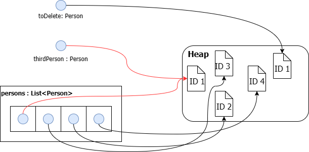

# Collections in .NET

## Erstellen einer Visual Studio Solution

Um die Beispiele mitmachen zu können, muss eine .NET Konsolenapplikation erstellt werden. Führe
dafür die folgenden Befehle in der Konsole aus. Unter macOs müssen md und rd durch die entsprechenden
Befehle ersetzt werden.

```text
rd /S /Q CollectionDemo
md CollectionDemo
cd CollectionDemo
md CollectionDemo.Application
cd CollectionDemo.Application
dotnet new console
cd ..
dotnet new sln
dotnet sln add CollectionDemo.Application
start CollectionDemo.sln

```

Öffne danach durch Doppelklick auf das Projekt (*CollectionDemo.Application*) die Datei
*CollectionDemo.Application.csproj* und füge die Optionen für
*Nullable* und *TreatWarningsAsError* hinzu. Die gesamte Konfiguration muss nun so aussehen:

```xml
<Project Sdk="Microsoft.NET.Sdk">

  <PropertyGroup>
    <OutputType>Exe</OutputType>
    <TargetFramework>net5.0</TargetFramework>
    <Nullable>enable</Nullable>
    <TreatWarningsAsErrors>true</TreatWarningsAsErrors>
  </PropertyGroup>

</Project>
```

## Das Array als einfachste Collection

Wie in Java können mehrere Elemente des gleichen Typs als Array deklariert werden. Natürlich können
auch Referenztypen wie eigene Klassen, ... in Arrays verwaltet werden. Durch den *new* Operator
ist erkennbar, dass diese Datenstruktur am Heap angelegt wird. Das bedeutet, dass der Garbage
Collector diese Daten wieder entfernen muss. Daher macht es einen Unterschied, ob 2 getrennte
Werte wie *int x; int y;* oder ein zweidimensionales Array verwendet wird.

```c#
int length = 6;
int[] numbers = new int[6];         // (1)
int[] numbers2 = new int[length];   // (2)

int[] numbersDrawn = new int[] { 1, 2, 3, 4, 5, 6 };  // (3)
```

- **(1)** Wird ein Array mit einer fixen Größe definiert, werden alle Elemente mit dem default
  Wert initialisiert. Numbers hat daher den Inhalt [0, 0, 0, 0, 0, 0].
- **(2)** Es kann auch eine Variable zur Definition der Länge verwendet werden, sie muss nicht statisch
  sein.
- **(3)** Stehen die zu speichernden Elemente bereits fest, so kann der Initializer das Array befüllen.
  Eine Längenangabe ist dann überflüssig (und führt zu einen Fehler wenn die angegebene Länge der
  Anzahl der Elemente widerspricht).

### Jagged Arrays

Fälschlich als "mehrdimensionales" Array wird das aus Java bekannte *jagged array*
bezeichnet. In Wirklichkeit ist es ein Array, welches auf weitere Arrays im Heap verweist.


<small>Quelle: https://media.geeksforgeeks.org/wp-content/uploads/20201202202711/Untitled4-660x306.png</small>

Dadurch können die Elemente auch unterschiedliche Längen haben, wie folgendes Beispiel zeigt:

```c#
int[][] quickTipp = new int[][]
{
    new int[]{1,2,3,4,5,6},
    new int[]{8,9,10,11,12,13},
    new int[]{14,16}
};
for (int i = 0; i < quickTipp.Length; i++)
{
    Console.Write($"{i + 1}. TIPP: ");
    for (int j = 0; j < quickTipp[i].Length; j++)
    {
        Console.Write($"{quickTipp[i][j]:00} ");
    }
    Console.WriteLine();
}
```

### "Echte" mehrdimensionale Arrays

Ein "echtes" mehrdimensionales Array besteht aus Elementen, die im Speicher linear aufeinanderfolgend
vorliegen. Die Position wird einfach mittels *row x length + col* berechnet. Die erste (äußere)
Dimension ist meist die Zeile, sodass in der inneren Schleife aufeinanderfolgende Speicherbereiche
gelesen werden können. Dies erhöht die Performance, da der CPU Cache nachfolgende Elemente
einliest.

```c#
int[,] matrix = new int[,]
{
    { 1,2,3 },
    { 4,5,6 }
};
for (int row = 0; row < matrix.GetLength(0); row++)
{
    for (int col = 0; col < matrix.GetLength(1); col++)
    {
        Console.Write($"{matrix[row, col]:00} ");
    }
    Console.WriteLine();
}
```

> **Hinweis:** Das mehrdimensionale Array ist ein sehr spezieller Typ und sollte nur
> dann verwendet werden, wenn die Organisation im Speicher aus Performancegründen wesentlich ist.
> OpenCV z. B. speichert seine Transformationsmatrizen als "echte" zweidimensionale Arrays.

## List&lt;T&gt; als flexiblerer Ersatz für Arrays

Arrays haben einen Nachteil: Sie können in der Größe nicht mehr verändert werden, d. h. es gibt
keine *Add()* oder *Remove()* Methode. Daher findet sich in den meisten Programmen der Typ
*List&lt;T&gt;*. Der Zugang zu Collections im Allgemeinen führt über den Namespace
*System.Collections.Generic*. Er muss mit *using* eingebunden werden:

```c#
using System.Collections.Generic;
```


## Interner Aufbau der Klasse List&lt;T&gt;

Der Typ *List&lt;T&gt;* verwendet im Inneren ein Array zur Verwaltung der Daten. Es wird zu Beginn mit
4 Stellen definiert. Werden durch *Add()* mehr Elemente benötigt, wird ein neues internes Array
mit doppelt so vielen Elementen definiert und der Speicher muss kopiert werden. Der Zugriff auf
Elemente ist daher genauso schnell wie bei einem Array.

Für unsere Beispiele verwenden wir die Klasse Person, eine datenhaltende Klasse mit 3 Properties:
```c#
class Person
{
    public Person(int id, string firstname, string lastname)
    {
        Id = id;
        Firstname = firstname;
        Lastname = lastname;
    }

    public int Id { get; }
    public string Firstname { get; set; }
    public string Lastname { get; set; }

    public override string ToString() => $"{Id} - {Firstname} {Lastname}";
}
```

Listen werden generisch durch Angabe des zu speichernden Typs erstellt. Nützlich in C#:
Auch der Initializer kann verwendet werden.

```c#
// using System.Collections.Generic;
List<Person> persons1 = new List<Person>();
// kürzer: var persons2 = new List<Person>()
List<Person> persons2 = new List<Person>()
{
    new Person(id: 1, firstname: "FN1", lastname: "LN1"),
    new Person(id: 2, firstname: "FN2", lastname: "LN2"),
    new Person(id: 3, firstname: "FN3", lastname: "LN3")
};
```

### Abfragen, Hinzufügen und Löschen von Elementen

Der Indexer ([]) greift - wie bei einem Array - nullbasierend auf das n-te Element zu. Mit der Methode
*Add()* wird ein neues Element in die Liste eingefügt. Natürlich kann auch mit *foreach* durch die Liste
iteriert werden.

```c#
persons.Add(new Person(id: 4, firstname: "FN4", lastname: "LN4"));

Person thirdPerson = persons[2];                        // (1)
thirdPerson.Lastname = "Other Name";                    // (2)
Console.WriteLine($"Found {persons.Count} Persons");    // (3)
foreach (Person p in persons)                           // (4)
{
    Console.WriteLine(p);
}
```

- **(1)** Mit dem Index Operator [] kann auf ein Element zugegriffen werden.
- **(2)** Da eine Liste nur Referenzen auf die mit new erzeugen Objekte, aber nicht die Objekte
  selbst (bei Referenztypen) beinhaltet, wird auch bei der Ausgabe "Other Name" zu sehen sein.
- **(3)** Das Property *Count* liefert die Anzahl der Elemente in der Liste.
- **(4)** Die Liste implementiert das Interface *IEnumerable&lt;T&gt;*. Dadurch kann mit foreach die
  Liste durchgegangen werden.

Werden Elemente gelöscht, wird über die *Equals()* Methode nach Elementen in der Liste gesucht. Daher wird
die Person mit der ID 1 nicht gelöscht, da toDelete eine andere Rerefenzadresse besitzt.

```c#
// kürzer: var toDelete = ...
Person toDelete = new Person(id: 1, firstname: "FN1", lastname: "LN1");
persons.Remove(toDelete);
Console.WriteLine($"Found {persons.Count} Persons");

persons.Remove(thirdPerson);
Console.WriteLine($"Found {persons.Count} Persons");
```

Dieses etwas seltsame verhalten wird schnell klarer, wenn wir uns den Speicher ansehen. Es wurde
4x mit *new* eine Person erzeugt. Dadurch sind 4 Instanzen im Heap. Die Referenzen darauf sehen
so aus:



## Das Dictionary (HashMap in Java)

Der Zugriff auf Elemente einer Liste erfolgt über den Index. Möchten wir z. B. nach einer Person
mit der ID 2 suchen, so müssen wir die Liste durchlaufen. Im schlechtesten Fall (Element wird nicht
gefunden) benötigt dies n Vergleiche.

Das *Dictionary* hat die Möglichkeit, einen Key zu definieren. Er muss eindeutig sein und
über den Indexer ist ein Zugriff über den Key möglich. Es kann jeder Datentyp als Key (auch eigene
Typen) verwendet werden.

Das folgende Beispiel erstellt ein Dictionary mit einem *int* Feld als Key und einer Person als Wert.
Es kann auch hier der Indexer verwendet werden.

```c#
// kürzer: var personsDict = new Dictionary<string, Person>()
Dictionary<string, Person> personsDict = new Dictionary<string, Person>()
{
    {"A", new Person(id: 1, firstname: "FN1", lastname: "LN1") },
    {"B", new Person(id: 2, firstname: "FN2", lastname: "LN2") },
    {"C", new Person(id: 3, firstname: "FN3", lastname: "LN3") }
};

// Add benötigt 2 Argumente: Key und Value.
personsDict.Add("D", new Person(id: 4, firstname: "FN4", lastname: "LN4"));
```

#### Zugriff auf Elemente

Über den Indexoperator kann die Person B ausgelesen werden. Mit *foreach* kann das Dictionary
durchlaufen werden. Es wird dann ein KeyValuePair zurückgegeben, welches den Key im Dictionary und
das eigentliche Objekt im Property *Value* enthält.
```c#
Person personB = personsDict["B"];
foreach (KeyValuePair<string, Person> p in personsDict)  // kürzer: foreach (var p in personDict)
{
    Console.WriteLine($"Person {p.Key} hat den Zunamen {p.Value.Lastname}");
}
```

Das Löschen von Elementen wird mit *Remove()* über den Key durchgeführt:
```c#
personDict.Remove("A");
```

#### TryGetValue() und TryAdd()

Wird in einem Dictionary versucht, einen bestehenden Key hinzuzufügen, wird eine *ArgumentException
(An item with the same key has already been added)* ausgelöst. Der Zugriff auf einen nicht
vorhandenen Index führt ebenso zu einer Exception.
```c#
// ArgumentException: An item with the same key has already been added
personDict.Add("D", new Person(id: 5, firstname: "FN5", lastname: "LN5"));
Person notFound = personDict["Z"];
```

Daher gibt es bessere Methoden, um Daten zu suchen oder zu schreiben:
```c#
if (personsDict.TryGetValue("C", out Person? found))
{
    Console.WriteLine(found.Lastname);
}
if (!personsDict.TryAdd("D", new Person(id: 4, firstname: "FN4", lastname: "LN4")))
{
    Console.WriteLine("Person D ist bereits im Dictionary.");
}
```


## HashSet (HashSet in Java)

Einen Spezialfall stellt das Hashset dar. Oft sollen - wie bei *DISTINCT* in SQL - doppelte Werte entfernt
werden. Das Hashset speichert durch *Add()* nur den ersten Wert, nachfolgende idente Werte werden ignoriert.
Die Gleichheit wird bei Referenztypen auch über *Equals()* ermittelt.
```c#
HashSet<string> teacherHashSet = new HashSet<string>();
teacherHashSet.Add("SZ");
// Wird einfach ignoriert.
teacherHashSet.Add("SZ");
foreach(string teacher in teacherHashSet)
{
    Console.WriteLine(teacher);                // Gibt 1x SZ aus.
}            
```

Das HashSet bietet keinen direkten Zugriff auf die Elemente. Oft wird es im Zusammenhang mit
der Contains Methode verwendet, da es eine binäre Suche bietet.

```c#
if (teacherHashSet.Contains("SZ")) { ... }
```

## Übung

Erstelle ein Projekt mit dem Namen *CollectionDemo* wie oben beschrieben. Ersetze danach den Inhalt
von Program.cs durch die untenstehende Version. Vervollständige die 2 Klassen 
*SchoolClass* und *Student* so, dass die Ausgaben des Programmes korrekt sind.

```c#
using System;
using System.Collections.Generic;
using System.Linq;
using System.Text.Json;
using System.Text.Json.Serialization;

namespace ExColletions
{
    /// <summary>
    /// TODO: 
    ///    - Create a constructor to initialize Name, ClassTeacher (KV).
    ///    - Add a List of students to manage the students in this class.
    ///    - Use IReadOnlyList for your public property. It should NOT be possible to add or remove students from outside
    ///      without calling AddStudent or RemoveStudent.
    ///    - Add a read-only property of type HashSet<string> to get the different cities in this class.
    /// </summary>
    class SchoolClass
    {
        public string Name { get; }
        public string ClassTeacher { get; }
        /// <summary>
        /// Adds a student and modifies the schoolclass reference of the provided
        /// student.
        /// </summary>
        public void AddStudent(Student s)
        {
        }

        /// <summary>
        /// Removes a student and modifies the schoolclass reference of the provided
        /// student.
        /// </summary>
        public void RemoveStudent(Student s)
        {
        }
    }

    /// <summary>
    /// TODO: 
    ///    - Add a constructor to initialize the properties Id, Firstname, Lastname and City.
    ///    - Add a reference to the class of the student (type SchoolClass). This reference is optional,
    ///      if a student is not assigned to a class is has the value null.
    ///    - Add an annotation [JsonIgnore] above this property to suppress the content of
    ///      the class object in your serialized output.
    /// </summary>
    class Student
    {
        public int Id { get; }
        public string Lastname { get; }
        public string Firstname { get; }
        public string City { get; set; }
        /// <summary>
        /// Updates the reference of the student and adds the student to the new class.
        /// </summary>
        /// <param name="k"></param>
        public void ChangeClass(SchoolClass k)
        {
        }
    }

    class Program
    {
        static void Main(string[] args)
        {
            Dictionary<string, SchoolClass> classes = new();
            classes.Add("3AHIF", new SchoolClass(name: "3AHIF", classTeacher: "KV1"));
            classes.Add("3BHIF", new SchoolClass(name: "3BHIF", classTeacher: "KV2"));
            classes.Add("3CHIF", new SchoolClass(name: "3CHIF", classTeacher: "KV3"));

            classes["3AHIF"].AddStudent(new Student(id: 1001, firstname: "FN1", lastname: "LN1", city: "CTY1"));
            classes["3AHIF"].AddStudent(new Student(id: 1002, firstname: "FN2", lastname: "LN2", city: "CTY1"));
            classes["3AHIF"].AddStudent(new Student(id: 1003, firstname: "FN3", lastname: "LN3", city: "CTY2"));
            classes["3BHIF"].AddStudent(new Student(id: 1011, firstname: "FN4", lastname: "LN4", city: "CTY1"));
            classes["3BHIF"].AddStudent(new Student(id: 1012, firstname: "FN5", lastname: "LN5", city: "CTY1"));
            classes["3BHIF"].AddStudent(new Student(id: 1013, firstname: "FN6", lastname: "LN6", city: "CTY1"));

            Student s = classes["3AHIF"].Students[0];
            Console.WriteLine($"s sitzt in der Klasse {s.SchoolClass?.Name} mit dem KV {s.SchoolClass?.ClassTeacher}.");
            Console.WriteLine($"In der 3AHIF sind folgende Städte: {JsonSerializer.Serialize(classes["3AHIF"].Cities)}.");

            Console.WriteLine("3AHIF vor ChangeKlasse:");
            Console.WriteLine(JsonSerializer.Serialize(classes["3AHIF"].Students));
            s.ChangeClass(classes["3BHIF"]);
            Console.WriteLine("3AHIF nach ChangeKlasse:");
            Console.WriteLine(JsonSerializer.Serialize(classes["3AHIF"].Students));
            Console.WriteLine("3BHIF nach ChangeKlasse:");
            Console.WriteLine(JsonSerializer.Serialize(classes["3BHIF"].Students));
            Console.WriteLine($"s sitzt in der Klasse {s.SchoolClass?.Name} mit dem KV {s.SchoolClass?.ClassTeacher}.");
        }
    }
}
```

### Korrekte Ausgabe:
```
s sitzt in der Klasse 3AHIF mit dem KV KV1.
In der 3AHIF sind folgende Städte: ["CTY1","CTY2"].
3AHIF vor ChangeKlasse:
[{"City":"CTY1","Id":1001,"Lastname":"LN1","Firstname":"FN1"},{"City":"CTY1","Id":1002,"Lastname":"LN2","Firstname":"FN2"},{"City":"CTY2","Id":1003,"Lastname":"LN3","Firstname":"FN3"}]
3AHIF nach ChangeKlasse:
[{"City":"CTY1","Id":1002,"Lastname":"LN2","Firstname":"FN2"},{"City":"CTY2","Id":1003,"Lastname":"LN3","Firstname":"FN3"}]
3BHIF nach ChangeKlasse:
[{"City":"CTY1","Id":1011,"Lastname":"LN4","Firstname":"FN4"},{"City":"CTY1","Id":1012,"Lastname":"LN5","Firstname":"FN5"},{"City":"CTY1","Id":1013,"Lastname":"LN6","Firstname":"FN6"},{"City":"CTY1","Id":1001,"Lastname":"LN1","Firstname":"FN1"}]
s sitzt in der Klasse 3BHIF mit dem KV KV2.
```