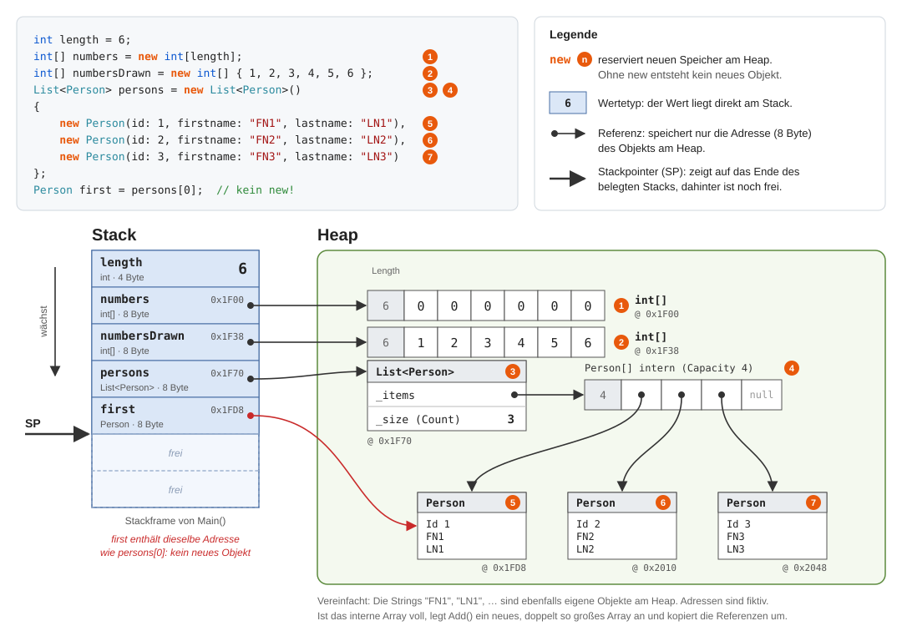

# Collections in .NET

## Projekt anlegen

Für die Beispiele brauchst du eine .NET Konsolenapplikation. Führe dafür die folgenden Befehle in
der Konsole aus. Unter macOS und Linux ersetzt du *rd /S /Q* durch *rm -rf* und *md* durch *mkdir*.

```text
rd /S /Q CollectionDemo
md CollectionDemo
cd CollectionDemo
md CollectionDemo.Application
cd CollectionDemo.Application
dotnet new console
cd ..
dotnet new sln -f sln
dotnet sln add CollectionDemo.Application
start CollectionDemo.sln

```

Öffne danach die Datei *CollectionDemo.Application.csproj*. In Visual Studio geht das mit einem
Doppelklick auf das Projekt *CollectionDemo.Application*. Ergänze die Optionen *Nullable* und
*TreatWarningsAsErrors*. Die Datei sieht dann so aus:

```xml
<Project Sdk="Microsoft.NET.Sdk">

  <PropertyGroup>
    <OutputType>Exe</OutputType>
    <TargetFramework>net10.0</TargetFramework>
    <Nullable>enable</Nullable>
    <TreatWarningsAsErrors>true</TreatWarningsAsErrors>
  </PropertyGroup>

</Project>
```

## Das Array als einfachste Collection

Ein Array speichert mehrere Elemente vom gleichen Typ, so wie in Java. Die Elemente können auch
Referenztypen sein, z. B. Objekte deiner eigenen Klassen. Ein Array wird mit *new* erzeugt. Es liegt
daher am Heap und wird später vom Garbage Collector entfernt.

```c#
int length = 6;
int[] numbers = new int[6];         // (1)
int[] numbers2 = new int[length];   // (2)

int[] numbersDrawn = new int[] { 1, 2, 3, 4, 5, 6 };  // (3)
```

- **(1)** Gibst du nur die Länge an, bekommen alle Elemente den Default-Wert. *numbers* enthält
  daher [0, 0, 0, 0, 0, 0].
- **(2)** Die Länge kann auch in einer Variable stehen. Sie muss nicht beim Kompilieren feststehen.
- **(3)** Kennst du die Werte schon, befüllst du das Array mit einem Initializer. Die Länge musst du
  dann nicht angeben. Gibst du sie trotzdem an und passt sie nicht zur Anzahl der Werte, meldet der
  Compiler einen Fehler.

### Stack und Heap

Lokale Variablen liegen am *Stack*. Bei Wertetypen wie *int* steht dort direkt der Wert. Bei
Referenztypen steht dort nur die Adresse (8 Byte) des Objekts. Der *Stackpointer* zeigt auf das Ende
des belegten Bereichs.

Speicher am *Heap* wird nur mit *new* reserviert. Jedes *new* im Code (orange Nummer in der Grafik)
erzeugt genau ein Objekt am Heap. Auch eine Liste ist ein Objekt. Sie verwaltet intern ein Array, das
nur Referenzen auf die Personen speichert. Die Zuweisung *first = persons[0]* kopiert daher nur die
Adresse. Es entsteht keine neue Person.



### Jagged Arrays

Das *jagged array* kennst du schon aus Java. Es wird oft "mehrdimensionales Array" genannt, das ist
aber nicht ganz richtig: Es ist ein Array, dessen Elemente auf weitere Arrays am Heap verweisen.


<small>Quelle: https://media.geeksforgeeks.org/wp-content/uploads/20201202202711/Untitled4-660x306.png</small>

Deshalb können die inneren Arrays unterschiedlich lang sein:

```c#
int[][] quickTipp = new int[][]
{
    new int[]{1,2,3,4,5,6},
    new int[]{8,9,10,11,12,13},
    new int[]{14,16}
};
for (int i = 0; i < quickTipp.Length; i++)
{
    Console.Write($"{i + 1}. TIPP: ");
    for (int j = 0; j < quickTipp[i].Length; j++)
    {
        Console.Write($"{quickTipp[i][j]:00} ");
    }
    Console.WriteLine();
}
```

### "Echte" mehrdimensionale Arrays

Bei einem "echten" mehrdimensionalen Array liegen alle Elemente direkt hintereinander im Speicher.
Die Position eines Elements ist *row × Anzahl der Spalten + col*. Die erste Dimension ist meist die
Zeile. Die innere Schleife geht dann über die Spalten und liest Speicherstellen, die direkt
nebeneinander liegen. Das ist schnell, weil der CPU-Cache die nächsten Elemente schon mitlädt.

```c#
int[,] matrix = new int[,]
{
    { 1,2,3 },
    { 4,5,6 }
};
for (int row = 0; row < matrix.GetLength(0); row++)
{
    for (int col = 0; col < matrix.GetLength(1); col++)
    {
        Console.Write($"{matrix[row, col]:00} ");
    }
    Console.WriteLine();
}
```

> **Hinweis:** Mehrdimensionale Arrays brauchst du selten. Verwende sie nur, wenn die Anordnung im
> Speicher für die Performance wichtig ist. Die Bibliothek OpenCV speichert z. B. ihre
> Transformationsmatrizen so.

## List&lt;T&gt; als flexibler Ersatz für Arrays

Ein Array hat eine feste Länge. Es gibt keine Methoden *Add()* oder *Remove()*. Deshalb verwenden
die meisten Programme den Typ *List&lt;T&gt;*. Die Collections liegen im Namespace
*System.Collections.Generic*. Du bindest ihn mit *using* ein:

```c#
using System.Collections.Generic;
```

### Interner Aufbau

*List&lt;T&gt;* speichert die Daten intern in einem Array. Eine neue, leere Liste hat ein leeres
Array. Beim ersten *Add()* bekommt das Array 4 Plätze. Ist das Array voll, legt *Add()* ein neues
Array mit doppelter Größe an und kopiert alle Elemente hinein. Das alte Array entfernt der Garbage
Collector. Der Zugriff über den Index ist deshalb genauso schnell wie bei einem Array.

*Count* liefert die Anzahl der Elemente, *Capacity* die Länge des internen Arrays. Die Grafik zeigt
die ersten 9 Aufrufe von *Add()*:


### Eine Liste anlegen

Für die Beispiele verwenden wir die Klasse *Person* mit 3 Properties:

```c#
class Person
{
    public Person(int id, string firstname, string lastname)
    {
        Id = id;
        Firstname = firstname;
        Lastname = lastname;
    }

    public int Id { get; }
    public string Firstname { get; set; }
    public string Lastname { get; set; }

    public override string ToString() => $"{Id} - {Firstname} {Lastname}";
}
```

Den Typ der Elemente gibst du in spitzen Klammern an. Mit einem Initializer kannst du die Liste
gleich befüllen:

```c#
// using System.Collections.Generic;
List<Person> emptyList = new List<Person>();
// kürzer: var persons = new List<Person>()
List<Person> persons = new List<Person>()
{
    new Person(id: 1, firstname: "FN1", lastname: "LN1"),
    new Person(id: 2, firstname: "FN2", lastname: "LN2"),
    new Person(id: 3, firstname: "FN3", lastname: "LN3")
};
```

### Elemente lesen, hinzufügen und löschen

*Add()* fügt ein Element am Ende ein. Der Indexer [] liest ein Element an einer Position, wie bei
einem Array. Der erste Index ist 0. Mit *foreach* gehst du durch alle Elemente.

```c#
persons.Add(new Person(id: 4, firstname: "FN4", lastname: "LN4"));

Person thirdPerson = persons[2];                        // (1)
thirdPerson.Lastname = "Other Name";                    // (2)
Console.WriteLine($"Found {persons.Count} Persons");    // (3)
foreach (Person p in persons)                           // (4)
{
    Console.WriteLine(p);
}
```

- **(1)** *persons[2]* liefert das dritte Element.
- **(2)** Bei Referenztypen speichert die Liste nur Referenzen, nicht die Objekte selbst.
  *thirdPerson* zeigt also auf dasselbe Objekt wie *persons[2]*. Die Ausgabe zeigt daher auch
  "Other Name".
- **(3)** *Count* liefert die Anzahl der Elemente.
- **(4)** *List&lt;T&gt;* implementiert das Interface *IEnumerable&lt;T&gt;*. Deshalb funktioniert
  *foreach*.

*Remove()* löscht ein Element aus der Liste. Die Klasse *Person* überschreibt *Equals()* nicht.
*Remove()* vergleicht daher nur die Referenzen (Adressen). Willst du eine Person löschen, brauchst du
die Referenz auf genau das Objekt in der Liste, z. B. *persons.Remove(thirdPerson)*. Ein neues Objekt
mit denselben Werten hat eine andere Adresse und wird nicht gefunden.

## Dictionary&lt;TKey, TValue&gt; (HashMap in Java)

In einer Liste greifst du über den Index zu. Suchst du z. B. die Person mit der ID 2, musst du die
Liste durchlaufen. Im schlechtesten Fall (das Element ist nicht vorhanden) sind das n Vergleiche.

Ein *Dictionary* speichert Paare aus *Key* und *Value*. Jeder Key darf nur einmal vorkommen. Über
den Key findest du den Value direkt, ohne die Collection zu durchlaufen. Als Key kannst du jeden
Typ verwenden, auch eigene Klassen.

Das Beispiel verwendet einen *string* als Key und eine *Person* als Value:

```c#
// kürzer: var personsDict = new Dictionary<string, Person>()
Dictionary<string, Person> personsDict = new Dictionary<string, Person>()
{
    {"A", new Person(id: 1, firstname: "FN1", lastname: "LN1") },
    {"B", new Person(id: 2, firstname: "FN2", lastname: "LN2") },
    {"C", new Person(id: 3, firstname: "FN3", lastname: "LN3") }
};

// Add benötigt 2 Argumente: Key und Value.
personsDict.Add("D", new Person(id: 4, firstname: "FN4", lastname: "LN4"));
```

### Zugriff auf Elemente

Der Indexer liefert den Value zu einem Key, hier die Person mit dem Key "B". Mit *foreach* bekommst
du Objekte vom Typ *KeyValuePair*. Sie enthalten den Key im Property *Key* und das Objekt im
Property *Value*.

```c#
Person personB = personsDict["B"];
foreach (KeyValuePair<string, Person> p in personsDict)  // kürzer: foreach (var p in personsDict)
{
    Console.WriteLine($"Person {p.Key} hat den Zunamen {p.Value.Lastname}");
}
```

*Remove()* löscht ein Element über seinen Key:

```c#
personsDict.Remove("A");
```

### TryGetValue() und TryAdd()

In zwei Fällen wirft ein Dictionary eine Exception:

- *Add()* mit einem Key, den es schon gibt: *ArgumentException (An item with the same key has
  already been added)*.
- Lesen über den Indexer mit einem Key, den es nicht gibt: *KeyNotFoundException*.

```c#
// ArgumentException: An item with the same key has already been added
personsDict.Add("D", new Person(id: 5, firstname: "FN5", lastname: "LN5"));
// KeyNotFoundException
Person notFound = personsDict["Z"];
```

Besser sind daher *TryGetValue()* und *TryAdd()*. Sie liefern *true* oder *false* und werfen keine
Exception:

```c#
if (personsDict.TryGetValue("C", out Person? found))
{
    Console.WriteLine(found.Lastname);
}
if (!personsDict.TryAdd("D", new Person(id: 4, firstname: "FN4", lastname: "LN4")))
{
    Console.WriteLine("Person D ist bereits im Dictionary.");
}
```

## HashSet&lt;T&gt; (HashSet in Java)

Ein *HashSet* speichert jeden Wert nur einmal, ähnlich wie *DISTINCT* in SQL. *Add()* fügt nur den
ersten Wert ein. Gleiche Werte danach werden ignoriert. Ob zwei Werte gleich sind, prüft das
HashSet mit *Equals()* und *GetHashCode()*.

```c#
HashSet<string> teacherHashSet = new HashSet<string>();
teacherHashSet.Add("SZ");
// Wird einfach ignoriert.
teacherHashSet.Add("SZ");
foreach(string teacher in teacherHashSet)
{
    Console.WriteLine(teacher);                // Gibt 1x SZ aus.
}
```

Ein HashSet hat keinen Index. Du kannst also nicht auf das n-te Element zugreifen. Meist verwendest
du es mit *Contains()*. Diese Suche ist sehr schnell: Das HashSet berechnet aus dem Hashcode direkt
die Stelle, an der der Wert liegen muss. Es muss nicht alle Elemente durchlaufen.

```c#
if (teacherHashSet.Contains("SZ")) { ... }
```

## Read-only Collections: IReadOnlyList, IReadOnlySet und IReadOnlyDictionary

Oft verwaltet eine Klasse intern eine Collection, die man von außen nur lesen soll. Die Klasse
*Course* prüft beim Hinzufügen, ob der Kurs schon voll ist. Wäre die Liste als public
*List&lt;Person&gt;* sichtbar, könnte jeder mit *course.Persons.Add()* diese Prüfung umgehen.

```c#
class Course
{
    private readonly List<Person> _persons = new();
    public IReadOnlyList<Person> Persons => _persons.AsReadOnly();

    public void AddPerson(Person person)
    {
        if (_persons.Count >= 20) { throw new InvalidOperationException("Der Kurs ist voll."); }
        _persons.Add(person);
    }
}
```

Die Liste selbst ist *private readonly*. Das Property gibt nach außen nur ein Interface zurück.
Dieses Interface hat nur Methoden zum Lesen. Für jede der 3 Collections gibt es ein passendes
Interface:

| Collection                      | Read-only Interface                        | Was ist erlaubt?                                      |
| ------------------------------- | ------------------------------------------ | ----------------------------------------------------- |
| *List&lt;T&gt;*                 | *IReadOnlyList&lt;T&gt;*                   | *Count*, Indexer [], *foreach*                        |
| *HashSet&lt;T&gt;*              | *IReadOnlySet&lt;T&gt;*                    | *Count*, *Contains()*, *foreach*                      |
| *Dictionary&lt;TKey, TValue&gt;* | *IReadOnlyDictionary&lt;TKey, TValue&gt;* | *Count*, Indexer [], *ContainsKey()*, *TryGetValue()*, *Keys*, *Values*, *foreach* |

*Add()*, *Remove()* oder *Clear()* gibt es in diesen Interfaces nicht. Rufst du sie trotzdem auf,
meldet schon der Compiler einen Fehler.

### Warum AsReadOnly() und kein Typecast?

*List&lt;T&gt;* implementiert *IReadOnlyList&lt;T&gt;*. Deshalb kompiliert auch ein impliziter
Typecast:

```c#
public IReadOnlyList<Person> Persons => _persons;   // Typecast, nicht empfohlen!
```

Das Problem: Ein Typecast ändert nur den Typ der Variable, nicht das Objekt im Speicher. Hinter
*Persons* steht weiterhin die interne Liste. Mit einem expliziten Typecast zurück auf
*List&lt;Person&gt;* kann man sie wieder verändern. Die Prüfung in *AddPerson()* ist dann
wirkungslos:

```c#
List<Person> hacked = (List<Person>)course.Persons;   // Funktioniert!
hacked.Add(new Person(id: 99, firstname: "FN99", lastname: "LN99"));
hacked.Clear();                                       // Die interne Liste der Klasse ist leer.
```

*AsReadOnly()* erzeugt dagegen ein neues Objekt vom Typ *ReadOnlyCollection&lt;T&gt;* (Namespace
*System.Collections.ObjectModel*). Dieses Objekt ist ein *Wrapper*: Es umhüllt die interne Liste und
erlaubt nur lesende Zugriffe. Ein Typecast auf *List&lt;Person&gt;* ist nicht mehr möglich:

```c#
List<Person> hacked = (List<Person>)course.Persons;   // InvalidCastException
IList<Person> list = (IList<Person>)course.Persons;   // OK, aber...
list.Add(new Person(id: 99, firstname: "FN99", lastname: "LN99"));  // NotSupportedException
```

*AsReadOnly()* kopiert die Daten nicht. Der Wrapper zeigt immer auf die interne Liste. Spätere
Änderungen durch *AddPerson()* siehst du daher auch über *Persons*. Der Aufruf kostet kaum Zeit
und kann direkt im Property stehen.

Die Methode gibt es für alle 3 Collections:

```c#
private readonly List<Person> _persons = new();
private readonly HashSet<string> _cities = new();
private readonly Dictionary<int, Person> _personsById = new();

public IReadOnlyList<Person> Persons => _persons.AsReadOnly();                       // ReadOnlyCollection<T>
public IReadOnlySet<string> Cities => _cities.AsReadOnly();                          // ReadOnlySet<T>
public IReadOnlyDictionary<int, Person> PersonsById => _personsById.AsReadOnly();    // ReadOnlyDictionary<TKey, TValue>
```

> Read-only gilt nur für die Collection, nicht für die Objekte darin. Mit
> *course.Persons[0].Lastname = "X"* kannst du die Person trotzdem ändern, wenn *Lastname* einen
> public Setter hat.

## Übung

Erstelle ein Projekt mit dem Namen *CollectionDemo*, wie oben beschrieben. Ersetze dann den Inhalt
von *Program.cs* durch den folgenden Code. Ergänze die Klassen *SchoolClass* und *Student*, sodass
das Programm die unten gezeigte Ausgabe liefert.

```c#
using System;
using System.Collections.Generic;
using System.Linq;
using System.Text.Json;
using System.Text.Json.Serialization;

namespace ExColletions
{
    /// <summary>
    /// TODO: 
    ///    - Create a constructor to initialize Name, ClassTeacher (KV).
    ///    - Add a List of students to manage the students in this class.
    ///    - Use IReadOnlyList for your public property. It should NOT be possible to add or remove students from outside
    ///      without calling AddStudent or RemoveStudent.
    ///    - Add a read-only property of type HashSet<string> to get the different cities in this class.
    /// </summary>
    class SchoolClass
    {
        public string Name { get; }
        public string ClassTeacher { get; }
        /// <summary>
        /// Adds a student and modifies the schoolclass reference of the provided
        /// student.
        /// </summary>
        public void AddStudent(Student s)
        {
        }

        /// <summary>
        /// Removes a student and modifies the schoolclass reference of the provided
        /// student.
        /// </summary>
        public void RemoveStudent(Student s)
        {
        }
    }

    /// <summary>
    /// TODO: 
    ///    - Add a constructor to initialize the properties Id, Firstname, Lastname and City.
    ///    - Add a reference to the class of the student (type SchoolClass). This reference is optional,
    ///      if a student is not assigned to a class is has the value null.
    ///    - Add an annotation [JsonIgnore] above this property to suppress the content of
    ///      the class object in your serialized output.
    /// </summary>
    class Student
    {
        public int Id { get; }
        public string Lastname { get; }
        public string Firstname { get; }
        public string City { get; set; }
        /// <summary>
        /// Updates the reference of the student and adds the student to the new class.
        /// </summary>
        /// <param name="k"></param>
        public void ChangeClass(SchoolClass k)
        {
        }
    }

    class Program
    {
        static void Main(string[] args)
        {
            Dictionary<string, SchoolClass> classes = new();
            classes.Add("3AHIF", new SchoolClass(name: "3AHIF", classTeacher: "KV1"));
            classes.Add("3BHIF", new SchoolClass(name: "3BHIF", classTeacher: "KV2"));
            classes.Add("3CHIF", new SchoolClass(name: "3CHIF", classTeacher: "KV3"));

            classes["3AHIF"].AddStudent(new Student(id: 1001, firstname: "FN1", lastname: "LN1", city: "CTY1"));
            classes["3AHIF"].AddStudent(new Student(id: 1002, firstname: "FN2", lastname: "LN2", city: "CTY1"));
            classes["3AHIF"].AddStudent(new Student(id: 1003, firstname: "FN3", lastname: "LN3", city: "CTY2"));
            classes["3BHIF"].AddStudent(new Student(id: 1011, firstname: "FN4", lastname: "LN4", city: "CTY1"));
            classes["3BHIF"].AddStudent(new Student(id: 1012, firstname: "FN5", lastname: "LN5", city: "CTY1"));
            classes["3BHIF"].AddStudent(new Student(id: 1013, firstname: "FN6", lastname: "LN6", city: "CTY1"));

            Student s = classes["3AHIF"].Students[0];
            Console.WriteLine($"s sitzt in der Klasse {s.SchoolClass?.Name} mit dem KV {s.SchoolClass?.ClassTeacher}.");
            Console.WriteLine($"In der 3AHIF sind folgende Städte: {JsonSerializer.Serialize(classes["3AHIF"].Cities)}.");

            Console.WriteLine("3AHIF vor ChangeKlasse:");
            Console.WriteLine(JsonSerializer.Serialize(classes["3AHIF"].Students));
            s.ChangeClass(classes["3BHIF"]);
            Console.WriteLine("3AHIF nach ChangeKlasse:");
            Console.WriteLine(JsonSerializer.Serialize(classes["3AHIF"].Students));
            Console.WriteLine("3BHIF nach ChangeKlasse:");
            Console.WriteLine(JsonSerializer.Serialize(classes["3BHIF"].Students));
            Console.WriteLine($"s sitzt in der Klasse {s.SchoolClass?.Name} mit dem KV {s.SchoolClass?.ClassTeacher}.");
        }
    }
}
```

### Korrekte Ausgabe:
```
s sitzt in der Klasse 3AHIF mit dem KV KV1.
In der 3AHIF sind folgende Städte: ["CTY1","CTY2"].
3AHIF vor ChangeKlasse:
[{"City":"CTY1","Id":1001,"Lastname":"LN1","Firstname":"FN1"},{"City":"CTY1","Id":1002,"Lastname":"LN2","Firstname":"FN2"},{"City":"CTY2","Id":1003,"Lastname":"LN3","Firstname":"FN3"}]
3AHIF nach ChangeKlasse:
[{"City":"CTY1","Id":1002,"Lastname":"LN2","Firstname":"FN2"},{"City":"CTY2","Id":1003,"Lastname":"LN3","Firstname":"FN3"}]
3BHIF nach ChangeKlasse:
[{"City":"CTY1","Id":1011,"Lastname":"LN4","Firstname":"FN4"},{"City":"CTY1","Id":1012,"Lastname":"LN5","Firstname":"FN5"},{"City":"CTY1","Id":1013,"Lastname":"LN6","Firstname":"FN6"},{"City":"CTY1","Id":1001,"Lastname":"LN1","Firstname":"FN1"}]
s sitzt in der Klasse 3BHIF mit dem KV KV2.
```

## Übung 2

Erstelle ein Projekt mit dem Namen *LottoDemo*, wie oben beschrieben. Ersetze dann den Inhalt von
*Program.cs* durch den folgenden Code.

Die Klasse *LottoTipp* bildet einen Lottoschein ab. Beim Lotto werden 6 Zahlen zwischen 1 und 45
gezogen. Keine Zahl darf doppelt vorkommen (Ziehen ohne Zurücklegen). Die Klasse soll Quicktipps
erzeugen: Der Zufallszahlengenerator wählt dabei 6 Zahlen zwischen 1 und 45.

Speichere die Tipps in einer internen Liste. Diese Liste muss *private* sein!

Dein Programm soll genau die Zahlen aus der Musterausgabe liefern. Das funktioniert, weil der
Zufallszahlengenerator einen fixen Seed (906) hat. Er liefert daher immer dieselbe Folge von
Zahlen. Erzeuge die Zahlen mit *_random.Next(1, 46)*. Prüfe bei jeder neuen Zahl, ob sie schon im
Array vorkommt. Wenn ja, erzeuge einfach die nächste Zahl.

**Program.cs**
```c#
using System;
using System.Collections.Generic;
using System.Diagnostics;
using System.Linq;


{
    Console.WriteLine($"Prüfe die Tipps auf Duplikate...");
    var lottoTipp = new LottoTipp();
    lottoTipp.AddQuicktipps(1000);
    for (int i = 0; i < 1000; i++)
    {
        var tipp = lottoTipp.GetTipp(i);
        if (tipp.Distinct().Count() != 6)
        {
            Console.Error.WriteLine($"FEHLER! Der Tipp {string.Join(",", tipp)} hat Duplikate!");
            return;
        }
        if (tipp.Max() > 45)
        {
            Console.Error.WriteLine($"FEHLER! Der Tipp {string.Join(",", tipp)} hat Zahlen über 45.");
            return;
        }
        if (tipp.Min() < 1)
        {
            Console.Error.WriteLine($"FEHLER! Der Tipp {string.Join(",", tipp)} hat Zahlen unter 1.");
            return;
        }
    }
}

{
    var lottoTipp = new LottoTipp();
    lottoTipp.AddQuicktipps(5);
    Console.WriteLine($"Generiere 5 Tipps...");
    for (int i = 0; i < 5; i++)
    {
        var tipp = lottoTipp.GetTipp(i);
        Console.WriteLine($"Tipp {i}: {string.Join(" ", tipp)}");
    }
}

{
    Console.WriteLine($"Generiere 1 000 000 Tipps und zähle die 6er und 5er.");
    var usedMemory = GC.GetTotalMemory(forceFullCollection: true);
    var lottoTipp = new LottoTipp();
    lottoTipp = new LottoTipp();
    lottoTipp.AddQuicktipps(1_000_000);
    var drawnNumbers = new int[] { 4, 2, 1, 8, 32, 16 };
    var stopwatch = new Stopwatch();
    stopwatch.Start();
    for (int i = 0; i < 1_000_000; i++)
    {
        var rightNumbers = lottoTipp.CheckTipp(i, drawnNumbers);
        if (rightNumbers >= 5)
        {
            var tipp = lottoTipp.GetTipp(i);
            Console.WriteLine($"Tipp {i:000 000} hat {rightNumbers} Richtige: {string.Join(" ", tipp)}");

        }
    }
    stopwatch.Stop();
    Console.WriteLine($"Berechnung nach {stopwatch.ElapsedMilliseconds} ms beendet.");
    Console.WriteLine($"{(GC.GetTotalMemory(forceFullCollection: true) - usedMemory)/1048576M:0.00} MBytes belegt.");
}

// TODO: Implementiere die Klasse. Füge notwendige Properties und interne Listen hinzu.
class LottoTipp
{
    private readonly Random _random = new Random(906);  // Fixed Seed, erzeugt immer die selbe Sequenz an Werten.

    /// <summary>
    /// Property; Gibt die Anzahl der gespeicherten Tipps zurück.
    /// </summary>
    public int TippCount { get; } // TODO: Implementierung statt default Property.

    /// <summary>
    /// Gibt den nten gespeicherten Tipp als Array zurück. Der erste Tipp hat die Nummer 0.
    /// </summary>
    public int[] GetTipp(int number)
    {
        // TODO: Implementierung    }
    }
    /// <summary>
    /// Generiert 6 zufällige Zahlen zwischen 1 und 45 ohne Kollision.
    /// </summary>
    private int[] GetNumbers()
    {
        // TODO: Implementierung
    }

    /// <summary>
    /// Fügt die in count übergebene Anzahl an Tipps zur internen Tippliste hinzu.
    /// </summary>
    /// <param name="count"></param>
    public void AddQuicktipps(int count)
    {
        // TODO: Implementierung
    }

    /// <summary>
    /// Prüft, wie viele Richtige der nte Tipp hat. Die Tippnummer beginnt bei 0
    /// (0 ist also der erste Tipp, ...).
    /// </summary>
    public int CheckTipp(int tippNr, int[] drawnNumbers)
    {
        // TODO: Implementierung
    }
}

```


**Korrekte Ausgabe**
```
Prüfe die Tipps auf Duplikate...
Generiere 5 Tipps...
Tipp 0: 2 30 3 43 12 14
Tipp 1: 39 44 3 17 35 36
Tipp 2: 21 37 8 39 32 33
Tipp 3: 10 6 9 5 25 23
Tipp 4: 12 40 3 36 34 30
Generiere 1 000 000 Tipps und zähle die 6er und 5er.
Tipp 000 094 hat 5 Richtige: 2 4 27 16 8 32
Tipp 017 533 hat 5 Richtige: 8 41 4 1 2 16
Tipp 065 810 hat 5 Richtige: 2 18 16 4 32 1
Tipp 111 809 hat 5 Richtige: 2 4 1 32 16 9
Tipp 137 467 hat 5 Richtige: 8 4 16 32 11 2
Tipp 196 819 hat 5 Richtige: 16 2 8 4 29 1
Tipp 248 287 hat 5 Richtige: 8 2 1 32 16 31
Tipp 288 697 hat 5 Richtige: 28 8 4 1 2 32
Tipp 324 754 hat 5 Richtige: 13 4 1 2 8 16
Tipp 436 717 hat 5 Richtige: 8 16 32 2 4 11
Tipp 473 618 hat 5 Richtige: 1 2 8 16 32 19
Tipp 477 288 hat 5 Richtige: 9 32 8 16 1 4
Tipp 499 182 hat 6 Richtige: 16 1 32 8 4 2
Tipp 519 778 hat 5 Richtige: 2 8 4 32 31 1
Tipp 529 366 hat 5 Richtige: 2 4 32 36 8 16
Tipp 585 261 hat 5 Richtige: 4 20 1 2 16 32
Tipp 680 855 hat 5 Richtige: 37 32 1 4 16 2
Tipp 707 693 hat 5 Richtige: 16 43 4 32 8 1
Tipp 738 554 hat 5 Richtige: 30 1 16 8 32 2
Tipp 770 300 hat 5 Richtige: 2 16 39 32 8 4
Tipp 784 975 hat 5 Richtige: 2 16 32 8 20 1
Tipp 807 334 hat 5 Richtige: 1 37 16 4 8 2
Tipp 911 569 hat 5 Richtige: 32 2 8 4 45 1
Tipp 916 819 hat 5 Richtige: 8 10 16 32 1 2
Tipp 924 592 hat 5 Richtige: 8 4 1 38 2 32
Tipp 942 173 hat 5 Richtige: 1 2 8 32 16 12
Tipp 985 945 hat 5 Richtige: 16 8 2 4 32 14
Berechnung nach 81 ms beendet.
53,78 MBytes belegt.
```

### Für echte Profis

Bis jetzt liegen die Tipps in einer Liste von *int* Arrays. Ein Tipp braucht daher 6 × 4 = 24 Bytes
für die Zahlen am Heap. Außerdem musst du die Arrays oft durchsuchen:

- Beim Erzeugen prüfst du, ob eine Zahl schon im Array ist.
- Beim Prüfen der "Richtigen" suchst du jede gezogene Zahl im Array des Tipps.

Ein Tipp lässt sich auch als *Bitmaske* speichern: Jede Zahl von 1 bis 45 bekommt ein Bit. Ein
gesetztes Bit (1) bedeutet, dass die Zahl getippt wurde. Du brauchst also 45 Bits. Ein *long* hat
64 Bits, daher reicht ein einziger *long* Wert für einen Tipp:


Ändere deine Klasse so, dass sie die Tipps intern in einer Liste von *long* Werten speichert. Die
Parameter der public Methoden bleiben gleich, das Musterprogramm muss also weiterhin funktionieren.
Die erzeugten Zufallszahlen können sich je nach Implementierung von der Musterausgabe unterscheiden.

Auch die Anzahl der richtigen Zahlen kannst du mit Bitoperationen schneller berechnen. Verwende
passende Operatoren und
[Brian Kernighan's Algorithm](https://iq.opengenus.org/brian-kernighan-algorithm/#:~:text=The%20main%20idea%20behind%20this,binary%20representation%20of%20these%20numbers.)
zum Zählen der gesetzten Bits.

> Brauchst du bei einem Bitshift ein Ergebnis vom Typ *long*, schreibe **1L** statt 1. Sonst
> rechnet C# mit *int* (nur 32 Bits) und das Ergebnis ist falsch.
> Achte auch auf die Rangfolge der Operatoren: Vergleiche (*==*, *!=*) werden vor *&* und *|*
> ausgeführt. Setze daher Klammern, z. B. *(mask & bit) != 0*.

## Übung 3: Eine Heldengruppe für das Rollenspiel

Diese Übung setzt die Übung *Charaktere für ein Rollenspiel* aus dem Kapitel
[Properties](03_Properties.md) fort. Verwende weiter die Solution *RpgDemo*. Kopiere deine Klassen
*Weapon* und *Character* in die *Program.cs* unten. *Weapon* bleibt gleich, *Character* wird
erweitert und die Klasse *Party* ist neu.

Speichere jede Collection intern in einer *private readonly* Variable. Das Property nach außen ist
read-only und liefert nur ein Interface ohne ändernde Methoden (*IReadOnlyList&lt;T&gt;*,
*IReadOnlySet&lt;T&gt;* oder *IReadOnlyDictionary&lt;TKey, TValue&gt;*). Die Collection ändert sich
also nur über die Methoden der Klasse. Verwende *AsReadOnly()* und keinen Typecast (siehe Abschnitt
*Read-only Collections*). Die Tests prüfen das.

Regeln für die Waffen in *Character* (List):
- Das Property *Weapon* aus dem Kapitel Properties speichert weiterhin die ausgerüstete Waffe. Es
  darf aber nur noch innerhalb der Klasse gesetzt werden. Zum Ausrüsten gibt es die folgenden
  Methoden.
- Der Charakter hat ein Inventar mit beliebig vielen Waffen. Das Property *Weapons* liefert es als
  *IReadOnlyList&lt;Weapon&gt;*. Am Anfang ist das Inventar leer.
- *PickUp(Weapon weapon)* fügt die Waffe am Ende des Inventars ein. Hat der Charakter noch keine
  Waffe ausgerüstet, wird diese Waffe sofort ausgerüstet.
- *Equip(Weapon weapon)* rüstet die Waffe aus. Ist sie nicht im Inventar, wirft die Methode eine
  *ArgumentException*.
- *EquipStrongestWeapon()* rüstet die Waffe mit dem höchsten *Damage* aus dem Inventar aus. Ist das
  Inventar leer, passiert nichts.
- *Drop(Weapon weapon)* entfernt die Waffe aus dem Inventar und liefert true. War sie ausgerüstet,
  hat der Charakter danach keine Waffe mehr. Ist die Waffe nicht im Inventar, liefert die Methode
  false.

Regeln für die Fähigkeiten in *Character* (HashSet):
- Ein Charakter kann Fähigkeiten wie *Feuerball* oder *Heilen* lernen. Jede Fähigkeit kommt nur
  einmal vor. Das Property *Skills* liefert sie als *IReadOnlySet&lt;string&gt;*.
- *LearnSkill(string skill)* fügt die Fähigkeit hinzu. Die Methode liefert true, wenn die Fähigkeit
  neu ist, sonst false. Tipp: Sieh dir den Rückgabewert von *HashSet.Add()* an.
- *HasSkill(string skill)* liefert true, wenn der Charakter die Fähigkeit beherrscht.

Regeln für die Klasse *Party* (Dictionary):
- Die Klasse hat einen Konstruktor mit dem Parameter *name* (string). Das Property *Name* ist
  immutable (nicht änderbar).
- Die Mitglieder liegen in einem Dictionary. Der Key ist der Name des Charakters. Das Property
  *Members* liefert es als *IReadOnlyDictionary&lt;string, Character&gt;*.
- *AddMember(Character character)* fügt den Charakter hinzu und liefert true. Gibt es schon ein
  Mitglied mit diesem Namen oder hat die Party schon 4 Mitglieder, fügt die Methode nichts hinzu
  und liefert false.
- *RemoveMember(string name)* entfernt das Mitglied mit diesem Namen. Die Methode liefert true,
  wenn es gefunden wurde, sonst false.
- *FindMember(string name)* liefert das Mitglied mit diesem Namen oder null. Verwende
  *TryGetValue()*. Überlege, welchen Rückgabetyp die Methode braucht.
- Das Property *AliveMembers* ist read-only. Es liefert eine neue *List&lt;Character&gt;* mit allen
  Mitgliedern, die noch leben.
- Das Property *Skills* ist read-only. Es liefert ein neues *HashSet&lt;string&gt;* mit allen
  Fähigkeiten der Mitglieder. Beherrschen mehrere Mitglieder dieselbe Fähigkeit, kommt sie trotzdem
  nur einmal vor. Tipp: *UnionWith()*.
- Die Party hat gemeinsame Vorräte, z. B. Heiltränke oder Fackeln. Sie liegen in einem Dictionary:
  Der Key ist der Name des Gegenstands, der Value die Anzahl. Das Property *Supplies* liefert es als
  *IReadOnlyDictionary&lt;string, int&gt;*.
- *AddSupply(string item, int count)* erhöht die Anzahl des Gegenstands um *count*. Gibt es den
  Gegenstand noch nicht, wird er mit dieser Anzahl angelegt. Ist *count* kleiner oder gleich 0,
  wirft die Methode eine *ArgumentException*.
- *GetSupplyCount(string item)* liefert die Anzahl des Gegenstands oder 0, wenn es ihn nicht gibt.
- *UseSupply(string item)* verringert die Anzahl um 1 und liefert true. Gibt es den Gegenstand
  nicht, liefert die Methode false. Ist danach keiner mehr übrig, entfernt sie den Key aus dem
  Dictionary.
- *AttackTogether(Character enemy)*: Alle lebenden Mitglieder greifen den Gegner mit *Attack()* an.

Überlege bei jeder Methode, welche Methode der Collection die Arbeit schon erledigt. Viele Methoden
brauchen dann nur eine Zeile. Achtung: *Contains()* und *Remove()* vergleichen bei einer Liste von
Objekten die Referenzen (siehe Abschnitt zu *List&lt;T&gt;*).

Am Ende muss das Programm diese Ausgabe liefern:

```
********************************************************************************
TESTS FÜR DIE WAFFEN EINES CHARAKTERS (LIST)
********************************************************************************
1 Weapons ist eine schreibgeschützte IReadOnlyList<Weapon> OK
2 Weapon ist von außen nicht setzbar OK
3 PickUp OK
4 Equip OK
5 Exception bei Equip einer Waffe, die nicht im Inventar ist OK
6 EquipStrongestWeapon OK
7 Drop OK
********************************************************************************
TESTS FÜR DIE FÄHIGKEITEN EINES CHARAKTERS (HASHSET)
********************************************************************************
1 Skills ist ein schreibgeschütztes IReadOnlySet<string> OK
2 LearnSkill ignoriert doppelte Fähigkeiten OK
3 HasSkill OK
********************************************************************************
TESTS FÜR PARTY (DICTIONARY)
********************************************************************************
1 Kein default Konstruktor OK
2 Members und Supplies sind ein schreibgeschütztes IReadOnlyDictionary OK
3 AddMember OK
4 Keine doppelten Namen in der Party OK
5 Maximal 4 Mitglieder OK
6 FindMember OK
7 RemoveMember OK
8 AliveMembers OK
9 Skills der Party ohne Duplikate OK
10 AddSupply und GetSupplyCount OK
11 Exception bei ungültiger Anzahl OK
12 UseSupply entfernt aufgebrauchte Gegenstände OK
13 AttackTogether OK
```

### Program.cs
```c#
using System;
using System.Collections.Generic;
using System.Reflection;

namespace RpgDemo.Application;

class Weapon
{
    // TODO: Kopiere deine Implementierung aus Übung 2 des Kapitels Properties
}

class Character
{
    // TODO: Kopiere deine Implementierung aus Übung 2 des Kapitels Properties und erweitere sie
}

class Party
{
    // TODO: Implementierung von Party
}

class Program
{
    // DON'T TOUCH!
    private static void Main(string[] args)
    {
        Console.WriteLine("********************************************************************************");
        Console.WriteLine("TESTS FÜR DIE WAFFEN EINES CHARAKTERS (LIST)");
        Console.WriteLine("********************************************************************************");
        Character hero = new Character(name: "Link", maxHealth: 100, strength: 10);
        Weapon dagger = new Weapon(name: "Dolch", damage: 5);
        Weapon sword = new Weapon(name: "Schwert", damage: 15);
        Weapon axe = new Weapon(name: "Axt", damage: 25);
        if (IsReadOnly(typeof(Character), nameof(Character.Weapons))
            && HasType(typeof(Character), nameof(Character.Weapons), typeof(IReadOnlyList<Weapon>))
            && hero.Weapons is not List<Weapon> && hero.Weapons.Count == 0)
        {
            Console.WriteLine("1 Weapons ist eine schreibgeschützte IReadOnlyList<Weapon> OK");
        }
        if (HasPrivateSetter(typeof(Character), nameof(Character.Weapon)) && hero.Weapon is null)
        {
            Console.WriteLine("2 Weapon ist von außen nicht setzbar OK");
        }
        hero.PickUp(dagger);
        Weapon? weaponAfterFirstPickUp = hero.Weapon;
        hero.PickUp(sword);
        if (weaponAfterFirstPickUp == dagger && hero.Weapon == dagger
            && hero.Weapons.Count == 2 && hero.Weapons[0] == dagger && hero.Weapons[1] == sword)
        {
            Console.WriteLine("3 PickUp OK");
        }
        hero.Equip(sword);
        if (hero.Weapon == sword && hero.AttackPower == 25) { Console.WriteLine("4 Equip OK"); }
        try
        {
            hero.Equip(axe);
        }
        catch (ArgumentException)
        {
            if (hero.Weapon == sword) { Console.WriteLine("5 Exception bei Equip einer Waffe, die nicht im Inventar ist OK"); }
        }
        Character farmer = new Character(name: "Bauer", maxHealth: 20, strength: 2);
        farmer.EquipStrongestWeapon();
        hero.PickUp(axe);
        hero.Equip(dagger);
        hero.EquipStrongestWeapon();
        if (farmer.Weapon is null && hero.Weapon == axe && hero.AttackPower == 35)
        {
            Console.WriteLine("6 EquipStrongestWeapon OK");
        }
        bool firstDrop = hero.Drop(axe);
        bool secondDrop = hero.Drop(axe);
        if (firstDrop && !secondDrop && hero.Weapon is null && hero.Weapons.Count == 2)
        {
            Console.WriteLine("7 Drop OK");
        }

        Console.WriteLine("********************************************************************************");
        Console.WriteLine("TESTS FÜR DIE FÄHIGKEITEN EINES CHARAKTERS (HASHSET)");
        Console.WriteLine("********************************************************************************");
        if (IsReadOnly(typeof(Character), nameof(Character.Skills))
            && HasType(typeof(Character), nameof(Character.Skills), typeof(IReadOnlySet<string>))
            && hero.Skills is not HashSet<string> && hero.Skills.Count == 0)
        {
            Console.WriteLine("1 Skills ist ein schreibgeschütztes IReadOnlySet<string> OK");
        }
        bool learnedFireball = hero.LearnSkill("Feuerball");
        bool learnedFireballAgain = hero.LearnSkill("Feuerball");
        bool learnedHealing = hero.LearnSkill("Heilen");
        if (learnedFireball && !learnedFireballAgain && learnedHealing && hero.Skills.Count == 2)
        {
            Console.WriteLine("2 LearnSkill ignoriert doppelte Fähigkeiten OK");
        }
        if (hero.HasSkill("Heilen") && !hero.HasSkill("Teleport")) { Console.WriteLine("3 HasSkill OK"); }

        Console.WriteLine("********************************************************************************");
        Console.WriteLine("TESTS FÜR PARTY (DICTIONARY)");
        Console.WriteLine("********************************************************************************");
        if (typeof(Party).GetConstructor(Type.EmptyTypes) is null) { Console.WriteLine("1 Kein default Konstruktor OK"); }
        Party party = new Party(name: "Die Gefährten");
        if (IsReadOnly(typeof(Party), nameof(Party.Members))
            && HasType(typeof(Party), nameof(Party.Members), typeof(IReadOnlyDictionary<string, Character>))
            && IsReadOnly(typeof(Party), nameof(Party.Supplies))
            && HasType(typeof(Party), nameof(Party.Supplies), typeof(IReadOnlyDictionary<string, int>))
            && party.Members is not Dictionary<string, Character> && party.Supplies is not Dictionary<string, int>
            && party.Name == "Die Gefährten" && party.Members.Count == 0)
        {
            Console.WriteLine("2 Members und Supplies sind ein schreibgeschütztes IReadOnlyDictionary OK");
        }
        Character mage = new Character(name: "Zelda", maxHealth: 60, strength: 20);
        Character archer = new Character(name: "Robin", maxHealth: 80, strength: 30);
        Character healer = new Character(name: "Mercy", maxHealth: 50, strength: 5);
        bool heroAdded = party.AddMember(hero);
        bool mageAdded = party.AddMember(mage);
        if (heroAdded && mageAdded && party.Members.Count == 2 && party.Members["Link"] == hero)
        {
            Console.WriteLine("3 AddMember OK");
        }
        if (!party.AddMember(new Character(name: "Link", maxHealth: 10, strength: 1)) && party.Members["Link"] == hero)
        {
            Console.WriteLine("4 Keine doppelten Namen in der Party OK");
        }
        party.AddMember(archer);
        party.AddMember(healer);
        if (!party.AddMember(new Character(name: "Epona", maxHealth: 10, strength: 1)) && party.Members.Count == 4)
        {
            Console.WriteLine("5 Maximal 4 Mitglieder OK");
        }
        if (party.FindMember("Zelda") == mage && party.FindMember("Ganon") is null)
        {
            Console.WriteLine("6 FindMember OK");
        }
        bool firstRemove = party.RemoveMember("Mercy");
        bool secondRemove = party.RemoveMember("Mercy");
        if (firstRemove && !secondRemove && party.Members.Count == 3 && party.FindMember("Mercy") is null)
        {
            Console.WriteLine("7 RemoveMember OK");
        }
        archer.TakeDamage(1000);
        List<Character> aliveMembers = party.AliveMembers;
        if (IsReadOnly(typeof(Party), nameof(Party.AliveMembers))
            && aliveMembers.Count == 2 && aliveMembers.Contains(hero) && aliveMembers.Contains(mage))
        {
            Console.WriteLine("8 AliveMembers OK");
        }
        mage.LearnSkill("Feuerball");
        mage.LearnSkill("Teleport");
        HashSet<string> partySkills = party.Skills;
        if (IsReadOnly(typeof(Party), nameof(Party.Skills))
            && partySkills.Count == 3 && partySkills.Contains("Heilen") && partySkills.Contains("Teleport"))
        {
            Console.WriteLine("9 Skills der Party ohne Duplikate OK");
        }
        party.AddSupply("Heiltrank", 3);
        party.AddSupply("Heiltrank", 2);
        party.AddSupply("Fackel", 1);
        if (party.GetSupplyCount("Heiltrank") == 5 && party.GetSupplyCount("Fackel") == 1
            && party.GetSupplyCount("Seil") == 0 && party.Supplies.Count == 2)
        {
            Console.WriteLine("10 AddSupply und GetSupplyCount OK");
        }
        try
        {
            party.AddSupply("Seil", 0);
        }
        catch (ArgumentException)
        {
            if (!party.Supplies.ContainsKey("Seil")) { Console.WriteLine("11 Exception bei ungültiger Anzahl OK"); }
        }
        bool usedTorch = party.UseSupply("Fackel");
        bool usedTorchAgain = party.UseSupply("Fackel");
        bool usedPotion = party.UseSupply("Heiltrank");
        if (usedTorch && !usedTorchAgain && usedPotion
            && !party.Supplies.ContainsKey("Fackel") && party.GetSupplyCount("Heiltrank") == 4)
        {
            Console.WriteLine("12 UseSupply entfernt aufgebrauchte Gegenstände OK");
        }
        // Link (10 + 15) and Zelda (20) hit the dragon (50 -> 5). Robin is dead and must not attack.
        hero.Equip(sword);
        Character dragon = new Character(name: "Drache", maxHealth: 50, strength: 40);
        party.AttackTogether(dragon);
        int dragonHealthAfterFirstAttack = dragon.Health;
        party.AttackTogether(dragon);
        // Only the member who kills the dragon gets the 50 experience points.
        if (dragonHealthAfterFirstAttack == 5 && !dragon.IsAlive
            && hero.Experience + mage.Experience == 50 && archer.Experience == 0)
        {
            Console.WriteLine("13 AttackTogether OK");
        }
    }

    /// <summary>
    /// Returns true if the property exists and has no set method at all.
    /// </summary>
    private static bool IsReadOnly(Type type, string propertyName)
    {
        PropertyInfo? property = type.GetProperty(propertyName);
        return property is not null && !property.CanWrite;
    }

    /// <summary>
    /// Returns true if the property has a set method that cannot be called from outside the class.
    /// </summary>
    private static bool HasPrivateSetter(Type type, string propertyName)
    {
        PropertyInfo? property = type.GetProperty(propertyName);
        return property is not null && property.SetMethod is not null && !property.SetMethod.IsPublic;
    }

    /// <summary>
    /// Returns true if the property is declared with exactly the given type.
    /// </summary>
    private static bool HasType(Type type, string propertyName, Type expectedType)
    {
        PropertyInfo? property = type.GetProperty(propertyName);
        return property is not null && property.PropertyType == expectedType;
    }
}
```
