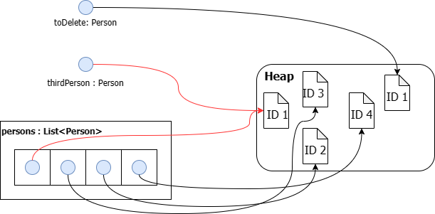

# Collections in .NET

## Erstellen einer Visual Studio Solution

Um die Beispiele mitmachen zu können, muss eine .NET Konsolenapplikation erstellt werden. Führe
dafür die folgenden Befehle in der Konsole aus. Unter macOs müssen md und rd durch die entsprechenden
Befehle ersetzt werden.

```text
rd /S /Q CollectionDemo
md CollectionDemo
cd CollectionDemo
md CollectionDemo.Application
cd CollectionDemo.Application
dotnet new console
cd ..
dotnet new sln -f sln
dotnet sln add CollectionDemo.Application
start CollectionDemo.sln

```

Öffne danach durch Doppelklick auf das Projekt (*CollectionDemo.Application*) die Datei
*CollectionDemo.Application.csproj* und füge die Optionen für
*Nullable* und *TreatWarningsAsError* hinzu. Die gesamte Konfiguration muss nun so aussehen:

```xml
<Project Sdk="Microsoft.NET.Sdk">

  <PropertyGroup>
    <OutputType>Exe</OutputType>
    <TargetFramework>net10.0</TargetFramework>
    <Nullable>enable</Nullable>
    <TreatWarningsAsErrors>true</TreatWarningsAsErrors>
  </PropertyGroup>

</Project>
```

## Das Array als einfachste Collection

Wie in Java können mehrere Elemente des gleichen Typs als Array deklariert werden. Natürlich können
auch Referenztypen wie eigene Klassen, ... in Arrays verwaltet werden. Durch den *new* Operator
ist erkennbar, dass diese Datenstruktur am Heap angelegt wird. Das bedeutet, dass der Garbage
Collector diese Daten wieder entfernen muss. Daher macht es einen Unterschied, ob 2 getrennte
Werte wie *int x; int y;* oder ein zweidimensionales Array verwendet wird.

```c#
int length = 6;
int[] numbers = new int[6];         // (1)
int[] numbers2 = new int[length];   // (2)

int[] numbersDrawn = new int[] { 1, 2, 3, 4, 5, 6 };  // (3)
```

- **(1)** Wird ein Array mit einer fixen Größe definiert, werden alle Elemente mit dem default
  Wert initialisiert. Numbers hat daher den Inhalt [0, 0, 0, 0, 0, 0].
- **(2)** Es kann auch eine Variable zur Definition der Länge verwendet werden, sie muss nicht statisch
  sein.
- **(3)** Stehen die zu speichernden Elemente bereits fest, so kann der Initializer das Array befüllen.
  Eine Längenangabe ist dann überflüssig (und führt zu einen Fehler wenn die angegebene Länge der
  Anzahl der Elemente widerspricht).

### Jagged Arrays

Fälschlich als "mehrdimensionales" Array wird das aus Java bekannte *jagged array*
bezeichnet. In Wirklichkeit ist es ein Array, welches auf weitere Arrays im Heap verweist.


<small>Quelle: https://media.geeksforgeeks.org/wp-content/uploads/20201202202711/Untitled4-660x306.png</small>

Dadurch können die Elemente auch unterschiedliche Längen haben, wie folgendes Beispiel zeigt:

```c#
int[][] quickTipp = new int[][]
{
    new int[]{1,2,3,4,5,6},
    new int[]{8,9,10,11,12,13},
    new int[]{14,16}
};
for (int i = 0; i < quickTipp.Length; i++)
{
    Console.Write($"{i + 1}. TIPP: ");
    for (int j = 0; j < quickTipp[i].Length; j++)
    {
        Console.Write($"{quickTipp[i][j]:00} ");
    }
    Console.WriteLine();
}
```

### "Echte" mehrdimensionale Arrays

Ein "echtes" mehrdimensionales Array besteht aus Elementen, die im Speicher linear aufeinanderfolgend
vorliegen. Die Position wird einfach mittels *row x length + col* berechnet. Die erste (äußere)
Dimension ist meist die Zeile, sodass in der inneren Schleife aufeinanderfolgende Speicherbereiche
gelesen werden können. Dies erhöht die Performance, da der CPU Cache nachfolgende Elemente
einliest.

```c#
int[,] matrix = new int[,]
{
    { 1,2,3 },
    { 4,5,6 }
};
for (int row = 0; row < matrix.GetLength(0); row++)
{
    for (int col = 0; col < matrix.GetLength(1); col++)
    {
        Console.Write($"{matrix[row, col]:00} ");
    }
    Console.WriteLine();
}
```

> **Hinweis:** Das mehrdimensionale Array ist ein sehr spezieller Typ und sollte nur
> dann verwendet werden, wenn die Organisation im Speicher aus Performancegründen wesentlich ist.
> OpenCV z. B. speichert seine Transformationsmatrizen als "echte" zweidimensionale Arrays.

## List&lt;T&gt; als flexiblerer Ersatz für Arrays

Arrays haben einen Nachteil: Sie können in der Größe nicht mehr verändert werden, d. h. es gibt
keine *Add()* oder *Remove()* Methode. Daher findet sich in den meisten Programmen der Typ
*List&lt;T&gt;*. Der Zugang zu Collections im Allgemeinen führt über den Namespace
*System.Collections.Generic*. Er muss mit *using* eingebunden werden:

```c#
using System.Collections.Generic;
```


## Interner Aufbau der Klasse List&lt;T&gt;

Der Typ *List&lt;T&gt;* verwendet im Inneren ein Array zur Verwaltung der Daten. Es wird zu Beginn mit
4 Stellen definiert. Werden durch *Add()* mehr Elemente benötigt, wird ein neues internes Array
mit doppelt so vielen Elementen definiert und der Speicher muss kopiert werden. Der Zugriff auf
Elemente ist daher genauso schnell wie bei einem Array.

Für unsere Beispiele verwenden wir die Klasse Person, eine datenhaltende Klasse mit 3 Properties:
```c#
class Person
{
    public Person(int id, string firstname, string lastname)
    {
        Id = id;
        Firstname = firstname;
        Lastname = lastname;
    }

    public int Id { get; }
    public string Firstname { get; set; }
    public string Lastname { get; set; }

    public override string ToString() => $"{Id} - {Firstname} {Lastname}";
}
```

Listen werden generisch durch Angabe des zu speichernden Typs erstellt. Nützlich in C#:
Auch der Initializer kann verwendet werden.

```c#
// using System.Collections.Generic;
List<Person> persons1 = new List<Person>();
// kürzer: var persons2 = new List<Person>()
List<Person> persons2 = new List<Person>()
{
    new Person(id: 1, firstname: "FN1", lastname: "LN1"),
    new Person(id: 2, firstname: "FN2", lastname: "LN2"),
    new Person(id: 3, firstname: "FN3", lastname: "LN3")
};
```

### Abfragen, Hinzufügen und Löschen von Elementen

Der Indexer ([]) greift - wie bei einem Array - nullbasierend auf das n-te Element zu. Mit der Methode
*Add()* wird ein neues Element in die Liste eingefügt. Natürlich kann auch mit *foreach* durch die Liste
iteriert werden.

```c#
persons.Add(new Person(id: 4, firstname: "FN4", lastname: "LN4"));

Person thirdPerson = persons[2];                        // (1)
thirdPerson.Lastname = "Other Name";                    // (2)
Console.WriteLine($"Found {persons.Count} Persons");    // (3)
foreach (Person p in persons)                           // (4)
{
    Console.WriteLine(p);
}
```

- **(1)** Mit dem Index Operator [] kann auf ein Element zugegriffen werden.
- **(2)** Da eine Liste nur Referenzen auf die mit new erzeugen Objekte, aber nicht die Objekte
  selbst (bei Referenztypen) beinhaltet, wird auch bei der Ausgabe "Other Name" zu sehen sein.
- **(3)** Das Property *Count* liefert die Anzahl der Elemente in der Liste.
- **(4)** Die Liste implementiert das Interface *IEnumerable&lt;T&gt;*. Dadurch kann mit foreach die
  Liste durchgegangen werden.

Werden Elemente gelöscht, wird über die *Equals()* Methode nach Elementen in der Liste gesucht. Daher wird
die Person mit der ID 1 nicht gelöscht, da toDelete eine andere Rerefenzadresse besitzt.

```c#
// kürzer: var toDelete = ...
Person toDelete = new Person(id: 1, firstname: "FN1", lastname: "LN1");
persons.Remove(toDelete);
Console.WriteLine($"Found {persons.Count} Persons");

persons.Remove(thirdPerson);
Console.WriteLine($"Found {persons.Count} Persons");
```

Dieses etwas seltsame verhalten wird schnell klarer, wenn wir uns den Speicher ansehen. Es wurde
4x mit *new* eine Person erzeugt. Dadurch sind 4 Instanzen im Heap. Die Referenzen darauf sehen
so aus:



## Das Dictionary (HashMap in Java)

Der Zugriff auf Elemente einer Liste erfolgt über den Index. Möchten wir z. B. nach einer Person
mit der ID 2 suchen, so müssen wir die Liste durchlaufen. Im schlechtesten Fall (Element wird nicht
gefunden) benötigt dies n Vergleiche.

Das *Dictionary* hat die Möglichkeit, einen Key zu definieren. Er muss eindeutig sein und
über den Indexer ist ein Zugriff über den Key möglich. Es kann jeder Datentyp als Key (auch eigene
Typen) verwendet werden.

Das folgende Beispiel erstellt ein Dictionary mit einem *string* Feld als Key und einer Person als Wert.
Es kann auch hier der Indexer verwendet werden.

```c#
// kürzer: var personsDict = new Dictionary<string, Person>()
Dictionary<string, Person> personsDict = new Dictionary<string, Person>()
{
    {"A", new Person(id: 1, firstname: "FN1", lastname: "LN1") },
    {"B", new Person(id: 2, firstname: "FN2", lastname: "LN2") },
    {"C", new Person(id: 3, firstname: "FN3", lastname: "LN3") }
};

// Add benötigt 2 Argumente: Key und Value.
personsDict.Add("D", new Person(id: 4, firstname: "FN4", lastname: "LN4"));
```

#### Zugriff auf Elemente

Über den Indexoperator kann die Person B ausgelesen werden. Mit *foreach* kann das Dictionary
durchlaufen werden. Es wird dann ein KeyValuePair zurückgegeben, welches den Key im Dictionary und
das eigentliche Objekt im Property *Value* enthält.
```c#
Person personB = personsDict["B"];
foreach (KeyValuePair<string, Person> p in personsDict)  // kürzer: foreach (var p in personDict)
{
    Console.WriteLine($"Person {p.Key} hat den Zunamen {p.Value.Lastname}");
}
```

Das Löschen von Elementen wird mit *Remove()* über den Key durchgeführt:
```c#
personDict.Remove("A");
```

#### TryGetValue() und TryAdd()

Wird in einem Dictionary versucht, einen bestehenden Key hinzuzufügen, wird eine *ArgumentException
(An item with the same key has already been added)* ausgelöst. Der Zugriff auf einen nicht
vorhandenen Index führt ebenso zu einer Exception.
```c#
// ArgumentException: An item with the same key has already been added
personDict.Add("D", new Person(id: 5, firstname: "FN5", lastname: "LN5"));
Person notFound = personDict["Z"];
```

Daher gibt es bessere Methoden, um Daten zu suchen oder zu schreiben:
```c#
if (personsDict.TryGetValue("C", out Person? found))
{
    Console.WriteLine(found.Lastname);
}
if (!personsDict.TryAdd("D", new Person(id: 4, firstname: "FN4", lastname: "LN4")))
{
    Console.WriteLine("Person D ist bereits im Dictionary.");
}
```


## HashSet (HashSet in Java)

Einen Spezialfall stellt das Hashset dar. Oft sollen - wie bei *DISTINCT* in SQL - doppelte Werte entfernt
werden. Das Hashset speichert durch *Add()* nur den ersten Wert, nachfolgende idente Werte werden ignoriert.
Die Gleichheit wird bei Referenztypen auch über *Equals()* ermittelt.
```c#
HashSet<string> teacherHashSet = new HashSet<string>();
teacherHashSet.Add("SZ");
// Wird einfach ignoriert.
teacherHashSet.Add("SZ");
foreach(string teacher in teacherHashSet)
{
    Console.WriteLine(teacher);                // Gibt 1x SZ aus.
}            
```

Das HashSet bietet keinen direkten Zugriff auf die Elemente. Oft wird es im Zusammenhang mit
der Contains Methode verwendet, da es eine binäre Suche bietet.

```c#
if (teacherHashSet.Contains("SZ")) { ... }
```

## Read-only Collections: IReadOnlyList, IReadOnlySet und IReadOnlyDictionary

Oft verwaltet eine Klasse intern eine Collection, die von außen nur gelesen werden soll. Die
folgende Klasse *Course* prüft beim Hinzufügen, ob der Kurs schon voll ist. Wäre die Liste als
*List&lt;Person&gt;* public, könnte jeder mit *course.Persons.Add()* diese Prüfung umgehen.

```c#
class Course
{
    private readonly List<Person> _persons = new();
    public IReadOnlyList<Person> Persons => _persons.AsReadOnly();

    public void AddPerson(Person person)
    {
        if (_persons.Count >= 20) { throw new InvalidOperationException("Der Kurs ist voll."); }
        _persons.Add(person);
    }
}
```

Die Liste selbst ist *private readonly*. Nach außen gibt das Property nur ein Interface zurück, das
ausschließlich lesende Methoden definiert. Für die 3 besprochenen Collections gibt es jeweils ein
passendes Interface:

| Collection                      | Read-only Interface                        | Was ist erlaubt?                                      |
| ------------------------------- | ------------------------------------------ | ----------------------------------------------------- |
| *List&lt;T&gt;*                 | *IReadOnlyList&lt;T&gt;*                   | *Count*, Indexer [], *foreach*                        |
| *HashSet&lt;T&gt;*              | *IReadOnlySet&lt;T&gt;*                    | *Count*, *Contains()*, *foreach*                      |
| *Dictionary&lt;TKey, TValue&gt;* | *IReadOnlyDictionary&lt;TKey, TValue&gt;* | *Count*, Indexer [], *ContainsKey()*, *TryGetValue()*, *Keys*, *Values*, *foreach* |

Methoden wie *Add()*, *Remove()* oder *Clear()* sind in diesen Interfaces nicht definiert. Ein
Aufruf führt daher schon zu einem Compilerfehler.

### Warum AsReadOnly() und kein Typecast?

Da *List&lt;T&gt;* das Interface *IReadOnlyList&lt;T&gt;* implementiert, würde auch ein impliziter
Typecast kompilieren:

```c#
public IReadOnlyList<Person> Persons => _persons;   // Typecast, nicht empfohlen!
```

Das Problem: Der Typecast ändert nur den Typ der Variable, nicht das Objekt im Speicher. Hinter
*Persons* steht immer noch die interne Liste. Mit einem gegenläufigen (expliziten) Typecast wird
sie wieder bearbeitbar und die Prüfung in *AddPerson()* ist umgangen:

```c#
List<Person> hacked = (List<Person>)course.Persons;   // Funktioniert!
hacked.Add(new Person(id: 99, firstname: "FN99", lastname: "LN99"));
hacked.Clear();                                       // Die interne Liste der Klasse ist leer.
```

*AsReadOnly()* erzeugt dagegen ein eigenes Objekt vom Typ *ReadOnlyCollection&lt;T&gt;*
(Namespace *System.Collections.ObjectModel*). Es umhüllt die interne Liste und leitet nur lesende
Zugriffe weiter. Der Typecast auf *List&lt;Person&gt;* ist nicht mehr möglich:

```c#
List<Person> hacked = (List<Person>)course.Persons;   // InvalidCastException
IList<Person> list = (IList<Person>)course.Persons;   // OK, aber...
list.Add(new Person(id: 99, firstname: "FN99", lastname: "LN99"));  // NotSupportedException
```

*AsReadOnly()* kopiert die Daten nicht. Der Wrapper ist nur eine Sicht auf die interne Liste,
deshalb sind spätere Änderungen durch *AddPerson()* auch über *Persons* sichtbar. Der Aufruf ist
also günstig und kann direkt im Property stehen.

Die Methode gibt es für alle 3 Collections:

```c#
private readonly List<Person> _persons = new();
private readonly HashSet<string> _cities = new();
private readonly Dictionary<int, Person> _personsById = new();

public IReadOnlyList<Person> Persons => _persons.AsReadOnly();                       // ReadOnlyCollection<T>
public IReadOnlySet<string> Cities => _cities.AsReadOnly();                          // ReadOnlySet<T>
public IReadOnlyDictionary<int, Person> PersonsById => _personsById.AsReadOnly();    // ReadOnlyDictionary<TKey, TValue>
```

> Read-only bezieht sich nur auf die Collection, nicht auf die gespeicherten Objekte. Über
> *course.Persons[0].Lastname = "X"* kann die Person trotzdem verändert werden, wenn das Property
> *Lastname* einen public Setter hat.

## Übung

Erstelle ein Projekt mit dem Namen *CollectionDemo* wie oben beschrieben. Ersetze danach den Inhalt
von Program.cs durch die untenstehende Version. Vervollständige die 2 Klassen 
*SchoolClass* und *Student* so, dass die Ausgaben des Programmes korrekt sind.

```c#
using System;
using System.Collections.Generic;
using System.Linq;
using System.Text.Json;
using System.Text.Json.Serialization;

namespace ExColletions
{
    /// <summary>
    /// TODO: 
    ///    - Create a constructor to initialize Name, ClassTeacher (KV).
    ///    - Add a List of students to manage the students in this class.
    ///    - Use IReadOnlyList for your public property. It should NOT be possible to add or remove students from outside
    ///      without calling AddStudent or RemoveStudent.
    ///    - Add a read-only property of type HashSet<string> to get the different cities in this class.
    /// </summary>
    class SchoolClass
    {
        public string Name { get; }
        public string ClassTeacher { get; }
        /// <summary>
        /// Adds a student and modifies the schoolclass reference of the provided
        /// student.
        /// </summary>
        public void AddStudent(Student s)
        {
        }

        /// <summary>
        /// Removes a student and modifies the schoolclass reference of the provided
        /// student.
        /// </summary>
        public void RemoveStudent(Student s)
        {
        }
    }

    /// <summary>
    /// TODO: 
    ///    - Add a constructor to initialize the properties Id, Firstname, Lastname and City.
    ///    - Add a reference to the class of the student (type SchoolClass). This reference is optional,
    ///      if a student is not assigned to a class is has the value null.
    ///    - Add an annotation [JsonIgnore] above this property to suppress the content of
    ///      the class object in your serialized output.
    /// </summary>
    class Student
    {
        public int Id { get; }
        public string Lastname { get; }
        public string Firstname { get; }
        public string City { get; set; }
        /// <summary>
        /// Updates the reference of the student and adds the student to the new class.
        /// </summary>
        /// <param name="k"></param>
        public void ChangeClass(SchoolClass k)
        {
        }
    }

    class Program
    {
        static void Main(string[] args)
        {
            Dictionary<string, SchoolClass> classes = new();
            classes.Add("3AHIF", new SchoolClass(name: "3AHIF", classTeacher: "KV1"));
            classes.Add("3BHIF", new SchoolClass(name: "3BHIF", classTeacher: "KV2"));
            classes.Add("3CHIF", new SchoolClass(name: "3CHIF", classTeacher: "KV3"));

            classes["3AHIF"].AddStudent(new Student(id: 1001, firstname: "FN1", lastname: "LN1", city: "CTY1"));
            classes["3AHIF"].AddStudent(new Student(id: 1002, firstname: "FN2", lastname: "LN2", city: "CTY1"));
            classes["3AHIF"].AddStudent(new Student(id: 1003, firstname: "FN3", lastname: "LN3", city: "CTY2"));
            classes["3BHIF"].AddStudent(new Student(id: 1011, firstname: "FN4", lastname: "LN4", city: "CTY1"));
            classes["3BHIF"].AddStudent(new Student(id: 1012, firstname: "FN5", lastname: "LN5", city: "CTY1"));
            classes["3BHIF"].AddStudent(new Student(id: 1013, firstname: "FN6", lastname: "LN6", city: "CTY1"));

            Student s = classes["3AHIF"].Students[0];
            Console.WriteLine($"s sitzt in der Klasse {s.SchoolClass?.Name} mit dem KV {s.SchoolClass?.ClassTeacher}.");
            Console.WriteLine($"In der 3AHIF sind folgende Städte: {JsonSerializer.Serialize(classes["3AHIF"].Cities)}.");

            Console.WriteLine("3AHIF vor ChangeKlasse:");
            Console.WriteLine(JsonSerializer.Serialize(classes["3AHIF"].Students));
            s.ChangeClass(classes["3BHIF"]);
            Console.WriteLine("3AHIF nach ChangeKlasse:");
            Console.WriteLine(JsonSerializer.Serialize(classes["3AHIF"].Students));
            Console.WriteLine("3BHIF nach ChangeKlasse:");
            Console.WriteLine(JsonSerializer.Serialize(classes["3BHIF"].Students));
            Console.WriteLine($"s sitzt in der Klasse {s.SchoolClass?.Name} mit dem KV {s.SchoolClass?.ClassTeacher}.");
        }
    }
}
```

### Korrekte Ausgabe:
```
s sitzt in der Klasse 3AHIF mit dem KV KV1.
In der 3AHIF sind folgende Städte: ["CTY1","CTY2"].
3AHIF vor ChangeKlasse:
[{"City":"CTY1","Id":1001,"Lastname":"LN1","Firstname":"FN1"},{"City":"CTY1","Id":1002,"Lastname":"LN2","Firstname":"FN2"},{"City":"CTY2","Id":1003,"Lastname":"LN3","Firstname":"FN3"}]
3AHIF nach ChangeKlasse:
[{"City":"CTY1","Id":1002,"Lastname":"LN2","Firstname":"FN2"},{"City":"CTY2","Id":1003,"Lastname":"LN3","Firstname":"FN3"}]
3BHIF nach ChangeKlasse:
[{"City":"CTY1","Id":1011,"Lastname":"LN4","Firstname":"FN4"},{"City":"CTY1","Id":1012,"Lastname":"LN5","Firstname":"FN5"},{"City":"CTY1","Id":1013,"Lastname":"LN6","Firstname":"FN6"},{"City":"CTY1","Id":1001,"Lastname":"LN1","Firstname":"FN1"}]
s sitzt in der Klasse 3BHIF mit dem KV KV2.
```

## Übung 2

Erstelle ein Projekt mit dem Namen *LottoDemo* wie oben beschrieben. Ersetze danach den Inhalt
von Program.cs durch die untenstehende Version.

Mit der Klasse *LottoTipp* soll ein Lottoschein implementiert werden. Beim Zahlenlotto werden
6 Zahlen zwischen 1 und 45 gezogen, wobei keine Zahl doppelt vorkommen darf (Ziehen ohne
zurücklegen). Weiters soll die Möglichkeit bestenen, Quicktipps zu generieren. Hier generiert
der Zufallszahlengenerator 6 zufällige Zahlen zwischen 1 und 45.

Die Tipps sollen in einer internen Liste verwaltet werden. Diese Liste kann die einzelnen
Tipps aufnehmen. Sie muss *private* sein!

Die angezeigten Zahlen in der Musterausgabe sollen auch in deinem Programm erscheinen. Da der
Zufallszahlengenerator mit einem fixen Seed (906) verwendet wird, liefert er immer die gleiche
Sequenz an Werten. Verwende in der Klasse *_random.Next(1, 46)* zum Generieren der Zahlen. Damit
Duplikate vermieden werden, musst du bei jeder generierten Zahl nachsehen, ob sie nicht schon
im Array vorhanden ist. Wenn ja, wird einfach eine neue nächste Zahl generiert.

**Program.cs**
```c#
using System;
using System.Collections.Generic;
using System.Diagnostics;
using System.Linq;


{
    Console.WriteLine($"Prüfe die Tipps auf Duplikate...");
    var lottoTipp = new LottoTipp();
    lottoTipp.AddQuicktipps(1000);
    for (int i = 0; i < 1000; i++)
    {
        var tipp = lottoTipp.GetTipp(i);
        if (tipp.Distinct().Count() != 6)
        {
            Console.Error.WriteLine($"FEHLER! Der Tipp {string.Join(",", tipp)} hat Duplikate!");
            return;
        }
        if (tipp.Max() > 45)
        {
            Console.Error.WriteLine($"FEHLER! Der Tipp {string.Join(",", tipp)} hat Zahlen über 45.");
            return;
        }
        if (tipp.Min() < 1)
        {
            Console.Error.WriteLine($"FEHLER! Der Tipp {string.Join(",", tipp)} hat Zahlen unter 1.");
            return;
        }
    }
}

{
    var lottoTipp = new LottoTipp();
    lottoTipp.AddQuicktipps(5);
    Console.WriteLine($"Generiere 5 Tipps...");
    for (int i = 0; i < 5; i++)
    {
        var tipp = lottoTipp.GetTipp(i);
        Console.WriteLine($"Tipp {i}: {string.Join(" ", tipp)}");
    }
}

{
    Console.WriteLine($"Generiere 1 000 000 Tipps und zähle die 6er, 5er, ...");
    var usedMemory = GC.GetTotalMemory(forceFullCollection: true);
    var lottoTipp = new LottoTipp();
    lottoTipp = new LottoTipp();
    lottoTipp.AddQuicktipps(1_000_000);
    var drawnNumbers = new int[] { 4, 2, 1, 8, 32, 16 };
    var stopwatch = new Stopwatch();
    stopwatch.Start();
    for (int i = 0; i < 1_000_000; i++)
    {
        var rightNumbers = lottoTipp.CheckTipp(i, drawnNumbers);
        if (rightNumbers >= 5)
        {
            var tipp = lottoTipp.GetTipp(i);
            Console.WriteLine($"Tipp {i:000 000} hat {rightNumbers} Richtige: {string.Join(" ", tipp)}");

        }
    }
    stopwatch.Stop();
    Console.WriteLine($"Berechnung nach {stopwatch.ElapsedMilliseconds} ms beendet.");
    Console.WriteLine($"{(GC.GetTotalMemory(forceFullCollection: true) - usedMemory)/1048576M:0.00} MBytes belegt.");
}

// TODO: Implementiere die Klasse. Füge notwendige Properties und interne Listen hinzu.
class LottoTipp
{
    private readonly Random _random = new Random(906);  // Fixed Seed, erzeugt immer die selbe Sequenz an Werten.

    /// <summary>
    /// Property; Gibt die Anzahl der gespeicherten Tipps zurück.
    /// </summary>
    public int TippCount { get; } // TODO: Implementierung statt default Property.

    /// <summary>
    /// Gibt den nten gespeicherten Tipp als Array zurück. Der erste Tipp hat die Nummer 0.
    /// </summary>
    public int[] GetTipp(int number)
    {
        // TODO: Implementierung    }
    }
    /// <summary>
    /// Generiert 6 zufällige Zahlen zwischen 1 und 45 ohne Kollision.
    /// </summary>
    private int[] GetNumbers()
    {
        // TODO: Implementierung
    }

    /// <summary>
    /// Fügt die in count übergebene Anzahl an Tipps zur internen Tippliste hinzu.
    /// </summary>
    /// <param name="count"></param>
    public void AddQuicktipps(int count)
    {
        // TODO: Implementierung
    }

    /// <summary>
    /// Prüft, wie viele Richtige der nte Tipp hat. Die Tippnummer beginnt bei 0
    /// (0 ist also der erste Tipp, ...).
    /// </summary>
    public int CheckTipp(int tippNr, int[] drawnNumbers)
    {
        // TODO: Implementierung
    }
}

```


**Korrekte Ausgabe**
```
Prüfe die Tipps auf Duplikate...
Generiere 5 Tipps...
Tipp 0: 2 30 3 43 12 14
Tipp 1: 39 44 3 17 35 36
Tipp 2: 21 37 8 39 32 33
Tipp 3: 10 6 9 5 25 23
Tipp 4: 12 40 3 36 34 30
Generiere 1 000 000 Tipps und zähle die 6er und 5er.
Tipp 000 094 hat 5 Richtige: 2 4 27 16 8 32
Tipp 017 533 hat 5 Richtige: 8 41 4 1 2 16
Tipp 065 810 hat 5 Richtige: 2 18 16 4 32 1
Tipp 111 809 hat 5 Richtige: 2 4 1 32 16 9
Tipp 137 467 hat 5 Richtige: 8 4 16 32 11 2
Tipp 196 819 hat 5 Richtige: 16 2 8 4 29 1
Tipp 248 287 hat 5 Richtige: 8 2 1 32 16 31
Tipp 288 697 hat 5 Richtige: 28 8 4 1 2 32
Tipp 324 754 hat 5 Richtige: 13 4 1 2 8 16
Tipp 436 717 hat 5 Richtige: 8 16 32 2 4 11
Tipp 473 618 hat 5 Richtige: 1 2 8 16 32 19
Tipp 477 288 hat 5 Richtige: 9 32 8 16 1 4
Tipp 499 182 hat 6 Richtige: 16 1 32 8 4 2
Tipp 519 778 hat 5 Richtige: 2 8 4 32 31 1
Tipp 529 366 hat 5 Richtige: 2 4 32 36 8 16
Tipp 585 261 hat 5 Richtige: 4 20 1 2 16 32
Tipp 680 855 hat 5 Richtige: 37 32 1 4 16 2
Tipp 707 693 hat 5 Richtige: 16 43 4 32 8 1
Tipp 738 554 hat 5 Richtige: 30 1 16 8 32 2
Tipp 770 300 hat 5 Richtige: 2 16 39 32 8 4
Tipp 784 975 hat 5 Richtige: 2 16 32 8 20 1
Tipp 807 334 hat 5 Richtige: 1 37 16 4 8 2
Tipp 911 569 hat 5 Richtige: 32 2 8 4 45 1
Tipp 916 819 hat 5 Richtige: 8 10 16 32 1 2
Tipp 924 592 hat 5 Richtige: 8 4 1 38 2 32
Tipp 942 173 hat 5 Richtige: 1 2 8 32 16 12
Tipp 985 945 hat 5 Richtige: 16 8 2 4 32 14
Berechnung nach 81 ms beendet.
53,78 MBytes belegt.
```

### Für echte Profis

Die Tipps werden in einer Liste von int Arrays verwaltet. Ein einzelner Tipp wird als int
Array gespeichert und benötigt daher 6x4 = 24 Bytes am Heap. Zudem muss beim Generieren das
Array auf schon vorhandene Zahlen geprüft werden. Beim Prüfen, wie viele Zahlen "richtig" sind (also im
übergebenen Array vorkommen), müssen wir immer durch das Array iterieren und prüfen, ob die Zahl
im Array des Tipps vorkommt.

Daher verfolgen wir folgende Idee: Der Tipp könnte auch als *Bitmaske* gespeichert werden.
1 bedeutet, dass die Zahl gezogen wurde. Somit können wir mit 45 Bits ebenfalls einen Lottotipp
speichern. Ein *long* Wert in C# hat 64 Bits. Daher kann ein ganzer Tipp mit einem Wert vom Typ *long*
gespeichert werden:


Implementiere nun deine Klasse so, dass sie als interne Struktur eine Liste von long Werten
zum Speichern der Tipps verwendet. Die Funktionsparameter der public Methoden dürfen natürlich
nicht verändert werden, d. h. das Musterprogramm muss weiterhin funktionieren. Je nach Generierung
können die generierten Zufallszahlen allerdings abweichen. Überlege dabei auch folgendes: Die
Bestimmung, wie viele Zahlen "richtig" (also im übergebenen Array sind) kann bitweise,
also auch performanter, ermittelt werden. Verwende geeignete Operationen und
[Brian Kernighan's Algorithm](https://iq.opengenus.org/brian-kernighan-algorithm/#:~:text=The%20main%20idea%20behind%20this,binary%20representation%20of%20these%20numbers.)
zum Zählen der gesetzten Bits.

> Beachte, dass bei Bitshifts, die einen Wert vom Typ *long* als Ergebnis haben, das Literal **1L** statt
> 1 geschrieben werden muss. Sonst würde ein Wert vom Typ *int* entstehen, der abgeschnitten wird.
> Achte zudem auf die Rangfolge der Operatoren. Der Vergleich wird ohne entsprechende Klammerung
> vor bitweisem UND bzw. ODER ausgeführt.

## Übung 3: Eine Heldengruppe für das Rollenspiel

Diese Übung ist die Fortsetzung der Übung *Charaktere für ein Rollenspiel* aus dem Kapitel
[Properties](03_Properties.md). Verwende die Solution *RpgDemo* weiter und kopiere deine Klassen
*Weapon* und *Character* in die untenstehende Program.cs. Die Klasse *Weapon* bleibt unverändert,
*Character* wird erweitert und die Klasse *Party* kommt neu dazu.

Jede Collection soll intern in einer *private readonly* Variable gespeichert werden. Nach außen
gibt ein read-only Property nur ein Interface zurück, das keine Änderungen erlaubt
(*IReadOnlyList&lt;T&gt;*, *IReadOnlySet&lt;T&gt;* oder *IReadOnlyDictionary&lt;TKey, TValue&gt;*).
Die Collection wird also nur über die Methoden der Klasse verändert. Verwende dafür *AsReadOnly()*
und keinen Typecast (siehe Kapitel *Read-only Collections*). Die Tests prüfen das.

Für die Waffen der Klasse *Character* (List) gelten folgende Regeln:
- Das Property *Weapon* aus Übung 2 speichert weiterhin die ausgerüstete Waffe. Es darf aber nur
  noch in der Klasse gesetzt werden. Ausgerüstet wird über die folgenden Methoden.
- Der Charakter hat ein Inventar mit beliebig vielen Waffen. Das Property *Weapons* liefert es als
  *IReadOnlyList&lt;Weapon&gt;*. Am Anfang ist das Inventar leer.
- Die Methode *PickUp(Weapon weapon)* fügt die Waffe hinten an das Inventar an. Hat der Charakter
  noch keine Waffe ausgerüstet, wird die aufgehobene Waffe gleich ausgerüstet.
- Die Methode *Equip(Weapon weapon)* rüstet die übergebene Waffe aus. Ist sie nicht im Inventar,
  wird eine *ArgumentException* geworfen.
- Die Methode *EquipStrongestWeapon()* rüstet die Waffe mit dem größten *Damage* aus dem Inventar
  aus. Ist das Inventar leer, passiert nichts.
- Die Methode *Drop(Weapon weapon)* entfernt die Waffe aus dem Inventar und liefert true. War sie
  ausgerüstet, hat der Charakter danach keine Waffe mehr. Ist die Waffe nicht im Inventar, wird
  false geliefert.

Für die Fähigkeiten der Klasse *Character* (HashSet) gelten folgende Regeln:
- Ein Charakter kann Fähigkeiten wie *Feuerball* oder *Heilen* lernen. Jede Fähigkeit kommt dabei
  nur einmal vor. Das Property *Skills* liefert sie als *IReadOnlySet&lt;string&gt;*.
- Die Methode *LearnSkill(string skill)* fügt die Fähigkeit hinzu. Sie liefert true, wenn die
  Fähigkeit neu ist und false, wenn der Charakter sie schon beherrscht. Sieh dir dafür den
  Rückgabewert von *HashSet.Add()* an.
- Die Methode *HasSkill(string skill)* liefert true, wenn der Charakter die Fähigkeit beherrscht.

Für die Klasse *Party* (Dictionary) gelten folgende Regeln:
- Die Klasse hat einen Konstruktor mit dem Parameter *name* (string). Das Property *Name* ist
  immutable.
- Die Mitglieder werden in einem Dictionary mit dem Namen des Charakters als Key gespeichert.
  Das Property *Members* liefert es als *IReadOnlyDictionary&lt;string, Character&gt;*.
- Die Methode *AddMember(Character character)* fügt den Charakter hinzu und liefert true. Gibt es
  schon ein Mitglied mit diesem Namen oder hat die Party schon 4 Mitglieder, wird der Charakter
  nicht aufgenommen und false geliefert.
- Die Methode *RemoveMember(string name)* entfernt das Mitglied mit diesem Namen. Sie liefert
  true, wenn es gefunden wurde, sonst false.
- Die Methode *FindMember(string name)* liefert das Mitglied mit diesem Namen oder null, wenn es
  nicht gefunden wurde. Verwende *TryGetValue()* und überlege dir den Rückgabetyp.
- Das Property *AliveMembers* ist read-only und liefert eine neue *List&lt;Character&gt;* mit allen
  Mitgliedern, die noch am Leben sind.
- Das Property *Skills* ist read-only und liefert ein neues *HashSet&lt;string&gt;* mit allen
  Fähigkeiten, die in der Party vorkommen. Beherrschen mehrere Mitglieder die gleiche Fähigkeit,
  kommt sie trotzdem nur einmal vor. Die Methode *UnionWith()* kann hier verwendet werden.
- Die Party hat gemeinsame Vorräte wie Heiltränke oder Fackeln. Sie werden in einem Dictionary
  mit dem Namen des Gegenstandes als Key und der Anzahl als Value gespeichert. Das Property
  *Supplies* liefert es als *IReadOnlyDictionary&lt;string, int&gt;*.
- Die Methode *AddSupply(string item, int count)* erhöht die Anzahl des Gegenstandes um *count*.
  Ist der Gegenstand noch nicht vorhanden, wird er mit dieser Anzahl angelegt. Ist *count* nicht
  größer als 0, wird eine *ArgumentException* geworfen.
- Die Methode *GetSupplyCount(string item)* liefert die Anzahl des Gegenstandes oder 0, wenn er
  nicht vorhanden ist.
- Die Methode *UseSupply(string item)* verringert die Anzahl um 1 und liefert true. Ist der
  Gegenstand nicht vorhanden, wird false geliefert. Wird der letzte Gegenstand verbraucht, wird
  der Key aus dem Dictionary entfernt.
- Die Methode *AttackTogether(Character enemy)* lässt alle lebenden Mitglieder den Gegner mit
  *Attack()* angreifen.

Überlege dir bei jeder Methode, welche Methode der Collection die Arbeit schon erledigt. Viele
Methoden lassen sich dann in einer Zeile schreiben. Beachte, dass *Contains()* und *Remove()* bei
einer Liste von Objekten die Referenzen vergleichen (siehe Kapitel über *List&lt;T&gt;*).

Die Ausgabe des Programmes muss am Ende so lauten:

```
********************************************************************************
TESTS FÜR DIE WAFFEN EINES CHARAKTERS (LIST)
********************************************************************************
1 Weapons ist eine schreibgeschützte IReadOnlyList<Weapon> OK
2 Weapon ist von außen nicht setzbar OK
3 PickUp OK
4 Equip OK
5 Exception bei Equip einer Waffe, die nicht im Inventar ist OK
6 EquipStrongestWeapon OK
7 Drop OK
********************************************************************************
TESTS FÜR DIE FÄHIGKEITEN EINES CHARAKTERS (HASHSET)
********************************************************************************
1 Skills ist ein schreibgeschütztes IReadOnlySet<string> OK
2 LearnSkill ignoriert doppelte Fähigkeiten OK
3 HasSkill OK
********************************************************************************
TESTS FÜR PARTY (DICTIONARY)
********************************************************************************
1 Kein default Konstruktor OK
2 Members und Supplies sind ein schreibgeschütztes IReadOnlyDictionary OK
3 AddMember OK
4 Keine doppelten Namen in der Party OK
5 Maximal 4 Mitglieder OK
6 FindMember OK
7 RemoveMember OK
8 AliveMembers OK
9 Skills der Party ohne Duplikate OK
10 AddSupply und GetSupplyCount OK
11 Exception bei ungültiger Anzahl OK
12 UseSupply entfernt aufgebrauchte Gegenstände OK
13 AttackTogether OK
```

### Program.cs
```c#
using System;
using System.Collections.Generic;
using System.Reflection;

namespace RpgDemo.Application;

class Weapon
{
    // TODO: Kopiere deine Implementierung aus Übung 2
}

class Character
{
    // TODO: Kopiere deine Implementierung aus Übung 2 und erweitere sie
}

class Party
{
    // TODO: Implementierung von Party
}

class Program
{
    // DON'T TOUCH!
    private static void Main(string[] args)
    {
        Console.WriteLine("********************************************************************************");
        Console.WriteLine("TESTS FÜR DIE WAFFEN EINES CHARAKTERS (LIST)");
        Console.WriteLine("********************************************************************************");
        Character hero = new Character(name: "Link", maxHealth: 100, strength: 10);
        Weapon dagger = new Weapon(name: "Dolch", damage: 5);
        Weapon sword = new Weapon(name: "Schwert", damage: 15);
        Weapon axe = new Weapon(name: "Axt", damage: 25);
        if (IsReadOnly(typeof(Character), nameof(Character.Weapons))
            && HasType(typeof(Character), nameof(Character.Weapons), typeof(IReadOnlyList<Weapon>))
            && hero.Weapons is not List<Weapon> && hero.Weapons.Count == 0)
        {
            Console.WriteLine("1 Weapons ist eine schreibgeschützte IReadOnlyList<Weapon> OK");
        }
        if (HasPrivateSetter(typeof(Character), nameof(Character.Weapon)) && hero.Weapon is null)
        {
            Console.WriteLine("2 Weapon ist von außen nicht setzbar OK");
        }
        hero.PickUp(dagger);
        Weapon? weaponAfterFirstPickUp = hero.Weapon;
        hero.PickUp(sword);
        if (weaponAfterFirstPickUp == dagger && hero.Weapon == dagger
            && hero.Weapons.Count == 2 && hero.Weapons[0] == dagger && hero.Weapons[1] == sword)
        {
            Console.WriteLine("3 PickUp OK");
        }
        hero.Equip(sword);
        if (hero.Weapon == sword && hero.AttackPower == 25) { Console.WriteLine("4 Equip OK"); }
        try
        {
            hero.Equip(axe);
        }
        catch (ArgumentException)
        {
            if (hero.Weapon == sword) { Console.WriteLine("5 Exception bei Equip einer Waffe, die nicht im Inventar ist OK"); }
        }
        Character farmer = new Character(name: "Bauer", maxHealth: 20, strength: 2);
        farmer.EquipStrongestWeapon();
        hero.PickUp(axe);
        hero.Equip(dagger);
        hero.EquipStrongestWeapon();
        if (farmer.Weapon is null && hero.Weapon == axe && hero.AttackPower == 35)
        {
            Console.WriteLine("6 EquipStrongestWeapon OK");
        }
        bool firstDrop = hero.Drop(axe);
        bool secondDrop = hero.Drop(axe);
        if (firstDrop && !secondDrop && hero.Weapon is null && hero.Weapons.Count == 2)
        {
            Console.WriteLine("7 Drop OK");
        }

        Console.WriteLine("********************************************************************************");
        Console.WriteLine("TESTS FÜR DIE FÄHIGKEITEN EINES CHARAKTERS (HASHSET)");
        Console.WriteLine("********************************************************************************");
        if (IsReadOnly(typeof(Character), nameof(Character.Skills))
            && HasType(typeof(Character), nameof(Character.Skills), typeof(IReadOnlySet<string>))
            && hero.Skills is not HashSet<string> && hero.Skills.Count == 0)
        {
            Console.WriteLine("1 Skills ist ein schreibgeschütztes IReadOnlySet<string> OK");
        }
        bool learnedFireball = hero.LearnSkill("Feuerball");
        bool learnedFireballAgain = hero.LearnSkill("Feuerball");
        bool learnedHealing = hero.LearnSkill("Heilen");
        if (learnedFireball && !learnedFireballAgain && learnedHealing && hero.Skills.Count == 2)
        {
            Console.WriteLine("2 LearnSkill ignoriert doppelte Fähigkeiten OK");
        }
        if (hero.HasSkill("Heilen") && !hero.HasSkill("Teleport")) { Console.WriteLine("3 HasSkill OK"); }

        Console.WriteLine("********************************************************************************");
        Console.WriteLine("TESTS FÜR PARTY (DICTIONARY)");
        Console.WriteLine("********************************************************************************");
        if (typeof(Party).GetConstructor(Type.EmptyTypes) is null) { Console.WriteLine("1 Kein default Konstruktor OK"); }
        Party party = new Party(name: "Die Gefährten");
        if (IsReadOnly(typeof(Party), nameof(Party.Members))
            && HasType(typeof(Party), nameof(Party.Members), typeof(IReadOnlyDictionary<string, Character>))
            && IsReadOnly(typeof(Party), nameof(Party.Supplies))
            && HasType(typeof(Party), nameof(Party.Supplies), typeof(IReadOnlyDictionary<string, int>))
            && party.Members is not Dictionary<string, Character> && party.Supplies is not Dictionary<string, int>
            && party.Name == "Die Gefährten" && party.Members.Count == 0)
        {
            Console.WriteLine("2 Members und Supplies sind ein schreibgeschütztes IReadOnlyDictionary OK");
        }
        Character mage = new Character(name: "Zelda", maxHealth: 60, strength: 20);
        Character archer = new Character(name: "Robin", maxHealth: 80, strength: 30);
        Character healer = new Character(name: "Mercy", maxHealth: 50, strength: 5);
        bool heroAdded = party.AddMember(hero);
        bool mageAdded = party.AddMember(mage);
        if (heroAdded && mageAdded && party.Members.Count == 2 && party.Members["Link"] == hero)
        {
            Console.WriteLine("3 AddMember OK");
        }
        if (!party.AddMember(new Character(name: "Link", maxHealth: 10, strength: 1)) && party.Members["Link"] == hero)
        {
            Console.WriteLine("4 Keine doppelten Namen in der Party OK");
        }
        party.AddMember(archer);
        party.AddMember(healer);
        if (!party.AddMember(new Character(name: "Epona", maxHealth: 10, strength: 1)) && party.Members.Count == 4)
        {
            Console.WriteLine("5 Maximal 4 Mitglieder OK");
        }
        if (party.FindMember("Zelda") == mage && party.FindMember("Ganon") is null)
        {
            Console.WriteLine("6 FindMember OK");
        }
        bool firstRemove = party.RemoveMember("Mercy");
        bool secondRemove = party.RemoveMember("Mercy");
        if (firstRemove && !secondRemove && party.Members.Count == 3 && party.FindMember("Mercy") is null)
        {
            Console.WriteLine("7 RemoveMember OK");
        }
        archer.TakeDamage(1000);
        List<Character> aliveMembers = party.AliveMembers;
        if (IsReadOnly(typeof(Party), nameof(Party.AliveMembers))
            && aliveMembers.Count == 2 && aliveMembers.Contains(hero) && aliveMembers.Contains(mage))
        {
            Console.WriteLine("8 AliveMembers OK");
        }
        mage.LearnSkill("Feuerball");
        mage.LearnSkill("Teleport");
        HashSet<string> partySkills = party.Skills;
        if (IsReadOnly(typeof(Party), nameof(Party.Skills))
            && partySkills.Count == 3 && partySkills.Contains("Heilen") && partySkills.Contains("Teleport"))
        {
            Console.WriteLine("9 Skills der Party ohne Duplikate OK");
        }
        party.AddSupply("Heiltrank", 3);
        party.AddSupply("Heiltrank", 2);
        party.AddSupply("Fackel", 1);
        if (party.GetSupplyCount("Heiltrank") == 5 && party.GetSupplyCount("Fackel") == 1
            && party.GetSupplyCount("Seil") == 0 && party.Supplies.Count == 2)
        {
            Console.WriteLine("10 AddSupply und GetSupplyCount OK");
        }
        try
        {
            party.AddSupply("Seil", 0);
        }
        catch (ArgumentException)
        {
            if (!party.Supplies.ContainsKey("Seil")) { Console.WriteLine("11 Exception bei ungültiger Anzahl OK"); }
        }
        bool usedTorch = party.UseSupply("Fackel");
        bool usedTorchAgain = party.UseSupply("Fackel");
        bool usedPotion = party.UseSupply("Heiltrank");
        if (usedTorch && !usedTorchAgain && usedPotion
            && !party.Supplies.ContainsKey("Fackel") && party.GetSupplyCount("Heiltrank") == 4)
        {
            Console.WriteLine("12 UseSupply entfernt aufgebrauchte Gegenstände OK");
        }
        // Link (10 + 15) and Zelda (20) hit the dragon (50 -> 5). Robin is dead and must not attack.
        hero.Equip(sword);
        Character dragon = new Character(name: "Drache", maxHealth: 50, strength: 40);
        party.AttackTogether(dragon);
        int dragonHealthAfterFirstAttack = dragon.Health;
        party.AttackTogether(dragon);
        // Only the member who kills the dragon gets the 50 experience points.
        if (dragonHealthAfterFirstAttack == 5 && !dragon.IsAlive
            && hero.Experience + mage.Experience == 50 && archer.Experience == 0)
        {
            Console.WriteLine("13 AttackTogether OK");
        }
    }

    /// <summary>
    /// Returns true if the property exists and has no set method at all.
    /// </summary>
    private static bool IsReadOnly(Type type, string propertyName)
    {
        PropertyInfo? property = type.GetProperty(propertyName);
        return property is not null && !property.CanWrite;
    }

    /// <summary>
    /// Returns true if the property has a set method that cannot be called from outside the class.
    /// </summary>
    private static bool HasPrivateSetter(Type type, string propertyName)
    {
        PropertyInfo? property = type.GetProperty(propertyName);
        return property is not null && property.SetMethod is not null && !property.SetMethod.IsPublic;
    }

    /// <summary>
    /// Returns true if the property is declared with exactly the given type.
    /// </summary>
    private static bool HasType(Type type, string propertyName, Type expectedType)
    {
        PropertyInfo? property = type.GetProperty(propertyName);
        return property is not null && property.PropertyType == expectedType;
    }
}
```
