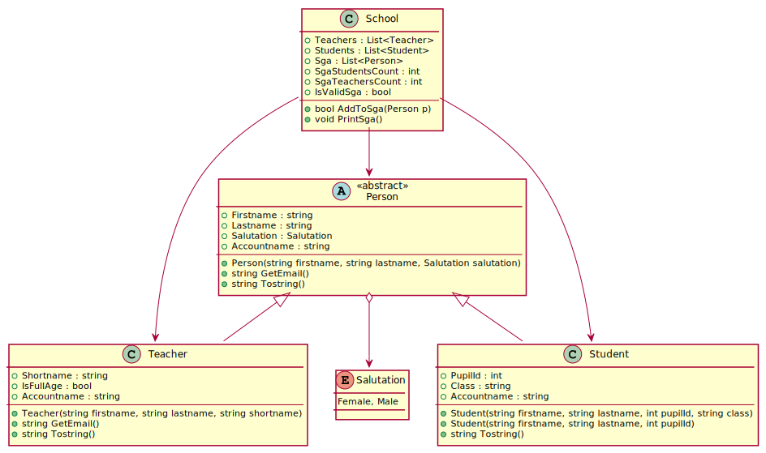
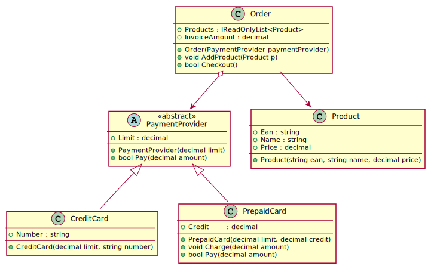

# Vererbung 1: Implementierung in C#

## Erstellen einer Visual Studio Solution

Um die Beispiele mitmachen zu können, muss eine .NET Konsolenapplikation erstellt werden. Führe
dafür die folgenden Befehle in der Konsole aus. Unter macOs müssen md und rd durch die entsprechenden
Befehle ersetzt werden.

```text
rd /S /Q InheritanceDemo
md InheritanceDemo
cd InheritanceDemo
md InheritanceDemo.Application
cd InheritanceDemo.Application
dotnet new console
cd ..
dotnet new sln
dotnet sln add InheritanceDemo.Application
start InheritanceDemo.sln

```

Öffne danach durch Doppelklick auf das Projekt (*InheritanceDemo.Application*) die Datei
*InheritanceDemo.Application.csproj* und füge die Optionen für
*Nullable* und *TreatWarningsAsError* hinzu. Die gesamte Konfiguration muss nun so aussehen:

```xml
<Project Sdk="Microsoft.NET.Sdk">

  <PropertyGroup>
    <OutputType>Exe</OutputType>
    <TargetFramework>net5.0</TargetFramework>
    <Nullable>enable</Nullable>
    <TreatWarningsAsErrors>true</TreatWarningsAsErrors>
  </PropertyGroup>

</Project>
```

## Unterschiede zu Java
Die Vererbung wird in C# in weiten Teilen wie in Java implementiert. Einige Besonderheiten treten
allerdings auf:
- Vererbung wird durch den Doppelpunkt gekennzeichnet. Es gibt keinen Unterschied zwischen Klassen und Interfaces, also zwischen *extends* und *implements*.
- Es kann genauso wie in Java nur von 1 Klasse geerbt werden, es können jedoch beliebig viele Interfaces implementiert werden.
- Properties sind im Prinzip auch nur Methoden, daher können sie natürlich auch vererbt werden.
- Das Schlüsselwort virtual erlaubt das Überschreiben dieser Methode in den nachfolgenden Klassen.
- Das Schlüsselwort override überschreibt eine mit virtual gekennzeichnete Methode.
- Das Schlüsselwort new blendet eine Methode aus.

Die Funktionsweise ist in den Kommentaren des nachfolgenden Codes erklärt.

## Ein kleines UML Klassendiagramm

- Abstrakte Klassen wie die Klasse *Person* werden mit A gekennzeichnet.
- Abstrakte Methoden oder Felder sind kursiv wie *IsFullAge* (ist volljährig)
- Enumerations werden mit einem E gekennzeichnet so wie in *Salutation* (= Anrede)
- Die großen Pfeile bedeuten Vererbung und zeigen Richtung Basisklasse.
- Spitze Pfeile wie von School nach Teacher bedeuten *Navigierbarkeit* (nicht 1:n!). Ich kann
  von der Schule über die Liste Teachers in den Teacher *navigieren*. Erkennbar auch an der
  Verwendung des Typs Teacher in der Klasse *School*.
- Der weiße Diamond bedeutet Aggregation. Person kann ohne Salutation nicht erzeugt werden,
  es ist daher "existenzabhängig". Erkennbar an der Verwendung des Typs im Konstruktor von *Person*.

UML sieht Basistypen wie *String*, *Boolean*, ... vor, zur konkreteren Darstellung werden aber 
C# Datentypen verwendet.


<small>https://www.plantuml.com/plantuml/uml/fLB1QW8n4BtdA-QerFq1aKMHMWGBWj9xt4qra4sMJTABzT-RxSpOB9NMKW-oUMyoyzxBp7sGNOYD4Sh61dRIn223TXR4MK3whLGZZPh0S_eN5o4FFdIo2b0PwJriLUTJxMp6U5dIlOULxdomib4mXSHfUqHy8s_2sUHf9WF9CxU_mAAgNBGtEXH5WSMeQOGKlBAC2H1Y90FPJ7_z76CNAdvIuR6Hseo6yDxXHu8lWa9mHL7coWL6j5UoEgcEOzcTN7VB_zgleZ6BOuyVd3E8_kwMsjzXbm7F2lxib2tjGgoL3Mnf6rjjrdKIg6r0QFbPnuhlzK9zx_6I9a6BSvd5bHp_fzLFrYbeA69Rl9Uq-OBc3D5hJjMfVydpuANwM3RQXncTou7WAqjdPe-I2HpnXVF5PHyklG5pFF8Rj_OlqkWQs-AwvG_H8x2ewxrB5IES22sby-Pq3TikzKeaPeD6q_sIrps7I646SKvpPUlOc0y0
</small>


## Implementierung der Klasse Person

```c#
enum Salutation { Female = 1, Male }   // (1)

abstract class Person   // (2a)
{
	protected Person(string firstname, string lastname, Salutation salutation)
	{
		Firstname = firstname;
		Lastname = lastname;
		Salutation = salutation;
	}

	public string Firstname { get; }
	public string Lastname { get; }
	public Salutation Salutation { get; }
	public abstract string Accountname { get; }                             // (2)
	public virtual string GetEmail() => $"{Accountname}@spengergasse.at";   // (3)
	public override string ToString() => $"{Firstname} {Lastname}";         // (4)
}
```
- **(1)** Ein enum ist ein symbolischer Wert für einen integer Wert. Wir beginnen mit 1, damit
          der Defaultwert (0) kein gültiger Wert ist. Sonst wären alle nicht initialisierte Werte
		  automatisch *Female*.
- **(2)** Das read-only Property *Accountname* ist abstrakt. Es hat keine Implementierung und muss
          in den abgeleiteten Klassen - wenn diese nicht selbst abstrakt sind - überschrieben werden.
		  Um ein abstraktes Property zu definieren, muss auch die Klasse als abstrakt gekennzeichnet
		  werden (2a).
- **(3)** Die Methode *GetEmail()* ist selbst nicht abstrakt, kann aber ein abstraktes Property wie
          *Accountname* verwenden. Es wird dann immer der entsprechende Accountname verwendet.
		  *virtual* kennzeichnet die Methode als Überschreibbar. Sie kann - muss aber nicht - in den 
		  abgeleiteten Klassen mit *override* überschrieben werden.
- **(4)** ToString ist in System.Object als virtual gekennzeichnet und kann daher mit override
          überschrieben werden.

## Implementierung der Klasse Teacher

```c#
class Teacher : Person   // (1)
{
	public Teacher(string firstname, string lastname, Salutation salutation, string shortname)   // (2)
		: base(firstname: firstname, lastname: lastname, salutation: salutation)
	{
		Shortname = shortname;
	}

	public string Shortname { get; }
	public override string Accountname => Lastname.ToLower();                               // (3)
	public override string GetEmail() => $"{Accountname}@teachers.spengergasse.at";         // (4)
	public override string ToString() => $"Teacher {Shortname} - {Firstname} {Lastname}";   // (5)
}
```

- **(1)** Mit dem Doppelpunkt wird die Vererbung gekennzeichnet. Es gibt keine Unterscheidung zwischen
          *implements* und *extends*.
- **(2)** Die Klasse Person hat keinen Defaultkonstruktor. Um einen Teacher anlegen zu können, muss
          der Compiler aber auch eine Person anlegen (ein Lehrer ist ja eine Person und erbt alle Felder).
		  Daher müssen wir sagen, wie eine Person anzulegen ist, da es ja keinen Default Konstruktor
		  gibt. Mit *base()* können wir den Konstruktor "weiterleiten". Es ist vergleichbar mit
		  *super()* in Java.
- **(3)** *Accountname* ist abstrakt und muss daher mit *override* überschrieben werden. Ohne
          override ist der Code nicht gültig.
- **(4)** *GetEmail()* ist virtual und kann daher überschrieben werden. Ohne *override* entsteht
          eine Warnung, dass die Methode die Methode *GetEmail()* aus Person "versteckt". Das bedeutet,
		  dass beim Cast auf Person die Methode *GetEmail()* von Person aufgerufen wird. Das ist aber
		  in den seltensten Fällen sinnvoll.
- **(5)** *ToString()* ist zwar in Person nicht als virtual gekennzeichnet, wir können sie aber
          dennoch überschreiben. Sie ist nämlich in System.Object als virtual definiert. virtual
		  Methoden können also mehrmals überschrieben werden.

## Implementierung der Klasse Student
```c#
class Student : Person
{
	public Student(string firstname, string lastname, Salutation salutation, int pupilId, string? @class)
		: base(firstname: firstname, lastname: lastname, salutation: salutation)
	{
		PupilId = pupilId;
		Class = @class;     // (1)
	}

	public Student(string firstname, string lastname, Salutation salutation, int pupilId)   // (2)
		: this(firstname: firstname, lastname: lastname, salutation: salutation, pupilId: pupilId, @class: null)
	{
	}

	public int PupilId { get; }
	public string? Class { get; }
	public override string Accountname =>
		(Lastname.Length < 3 ? Lastname : Lastname.Substring(0, 3)).ToLower() + PupilId.ToString("000000");
	public override string ToString() => $"Student {base.ToString()}";   // (3)
}
```

- **(1)** Mit dem @ Zeichen in C# reservierte Wörter wie *class* verwendet werden.
- **(2)** Die Klasse *Student* hat 2 Konstruktoren. Um den Initialisierungscode nicht kopieren zu
          müssen, leiten wir mit *this()* die Argumente an den anderen Konstruktor weiter. Statt
		  der optionalen Klasse wird *null* übergeben.
- **(3)** Mit *base.ToString()* können wir die Implementierung der Basisklasse (Person) aufrufen.

## Implementierung der Klasse School
```c#
class School
{
	private readonly List<Person> _sga = new(9);              // (1)
	public List<Teacher> Teachers { get; } = new();
	public List<Student> Students { get; } = new();
	public IReadOnlyList<Person> Sga => _sga;                // (2)
	public int SgaStudentsCount { get; private set; } = 0;   // (3)
	public int SgaTeachersCount { get; private set; } = 0;
	public bool IsValidSga => SgaTeachersCount == 3 && SgaStudentsCount == 3;

	public bool AddToSga(Person p)   // (4)
	{
		if (p is Student && SgaStudentsCount < 3) { _sga.Add(p); SgaStudentsCount++; return true; }
		if (p is Teacher && SgaTeachersCount < 3) { _sga.Add(p); SgaTeachersCount++; return true; }
		return false;
	}

	public void PrintSga()
	{
		foreach (Person p in Sga)   // (5)
		{
			if (p is Teacher)
			{
				Console.WriteLine($"Lehrervertreter {p.Lastname}, Email: {p.GetEmail()}");
			}
			if (p is Student)
			{
				Student s = (Student)p;
				Console.WriteLine($"Schülervertreter {p.Lastname} in der Klasse {s.Class ?? "?"}, Email: {p.GetEmail()}");
			}
		}
	}
```  

- **(1)** Die Liste für den SGA (Schulgemeinschaftsausschuss) ist private. *readonly* bedeudet,
          dass die Variable *_sga* nicht neu gesetzt werden kann. Es ist aber sehr wohl möglich,
		  Add(), ... aufzurufen! In C# 9 kann new() verwendet werden, wenn der Typ auf der linken
		  Seite definiert wurde. Es wird dann *new List<Person>()* vom Compiler angenommen.
		  Da der SGA 9 Vertreter hat, definieren wir die initiale Größe der Liste mit 9 Elementen.
- **(2)** Wir möchten nicht, dass die SGA Liste extern nach Belieben verändert werden kann. Sonst
          könnten z. B. 10 Schülervertreter eingefügt werden. List&lt;Person&gt; implementiert das Interface
		  *IReadOnlyList&lt;Person&gt;*. Durch diesen typecast stehen nur die Lesemethoden, aber nicht die
		  Schreibmethoden von List&lt;Person&gt; zur Verfügung. 
- **(3)** Die Anzahl der Vertreter kann außen gelesen werden, aber natürlich darf sie nur in der
          School Klasse verändert werden.
- **(4)** Intern können wir auf die ursprüngliche _sga Liste zugreifen und daher mit dieser Methode
          Daten einfügen. Es dürfen maximal 3 Schüler- und 3 Lehrervertreter in den SGA.
- **(5)** Die SGA Liste kann Personen (also Lehrer wie Schüler) enthalten. Mit *is* fragen wir ab,
          welchen Typ das entsprechende Element der Liste hat. Für *GetEmail()* müssen wir keinen
		  Typecast durchführen, da die Methode in Teacher überschrieben wird und daher - auch
		  wenn der Lehrer zur Person wurde - die korrekte Mailadresse ausgegeben wird.
		  Möchten wir auf Properties von Student zugreifen, brauchen wir natürlich einen Typecast.

## Testprogramm und Ausgabe
```c#
class Program
{
	private static void Main(string[] args)
	{
		Teacher teacher = new Teacher(firstname: "Eva", lastname: "Testlehrerin", salutation: Salutation.Female, shortname: "TES");
		Student student = new Student(firstname: "Stefan", lastname: "Eifrig", salutation: Salutation.Male, 1001, @class: "3AHIF");
		Student student2 = new Student(firstname: "Lukas", lastname: "Abschreiber", salutation: Salutation.Male, 1002);

		School school = new School();
		school.Teachers.Add(teacher);
		school.Students.Add(student);
		school.AddToSga(teacher);
		school.AddToSga(student);
		school.AddToSga(student2);

		school.PrintSga();
	}
}
```

```text
Lehrervertreter Testlehrerin, Email: testlehrerin@teachers.spengergasse.at
Schülervertreter Eifrig in der Klasse 3AHIF, Email: eif001001@spengergasse.at
Schülervertreter Abschreiber in der Klasse ?, Email: abs001002@spengergasse.at
```

## Übung

Das folgende Klassendiagramm bildet ein kleines Bestellsystem ab. Es verwaltet die bestellten
Produkte in der Klasse *Order*. Beim Anlegen einer Bestellung muss ein Payment Provider
im Konstruktor übergeben werden. Dieser ist entweder eine Kreditkarte oder eine Prepaid
Karte mit entsprechendem Guthaben.



<small>
https://www.plantuml.com/plantuml/uml/XL9BRi8m45tZKtWPL7o12aKWr0KI0jGR3FQ8MlKdScmaH7ltsawSb6J1Afh9-yoRyQRru7pGYd05RKlFpeh0FNcGnTi76FfEM--akSRo21h_rsSdUMe8v5A38Wl6M6vdXQh3KGIpwZdKWCPLmTCcyPVabn2uH01mJ_iPuAxH-2Xqam8TNQyBeAxpO0UffPyxJtXLCL89leo0YxKggGz_GDjWV9wXizuv5DBlm8biT0pwWcu8NOn6rBF763Jpaku8fImqxAUUfYF3uh41AGRhZhYOXnnnK_DIyaJDWMzM2hhx0dV5IUONwoWkh-S-kLGyniEtSLtxJmHnCkf-aArVzp_gYDcRE1B7RJQQNp2BLTFxDy_r46mhH7bi_PSs9LTCZVpR1b-bE5cNCbOFxxlhsDoQ1DkW4K6hFm00
</small>

- **Order** repräsentiert die Bestellung, die aus mehreren Produkten besteht. Beim
  Instanzieren ist ein Payment Provider zu übergeben. Speichere eventuell benötigte
  interne Felder als *private readonly* (wenn möglich).
- **Order.Products** ist eine *IReadOnlyList&lt;Product&gt;*. In die Liste der Produkte darf von außen nicht
  geschrieben werden können.
- **Order.InvoiceAmount** liefert den Gesamtbetrag (Summe der Produktpreise) als read-only
  Property.
- **Order.AddProduct()** fügt ein Produkt zur internen Liste der Produkte hinzu.
- **Order.Checkout()** ruft die Methode *Pay()* des Payment Providers auf. Liefert die
  *Pay()* Methode false, so liefert auch Checkout false. Liefert sie true, so ist die
  Liste der Produkte zu leeren (verwende die *Clear()* Methode der Liste).

- **PaymentProvider.Pay()** versucht eine Zahlung vorzunehmen. Die allgemeine Implementierung
  besteht aus einer Prüfung, ob der Betrag über dem Limit liegt. Wenn ja, liefert sie false.
  Ansonsten liefert die Methode true.
- **PrepaidCard.Pay()** ist eine speziellere Implementierung und soll Pay überschreiben. 
  Zusätzlich zur Limitprüfung muss noch das Guthaben geprüft werden. Ist nicht genug Guthaben
  vorhanden, liefert die Methode false. Ist alles OK, wird das Guthaben um den übergebenen
  Betrag verringert und die Methode liefert true zurück. Für die Prüfung des Limits soll
  die Methode Pay der Basisklasse verwendet werden.
- **PrepaidCard.Charge()** fügt den übergebenen Betrag dem Gutheben (*Credit*) hinzu.

Erstelle wie oben beschrieben eine Visual Studio Solution *InheritanceDemo* und kopiere
den nachfolgenden Code in die Datei *Program.cs*. Implementiere deine Klassen in eigene
Dateien. Das Testprogramm muss nach dem Starten die unten angeführten Ausgaben zeigen.

```c#
using System;
using System.Collections.Generic;
using System.Linq;

namespace CollectionDemo.Application
{
    class Program
    {
        private static int _testCount = 0;
        private static int _testsSucceeded = 0;

        private static void Main(string[] args)
        {
            Console.WriteLine("Teste Klassenimplementierung.");
            CheckAndWrite(() => typeof(Product).GetProperties().Any() && typeof(Product).GetProperties().All(p => p.CanWrite == false), "Alle Properties in Product sind read only");
            CheckAndWrite(() => typeof(Order).GetProperties().Any() && typeof(Order).GetProperties().All(p => p.CanWrite == false), "Alle Properties in Order sind read only");
            CheckAndWrite(() => typeof(PaymentProvider).GetProperties().Any() && typeof(PaymentProvider).GetProperties().All(p => p.CanWrite == false), "Alle Properties in PaymentProvider sind read only");
            CheckAndWrite(() => typeof(CreditCard).GetProperties().Any() && typeof(CreditCard).GetProperties().All(p => p.CanWrite == false), "Alle Properties in CreditCard sind read only");

            CheckAndWrite(() => typeof(PaymentProvider).GetConstructor(Type.EmptyTypes) is null, "Kein Defaultkonstruktor in PaymentProvider");
            CheckAndWrite(() => typeof(PaymentProvider).IsAbstract, "PaymentProvider ist abstrakt");
            CheckAndWrite(() => typeof(Order).GetProperty(nameof(Order.Products))?.PropertyType == typeof(IReadOnlyList<Product>), "Order.Products ist IReadOnlyList<Product>");
            CheckAndWrite(() => typeof(PrepaidCard).GetProperty(nameof(PrepaidCard.Credit))?.GetSetMethod() is null, "Credit kann nicht öffentlich gesetzt werden");

            Product p1 = new Product("1001", "Apple iPhone 13 Pro Max 1TB gold", 1800);
            Product p2 = new Product("1002", "Samsung Galaxy Z Fold 3 5G F926B/DS 512GB Phantom Black", 1600);

            {
                Console.WriteLine("Tests mit CreditCard als PaymentProdiver.");
                CreditCard creditCard = new CreditCard(limit: 3500, number: "123456789");
                CheckAndWrite(() => creditCard.Limit == 3500, "Limit ist 3500");
                Order order = new Order(paymentProvider: creditCard);
                order.AddProduct(p1);
                order.AddProduct(p2);
                CheckAndWrite(() => order.InvoiceAmount == 3400, "InvoiveAmount ist 3400");
                CheckAndWrite(() => order.Checkout() && order.Products.Count() == 0, "Checkout true und Produktliste leer");
            }
            {
                Console.WriteLine("Teste Limit.");
                CreditCard creditCard = new CreditCard(limit: 100, number: "123456789");
                Order order = new Order(paymentProvider: creditCard);
                order.AddProduct(p1);
                CheckAndWrite(() => !order.Checkout(), "Checkout false wenn amount > limit");
            }

            {
                Console.WriteLine("Tests mit PrepaidCard als PaymentProdiver.");
                PrepaidCard prepaidCard = new PrepaidCard(limit: 2000, credit: 1000);
                Order order = new Order(paymentProvider: prepaidCard);
                order.AddProduct(p1);
                CheckAndWrite(() => !order.Checkout(), "Checkout false wenn credit < amount");
                prepaidCard.Charge(900);
                CheckAndWrite(() => order.Checkout() && order.Products.Count() == 0, "Checkout true und Produktliste leer");
                CheckAndWrite(() => (prepaidCard.Credit == 100), "Credit = 100");
            }
            Console.WriteLine($"{_testsSucceeded} von {_testCount} Punkte erreicht.");
        }

        private static void CheckAndWrite(Func<bool> predicate, string message)
        {
            _testCount++;
            if (predicate())
            {
                Console.WriteLine($"   {_testCount} OK: {message}");
                _testsSucceeded++;
                return;
            }
            Console.ForegroundColor = ConsoleColor.Yellow;
            Console.WriteLine($"   {_testCount} Nicht erfüllt: {message}");
            Console.ResetColor();
        }
    }
}
```

```text
Teste Klassenimplementierung.
   1 OK: Alle Properties in Product sind read only
   2 OK: Alle Properties in Order sind read only
   3 OK: Alle Properties in PaymentProvider sind read only
   4 OK: Alle Properties in CreditCard sind read only
   5 OK: Kein Defaultkonstruktor in PaymentProvider
   6 OK: PaymentProvider ist abstrakt
   7 OK: Order.Products ist IReadOnlyList<Product>
   8 OK: Credit kann nicht öffentlich gesetzt werden
Tests mit CreditCard als PaymentProdiver.
   9 OK: Limit ist 3500
   10 OK: InvoiveAmount ist 3400
   11 OK: Checkout true und Produktliste leer
Teste Limit.
   12 OK: Checkout false wenn amount > limit
Tests mit PrepaidCard als PaymentProdiver.
   13 OK: Checkout false wenn credit < amount
   14 OK: Checkout true und Produktliste leer
   15 OK: Credit = 100
15 von 15 Punkte erreicht.

```