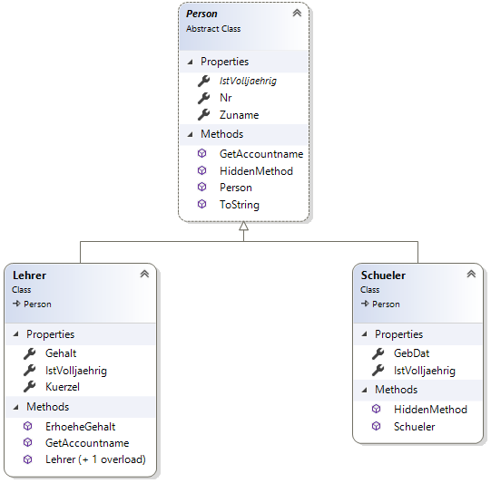

# Vererbung 1: Implementierung in C#

## Klasse Person
```c#
abstract class Person
{
	public int Nr { get; }
	public string Zuname { get; set; }
	/// <summary>
	/// Dieses read-only Property ist abstrakt, es muss daher in nachfolgenden Klassen
	/// implementiert werden, wenn sie nicht ebenfalls abstrakt sein sollen.
	/// Es muss jedoch ebenfalls als read-only Property implementiert werden.
	/// </summary>
	public abstract bool IstVolljaehrig { get; }
	/// <summary>
	/// Implementierungen in den abgeleiteten Klassen sollen diese Methode mit override
	/// überschreiben können. Daher müssen wir sie mit virtual kennzeichnen.
	/// </summary>
	/// <returns></returns>
	public virtual string GetAccountname()
	{
		// Substring liefert eine Exception, wenn Zuname kürer als 3 Stellen ist.
		int len = Math.Min(Zuname?.Length ?? 0, 3);
		return $"{Zuname?.Substring(0, len)?.ToLower() ?? ""}{Nr:0000}";
	}
	public Person(int nr)
	{
		Nr = nr;
	}
	public string HiddenMethod()
	{
		return "HiddenMethod in Person";
	}
	/// <summary>
	/// Mit base greifen wir auf die Implementierung von object zu.
	/// </summary>
	/// <returns></returns>
	public override string ToString()
	{
		string objectToString = base.ToString();
		return $"base.ToString() von Person {Nr} ist {objectToString}";
	}
}
```

## Klasse Schueler
```c#
class Schueler : Person
{
	public DateTime GebDat { get; set; }

	/// <summary>
	/// override ist verpflichtend, da es keine Implementierung in Person gibt.
	/// </summary>
	public override bool IstVolljaehrig
	{
		get
		{
			return (DateTime.Now - GebDat).TotalDays / 365.25 >= 18;
		}
	}
	/// <summary>
	/// Blendet HiddenMethod() in person aus. Bei einem Typencast auf Person wird
	/// die implementierung in Person aufgerufen. Das ist selten sinnvoll, daher selten.
	/// Es kommt eigentlich nur vor, wenn Methoden aus bestehenden Frameworkklassen,
	/// die nicht mit virtual gekennzeichnet sind, implementiert werden sollen.
	/// </summary>
	/// <returns></returns>
	public new string HiddenMethod()
	{
		return "HiddenMethod in Schueler";
	}
	/// <summary>
	/// Da Person keinen Standardkonstruktur hat, muss hier mit base der gewünschte
	/// Konstruktor aufgerufen werden.
	/// </summary>
	/// <param name="nr"></param>
	public Schueler(int nr) : base(nr)
	{ }
}
```

## Klasse Lehrer
```c#
class Lehrer : Person
{
	public string Kuerzel { get; }
	public decimal? Gehalt { get; set; }

	public override bool IstVolljaehrig
	{
		get
		{
			return true;
		}
	}
	/// <summary>
	/// Überschreibt GetAccountname() für Lehrer, sodass diese Implementierung auch
	/// bei einem Typencast auf Person aufgerufen wird.
	/// </summary>
	/// <returns></returns>
	public override string GetAccountname()
	{
		return Zuname.ToLower();
	}
	/// <summary>
	/// Diese Methode ist nur bei Lehrern vorhanden. Um sie aufzurufen, muss das Objekt den
	/// Typ Lehrer haben.
	/// </summary>
	/// <param name="prozent"></param>
	public void ErhoeheGehalt(int prozent)
	{
		Gehalt *= (1 + prozent / 100M);
	}
	/// <summary>
	/// Eigener Konstruktor mit 2 Argumenten, der den Konstruktur von Person aufruft.
	/// </summary>
	/// <param name="nr"></param>
	/// <param name="kuerzel"></param>
	public Lehrer(int nr, string kuerzel) : base(nr)
	{
		Kuerzel = kuerzel;
	}
	/// <summary>
	/// Ruft den eigenen Konstruktor (von Lehrer) auf und übergibt ??? als Kürzel.
	/// </summary>
	/// <param name="nr"></param>
	public Lehrer(int nr) : this(nr, "???")
	{ }
}
```

## Programmklasse
```c#
class Program
{
	// Ausgabe:
	// Ist s1AlsPerson volljährig?          False.
	// Accountname von s1 ist               eif0001.
	// Accountname von l1 ist               fleißig.
	// Accountname von l1AlsPerson ist      fleißig.
	// ToString() von l1 ist                base.ToString() von Person 1 ist VererbungDemo.Lehrer.
	// HiddenMethod von s1AlsPerson ist     HiddenMethod in Person.

	static void Main(string[] args)
	{
		// Konstruktor und Initializer können gemeinsam verwendet werden.
		Schueler s1 = new Schueler(1) { GebDat = new DateTime(2004, 1, 1), Zuname = "Eiftig" };
		Lehrer l1 = new Lehrer(1) { Gehalt = 3000, Zuname = "Fleißig" };

		// Der Typencast auf Person ist implizit möglich, da eine is-a Beziehung vorliegt.
		Person l1AlsPerson = l1;
		Person s1AlsPerson = s1;

		// Typencast ist verpflichtend, sonst wird ErhoeheGehalt nicht gefunden.
		((Lehrer)l1AlsPerson).ErhoeheGehalt(50);

		// Ruft die Implementierung in Schueler auf, da ein override existiert.
		Console.WriteLine($"Ist s1AlsPerson volljährig?          {s1AlsPerson.IstVolljaehrig}.");
		// Ruft die Implementierung in Person auf, da kein GetAccountname in Schueler existiert.
		Console.WriteLine($"Accountname von s1 ist               {s1.GetAccountname()}.");
		// Ruft die Implementierung in Lehrer auf, da die Methode dort implementiert wurde.
		Console.WriteLine($"Accountname von l1 ist               {l1.GetAccountname()}.");
		// Ruft die Implementierung in Lehrer auf, da die Methode dort mit override überschrieben wurde.
		Console.WriteLine($"Accountname von l1AlsPerson ist      {l1AlsPerson.GetAccountname()}.");
		// Verwendet ToString in Person, die mit base die ToString Methode von object aufruft.
		Console.WriteLine($"ToString() von l1 ist                {l1.ToString()}.");
		// Ruft HiddenMethod() in Person auf, da sie mit new nur ausgeblendet wurde.
		Console.WriteLine($"HiddenMethod von s1AlsPerson ist     {s1AlsPerson.HiddenMethod()}.");
	}
}
```

## Ausgabe
```
Ist s1AlsPerson volljährig?          False.
Accountname von s1 ist               eif0001.
Accountname von l1 ist               fleißig.
Accountname von l1AlsPerson ist      fleißig.
ToString() von l1 ist                base.ToString() von Person 1 ist VererbungDemo.Lehrer.
HiddenMethod von s1AlsPerson ist     HiddenMethod in Person.
```
