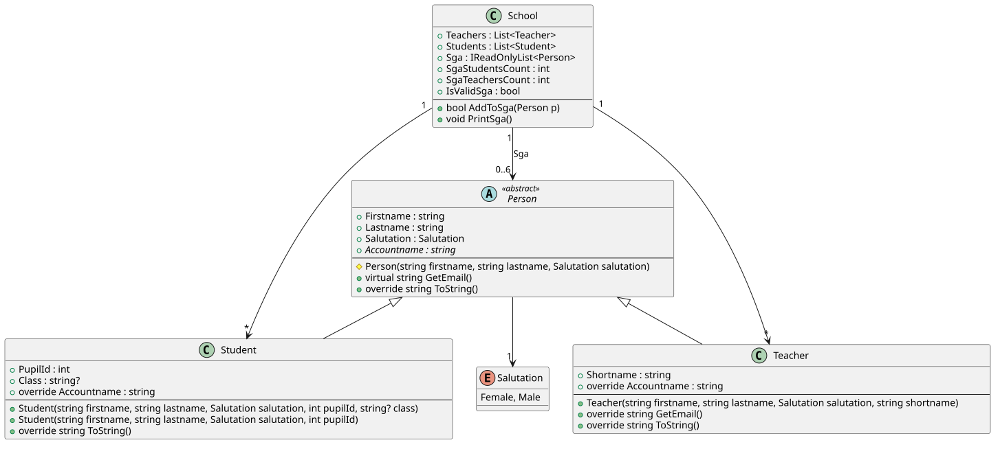
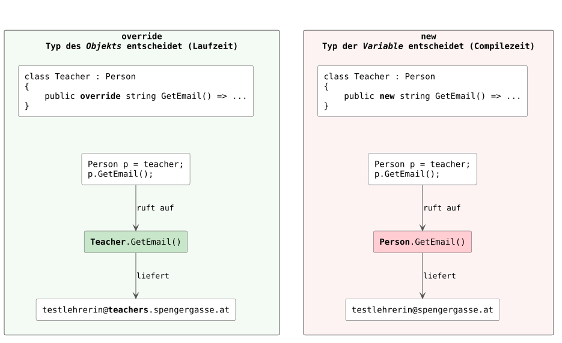
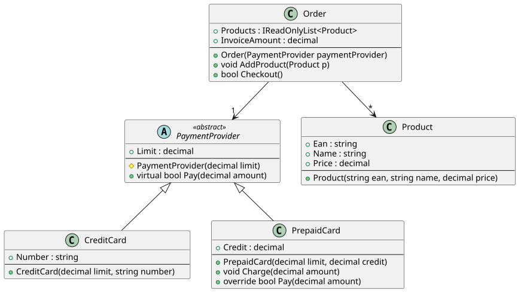

# Vererbung 1: Implementierung in C#

## Projekt anlegen

Für die Beispiele brauchst du eine .NET Konsolenapplikation. Führe diese Befehle in der Konsole
aus. Unter macOS ersetzt du *rd* und *md* durch *rm -rf* und *mkdir*.

```text
rd /S /Q InheritanceDemo
md InheritanceDemo
cd InheritanceDemo
md InheritanceDemo.Application
cd InheritanceDemo.Application
dotnet new console
cd ..
dotnet new sln -f sln
dotnet sln add InheritanceDemo.Application
start InheritanceDemo.sln

```

Öffne danach die Projektdatei *InheritanceDemo.Application.csproj* (Doppelklick auf das Projekt).
Entferne die Zeile *ImplicitUsings* und füge *TreatWarningsAsErrors* hinzu.
Die Datei sieht dann so aus:

```xml
<Project Sdk="Microsoft.NET.Sdk">

  <PropertyGroup>
    <OutputType>Exe</OutputType>
    <TargetFramework>net10.0</TargetFramework>
    <Nullable>enable</Nullable>
    <TreatWarningsAsErrors>true</TreatWarningsAsErrors>
  </PropertyGroup>

</Project>
```

> [!IMPORTANT]
> - Durch *TreatWarningsAsErrors* ist jede Warnung ein Fehler. Das Programm lässt sich dann
>   nicht kompilieren.
> - Ohne *ImplicitUsings* musst du jeden Namespace selbst mit *using* einbinden
>   (z. B. *using System;* für *Console*). So siehst du genau, woher eine Klasse kommt.

## Unterschiede zu Java

Vererbung funktioniert in C# fast wie in Java. Es gibt aber einige Unterschiede:

| Java                                         | C#                                       |
| -------------------------------------------- | ---------------------------------------- |
| `class B extends A implements I`             | `class B : A, I`                         |
| Jede Methode kann überschrieben werden.      | Nur Methoden mit `virtual` (oder `abstract`) können überschrieben werden. |
| `@Override` ist optional.                    | `override` ist Pflicht.                  |
| `super(...)` im Konstruktor                  | `: base(...)` nach dem Konstruktorkopf   |
| `super.method()`                             | `base.Method()`                          |
| `this(...)` im Konstruktor                   | `: this(...)` nach dem Konstruktorkopf   |
| `final class`                                | `sealed class`                           |

Gleich wie in Java:
- Eine Klasse kann nur von **1 Klasse** erben, aber **beliebig viele Interfaces** implementieren.
- `abstract` hat dieselbe Bedeutung.

Neu in C#:
- **Properties** sind intern Methoden. Sie können daher auch `virtual`, `abstract` oder `override` sein.
- `new` vor einer Methode **verdeckt** eine Methode der Basisklasse (siehe Teacher, Punkt 4).

## Das UML Klassendiagramm



<sup>PlantUML Quelle: [vererbung_diagram.puml](vererbung_diagram.puml)</sup>

So liest du das Diagramm:

| Element                         | Bedeutung                                                         |
| ------------------------------- | ----------------------------------------------------------------- |
| **A** im Kreis, *«abstract»*    | Abstrakte Klasse, z. B. *Person*                                  |
| *kursiv*                        | Abstraktes Member, z. B. *Accountname*                            |
| **E** im Kreis                  | Enum, z. B. *Salutation* (= Anrede)                               |
| Pfeil mit leerem Dreieck        | Vererbung. Der Pfeil zeigt zur Basisklasse.                       |
| Einfacher Pfeil (Assoziation)   | *School* speichert Teacher in einem Property (*Teachers*). Der Pfeil zeigt die Navigierbarkeit: Von *School* kommst du zu *Teacher*, aber nicht umgekehrt. |
| Zahlen an den Pfeilenden        | Multiplizität: *1 School* hat *\* (beliebig viele) Teacher*. *0..6* heißt 0 bis 6. |
| **+** / **#**                   | *public* / *protected*                                            |
| *virtual*, *override*           | C# Schlüsselwörter der Methode, z. B. *virtual string GetEmail()* |

Das ist kein reines UML: Im Diagramm stehen C# Datentypen (*string*, *bool*, ...) statt der UML Typen
(*String*, *Boolean*, ...). Auch *virtual* und *override* gibt es in UML nicht. Wir schreiben sie dazu,
damit du siehst, welche Methoden überschrieben werden.

Weitere Beziehungsarten (Abhängigkeit, Komposition) lernst du im Kapitel
[Interfaces](06_Interfaces.md#beziehungsarten-im-klassendiagramm) kennen.

## Die Klasse Person

Jede Klasse kommt in eine eigene Datei. Der Namespace entspricht dem Projektnamen.

**Salutation.cs**
```c#
namespace InheritanceDemo.Application;

enum Salutation { Female = 1, Male }   // (1)
```

**Person.cs**
```c#
namespace InheritanceDemo.Application;

abstract class Person   // (2a)
{
	protected Person(string firstname, string lastname, Salutation salutation)
	{
		Firstname = firstname;
		Lastname = lastname;
		Salutation = salutation;
	}

	public string Firstname { get; }
	public string Lastname { get; }
	public Salutation Salutation { get; }
	public abstract string Accountname { get; }                             // (2)
	public virtual string GetEmail() => $"{Accountname}@spengergasse.at";   // (3)
	public override string ToString() => $"{Firstname} {Lastname}";         // (4)
}
```

- **(1)** Ein *enum* gibt einem *int* Wert einen Namen. Wir beginnen mit 1. So ist der
  Defaultwert 0 kein gültiger Wert. Sonst wäre jeder nicht initialisierte Wert automatisch *Female*.
- **(2)** *Accountname* ist ein abstraktes read-only Property. Es hat keine Implementierung.
  Jede abgeleitete Klasse muss es überschreiben (außer sie ist selbst abstrakt).
  Eine Klasse mit abstrakten Membern muss selbst *abstract* sein **(2a)**.
- **(3)** *GetEmail()* ist nicht abstrakt, kann aber das abstrakte Property *Accountname* verwenden.
  Zur Laufzeit wird immer der *Accountname* des echten Objekts (Teacher oder Student) verwendet.
  *virtual* bedeutet: Abgeleitete Klassen **können** die Methode mit *override* überschreiben.
  Sie **müssen** es aber nicht.
- **(4)** *ToString()* ist in *System.Object* als *virtual* definiert. Daher können wir sie
  mit *override* überschreiben.

## Die Klasse Teacher

**Teacher.cs**
```c#
namespace InheritanceDemo.Application;

class Teacher : Person   // (1)
{
	public Teacher(string firstname, string lastname, Salutation salutation, string shortname)   // (2)
		: base(firstname: firstname, lastname: lastname, salutation: salutation)
	{
		Shortname = shortname;
	}

	public string Shortname { get; }
	public override string Accountname => Lastname.ToLower();                               // (3)
	public override string GetEmail() => $"{Accountname}@teachers.spengergasse.at";         // (4)
	public override string ToString() => $"Teacher {Shortname} - {Firstname} {Lastname}";   // (5)
}
```

- **(1)** Der Doppelpunkt kennzeichnet die Vererbung. Es gibt kein *extends* oder *implements*.
- **(2)** Ein Teacher ist auch eine Person. Beim Erstellen eines Teachers muss daher auch der
  Person-Teil erstellt werden. *Person* hat keinen Defaultkonstruktor. Mit *base(...)* rufen wir
  den Konstruktor von *Person* auf (wie *super(...)* in Java).
- **(3)** *Accountname* ist abstrakt. Wir **müssen** es mit *override* überschreiben.
- **(4)** *GetEmail()* ist *virtual*. Wir **können** sie mit *override* überschreiben.
  Was passiert ohne *override*?
  - Der Compiler meldet eine Warnung: Die Methode **verdeckt** *Person.GetEmail()*.
    Wegen *TreatWarningsAsErrors* ist das ein Fehler.
  - Mit dem Schlüsselwort *new* (`public new string GetEmail()`) verschwindet die Warnung.
    Die Methode wird dann aber nicht überschrieben, sondern nur verdeckt:
    ```c#
    Person p = teacher;
    p.GetEmail();   // Calls Person.GetEmail(), not Teacher.GetEmail()!
    ```
    Das ist fast nie gewünscht. Verwende daher *override*.

  

  <sup>PlantUML Quelle: [override_vs_new.puml](override_vs_new.puml)</sup>
- **(5)** *Person* überschreibt *ToString()* bereits. Eine *override* Methode ist selbst wieder
  *virtual*. Daher kann *Teacher* sie noch einmal überschreiben.

## Die Klasse Student

**Student.cs**
```c#
namespace InheritanceDemo.Application;

class Student : Person
{
	public Student(string firstname, string lastname, Salutation salutation, int pupilId, string? @class)
		: base(firstname: firstname, lastname: lastname, salutation: salutation)
	{
		PupilId = pupilId;
		Class = @class;     // (1)
	}

	public Student(string firstname, string lastname, Salutation salutation, int pupilId)   // (2)
		: this(firstname: firstname, lastname: lastname, salutation: salutation, pupilId: pupilId, @class: null)
	{
	}

	public int PupilId { get; }
	public string? Class { get; }
	public override string Accountname =>
		(Lastname.Length < 3 ? Lastname : Lastname.Substring(0, 3)).ToLower() + PupilId.ToString("000000");
	public override string ToString() => $"Student {base.ToString()}";   // (3)
}
```

- **(1)** *class* ist ein reserviertes Wort. Mit dem Zeichen *@* davor (*@class*) können wir es
  trotzdem als Variablenname verwenden.
- **(2)** *Student* hat 2 Konstruktoren. Mit *this(...)* leiten wir die Argumente an den anderen
  Konstruktor weiter. So müssen wir den Code nicht kopieren. Für die fehlende Klasse übergeben
  wir *null*.
- **(3)** Mit *base.ToString()* rufen wir die Implementierung der Basisklasse (*Person*) auf.

## Die Klasse School

Der SGA (Schulgemeinschaftsausschuss) ist ein Gremium der Schule. Er hat 9 Mitglieder.
In unserem Beispiel verwalten wir nur die 3 Lehrer- und die 3 Schülervertreter.

**School.cs**
```c#
using System;                       // (7)
using System.Collections.Generic;

namespace InheritanceDemo.Application;

class School
{
	private readonly List<Person> _sga = new(9);              // (1)
	public List<Teacher> Teachers { get; } = new();
	public List<Student> Students { get; } = new();
	public IReadOnlyList<Person> Sga => _sga;                // (2)
	public int SgaStudentsCount { get; private set; } = 0;   // (3)
	public int SgaTeachersCount { get; private set; } = 0;
	public bool IsValidSga => SgaTeachersCount == 3 && SgaStudentsCount == 3;

	public bool AddToSga(Person p)   // (4)
	{
		if (p is Student && SgaStudentsCount < 3) { _sga.Add(p); SgaStudentsCount++; return true; }
		if (p is Teacher && SgaTeachersCount < 3) { _sga.Add(p); SgaTeachersCount++; return true; }
		return false;
	}

	public void PrintSga()
	{
		foreach (Person p in Sga)
		{
			if (p is Teacher)   // (5)
			{
				Console.WriteLine($"Lehrervertreter {p.Lastname}, Email: {p.GetEmail()}");
			}
			if (p is Student s)   // (6)
			{
				Console.WriteLine($"Schülervertreter {p.Lastname} in der Klasse {s.Class ?? "?"}, Email: {p.GetEmail()}");
			}
		}
	}
}
```

- **(1)** *readonly*: Die Variable *_sga* kann nicht neu zugewiesen werden. *Add()*, *Remove()*, ...
  sind aber trotzdem möglich!
  *new(9)* ist die Kurzform von *new List&lt;Person&gt;(9)*. Der Compiler kennt den Typ von der
  linken Seite. Die 9 ist die Anfangsgröße (Capacity) der Liste.
- **(2)** Von außen soll niemand die Liste ändern können (z. B. 10 Schülervertreter einfügen).
  *List&lt;Person&gt;* implementiert das Interface *IReadOnlyList&lt;Person&gt;*. Das Property
  liefert die Liste als *IReadOnlyList&lt;Person&gt;*. Der Aufrufer sieht daher nur die Lesemethoden.
- **(3)** Die Anzahl kann von außen gelesen werden (*get*). Ändern kann sie nur die Klasse *School*
  (*private set*).
- **(4)** Nur über diese Methode kommen Personen in den SGA. So können wir prüfen, dass es
  maximal 3 Schüler- und 3 Lehrervertreter gibt.
- **(5)** Die Liste enthält Personen, also Lehrer **und** Schüler. Mit *is* prüfen wir den Typ.
  Für *GetEmail()* brauchen wir keinen Cast. Die Methode ist überschrieben. Daher wird auch über eine
  Variable vom Typ *Person* die Methode von *Teacher* aufgerufen.
- **(6)** Für *Class* brauchen wir ein *Student* Objekt. *p is Student s* prüft den Typ und
  castet in einem Schritt. Das kennst du aus Java: `if (p instanceof Student s)`.
- **(7)** *Console* liegt im Namespace *System*, *List&lt;T&gt;* und *IReadOnlyList&lt;T&gt;* liegen in
  *System.Collections.Generic*. Ohne diese *using* Anweisungen kompiliert der Code nicht.

## Testprogramm und Ausgabe

**Program.cs**
```c#
namespace InheritanceDemo.Application;

class Program
{
	private static void Main(string[] args)
	{
		Teacher teacher = new Teacher(firstname: "Eva", lastname: "Testlehrerin", salutation: Salutation.Female, shortname: "TES");
		Student student = new Student(firstname: "Stefan", lastname: "Eifrig", salutation: Salutation.Male, pupilId: 1001, @class: "3AHIF");
		Student student2 = new Student(firstname: "Lukas", lastname: "Abschreiber", salutation: Salutation.Male, pupilId: 1002);

		School school = new School();
		school.Teachers.Add(teacher);
		school.Students.Add(student);
		school.Students.Add(student2);
		school.AddToSga(teacher);
		school.AddToSga(student);
		school.AddToSga(student2);

		school.PrintSga();
	}
}
```

```text
Lehrervertreter Testlehrerin, Email: testlehrerin@teachers.spengergasse.at
Schülervertreter Eifrig in der Klasse 3AHIF, Email: eif001001@spengergasse.at
Schülervertreter Abschreiber in der Klasse ?, Email: abs001002@spengergasse.at
```

## Übung

Das Klassendiagramm zeigt ein kleines Bestellsystem. Eine Bestellung (*Order*) enthält Produkte.
Beim Erstellen einer Bestellung übergibst du einen Payment Provider. Das ist entweder eine
Kreditkarte (*CreditCard*) oder eine Prepaid Karte (*PrepaidCard*) mit Guthaben.



<sup>PlantUML Quelle: [uebung_vererbung_ordermanager.puml](uebung_vererbung_ordermanager.puml)</sup>

### Order

- **Konstruktor:** Bekommt den Payment Provider. Speichere interne Felder wenn möglich als
  *private readonly*.
- **Products:** Typ *IReadOnlyList&lt;Product&gt;*. Von außen darf niemand in die Liste schreiben.
- **InvoiceAmount:** Read-only Property. Liefert die Summe der Produktpreise.
- **AddProduct():** Fügt ein Produkt zur internen Liste hinzu.
- **Checkout():** Ruft *Pay()* des Payment Providers auf.
  - *Pay()* liefert *false* → *Checkout()* liefert *false*.
  - *Pay()* liefert *true* → Leere die Produktliste (*Clear()*) und liefere *true*.

### PaymentProvider

- **Konstruktor:** *protected*, denn nur abgeleitete Klassen rufen ihn auf.
- **Pay():** *virtual*, damit *PrepaidCard* die Methode überschreiben kann. Prüft, ob der Betrag
  über dem Limit liegt.
  - Betrag > Limit → *false*
  - sonst → *true*

### PrepaidCard

- **Pay():** Überschreibt *Pay()* der Basisklasse. Prüfe der Reihe nach:
  1. Limit: Verwende dafür *Pay()* der Basisklasse.
  2. Guthaben (*Credit*): Ist zu wenig Guthaben da, liefere *false*.
  3. Alles OK: Verringere das Guthaben um den Betrag und liefere *true*.
- **Charge():** Addiert den Betrag zum Guthaben (*Credit*).

### Testprogramm

Erstelle wie oben beschrieben die Solution *InheritanceDemo*. Kopiere den folgenden Code in die
Datei *Program.cs*. Schreibe jede Klasse in eine eigene Datei. Nach dem Start muss das Programm
die Ausgabe darunter zeigen.

```c#
using System;
using System.Collections.Generic;
using System.Linq;

namespace InheritanceDemo.Application;

class Program
{
    private static int _testCount = 0;
    private static int _testsSucceeded = 0;

    private static void Main(string[] args)
    {
        Console.WriteLine("Teste Klassenimplementierung.");
        CheckAndWrite(() => typeof(Product).GetProperties().Any() && typeof(Product).GetProperties().All(p => p.CanWrite == false), "Alle Properties in Product sind read only");
        CheckAndWrite(() => typeof(Order).GetProperties().Any() && typeof(Order).GetProperties().All(p => p.CanWrite == false), "Alle Properties in Order sind read only");
        CheckAndWrite(() => typeof(PaymentProvider).GetProperties().Any() && typeof(PaymentProvider).GetProperties().All(p => p.CanWrite == false), "Alle Properties in PaymentProvider sind read only");
        CheckAndWrite(() => typeof(CreditCard).GetProperties().Any() && typeof(CreditCard).GetProperties().All(p => p.CanWrite == false), "Alle Properties in CreditCard sind read only");

        CheckAndWrite(() => typeof(PaymentProvider).GetConstructor(Type.EmptyTypes) is null, "Kein Defaultkonstruktor in PaymentProvider");
        CheckAndWrite(() => typeof(PaymentProvider).IsAbstract, "PaymentProvider ist abstrakt");
        CheckAndWrite(() => typeof(Order).GetProperty(nameof(Order.Products))?.PropertyType == typeof(IReadOnlyList<Product>), "Order.Products ist IReadOnlyList<Product>");
        CheckAndWrite(() => typeof(PrepaidCard).GetProperty(nameof(PrepaidCard.Credit))?.GetSetMethod() is null, "Credit kann nicht öffentlich gesetzt werden");

        Product p1 = new Product("1001", "Apple iPhone 13 Pro Max 1TB gold", 1800);
        Product p2 = new Product("1002", "Samsung Galaxy Z Fold 3 5G F926B/DS 512GB Phantom Black", 1600);

        {
            Console.WriteLine("Tests mit CreditCard als PaymentProvider.");
            CreditCard creditCard = new CreditCard(limit: 3500, number: "123456789");
            CheckAndWrite(() => creditCard.Limit == 3500, "Limit ist 3500");
            Order order = new Order(paymentProvider: creditCard);
            order.AddProduct(p1);
            order.AddProduct(p2);
            CheckAndWrite(() => order.InvoiceAmount == 3400, "InvoiceAmount ist 3400");
            CheckAndWrite(() => order.Checkout() && order.Products.Count() == 0, "Checkout true und Produktliste leer");
        }
        {
            Console.WriteLine("Teste Limit.");
            CreditCard creditCard = new CreditCard(limit: 100, number: "123456789");
            Order order = new Order(paymentProvider: creditCard);
            order.AddProduct(p1);
            CheckAndWrite(() => !order.Checkout(), "Checkout false wenn amount > limit");
        }

        {
            Console.WriteLine("Tests mit PrepaidCard als PaymentProvider.");
            PrepaidCard prepaidCard = new PrepaidCard(limit: 2000, credit: 1000);
            Order order = new Order(paymentProvider: prepaidCard);
            order.AddProduct(p1);
            CheckAndWrite(() => !order.Checkout(), "Checkout false wenn credit < amount");
            prepaidCard.Charge(900);
            CheckAndWrite(() => order.Checkout() && order.Products.Count() == 0, "Checkout true und Produktliste leer");
            CheckAndWrite(() => (prepaidCard.Credit == 100), "Credit = 100");
        }
        Console.WriteLine($"{_testsSucceeded} von {_testCount} Punkte erreicht.");
    }

    private static void CheckAndWrite(Func<bool> predicate, string message)
    {
        _testCount++;
        if (predicate())
        {
            Console.WriteLine($"   {_testCount} OK: {message}");
            _testsSucceeded++;
            return;
        }
        Console.ForegroundColor = ConsoleColor.Yellow;
        Console.WriteLine($"   {_testCount} Nicht erfüllt: {message}");
        Console.ResetColor();
    }
}
```

```text
Teste Klassenimplementierung.
   1 OK: Alle Properties in Product sind read only
   2 OK: Alle Properties in Order sind read only
   3 OK: Alle Properties in PaymentProvider sind read only
   4 OK: Alle Properties in CreditCard sind read only
   5 OK: Kein Defaultkonstruktor in PaymentProvider
   6 OK: PaymentProvider ist abstrakt
   7 OK: Order.Products ist IReadOnlyList<Product>
   8 OK: Credit kann nicht öffentlich gesetzt werden
Tests mit CreditCard als PaymentProvider.
   9 OK: Limit ist 3500
   10 OK: InvoiceAmount ist 3400
   11 OK: Checkout true und Produktliste leer
Teste Limit.
   12 OK: Checkout false wenn amount > limit
Tests mit PrepaidCard als PaymentProvider.
   13 OK: Checkout false wenn credit < amount
   14 OK: Checkout true und Produktliste leer
   15 OK: Credit = 100
15 von 15 Punkte erreicht.

```
