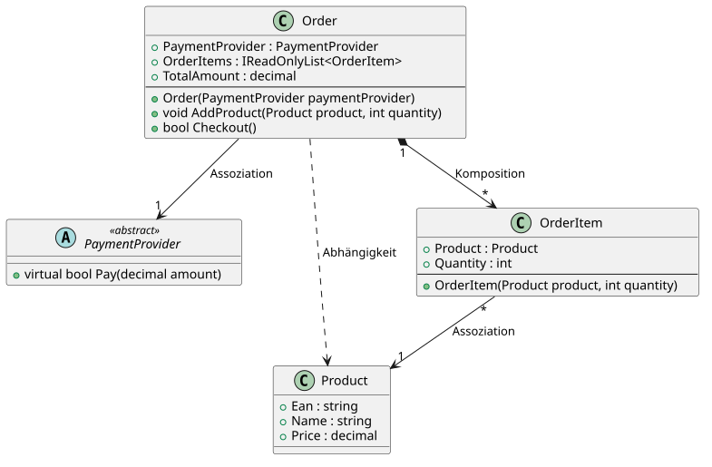
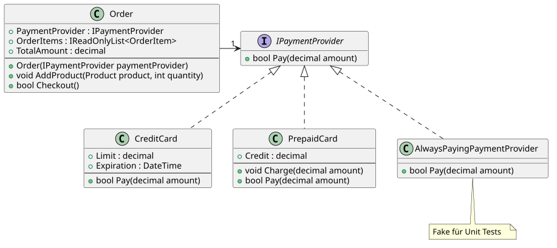
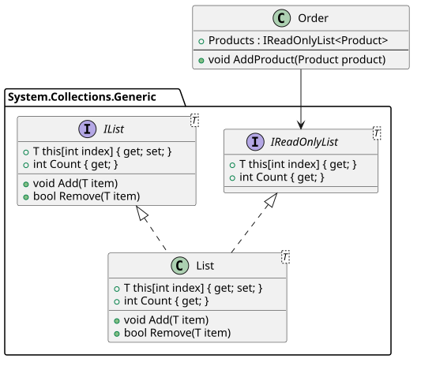

# Interfaces und Dependencies

## Was sind Dependencies (Abhängigkeiten)?

Klasse A ist von Klasse B **abhängig**, wenn A die Klasse B braucht, um zu kompilieren.
Das ist der Fall, wenn A den Typ B verwendet: als Feld, Property, Parameter, Rückgabewert,
lokale Variable oder Basisklasse.

**Warum ist das wichtig?** Jede Abhängigkeit ist eine Verbindung im Code. Ändert sich B, muss
eventuell auch A geändert werden. Viele Abhängigkeiten machen Software schwer änderbar und schwer
testbar. Man spricht von **starker Kopplung**. Ein Ziel guter Software ist daher **lose Kopplung**:
wenige Abhängigkeiten, und zwar zu Typen, die sich selten ändern. Interfaces sind dafür das
wichtigste Werkzeug in C#.

## Beziehungsarten im Klassendiagramm

Für die Praxis sind 3 Beziehungsarten wichtig. Du erkennst sie im Code, und sie haben echte
Konsequenzen. Sie sind nach Stärke der Bindung sortiert, die schwächste steht oben:

| Beziehung        | Symbol                             | Im Code erkennbar an                                  | Konsequenz                                          |
| ---------------- | ---------------------------------- | ----------------------------------------------------- | --------------------------------------------------- |
| **Abhängigkeit** | gestrichelter Pfeil `..>`          | B nur als Parameter, Rückgabewert oder lokale Variable | A muss neu kompiliert werden, wenn sich B ändert.  |
| **Assoziation**  | Pfeil `-->`                        | B als Feld oder Property                              | A hält eine Referenz auf B. B lebt unabhängig von A. |
| **Komposition**  | gefüllte (schwarze) Raute `*-->`   | A erzeugt B selbst mit *new* und gibt B nicht zum Ändern heraus | B gehört nur A. B lebt und stirbt mit A.  |

### Beispiel: Bestellung

Wir verwenden *Product* und *PaymentProvider* aus der Übung im Kapitel
[Vererbung](05_Vererbung.md). Eine Bestellung (*Order*) besteht aus Positionen (*OrderItem*).
Jede Position verweist auf ein Produkt und hat eine Menge.



<sup>PlantUML Quelle: [assoziationen.puml](assoziationen.puml)</sup>

**OrderItem.cs**
```c#
class OrderItem
{
    public OrderItem(Product product, int quantity)
    {
        Product = product;
        Quantity = quantity;
    }

    public Product Product { get; }   // (1)
    public int Quantity { get; }
}
```

**Order.cs**
```c#
using System.Collections.Generic;
using System.Linq;

class Order
{
    private readonly List<OrderItem> _orderItems = new();

    public Order(PaymentProvider paymentProvider)
    {
        PaymentProvider = paymentProvider;
    }

    public PaymentProvider PaymentProvider { get; }                    // (2)
    public IReadOnlyList<OrderItem> OrderItems => _orderItems;         // (3)
    public decimal TotalAmount => _orderItems.Sum(i => i.Product.Price * i.Quantity);

    public void AddProduct(Product product, int quantity)              // (4)
    {
        _orderItems.Add(new OrderItem(product, quantity));             // (3)
    }

    public bool Checkout() => PaymentProvider.Pay(TotalAmount);
}
```

- **(1) Assoziation OrderItem → Product:** *OrderItem* speichert ein *Product*. Das Produkt
  existiert unabhängig davon im Katalog, und viele Positionen verweisen auf dasselbe Produkt.
- **(2) Assoziation Order → PaymentProvider:** *Order* speichert den Payment Provider. Eine
  Kreditkarte bezahlt viele Bestellungen und existiert auch ohne sie.
- **(3) Komposition Order → OrderItem:** *Order* erzeugt die Positionen selbst mit *new*. Von außen
  kann niemand eine Position hinzufügen, denn *OrderItems* ist eine *IReadOnlyList*. Eine Position
  gehört also immer zu genau einer Bestellung. Gibt es die Bestellung nicht mehr, hat niemand mehr
  eine Referenz auf ihre Positionen. Der Garbage Collector entfernt sie.
- **(4) Abhängigkeit Order → Product:** *Order* verwendet *Product* nur als Parameter. Es speichert
  kein Produkt in einem eigenen Feld.

### Multiplizität: Muss es das Objekt geben?

Die Zahlen an den Pfeilenden sind die **Multiplizität**. Sie haben direkte Folgen für den Code
und für die Datenbank:

| Multiplizität | Bedeutung                 | C#                                          | Datenbank                    |
| ------------- | ------------------------- | ------------------------------------------- | ---------------------------- |
| **1**         | genau eines, Pflicht      | Konstruktorparameter, nicht nullable (*PaymentProvider*) | Fremdschlüssel *NOT NULL* |
| **0..1**      | höchstens eines, optional | nullable Property (*PaymentProvider?*)      | Fremdschlüssel *NULL*        |
| **\***        | beliebig viele            | Collection (*IReadOnlyList&lt;OrderItem&gt;*) | Fremdschlüssel in der anderen Tabelle |

*Order* kann ohne *PaymentProvider* nicht erstellt werden. Das drückt die **1** am Pfeil zu
*PaymentProvider* aus, **nicht** eine Komposition.

### Komposition: Wann ist das wichtig?

> [!WARNING]
> **Verwechslungsgefahr:** Komposition heißt nicht „A braucht B“. Komposition heißt
> „B lebt und stirbt mit A“. Stelle dir 2 Fragen:
> 1. Verschwindet B, wenn A verschwindet?
> 2. Gehört B nur zu diesem einen A?
>
> Nur wenn beide Antworten *ja* sind, ist es eine Komposition. Bei *Order → OrderItem* ist das
> so. Bei *Order → PaymentProvider* nicht, denn die Kreditkarte gibt es weiter.

Die Komposition hat in der Praxis diese Konsequenzen:
- **Kapselung:** Positionen werden nur über *Order* geändert (*AddProduct()*). So kann *Order*
  Regeln prüfen, z. B. eine maximale Anzahl an Positionen.
- **Datenbank:** Wird eine Bestellung gelöscht, werden ihre Positionen mitgelöscht
  (*ON DELETE CASCADE*). Die Produkte bleiben.
- **Domain-Driven Design:** Eine Gruppe von Objekten, die nur über ein Hauptobjekt geändert wird,
  heißt dort *Aggregate*. Das Hauptobjekt (hier *Order*) heißt *Aggregate Root*.

### Pfeilrichtung

Der Pfeil zeigt die **Navigierbarkeit**: Von *OrderItem* kommst du über das Property *Product* zum
Produkt. Umgekehrt geht das nicht. Ein solches Property heißt *navigation property*. Bei der
Komposition liegt die Raute beim **Ganzen** (*Order*).

> [!TIP]
> **Und die Aggregation (leere Raute `o-->`)?** Du wirst sie in manchen Diagrammen sehen. Sie soll
> eine Teil-Ganzes Beziehung zeigen, bei der das Teil unabhängig existiert. Im Code sieht sie aber
> genau wie eine Assoziation aus und hat keine eigenen Konsequenzen. Selbst die UML Spezifikation
> legt ihre Bedeutung nicht genau fest. Behandle sie daher wie eine Assoziation und verwende
> sie selbst nicht.

## Interfaces als Contract (Vertrag)

Sieh dir *Checkout()* in *Order* an:

```c#
public bool Checkout() => PaymentProvider.Pay(TotalAmount);
```

*Order* braucht vom Payment Provider nur **eine** Sache: die Methode *Pay()*. Wie sie bezahlt, ist
für *Order* egal. Trotzdem hängt *Order* von der Klasse *PaymentProvider* ab, also von einer
konkreten Klasse mit Feldern (*Limit*) und Logik.

Besser: Wir beschreiben nur, **was** *Order* braucht. Dafür definieren wir ein Interface:

```c#
interface IPaymentProvider
{
    bool Pay(decimal amount);
}
```

- Interfaces beginnen in .NET mit einem großen **I** (Konvention).
- Alle Members sind automatisch *public*. Ein Vertrag muss für alle sichtbar sein.
- Ein Interface enthält keine Felder, also keinen Zustand.
- Wie in Java ab Version 8 kann ein Interface seit C# 8 auch Default-Implementierungen haben.
  Das brauchst du aber selten.

*Order* verwendet jetzt nur noch das Interface:

```c#
public Order(IPaymentProvider paymentProvider)
{
    PaymentProvider = paymentProvider;
}

public IPaymentProvider PaymentProvider { get; }
```



<sup>PlantUML Quelle: [iPaymentProvider.puml](iPaymentProvider.puml)</sup>

Die Klassen *CreditCard*, *PrepaidCard* usw. **implementieren** (realisieren) das Interface. Im
Diagramm ist das der gestrichelte Pfeil mit leerem Dreieck. *Order* kennt keine dieser Klassen.

**CreditCard.cs**
```c#
using System;

class CreditCard : IPaymentProvider
{
    public CreditCard(decimal limit, DateTime expiration)
    {
        Limit = limit;
        Expiration = expiration;
    }

    public decimal Limit { get; }
    public DateTime Expiration { get; }

    public bool Pay(decimal amount)
    {
        if (amount > Limit) { return false; }
        if (Expiration < DateTime.UtcNow) { return false; }
        return true;
    }
}
```

Limit und Ablaufdatum sind Details von *CreditCard*. *Order* sieht davon nichts.

### Warum Interfaces?

| Vorteil                 | Erklärung                                                                 |
| ----------------------- | ------------------------------------------------------------------------- |
| **Austauschbarkeit**    | Eine neue Zahlungsart (z. B. PayPal) ist eine neue Klasse. *Order* bleibt unverändert. Das ist das *Open/Closed Principle* (offen für Erweiterung, geschlossen für Änderung). |
| **Testbarkeit**         | Im Unit Test übergeben wir eine einfache Fake-Klasse. Wir brauchen keine echte Kreditkarte. |
| **Lose Kopplung**       | *Order* hängt nur von einem kleinen, stabilen Interface ab, nicht von Details. Das ist das *Dependency Inversion Principle*: Klassen mit Geschäftslogik hängen von Abstraktionen (Interfaces) ab, nicht von technischen Details. |
| **Paralleles Arbeiten** | Das Interface ist schnell geschrieben. Danach kann ein Entwickler *Order* programmieren und ein anderer *CreditCard*. |

Ein Fake für Tests ist nur ein paar Zeilen lang:

```c#
class AlwaysPayingPaymentProvider : IPaymentProvider
{
    public bool Pay(decimal amount) => true;
}

Order order = new Order(new AlwaysPayingPaymentProvider());
```

Wie die richtige Implementierung zur Laufzeit in die Klasse kommt, lernst du im Kapitel
[Dependency Injection](08_DependencyInjection.md).

> [!WARNING]
> Erstelle nicht für jede Klasse ein Interface. Ein Interface lohnt sich, wenn es
> mehrere Implementierungen gibt oder geben wird. Das gilt auch für einen Fake im Test.

### Interface oder abstrakte Klasse?

|                          | Interface                          | Abstrakte Klasse                       |
| ------------------------ | ---------------------------------- | -------------------------------------- |
| Bedeutung                | *kann* (Fähigkeit, Vertrag)        | *ist ein* (gemeinsame Basis)           |
| Felder / Zustand         | nein                               | ja                                     |
| Konstruktor              | nein                               | ja                                     |
| Anzahl pro Klasse        | beliebig viele                     | nur 1 Basisklasse                      |
| Verwende es, wenn ...    | Klassen dasselbe *können* sollen   | Klassen gemeinsamen *Code* teilen      |

Beides lässt sich kombinieren. Die Limitprüfung aus der Übung im Kapitel Vererbung bleibt in
einer abstrakten Klasse. Diese implementiert das Interface:

```c#
abstract class PaymentProvider : IPaymentProvider
{
    protected PaymentProvider(decimal limit) { Limit = limit; }
    public decimal Limit { get; }
    public virtual bool Pay(decimal amount) => amount <= Limit;
}
```

*Order* kennt trotzdem nur *IPaymentProvider*. Ob eine Implementierung von *PaymentProvider* erbt
oder nicht, ist für *Order* egal.

### Properties in Interfaces

Interfaces können auch Properties enthalten. Oft steht nur *get* im Interface. Die Implementierung
darf zusätzlich ein *set* haben:

```c#
interface IPaymentProvider
{
    string NotificationEmail { get; }
    bool Pay(decimal amount);
}

class CreditCard : IPaymentProvider
{
    /* ... */
    public string NotificationEmail { get; private set; } = string.Empty;
    public bool Pay(decimal amount) { /* ... */ }
}
```

## Das Interface Segregation Principle

Das **I** in [SOLID](https://en.wikipedia.org/wiki/SOLID) steht für das
*Interface Segregation Principle*:

> "Many client-specific interfaces are better than one general-purpose interface."

Das bedeutet: Eine Klasse soll nur von den Methoden abhängen, die sie wirklich braucht. Daher
sind mehrere kleine Interfaces besser als ein großes.

Ein Beispiel ist *List&lt;T&gt;*. Drücke in Visual Studio *F12* auf *List*:

```c#
public class List<T> : IList<T>, IReadOnlyList<T> // ...
{
    // ...
}
```

*List&lt;T&gt;* implementiert mehrere Interfaces. Jedes beschreibt eine andere Fähigkeit:

| Interface                         | Fähigkeit                                  | Brauchst du für ...                  |
| --------------------------------- | ------------------------------------------ | ------------------------------------ |
| *IEnumerable&lt;T&gt;*            | Elemente durchlaufen                       | *foreach*, LINQ                      |
| *IReadOnlyCollection&lt;T&gt;*    | + Anzahl (*Count*)                         | Anzahl abfragen                      |
| *IReadOnlyList&lt;T&gt;*          | + Zugriff über Index (*list[0]*)           | Lesen an einer Position              |
| *IList&lt;T&gt;*                  | + Ändern (*Add*, *Remove*, ...)            | Liste verändern                      |

Daraus folgen zwei Regeln:
- **Parameter:** Verlange das kleinste Interface, das du brauchst. Eine Methode, die nur mit
  *foreach* durchläuft, nimmt *IEnumerable&lt;T&gt;*. Dann kann der Aufrufer ein Array, eine Liste,
  ein Set, ... übergeben.
- **Rückgabe:** Gib nur so viel preis, wie der Aufrufer darf. Deshalb liefert *Order.Products*
  eine *IReadOnlyList&lt;Product&gt;* und keine *List&lt;Product&gt;*.



<sup>PlantUML Quelle: [ireadonlylist.puml](ireadonlylist.puml)</sup>

*List&lt;Product&gt;* implementiert *IReadOnlyList&lt;Product&gt;*. Daher wandelt der Compiler
den Typ automatisch um (implizite Konvertierung):

```c#
class Order
{
    private readonly List<Product> _products = new();
    public IReadOnlyList<Product> Products => _products;
    public void AddProduct(Product product) => _products.Add(product);
}

Order order = new Order();
Product product = new Product(ean: "1001", name: "Apple iPhone", price: 1800);
order.AddProduct(product);
Product first = order.Products[0];   // OK: IReadOnlyList has an indexer.
order.Products.Remove(product);      // Compiler error: IReadOnlyList has no Remove().
```

> [!NOTE]
> Mit einem Cast (*(List&lt;Product&gt;)order.Products*) kann man das umgehen.
> Ein Interface ist also kein Schutz vor Absicht. Es zeigt aber klar, wie die Klasse
> verwendet werden soll, und verhindert Fehler aus Versehen.

## Praktisches Beispiel: Fluent API

Interfaces können auch **Zustände** abbilden. Der Compiler prüft dann, ob Methoden in der
richtigen Reihenfolge aufgerufen werden.

Beispiel: Eine Lottoziehung.
- **Vor der Ziehung:** Nur *AddTip()* und *DrawNumbers()* sind erlaubt → Interface *ITippableLottery*.
- **Nach der Ziehung:** Keine neuen Tipps mehr. Nur *CountTips()* und die Ergebnisse sind erlaubt →
  Interface *IDrawnLottery*.

Die Klasse *Lottery* implementiert beide Interfaces. Jede Methode liefert das Interface für den
nächsten Zustand zurück. So kannst du die Aufrufe verketten (*Fluent API*).

Erstelle eine Konsolenapplikation und ersetze *Program.cs* durch den folgenden Code. Prüfe:
Kannst du in *Main()* vor *DrawNumbers()* die Methode *CountTips()* aufrufen?

```c#
using System;
using System.Collections.Generic;
using System.Linq;
using System.Text.Json;

namespace LotteryDemo.Application;

interface ITippableLottery
{
    ITippableLottery AddTip(IEnumerable<int> numbers);
    IDrawnLottery DrawNumbers();
}

interface IDrawnLottery
{
    IReadOnlyList<IReadOnlySet<int>> Tips { get; }
    IReadOnlySet<int> DrawnNumbers { get; }
    int CountTips(int correctNumbers);
}

class Lottery : ITippableLottery, IDrawnLottery
{
    private readonly List<HashSet<int>> _tips = new();
    private readonly HashSet<int> _drawnNumbers = new(6);
    private readonly Random _rnd;

    /// <summary>
    /// Factory method. Starts a new drawing in the state "tippable".
    /// </summary>
    public static ITippableLottery NewDrawing(int seed) => new Lottery(new Random(seed));

    /// <summary>
    /// Private, so callers cannot create an instance with new and call every method.
    /// </summary>
    private Lottery(Random rnd)
    {
        _rnd = rnd;
    }

    /// <summary>
    /// List of HashSet can be returned as list of IReadOnlySet because
    /// IReadOnlyList&lt;out T&gt; is covariant (see the out keyword):
    /// https://learn.microsoft.com/en-us/dotnet/csharp/language-reference/keywords/out-generic-modifier
    /// </summary>
    public IReadOnlyList<IReadOnlySet<int>> Tips => _tips;

    /// <summary>
    /// The drawn numbers. Only accessible after DrawNumbers().
    /// </summary>
    public IReadOnlySet<int> DrawnNumbers => _drawnNumbers;

    /// <summary>
    /// Adds a tip. Accepts the weakest collection type (IEnumerable), so arrays, lists, ...
    /// can be passed. Tips without 6 different numbers are ignored.
    /// </summary>
    public ITippableLottery AddTip(IEnumerable<int> numbers)
    {
        var set = numbers.ToHashSet();   // Removes duplicate numbers.
        if (set.Count == 6) { _tips.Add(set); }
        return this;
    }

    /// <summary>
    /// Draws 6 different numbers between 1 and 45. Random numbers can repeat,
    /// so we add to a HashSet until it contains 6 numbers.
    /// </summary>
    public IDrawnLottery DrawNumbers()
    {
        while (_drawnNumbers.Count != 6)
        {
            _drawnNumbers.Add(_rnd.Next(1, 46));
        }
        return this;
    }

    /// <summary>
    /// Counts the tips with exactly the given number of correct numbers.
    /// </summary>
    public int CountTips(int correctNumbers)
    {
        int count = 0;
        foreach (var tip in _tips)
        {
            // LINQ, see next chapter: How many numbers of the tip were drawn?
            if (tip.Count(t => _drawnNumbers.Contains(t)) == correctNumbers)
            {
                count++;
            }
        }
        return count;
    }
}

class Program
{
    public static void Main()
    {
        // A fixed seed returns the same numbers on every run. This makes the result
        // reproducible and testable.
        IDrawnLottery drawing = Lottery
            .NewDrawing(2022)
            .AddTip(new int[] { 1, 2, 3, 4, 5, 6 })
            .AddTip(new int[] { 7, 8, 9, 10, 11, 12 })
            .AddTip(new int[] { 4, 5, 6, 7, 27, 40 })
            .DrawNumbers();

        Console.WriteLine("Abgegebene Tipps:");
        Console.WriteLine(JsonSerializer.Serialize(drawing.Tips));

        Console.WriteLine("Gezogene Zahlen:");
        Console.WriteLine(JsonSerializer.Serialize(drawing.DrawnNumbers));

        foreach (var i in Enumerable.Range(1, 6))
        {
            Console.WriteLine($"{i} richtige: {drawing.CountTips(i)} abgegebene Tipps");
        }
    }
}
```

**Lösung:** Nein. *NewDrawing()* und *AddTip()* liefern *ITippableLottery*. Dieses Interface hat
keine Methode *CountTips()*. Der Compiler verhindert also den falschen Aufruf.

## Übung

Im Kapitel [Dependency Injection](08_DependencyInjection.md) gibt es eine Aufgabe zum "echten"
Zweck von Interfaces.
