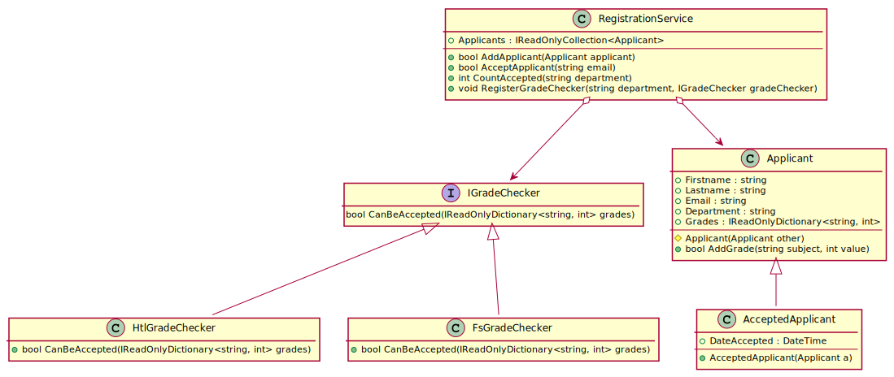

# Ein Anmeldesystem

Im November beginnen die Bewerbungen für interessierte Schülerinnen und Schüler
der 4. Klasse um einen Schulplatz an unserer Schule. Dabei werden die Daten von den
Bewerbern in ein Aufnahmesystem eingegeben.

Nach der Eingabe der Noten entscheidet der Abteilungsvorstand, wer aufgenommen wird.

Es gibt gesetzliche Vorschriften, welche Noten ein Bewerber für einen Schultyp haben muss
(HTL oder Fachschule). Werden diese nicht erfüllt, muss eine Aufnahmeprüfung gemacht werden.

Folgendes Modell soll diesen Sachverhalt vereinfacht wiedergeben:


<sup>
https://www.plantuml.com/plantuml/uml/jP9HZjem48RVSugH-WA2N00X10sbHQfKYVO2Wps0kuuTsHCajBjttus30uQiUDbz0ez___ddcvbxHiTrgRE3aWHKLdo2dI8jVPO9ZTx3eggq4cWOikSC062qKiwpmP9W0fwTClks_XjxopzALFgcjgGA7PTa-ERYfqD9_hsutX3AFqQVbagmiWRTQTeAnw0Cpu8yp_Fm-wqBERZ4jNmWDsnjjzPgM4WPx0Uj3_Xw-vy41pyuegvfcBrsRGj15PFi_6BtIsIAbp21vlXFbPJa6KL1NouCNxbJG5vN-SlimZicsT1UUNROKFXBxgW4nIoTDY5MMAqfG9jsWfHNvD6VB_vBs8MudIWYf6QsPrr3iR2ruTXQ5CauxEXuj4gUso8NHb8SI3oHktynXlMr0FPNXy2nXmxOF9-bxpwI9RYLON8x59I-FSE6mA50yvsw1XyjQHlN3m4kY_MBTO_xw9FSL_vBp6z2nrrDEQtyOysSZAnB_GO0
</sup>

## Klassenbeschreibung

#### Interface IGradeChecker
Der Grade Checker beinhaltet die Methode *CanBeAccepted()*, die feststellt, ob ein Bewerber
aufgrund der Noten aufgenommen werden darf. Sie liefert true, wenn der Bewerber aufgenommen werden
darf, false wenn nicht.

#### Klasse HtlGradeChecker
Prüft, ob eine Aufnahme in eine HTL ohne Prüfung erfolgen darf. Die echte Regelung berücksichtigt
noch die Schulart, dies ist eine Vereinfachung.

- **CanBeAccepted()** liefert true, wenn alle übergebenen Noten besser als 4 sind
  (also den Wert 1, 2, oder 3 haben).

#### Klasse FsGradeChecker
Prüft, ob eine Aufnahme in eine Fachschule ohne Prüfung erfolgen darf. Die echte Regelung
berücksichtigt noch die Schulart, dies ist eine Vereinfachung.

- **CanBeAccepted()** liefert true, wenn alle übergebenen Noten positiv sind
  (also den Wert 1, 2, 3 oder 4 haben).

#### Klasse Applicant
Erfasst den Bewerber mit den Stammdaten. Es ist ein Konstruktor für alle Werte zu definieren.
Die Properties selbst sind immutable.

- **Applicant(Applicant other)** ist ein Copykonstruktor. Er muss protected sein und weist einfach
  alle Felder von other den eigenen Werten zu.
- **AddGrade()** fügt die Note zum internen Dictionary hinzu. Liefert false, wenn die Note schon
  existiert. Ansonsten true.

#### Klasse AcceptedApplicant
Stellt einen akzeptierten Bewerber dar, der einen Schulplatz bekommen hat.

- **AcceptedApplicant()** Überträgt die Daten des übergebenen
  Bewerbers und setzt *DateAccepted* auf die Systemzeit (*DateTime.UtcNow*). Dabei wird der
  Copykonstruktor von *Appicant* verwendet.

#### Klasse RegistrationService
Ist das Service zur Registrierung der Bewerber und für alle Methoden
da, die die Bewerbungen bearbeiten.

- **RegisterGradeChecker()**  Fügt die übergebene Instanz eines
  GradeCheckers zu einem internen Dictionary hinzu. Das Dictionary
  soll den Typ *Dictionary&lt;string, IGradeChecker&gt;* haben.
- **AddApplicant()** 
  - Fügt den übergebenen Bewerber zur internen Collection hinzu. 
  - Es darf pro E-Mail Adresse nur eine Registrierung geben. Stelle dies z. B. durch
    ein Dictionary sicher.
  - Liefert true, wenn der Bewerber aufgenommen werden konnte.
  - Liefert false, wenn die E-Mail Adresse schon existiert.
- **AcceptApplicant()** Sucht nach der übergebene Email in der Liste der
  Bewerber und setzt den Status auf aufgenommen: 
  - Liefert false, wenn die Email nicht existiert. 
  - Ist der Bewerber schon aufgenommen (der Eintrag ist ein 
    *AcceptedApplicant*), wird false geliefert. 
  - Danach wird der entsprechende GradeChecker im Dictionary
    für die Abteilung des Bewerbers gesucht. 
  - Liefert die Methode *CanBeAccepted()* des GradeCheckers false, wird 
    false geliefert.
  - Existiert kein GradeChecker, so wird die Prüfung ausgelassen.
  - Am Ende wird der Bewerber durch eine neu erzeugte Instanz von
    *AcceptedApplicant* ersetzt.  Hinweis: Setze einfach über den Indexer des Dictionaries
    den neuen Wert.
- **CountAccepted()** Liefert zurück, wie viele Bewerber einer Abteilung
  den Status "aufgenommen" (also *AcceptedApplicant*) haben.

## Durchzuführende Arbeiten

Öffne die Solution *RegistrationSystem.sln* in diesem Ordner.
Definiere jede notwendige Klasse in einer eigenen Datei. Am Ende muss das Testprogramm folgende
Ausgabe zeigen. Die Datei *Program.cs* darf nicht geändert werden. Programme, die nicht kompilieren
oder Laufzeitfehler verursachen,
werden mit Nicht genügend bewertet. Erstelle daher notfalls eine Klasse mit Default Properties, damit
die geprüften Properties vorhanden sind.

  ```text
  Teste Klassenimplementierung.
   1 OK: Kein Defaultkonstruktor in Applicant.
   2 OK: Kein Defaultkonstruktor in AcceptedApplicant.
   3 OK: Alle Properties in RegistrationService sind read only.
   4 OK: Alle Properties in Applicant sind read only.
   5 OK: Alle Properties in AcceptedApplicant sind read only.
   6 OK: IGradeChecker ist ein Interface.
   7 OK: HtlGradeChecker implementiert IGradeChecker.
   8 OK: FsGradeChecker implementiert IGradeChecker.
   9 OK: Applicant.Grades ist IReadOnlyDictionary<string, int>.
Teste GradeCheckers
   10 OK: HtlGradeChecker.CanBeAccepted rechnet richtig.
   11 OK: FsGradeChecker.CanBeAccepted rechnet richtig.
Teste Applicants
   12 OK: AddGrades fügt die Noten hinzu.
   13 OK: AddGrades lehnt vorhandene Noten ab.
   14 OK: Konstruktor von AcceptedApplicant setzt die Werte.
Teste RegistrationService
   15 OK: RegistrationService.Applicants zeigt die richtige Anzahl an Bewerbern.
   16 OK: RegistrationService.AddApplicant prüft Emails auf Eindeutigkeit.
   17 OK: RegistrationService.AcceptApplicant akzeptiert Bewerber mit ausreichenden Noten.
   18 OK: RegistrationService.AcceptApplicant liefert false, wenn die Email nicht existiert.
   19 OK: RegistrationService.AcceptApplicant liefert false, wenn der Bewerber schon akzeptiert wurde.
   20 OK: RegistrationService.AcceptApplicant liefert false, wenn die Noten für die HTL nicht passen.
   21 OK: RegistrationService.AcceptApplicant liefert false, wenn die Noten für die FS nicht passen.
   22 OK: RegistrationService.AcceptApplicant berücksichtigt keine Noten, wenn kein GradeChecker für die Abteilung definiert wurde.
  ```