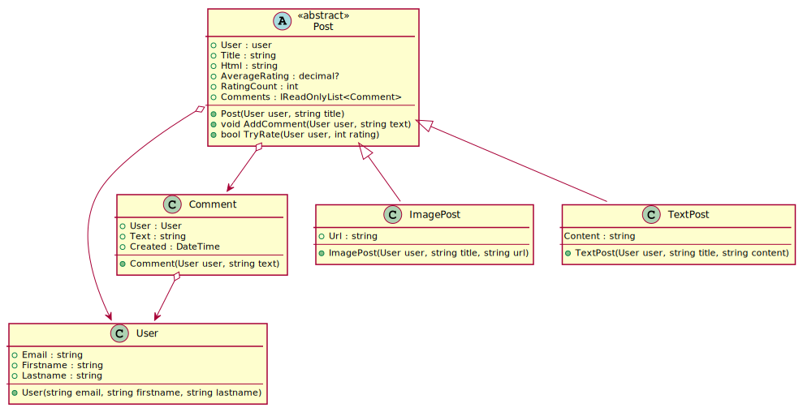

# Ein Blog

Das folgende Klassenmodell zeigt ein kleines Blogsystem. Es können Text- und Bildposts
erstellt werden. User können Kommentare auf Posts geben, die in einer Liste gespeichert
werden. Ein Rating kann ebenfalls abgegeben werden.


<sup>
https://www.plantuml.com/plantuml/uml/XL9Tpjem47pFAVRnGsqkKA4KbBOg4b8h10SmyGAM_8Fi3IgYtFrRupY420GFH9uTpup7dWKIdbgZYuEI26YET8QTGYt343581yTGqMWH0cm2-k9I0F--_3H2QVW6WRoo-uJzKZwG5GP7-58yWykoJECe-v46W57sAtIhNHRi4Tr9JOfhJbKxOz1I39RLs2X-4h36VpGAL7iKX9BH7_nTAuEFYJh9ZvjMot-zFx5OzEuOuCgoIbw5s397D0GfrbyN2ARJZ5RLA61x3wX8Zokxv7rN-4rcNFJyX5xiSIM88Pv9R9GH-dkQ9hXshIMUAKiFXmgCBLOev1-hpqiLQDeDgiSEEF_J0cBOIQASd98mb_9DNOcyTKx3sfyv7GwPd0_yBN7ibLs7fTwNdKU-z8NXyyTfRXKsNhzuNvdxyZZzglKwXkWtGDaUo__LxIwpStnE0-FQMU9SBwmp-QrpasIYUzepCf-XbQtHdm00
</sup>

## Klassenbeschreibung

#### Klasse User
Ist eine reine datenhaltende Klasse für die Userdaten. Alle Properties sind read-only.

#### Klasse Comment
Speichert die Daten eines Kommentares. Alle Properties sind read-only.
- **Comment()** Der Konstruktor setzt den Wert von Created auf die aktuelle UTC Systemzeit
  (DateTime.UtcNow).

#### Klasse Post
Speichert einen Post. Alle Properties sind read-only.
- **AverageRating** Gibt das durchschnittliche Rating zurück. Ist noch kein Rating für den
  Post abgegeben worden, ist das durchschnittliche Rating null.
- **RatingCount** Gibt die Anzahl der abgegebenen Ratings an.
- **AddComment** Fügt einen Kommentar zur internen Liste der Kommentare hinzu.
- **TryRate** Versucht, ein Rating hinzuzufügen. Dabei ist folgendes zu beachten:
  - Pro E-Mail Adresse eines Users darf nur ein Rating abgegeben werden. Stelle dies
    z. B. mit einem Dictionary sicher.
  - Ist schon ein Rating mit dieser E-Mail Adresse abgegeben worden, wird false geliefert.
  - Ist das Rating kleiner als 1 oder größer als 5, wird false geliefert.

#### Klasse ImagePost
Speichert einen Post, der aus einem Bild besteht. Alle Properties sind read-only.

- **Html** Erzeugt ein HTML Element für das Bild mit dem Aufbau `";` 
Der Wert (Url) ist durch die tatsächliche URL zu ersetzen. Hinweis: Anführungszeichen
im String müssen mit einem Backshash escaped werden.

#### Klasse TextPost
Speichert einen Post, der Text beinhaltet. Alle Properties sind read-only.

- **Html** Erzeugt ein HTML Element für den Inhalt mit dem Aufbau
`<h1>(Title)</h1><p>(Content)</p>";` 
Die Werte (Title) und (Content) sind durch die tatsächlichen Werte zu ersetzen.

## Durchzuführende Arbeiten

Öffne die Solution *BlogManager.sln* in diesem Ordner.
Definiere jede notwendige Klasse in einer eigenen Datei. Am Ende muss das Testprogramm folgende
Ausgabe zeigen. Die Datei *Program.cs* darf nicht geändert werden. Programme, die nicht kompilieren
oder Laufzeitfehler verursachen,
werden mit Nicht genügend bewertet. Erstelle daher notfalls eine Klasse mit Default Properties, damit
die abgeprüften Properties zumindest vorhanden sind.

```text
Teste Klassenimplementierung.
   1 OK: Kein Defaultkonstruktor in User.
   2 OK: User ist immutable.
   3 OK: Kein Defaultkonstruktor in Comment.
   4 OK: Comment ist immutable.
   5 OK: Kein Defaultkonstruktor in Post.
   6 OK: Post ist immutable.
   7 OK: Kein Defaultkonstruktor in ImagePost.
   8 OK: ImagePost ist immutable.
   9 OK: Kein Defaultkonstruktor in TextPost.
   10 OK: TextPost ist immutable.
   11 OK: Post.Comments ist vom Typ IReadOnlyList<Comment>.
   12 OK: Post.Html ist abstrakt.
Teste HTML Ausgabe.
   13 OK: ImagePost.Html liefert den richtign HTML String.
   14 OK: TextPost.Html liefert den richtign HTML String.
Teste Kommentieren
   15 OK: Post.AddComment fügt einen Kommentar hinzu.
   16 OK: Post.AddComment setzt Created auf UtcNow.
Teste Rating
   17 OK: Post.TryRate lehnt ungültige Werte ab.
   18 OK: Post.TryRate ein Rating hinzu.
   19 OK: Post.TryRate liefert false, wenn die Email schon geratet hat.
Teste AverageRating
   20 OK: Post.AverageRating ist null, wenn kein Rating abgegeben wurde.
   21 OK: Post.AverageRating berechnet den Durchschnitt der Ratings.
21 von 21 Tests erfüllt.
28 von 28 Punkte erreicht.


```