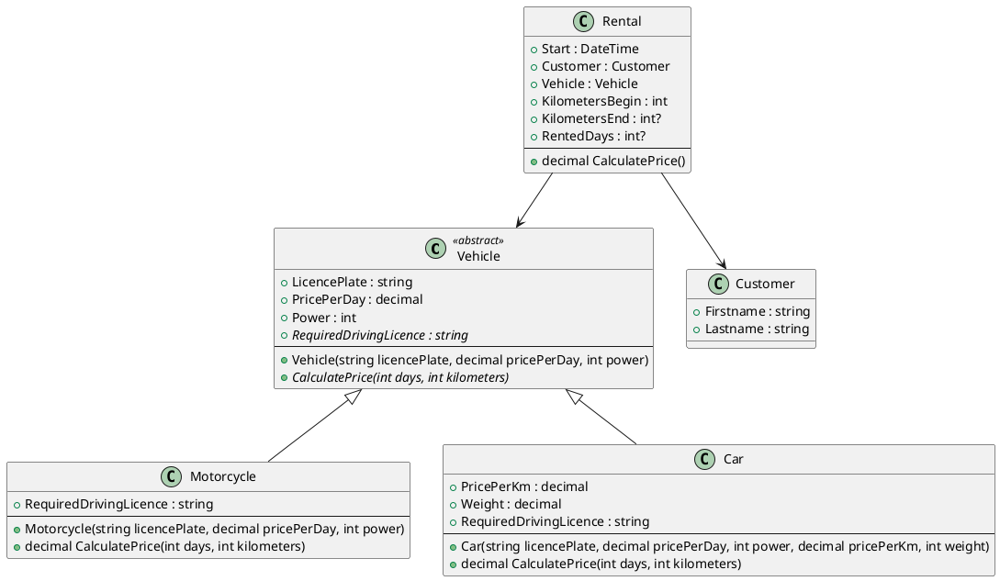

# Car rental service

A car rental company rents motorcycles and cars. A daily price is charged for motorcycles.
For cars, the kilometers driven are also charged. The following class model shows a simple
implementation.

## Description of each class

#### Class Vehicle
Abstract base class for cars and motorcycles.

- **LicencePlate:** Licence plate (Nummerntafel) of the vehicle.
- **PricePerDay:** Rental price for each day started.
- **Power:** Power of the vehicle in kWh.
- **RequireDrivingLicence:** Abstract property. Indicates which driver's license class is required to drive the vehicle.
- **CalculatePrice():** Abstract method. Calculates the price based on the days rented and the kilometers driven.

#### Class Motorcycle

- **RequireDrivingLicence:** Always returns the string "A".
- **CalculatePrice():** Calculates the price to be charged according to the formula *Days x PricePerDay*.

#### Class Car

- **RequireDrivingLicence:** Returns "B" if the car weighs less than 3500 kg. Otherwise "C" (truck).
- **CalculatePrice():** Calculates the price to be charged according to the formula *Days x PricePerDay + PricePerKm x km*.

#### Class Rent

- **Start:** Start of rental.
- **KilometersBegin:** Mileage (Kilometerstand) at the beginning of the rental.
- **End:** End of rental. Is *null* if the vehicle has not yet been returned.
- **KilometersEnd:** Mileage (Kilometerstand) at the end of the rental.
  Is *null* if the vehicle has not yet been returned.
- **RentedDays:** Number of days started. Note: this can be calculated with
  *(int) (End - Start).TotalDays + 1* if *Start* and *End* are *DateTime* (not DateTime?) values.
- **CalculatePrice():**
  - Returns 0 if End is null.
  - Returns 0 if KilometersEnd is null.
  - Otherwise returns the value of the calculation method of the rented vehicle.

## Your task

Start the solution *CarRentalService.sln*. *Program.cs* contains a test program which 
checks the implementation. The file *Program.cs* must not be modified.

Add a file for each class. At the end start *cleanSolution.cmd* to remove the
*bin* and *obj* folder. After that create a ZIP file with the complete program 
and submit it to Microsoft Teams.

Programs which do not compile as well as programs which cause runtime errors are rated as not sufficient (Nicht genügend).

