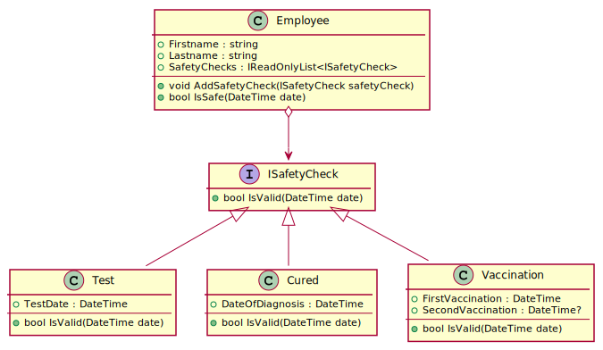

# Health Checker

As of November 2021, employees must provide a COVID health certificate to enter their workplace.
("3G am Arbeitsplatz"). The following types of certificates are accepted:
- A vaccination certificate, where the 2nd dose must have been applied.
- A proof of recovery (cured).
- A test certificate.

The different types of tests as well as different vaccines are not considered for simplicity. The following class model shows a possible implementation:

https://www.plantuml.com/plantuml/uml/dO_TIiD048NlzodcigNi2uZKIgjGA1HiwVsuEsa7zoTaDa9Gtzsa9RgffQXxDSoUETyvCqbOfTexTM1BGBvC3HHCpefI719L1Hg2vGOBIityGEO5tXIqR_8SeuEbxD2n7IqmqPOzWMs7iVfGoZWKWIr9wW-wkTF13VJouuVM-ZUEHojTb_fzEiZJe-PrHRPdTTVhOi6u3r5O_eayMLvXxj0O3fWuXfxyo9MaV7-6dcp8n60lA-x-aYwtk9BnmPSkDaI3W04zjLn95OVzQR_2Y-lCKTglvHEXNGVNh5ZIRSwR3hE_HhPmRssc6ELoaEzvFAZRYNws_QeHjJuhEgDWQ-y-0G00

## Description of each class

#### Class Employee

- **SafetyChecks**: A read-only list of all provided safety checks.
- **AddSafetyCheck(safetyCheck)**: Adds a safety check to the internal collection.
- **IsSafe(date)**: Returns true, if any safety check in the collection is valid.

#### Class Test

- **IsValid(date)**: Checks if a test is valid at the passed time.
  - Returns false if the test date is in the future.
  - Returns false if the test date is older than 48 hours. The current time is 
    passed in the variable date (hint: use *DateTime.AddHours()*).
  - Returns true if the date is valid.

#### Class Cured

- **IsValid(date)**: Checks if a recovery certificate is valid at the passed time.
  - Returns false if the date of diagnosis is in the future.
  - Returns false if the date of diagnosis is older than 90 days. The current time 
    is passed in the variable date (hint: use *DateTime.AddDays()*).
  - Returns true if the date is valid.

#### Class Vaccination

- **SecondVaccination**: This property may be set only if the date is after the 
  1st vaccination. Once this property has been set, it may not be changed.
- **IsValid(date)**: Checks if the vaccination is valid at the passed time.
  - Returns false if no second vaccination is present.
  - Returns false if the second vaccination is older than 360 days.
  - Returns true if the date is valid.

## Your task

Start the solution *HealthChecker.sln*. *Program.cs* contains a test program which 
checks the implementation. The file *Program.cs* must not be modified.

Add a file for each class. At the end start *cleanSolution.cmd* to remove the
*bin* and *obj* folder. After that create a ZIP file with the complete program 
and submit it to Microsoft Teams.

Programs which do not compile as well as programs which cause runtime errors are rated as not sufficient (Nicht genügend).

