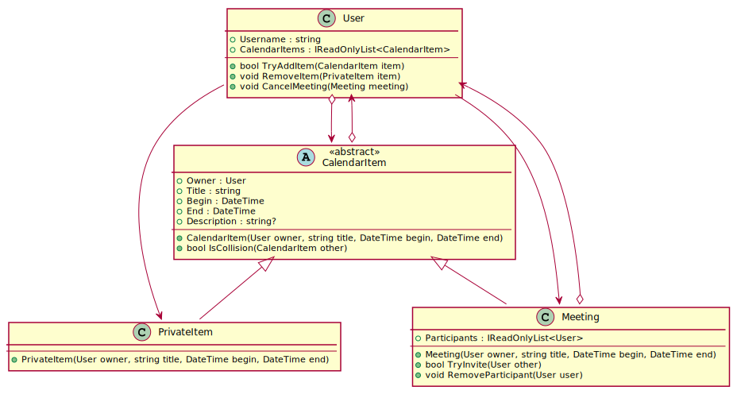

# Ein Kalendersystem

Das folgende Modell zeigt die Implementierung eines kleinen Kalendersystems für User. Es
gibt 2 Arten von Terminen: private Termine und Meetings. Bei Meetings können andere User
als Teilnehmer eingeladen werden. Beim Hinzufügen eines Termines wird immer geprüft,
ob es zu Kollisionen kommt.


<sup>
https://www.plantuml.com/plantuml/uml/fLBRZjem47ttLymZKTS_KA5qMxOFaLfjjQ8VOE8fMF8biYT1YFBlQsE37E0D7X9opbpEd9dNGCBJQ3JRAOc0Pg036AITaw66_YdK4Ucr207-1lJio23-lgJ_LXY4hn38AxlDy4fej5BuZj24o47tWKA-MttufG8jQxezPt3ES-R6EGrhV_WkPM8NTIYe-6XotEIKX0yqRi9pt1-l9a7uC6mbR8_wDo95WOlo1fFV3JinbiO0ntaBTRyCS-dsDb5LYnkcb6HCRA8BeYV8JjN5biiBsRONzzxt5dsq9rNBo5gHlZNp1swLZTXRRBvM1ZFwqyexx0r3xzL0ojbhZMzpVsj9Ypns4l5Iee6IW9ThNTYavjLtJ6wgJNLXvRHM8NQShyhH3dq3qTmvpCU1jtdWSawrhSUvs48zfVN4wjD8xV_FjrnqN9TuBBs59zMhGLXA5pm_u2Jcvd1B-hEUvkllx1IFEDVAJjvTVQKlnutnaSOjGXwEMhZv6buZFnhz2G00
</sup>


## Klassenbeschreibung

#### Klasse CalendarItem
Ist die abstrakte Basisklasse für alle Kalendereinträge. Sie hat die read-only Properties
*Owner*, *Title*, *Begin* und *End*. Das Property *Description* ist nullable und soll auch 
nachträglich von außen gesetzt werden.

- **IsCollision()** prüft, ob ein anderer Termin eine Kollision erzeugen würde. Ein Termin
kann nur gebucht werden, wenn das Ende des anderen Termines vor dem Beginn dieses Termines
liegt oder wenn der Beginn des anderen Termines nach dem Ende dieses Termines liegt. Ist
das nicht der Fall, liefert die Methode false.

#### Klasse PrivateItem
Diese Klasse repräsentiert einen privaten Termin. Sie hat keine Daten, da der Typ dieser
Klasse zur Bestimmung der Terminart verwendet wird. *User.RemoveItem()* darf nämlich nur einen
privaten Termin löschen, dies wird durch diesen Typ sichergestellt.

#### Klasse Meeting
Dieser Typ stellt ein Meeting dar. Ein Meeting hat eine Liste von Usern, die daran teilnehmen.
- **TryInvite()** lädt den übergebenen User ein, indem
  - der User zur Liste der Participants hinzugefügt wird.
  - das Meeting im Kalender des anderen Users eingetragen wird.
  - Gibt es eine Überschneidung (der andere User ist zu dieser Zeit belegt), liefert die
    Methode false.
- **RemoveParticipant()** löscht den übergebenen Teilnehmer aus der Liste der Teilnehmer.

#### Klasse User
Repräsentiert den Kalender eines Users. 

- **TryAddItem()** Fügt den übergebenen Termin nach folgenden Regeln zur Liste der
  Kalendereinträge (*CalendarItems*) hinzu:
  - Ist der Termin kein Meeting, so muss der Eigentümer (Property *Owner*) der eigene User sein. Falls dies
    verletzt wird, wird false zurückgegeben. Das verhindert, dass private Termine anderer User
    hinzugefügt werden. Bei einem Meeting kann das natürlich möglich sein (Einladefunktion)
- **RemoveItem()** Löscht den übergebenen Eintrag aus der Liste der Kalendereinträge.
- **CancelMeeting()** Sagt ein Meeting ab. Dabei soll wie folgt vorgegangen werden:
  - Ist der User der Eigentümer des Meetings, so wird das Meeting aus dem Kalender aller
    Teilnehmer gelöscht. Es findet ja nicht statt.
  - Ist der User nicht der Eigentümer des Meetings (also nur Teilnehmer), so wird das
    Meeting nur aus dem eigenen Kalender gelöscht. Bei den anderen Teilnehmern bleibt
    das Meeting natürlich im Kalender. Achte darauf, dass der User auch aus der Liste
    der Teilnehmer des Meetings entfernt wird.

## Durchzuführende Arbeiten

Öffne die Solution *TeamCalendar.sln* in diesem Ordner.
Definiere jede notwendige Klasse in einer eigenen Datei. Am Ende muss das Testprogramm folgende
Ausgabe zeigen. Die Datei *Program.cs* darf nicht geändert werden. Programme, die nicht kompilieren
oder Laufzeitfehler verursachen,
werden mit Nicht genügend bewertet. Erstelle daher notfalls eine Klasse mit Default Properties, damit
die geprüften Properties vorhanden sind.

```text
Teste Klassenimplementierung.
   1 OK: Kein Defaultkonstruktor in User.
   2 OK: Kein Defaultkonstruktor in CalendarItem.
   3 OK: Kein Defaultkonstruktor in PrivateItem.
   4 OK: Kein Defaultkonstruktor in Meeting.
   5 OK: CalendarItem ist eine abstrakte Klasse.
   6 OK: User.CalendarItems ist vom Typ IReadOnlyList<CalendarItem>.
   7 OK: Meeting.Participants ist vom Typ IReadOnlyList<User>.
Teste User.TryAddItem
   8 OK: User.TryAddItem fügt den Termin zu CalendarItems hinzu.
   9 OK: CalendarItem.IsCollision erkennt Kollisionen.
   10 OK: User.TryAddItem lehnt Kollisionen ab.
   11 OK: User.TryAddItem lehnt private Termine von fremden Usern ab.
Teste User.RemoveItem
   12 OK: User.RemoveItem löscht private Termine.
Teste Meeting.Invite
   13 OK: Meeting.Invite fügt den User zum Meeting hinzu.
Teste User.CancelMeeting (participant)
   14 OK: User.CancelMeeting löscht einen Teilnehmer aus dem Meeting.
   15 OK: User.CancelMeeting löscht den Termin aus dem Kalender des Teilnehmers.
   16 OK: User.CancelMeeting belässt das Meeting im Kalender des Organisators.
   17 OK: User.CancelMeeting belässt das Meeting im Kalender des anderen Teilnehmers.
Teste User.CancelMeeting (owner)
   18 OK: User.CancelMeeting löscht das Meeting aus dem Kalender des Eigentümers.
   19 OK: User.CancelMeeting löscht das Meeting aus dem Kalender des Teilnehmers.
```
