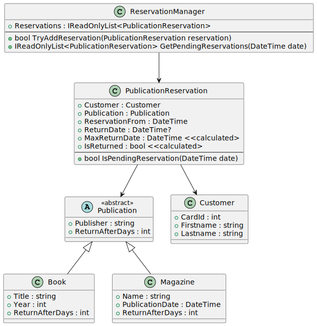

# Entleihsystem für eine Bibliothek

Eine Bibliothek möchte ihren Kunden ein Reservierungssystem anbieten. Jeder Kunde kann sich
ein Buch oder eine Zeitschrift reservieren. Nach einer bestimmten Frist muss das Werk
zurückgegeben werden. Werden Fristen versäumt, sollen Kunden benachrichtigt werden. 1 Kunde
kann nur 1 Werk gleichzeitig entleihen.

https://www.plantuml.com/plantuml/uml/ZL91pzem3BtdL_ZuVKBz0nFgO4DCbM13YCkEfZ4GBKrHaaxhMF_xqeH2A1bQJuxVi_tyt9cng6rJINOId82gistX84XomrWfqHZOaY7z4wserHeL7ad3XO7x9X5Yu0CKMqB-JSbs9OoTRfgz5AK78ruElZJBij1YNzSIThgTSnwntjB5eE_nUwZ_lvbVo6v8SQ6EiUIt1LhQYOg0k-2TTIonQfRba6ux-9D6lKUJpusnTKNQkJE4VJegSKZqOe-kBdLTES9DPu1jerMVYf2F7bhZhoGAC9sMACj6kWJFUsfX0fEuu_aZZ2dXHE50XNcsxzczj17UmM7vLvm0nTRUogvcekP5hrSesx-NGXkhiEfNDLOxUNrsXUDannZkNOobXQUJkRq7CC_378-Q4-c7lfU1ra6mRdwmf1VOcgkYRb3zgQv_X4uxOUMZkk-4-hx1lnhv3bbppluaRLdZ4NyBHM78rx43KSNeHtWrSsYQd3iZnPjA_WK0

## Klassenbeschreibung

#### Klasse ReservationManager

- **Reservations**: Eine read-only Liste, die alle Reservierungen zurückgibt.
- **TryAddReservation()**: Fügt eine Reservierung hinzu.
  - Liefert false, wenn der betroffene Kunde eine offene Reservierung hat (*IsReturned* false liefert).
    Hier wird keine Reservierung eingefügt.
  - Liefert true, wenn die Reservierung eingefügt wurde.
- **GetPendingReservations()**: Liefert eine Liste aller Reservierungen, die zum
  übergebenen Datum ausständig sind. Zur Bestimmung wird dabei die Methode
  *IsPendingReservation()* der Reservierung verwendet.

#### Klasse PublicationReservation
- **ReturnDate**: Null, wenn das Werk noch nicht zurückgebracht wurde.
- **MaxReturnDate**: Berechnetes spätestes Rückgabedatum. Es wird dabei das Property
*ReturnAfterDays* des Werkes verwendet. Hinweis: Verwende *AddDays()*.
- **IsReturned**: true, wenn das Rückgabedatum gesetzt ist. Sonst false.
- **IsPendingReservation()**: Liefert true, wenn die Reservierung zum übergebenen Zeitpunkt
ausständig ist. Das ist dann der Fall, wenn kein Rückgabedatum gesetzt ist und das
übergebene Datum nach dem maximalen Rückgabedatum ist.

#### Klasse Publication
- **ReturnAfterDays**: Abstraktes Property, welches die Tage, nach denen das Werk zurückgegeben
werden soll, liefert.

#### Klasse Book
- **ReturnAfterDays**: Liefert 14.

#### Klasse Magazine
- **ReturnAfterDays**: Liefert 7.

## Ihre Aufgabe

Starten Sie die Solution *LibraryManager.sln*. Die Datei *Program.cs* beinhaltet ein Testprogramm,
welches Ihre Implementierung testet. Diese Datei darf nicht verändert werden.

Legen Sie eine Datei für jede Klasse an. Starten Sie am Ende nach dem Schließen der IDE *cleanSolution.cmd*, um den Ordner *bin* und *obj* zu löschen. Danach laden Sie die ZIP Datei
mit Ihrer gesamten Solution (sln und alle Quellcodedateien) in Teams hoch.

Programme, die nicht kompilieren oder Programme, die Laufzeitfehler verursachen werden mit
"Nicht genügend" gewertet.

