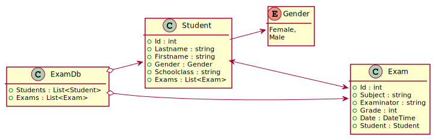

# Filtern mit Where, All und Any
Oft wird eine Collection nach bestimmten Eigenschaften gefiltert. Betrachten wir eine Liste von Zahlen.
Wir möchten herausfinden, welche Zahlen gerade sind. Imperativ wird dies so gelöst:
```c#
List<int> numbers = new List<int> { 2, 3, 4, 5, 6 };
List<int> result = new List<int>();
foreach (int x in numbers)
{
    if (x % 2 == 0) { result.Add(x); }
}
```

Solcher Code ist aus zweierlei Gründen schlecht:
- Viel "boilerplate code", der sich immer wiederholt: Deklarieren der Ergebnisliste, Schleife, if...
- Vermischung der eigentlichen Prüfung (Modulo 2 = 0) mit der Iteration.

Vor allem in der funktionalen Programmierung möchten wir den Code in kleinere, unabhängige Teile aufteilen.
Mit dem Namespace *System.Linq* (muss mittels *using* eingebunden werden) gibt es mit *Where()*, *All()* 
und *Any()* fertige Funktionen zum Filtern von Listen. Sie bekommen eine Lambdaexpression übergeben, die
bestimmt, welche Elemente genommen werden sollen. Dadurch wird unser Code auf eine Zeile reduziert:
```c#
IEnumerable<int> result = numbers.Where(n => n % 2 == 0);
```

## Was ist LINQ?

In .NET implementieren alle Collections das Interface *IEnumerable&lt;T&gt;*. Mit dem Einbinden
des Namespace *System.Linq* werden sogenannte Extension Methoden aktiv. Details dazu sind im Kapitel
[Extension Methods](../../Professional%20C%23/10_ExtensionMethods) erklärt.

## Musterprogramm mit Schülerdaten

Das Musterprogramm in [LinqUebung1](LinqUebung1) definiert 3 Klassen:


<sup>
https://www.plantuml.com/plantuml/uml/TPBDQiCm383lUWhTjxp0AA67hcNGdReNS6EjqV3Fi1NOA7ltsPKP3govHFhGpoVmDej9idW7Zju59MBYooneET4a70FCR0d9VyetUf8vsWn0OV5ue60f8Lm1oxSdRnmztkBN4i4FJCxaZ2TPB0LfPGyl5f-GWsXsD5c2yLHObiJXedZFwL-kAmlKGE5fccDqkcnT_lnbV6L7phAfoLYie0dXC8njJZEj5QhPMTO5o_c39kc7wsmEHc9QyqCobhhcdP6QrjyRUxgnPb1mYtgjpL34rANpsftXslV-dTNo4UuVhFqOwznMtZFTjQLWwpFu1G00
</sup>

Nun wollen wir folgende Beispiele lösen.

## Where, Count und First

1. Suche den Schüler mit der Id 1003. *Where()* liefert **immer** eine Collection, da wir ja nie wissen,
   wie viele Ergebnisse kommen. Mit *First()* suchen wir das erste Element und schreiben es in *result1*.
```c#
Student result1 = db.Students.Where(s => s.Id == 1003).First();
```

2. Wird eine Id nicht gefunden, liefert *Where()* eine leere Collection. *First()* wirft aber dann einen Fehler.
Daher sollte immer *FirstOrDefault()* verwendet werden. Es liefert null, wenn nichts gefunden wurde.
```c#
Student? result2 = db.Students.Where(s => s.Id == 1090).FirstOrDefault();
```

Beachte den Typ *Student?*. *FirstOrDefault()* kann null liefern, daher brauchen wir bei aktivierten
nullable reference types den entsprechenden nullable type. *FirstOrDefault()* kann auch direkt
einen Filterausdruck verwenden, was die Abfrage noch einmal vereinfacht:
```c#
Student? result2a = db.Students.FirstOrDefault(s => s.Id == 1090);
```

3. Wie viele Schüler sind in der Datenbank gespeichert?
```c#
int result3 = db.Students.Count();
```

4. Wie viele Schüler sind in der 3AHIF? Bei *Count()* kann ich ebenfalls eine Lambda Expression übergeben.
```c#
int result4 = db.Students.Count(s => s.Schoolclass == "3AHIF");
// Alternativ:
 int result5 = db.Students.Where(s => s.Schoolclass == "3AHIF").Count();
```

## All und Any

5. Liefere eine Liste aller Schüler, die irgendeine Prüfung auf 5 geschrieben haben. 
```c#
// Bitte nicht so, die Datenbank muss sonst zählen:
IEnumerable<Student> negative = db.Students
    .Where(s => s.Exams.Count(e => e.Grade == 5) != 0);
// Besser mit Any:
IEnumerable<Student> negative2 = db.Students
    .Where(s => s.Exams.Any(e => e.Grade == 5));

// Ich kann aus jedem Any Ausdruck einen All Ausdruck mittels Negation erzeugen.
IEnumerable<Student> negative2a = db.Students
    .Where(s => !s.Exams.All(e => e.Grade != 5));
```

6. Liefere eine Liste aller Schüler, die alle Prüfungen auf 5 geschrieben haben.
```c#   
IEnumerable<Student> negative2b = db.Students
    .Where(s => s.Exams.All(e => e.Grade == 5));
```

Betrachten wir das Ergebnis der Abfrage, liefert sie 2 Resultate. Doch bei genauerem Hinsehen
fällt uns auf, dass diese 2 Schüler keine Prüfungen hatten. Warum liefert also die Abfrage
diese 2 Schüler? In der Prädikatenlogik liegt die Antwort: Die Bedingung "alle Prüfungen sind
negativ" ist erfüllt, wenn es keine Prüfung gibt. Möchten wir diese Fälle ausschließen, brauchen
wir zusätzlich *Any()*:
```c#
IEnumerable<Student> negative2b = db.Students
      .Where(s => s.Exams.Any() && s.Exams.All(e => e.Grade == 5));
```

7. Liefert eine Liste aller Schüler, die eine negative D Prüfung hatten.
```c#
IEnumerable<Student> negative3 = db.Students
      .Where(s => s.Exams.Any(e => e.Grade == 5 && e.Subject == "D"));
```

8. Besonderheit: All liefert true, wenn die Ausgangsliste leer ist. Beispiel: Sind alle GGP Prüfungen 
eines Schülers negativ? Man muss wissen, dass es keine GGPB Prüfungen in den Testdaten gibt. Deswegen 
werden alle Schüler geliefert!
```c#
IEnumerable<Student> negative4 = db.Students
      .Where(s => s.Exams
            .Where(e => e.Subject == "GGP")
            .All(e => e.Grade == 5));
```

9. Dies liefert Schüler ohne irgendeine Prüfung oder Schüler, die ausschließlich negative GGP Prüfungen 
und sonst keine anderen Fächer hatten.
```c#
IEnumerable<Student> negative5 = db.Students
    .Where(s => s.Exams.All(e => e.Subject == "GGP" && e.Grade == 5));
```

## Max, Min und Average

Um das Maximum, das Minimum oder den Durchschnitt aus einer Liste zu berechnen, gibt es auch
dafür Funktionen. 
```c#
List<int> numbers = new List<int> {1, 2};
int max = numbers.Max();  // 2
```

Wollen wir allerdings die schlechteste Note berechnen, führt der folgende Ausdruck zu einem Fehler:
```c#
db.Exams.Max();
```

Das ist auch klar, da die Max-Funktion nur aus einer Liste von Zahlen (genauer gesagt: eine
Liste dessen Elemente mit *ICompareable* vergleichbar sind) einen Wert ermitteln kann. Die Funktion weiß nicht,
wie der Ausdruck *Prüfung1 &lt; Prüfung2* berechnet werden soll. Deswegen können wir mit einer
Lambda Expression einen Ausdruck hinterlegen, wenn wir den Vergleich über ein Property
durchführen wollen:
```c#
db.Exams.Max(e => e.Grade);  // 5
```

Vorsicht: Diese Funktionen liefern einen Fehler, wenn die Liste leer ist. Dies ist z. B. mit
*Any()* im Vorfeld zu prüfen.

## Übungen
Öffne die Solution [LinqUebung1.sln](LinqUebung1). Die Beispiele sind in den Kommentaren in der *Main()* Methode.
Schreibe dein Ergebnis in die entsprechende Variable, die ausgegeben wird. Verwende den korrekten
Rückgabetyp statt *object*. Die Korrektheit der Lösung wird im Programm überprüft.
