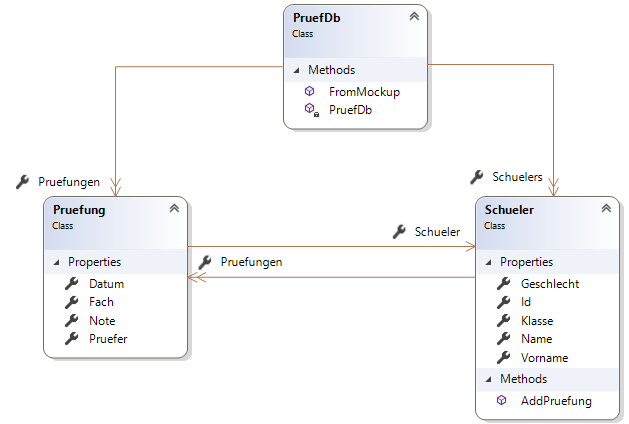

# Filtern mit Where, All und Any
Oft wird eine Collection nach bestimmten Eigenschaften gefiltert. Betrachten wir eine Liste von Zahlen.
Wir möchten herausfinden, welche Zahlen gerade sind. Imperativ wird dies so gelöst:
```c#
List<int> numbers = new List<int> { 2, 3, 4, 5, 6 };
List<int> result = new List<int>();
foreach (int x in numbers)
{
    if (x % 2 == 0) { result.Add(x); }
}
```

Solcher Code ist aus zweierlei Gründen schlecht:
- Viel "boilerplate code", der sich immer wiederholt: Deklarieren der Ergebnisliste, Schleife, if...
- Vermischung der eigentlichen Prüfung (Modulo 2 = 0) mit der Iteration.

Vor allem in der funktionalen Programmierung möchten wir den Code in kleinere, unabhängige Teile aufteilen.
Mit dem Namespace *System.Linq* (muss mittels *using* eingebunden werden) gibt es mit *Where()*, *All()* 
und *Any()* fertige Funktionen zum Filtern von Listen. Sie bekommen eine Lambdaexpression übergeben, die
bestimmt, welche Elemente genommen werden sollen. Dadurch wird unser Code auf eine Zeile reduziert:
```c#
IEnumerable<int> result = numbers.Where(n => n % 2 == 0);
```

## Musterprogramm mit Schülerdaten

Das Musterprogramm in diesem Ordner definiert 3 Klassen:


Nun wollen wir folgende Beispiele lösen.

1. Suche den Schüler mit der Id 1003. *Where()* liefert **immer** eine Collection, da wir ja nie wissen,
   wie viele Ergebnisse kommen. Mit *First()* suchen wir das erste Element und schreiben es in *result1*.
```c#
Schueler result1 = db.Schuelers.Where(s => s.Id == 1003).First();
```

2. Wird eine Id nicht gefunden, liefert *Where()* eine leere Collection. *First()* wirft aber dann einen Fehler.
Daher sollte immer *FirstOrDefault()* verwendet werden. Es liefert null, wenn nichts gefunden wurde.
```c#
Schueler result2 = db.Schuelers.Where(s => s.Id == 1090).FirstOrDefault();
```

3. Wie viele Schüler sind in der Liste gespeichert?
```c#
int result3 = db.Schuelers.Count();
```

4. Wie viele Schüler sind in der 3AHIF? Bei *Count()* kann ich ebenfalls eine Lambda Expression übergeben.
```c#
int result4 = db.Schuelers.Count(s => s.Klasse == "3AHIF");
// Alternativ:
int result5 = db.Schuelers.Where(s => s.Klasse == "3AHIF").Count();
```

5. Liefere eine Liste aller Schüler, die irgendeine Prüfung auf 5 geschrieben haben. 
```c#
// Bitte nicht so, die Datenbank muss sonst zählen:
IEnumerable<Schueler> negative = db.Schuelers
    .Where(s => s.Pruefungen.Count(p => p.Note == 5) != 0);
// Besser mit Any:
IEnumerable<Schueler> negative2 = db.Schuelers
    .Where(s => s.Pruefungen.Any(p => p.Note == 5));

// Ich kann aus jedem Any Ausdruck einen All Ausdruck mittels Negation erzeugen.
IEnumerable<Schueler> negative2a = db.Schuelers
    .Where(s => !s.Pruefungen.All(p => p.Note != 5));
```

6. Liefere eine Liste aller Schüler, die alle Prüfungen auf 5 geschrieben haben.
```c#   
IEnumerable<Schueler> negative2b = db.Schuelers
    .Where(s => s.Pruefungen.All(p => p.Note == 5));
```

7. Liefert eine Liste aller Schüler, die eine negative D Prüfung hatten.
```c#
IEnumerable<Schueler> negative3 = db.Schuelers
    .Where(s => s.Pruefungen.Any(p => p.Note == 5 && p.Fach == "D"));
```

8. Besonderheit: All liefert true, wenn die Ausgangsliste leer ist. Beispiel: Sind alle GGP Prüfungen 
eines Schülers negativ? Man muss wissen, dass es keine GGPB Prüfungen in den Testdaten gibt. Deswegen 
werden alle Schüler geliefert!
```c#
IEnumerable<Schueler> negative4 = db.Schuelers
    .Where(s => s.Pruefungen
            .Where(p => p.Fach == "GGP")
            .All(p => p.Note == 5));
```

9. Dies liefert Schüler ohne irgendeine Prüfung oder Schüler, die ausschließlich negative GGP Prüfungen 
und sonst keine anderen Fächer hatten.
```c#
IEnumerable<Schueler> negative5 = db.Schuelers
    .Where(s => s.Pruefungen.All(p => p.Fach == "GGP" && p.Note == 5));
```

## Übungen
Öffne die Solution LinqUebung1.sln. Die Beispiele sind in den Kommentaren in der Main() Methode.
Schreibe dein Ergebnis in die entsprechende Variable, die ausgegeben wird. Die korrekte Ausgabe
soll so aussehen:
```
Beispiel 5: FAV gab schlechtestens die Note 4.
Beispiel 6: Notenschnitt der Schülerinnen in POS: 3.67
Beispiel 7: Schüler mit mehr als 6 Prüfungen.
   Nayshe Eliès hat mehr 6 oder mehr Prüfungen.
   Domanek Noémie hat mehr 6 oder mehr Prüfungen.
   Dibden Maéna hat mehr 6 oder mehr Prüfungen.
Beispiel 8: Schüler mit DBI Prüfungen.
   Mattack Loïca hat eine DBI Prüfung.
   Nayshe Eliès hat eine DBI Prüfung.
   Domanek Noémie hat eine DBI Prüfung.
   Avramovitz Chloé hat eine DBI Prüfung.
   Kynge Valérie hat eine DBI Prüfung.
   Dibden Maéna hat eine DBI Prüfung.
   Cuseick Cléa hat eine DBI Prüfung.
   Minerdo Laurélie hat eine DBI Prüfung.
   Works Styrbjörn hat eine DBI Prüfung.
   Jeandin Maïté hat eine DBI Prüfung.
   McComiskey Léa hat eine DBI Prüfung.
Beispiel 9: Schüler, die nur in POS eine Prüfung haben.
   Wilton Lèi hat nur in POS eine Prüfung.
   Santori Céline hat nur in POS eine Prüfung.
   Gianulli Léonie hat nur in POS eine Prüfung.
Beispiel 10: Schüler, die keine POS Prüfung haben.
   Elt Célia hat keine POS Prüfung.
   Domanek Noémie hat keine POS Prüfung.
   Avramovitz Chloé hat keine POS Prüfung.
   Riseborough Lauréna hat keine POS Prüfung.
   Kynge Valérie hat keine POS Prüfung.
   Pinder Jú hat keine POS Prüfung.
   Elbourn Josée hat keine POS Prüfung.
   Fosdike Kallisté hat keine POS Prüfung.
   Billson Eléa hat keine POS Prüfung.
   Santori Céline hat keine POS Prüfung.
   Minerdo Laurélie hat keine POS Prüfung.
   Gianulli Léonie hat keine POS Prüfung.
   Works Styrbjörn hat keine POS Prüfung.
   Clearley Åsa hat keine POS Prüfung.
   Spurnier Stéphanie hat keine POS Prüfung.
Beispiel 11: Schüler, die überhaupt keine Prüfung haben.
   Santori Céline hat keine Prüfung.
   Gianulli Léonie hat keine Prüfung.
Beispiel 12: Schüler, die im Juni eine AM Prüfung hatten.
   Browne Esbjörn hat bei KY eine 5 in AM.
   Jeandin Maïté hat bei KY eine 5 in AM.
   Domanek Noémie hat bei KY eine 5 in AM.
Beispiel 13: Schüler, die in AM einmal negativ, aber in E immer positiv waren.
   Domanek Noémie war in AM negativ, in E aber nie.
   Calladine Clémence war in AM negativ, in E aber nie.
   Browne Esbjörn war in AM negativ, in E aber nie.
   Clearley Åsa war in AM negativ, in E aber nie.
Beispiel 14: Schüler, in DBI bessere Prüfungen (Notenschnitt) als in D hatten.
   Works Styrbjörn ist in DBI besser als in D.
```