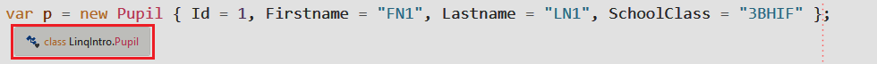
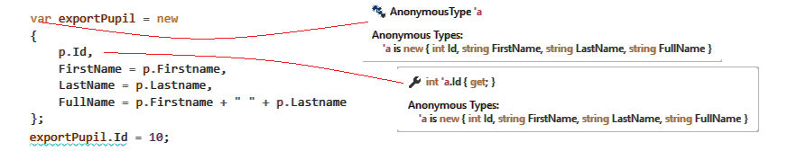

# Projektionen mit Select

## var (Implicitly Typed Local Variables) und anonyme Typen

Mit C# 3 wurde das Schlüsselwort *var* eingeführt. Es bedeutet soviel wie "der Compiler ersetzt dies
durch den Typ". Bei einer Zuweisung kann der Compiler nämlich schon aufgrund der rechten Seite des
Zuweisungsoperators eindeutig bestimmen, welcher Typ als Ergebnis geliefert wird:
```c#
int x = 1;                                   // (1)
int y = x + 1;                               // (2)
int z = Math.Min(x, y);                      // (3)
Pupil p = new Pupil {...};                   // (4)
List<Pupil> pupilList = new List<Pupil>();   // (5)
```
1. Das Literal 1 hat keine Kommastellen und ist daher eindeutig im Sprachstandard ein *int* Literal.
2. *int + int* ergibt *int*, das Ergebnis ist also auch eindeutig ein *int*.
3. Die Funktion *Math.Min()* gibt ein int zurück, wenn 2 *int* Werte übergeben werden.
4. Der new Operator bestimmt den Typ der Instanz auch eindeutig.
5. Auch bei Generics ist der Typ eindeutig bestimmbar.

Wir können nun alle Anweisungen so schreiben, dass der Compiler den Typ automatisch setzt:
```c#
var x = 1;                           // var ist vom Typ int
var y = x + 1;                       // var ist vom Typ int
var z = Math.Min(x, y);              // var ist vom Typ int
var p = new Pupil {...};             // var ist vom Typ Pupil
var pupilList = new List<Pupil>();   // var ist vom Typ List<Pupil>
```

### Soll *var* nun immer und überall verwendet werden?

Es gibt 4 mögliche Situationen:
1. *var* darf nicht verwendet werden. Dies ist z. B. in einer Funktions- oder Memberdeklaration der Fall.
2. Wir möchten einen impliziten Typencast mit der Zuweisung durchführen. Die Entscheidung des
   Compilers möchten wir also nicht übernehmen.
3. *var* kann verwendet werden, da der Compiler eindeutig den Typ bestimmen kann und wir auch damit
   zufrieden sind.
4. *var* muss verwendet werden.

Folgender Code zeigt die verschiedenen Varianten dieser Punkte:
```c#
public var myFunc(var x) { }     // (1), Syntaxfehler.
BasePupil pupil = new Pupil();   // (2), Typencast auf die Basisklasse.
double x = 0;                    // (2), Typencast von int auf double.
var p = new Pupil {...};         // (3), var ist vom Typ Pupil.
foreach(var p in pupilList) {}   // (3), das Element vom pupilList ist Pupil. 
var newType = new {...}          // (4), Details weiter unten.
```

Die Verwendung von *var* ist schlussendlich im Fall 3 dem Entwickler überlassen. Neuerer Code verwendet
sehr intensiv *var* statt des expliziten Typs. In der MSDN gibt es zu 
[Implicitly Typed Local Variables](https://docs.microsoft.com/en-us/dotnet/csharp/programming-guide/inside-a-program/coding-conventions#implicitly-typed-local-variables)
Guidelines, an die sich ein guter C# Entwickler halten sollte. 

Es gibt im Umgang mit *var* Fallstricke, wie die folgenden 2 Beispiele verdeutlichen sollen. Diese 
beiden Fälle wurden durch die Verwendung des expliziten Typs gleich an der richtigen Stelle 
auffallen, so führen sie erst später im Programm zu
einem Syntaxfehler:
```c#
var x = MyFunction();
x.SomeMethod();         // Syntaxfehler erst hier, wenn MyFunction sich ändert und etwas Anderes liefert.

var x = pupilList.Where(p => p.Id == 1);  // Liefert eine Collection, auch wenn nur 1 Element enthalten ist.
x.SchoolClass = "3AHIF"                   // x ist IEnumerable<Pupil> und nicht Pupil. Syntaxfehler aber erst hier.
```

### var ist weiterhin statisch

Wenn wir den Cursor in Visual Studio über var bewegen, erscheint der vom Compiler bestimmte Typ als
Schnellhilfe:



Dieser Typ wird fix mit der Variable p verbunden. Deswegen führt folgender Code auch zu einem
Syntaxfehler:
```c#
var p = new Pupil (id: 1, firstname: "FN1", lastname: "LN1", schoolClass: "3BHIF" );
p = "Hello!";                                       // Syntaxfehler, p ist vom Typ Pupil.
```

## Anonyme Typen
Mit C# 3 wurden auch anonyme Typen eingeführt. Diese Typen sind Klassen, die nicht explizit definiert werden.
Zur Verdeutlichung betrachten wir wieder unsere Pupil Klasse:
```c#
class Pupil
{
   public Pupil(int id, string firstname, string lastname, string schoolClass)
   {
      Id = id;
      Firstname = firstname;
      Lastname = lastname;
      SchoolClass = schoolClass;
   }

   public int Id { get; }
   public string Firstname { get; }
   public string Lastname { get; }
   public string SchoolClass { get; }
}
```

Nun möchten wir eine Klasse definieren, die die Schulklasse nicht enthält, aber zusätzlich den Anzeigenamen
(Vor- und Zuname) liefert. Dies kommt häufig bei der Serialisierung in einen JSON String vor, wenn wir
das Ergebnis einer LINQ Abfrage als JSON über ein Webservice ausgeben wollen.
```c#
Pupil p = new Pupil (id: 1, firstname: "FN1", lastname: "LN1", schoolClass: "3BHIF" );
var exportPupil = new                             // (1)
{
      p.Id,                                       // (2)
      FirstName = p.Firstname,                    // (3)
      LastName = p.Lastname,
      FullName = p.Firstname + " " + p.Lastname   // (4)
};
```

Was passiert hier?
1. Mit *new {}* erstellen wir die Instanz einer anonymen Klasse. Sie hat keinen Namen, deswegen haben 
   wir ein Problem: Welchen Datentyp sollen wir für unsere Variable *exportPupil* verwenden?
   Die Lösung bietet das Schlüsselwort *var* an. 
2. Die hier geschriebenen Werte werden als *read-only Properties* generiert. Der Name des Properties
   wird - wenn möglich - vom angeführten Wert übernommen.
3. Wollen wir die generierten Properties umbenennen, verwenden wir den = Operator.
4. Hier kann der Compiler keinen Namen bestimmen. Eine Namensgebung mit = ist daher syntaktisch notwendig.

Was der Compiler genau generiert, verrät uns wieder die Schnellhilfe. Beachte, dass die Zuweisung des
*Id* Feldes nicht möglich ist, da es sich um ein *read-only Property* handelt:




## Einsatz in der Select Funktion von LINQ

Wir möchten nun für jedes Element einer Liste einen anonymen Typ generieren. Der Rückgabewert ist
natürlich eine Liste dieses anonymen Types. Wie könnte unser Code aussehen?

```c#
List<Pupil> pupilList = new List<Pupil>
{
      new Pupil (id: 1, firstname: "FN1", lastname: "LN1", schoolClass: "3BHIF" );
};

foreach (Pupil p in pupilList)
{
      var exportPupil = new
      {
         p.Id,
         FirstName = p.Firstname,
         LastName = p.Lastname,
         FullName = p.Firstname + " " + p.Lastname
      };
      // Wie fügen wir hinzu???
}
```

Das Hinzufügen ist nicht möglich, da wir ja vorher eine Liste mit diesem anonymen Typ deklarieren
müssen. Die Lösung bietet die *Select()* Funktion:

```c#
var exportList = pupilList.Select(p => new
{
      p.Id,
      FirstName = p.Firstname,
      LastName = p.Lastname,
      FullName = $"{p.Firstname}  {p.Lastname}"
});
```

Da wir jedes Element auf ein anderes Element "projizieren", nennt man *Select()* auch Projektion. In 
anderen Sprachen wird es auch als *Mapping* bezeichnet. Eine Liste mit n Elementen wird daher auf eine
Liste mit wiederum n Elementen, jedoch eines anderen Typs, abgebildet.

## Beispiele aus dem Übungsprojekt in diesem Ordner

Die nachfolgenden Beispiele sind im Projekt [LinqUebung2](LinqUebung2) definiert und können live
getestet werden.

1. Liefere eine Liste aller Prüfungsfächer als *IEnumerable&lt;string&gt;*. Mit *Select()* kann der zurückgegebene
Typ jedes Listenelements definiert werden.
```c#
// Liste beinhaltet D, E, E, AM, D, AM, ...
IEnumerable<string> uebung1 = db.Exams.Select(e => e.Subject);
// Liste beinhaltet D, E, AM, POS, DBI (jedes Fach nur 1x)
IEnumerable<string> uebung1a = db.Exams.Select(e => e.Subject).Distinct();
```

2. Liefere eine Liste aller Schüler mit einem neu erstellten Objekt. Es soll die Anzahl der Prüfungen,
Name und Vorname als Property speichern. Mit Hilfe von *new {}* im nachfolgenden Beispiel legt der 
Compiler legt eine anonyme Klasse an:
```
class A {
  string Lastname {get; }
  string Firstname {get; }
  int ExamsCount {get; }
}
```

Da dieser Typ keinen Namen hat, wird das Schlüsselwort *var* verwendet. Der Compiler weist der Variable
beim Kompilieren (nicht zur Laufzeit!) den Typ zu. Der Typ der Variable kann danach nicht mehr geändert
werden, da wir nach wie vor static typing haben.
```c#
var uebung2 = db.Students.Select(s => new
{
      s.Lastname,                    // Name wird übernommen (Lastname)
      s.Firstname,                   // Name wird übernommen (Firstname)
      ExamsCount = s.Exams.Count()   // Propertynamen muss festlegt werden.
}).OrderBy(s => s.ExamsCount).ThenBy(s => s.Lastname);
// Funktioniert nicht:
// uebung2 = "Ein String".
```

3. Liefere ein JSON Array mit folgendem Aufbau:
```
[{
   Lastname: Mustermann,
   Firstname: Max,
   Examinators: [KY, FAV]
},...]
```

```c#
var uebung3 = db.Students.Select(s => new
{
      s.Lastname,
      s.Firstname,
      Examinators = s.Exams.Select(e => e.Examinator).Distinct()
});
```

4. Liefere ein JSON Array mit folgendem Aufbau:
```
[{
   Name: "Mustermann,"
   Vorname: "Max",
   db.Pruefungen: [{"Pruefer"="KY", "Fach"="AM"}, ...]
},...]
```

```c#
var uebung4 = db.Students
      .Select(s => new
      {
         s.Lastname,
         s.Firstname,
         Exams = s.Exams.Select(e => new
         {
            e.Examinator,
            e.Subject
         })
      });
```

## Übung

Öffne die Solution in [LinqUebung2](LinqUebung2). Die Angaben sind in der Datei *Program.cs*,
beim Ausführen lautet die korrekte Ausgabe in der Konsole:
```
Die Prüfungsfächer sind D,AM,DBI,POS,E
Die schlechteste E Note ist 4
Beispiel 3
   3CHIF: Calladine Clémence hat 3 Prüfungen.
   3CHIF: Clearley Åsa hat 4 Prüfungen.
   3CHIF: Curtin Maëline hat 4 Prüfungen.
   3CHIF: Cuseick Cléa hat 3 Prüfungen.
   3CHIF: Dibden Maéna hat 6 Prüfungen.
   3CHIF: Domanek Noémie hat 6 Prüfungen.
   3CHIF: Kynge Valérie hat 4 Prüfungen.
   3CHIF: McComiskey Léa hat 3 Prüfungen.
   3CHIF: Minerdo Laurélie hat 2 Prüfungen.
   3CHIF: Santori Céline hat 0 Prüfungen.
   3CHIF: Spurnier Stéphanie hat 2 Prüfungen.
   3CHIF: Wilton Lèi hat 1 Prüfungen.
   3CHIF: Works Styrbjörn hat 2 Prüfungen.
Beispiel 4
   3BHIF: Nayshe Eliès hat D,DBI,E,POS
   3BHIF: Avramovitz Chloé hat AM,D,DBI
   3BHIF: Pinder Jú hat D
   3BHIF: Billson Eléa hat E
   3BHIF: Gianulli Léonie hat
   3BHIF: Dixon Personnalisée hat E,POS
   3BHIF: Jeandin Maïté hat AM,D,DBI,POS
Beispiel 5
   Negative Prüfungen von Elt Célia:
   Negative Prüfungen von Mattack Loïca:
      POS am 28.11.2017
   Negative Prüfungen von Riseborough Lauréna:
   Negative Prüfungen von Stiff Maéna:
      POS am 18.06.2018
   Negative Prüfungen von Elbourn Josée:
   Negative Prüfungen von Fosdike Kallisté:
   Negative Prüfungen von Dunstall Lyséa:
      POS am 24.10.2017
   Negative Prüfungen von Sharpe Béatrice:
   Negative Prüfungen von Browne Esbjörn:
      AM am 09.06.2018
   Negative Prüfungen von Castellan Léa:
      POS am 28.09.2017
Beispiel 6
   KY gibt Noten von 1 bis 5
   FZ gibt Noten von 1 bis 5
   SZ gibt Noten von 1 bis 5
   FAV gibt Noten von 1 bis 4
   NAI gibt Noten von 1 bis 5
```
