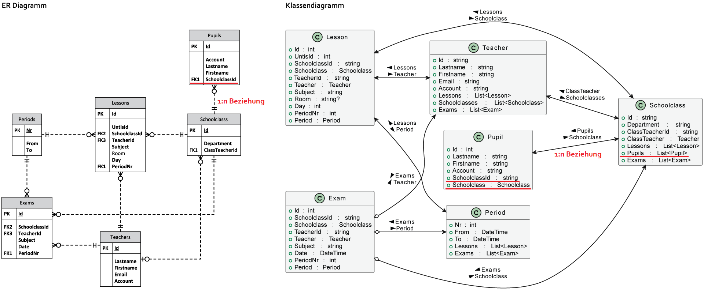
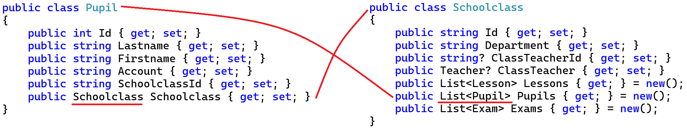

# Objektgraphen und Gruppierungen

## Datenbankmodell vs. Objektmodell

Bereits zu Beginn der objektorientierten Programmierung wird jeder mit der Beziehung zwischen 2 
Klassen konfrontiert. Es handelt sich meist um eine *Assotiation* und gibt an, dass eine Klasse
eine Andere als Member verwendet.

In Datenbanken gibt es auch Beziehungen zwischen Tabellen. Hier ist es ein Primärschlüssel, der
in anderen Tabellen als Fremdschlüssel verwendet wird, um auf einen Datensatz zu verweisen.

### Abbilden von Beziehungen: Navigations

Diese Ideen sind oberflächlich betrachtet nicht unähnlich. Gerade die Beziehungen in einer relationalen
Datenbank können leicht in der objektorientierten Programmierung nachgebildet werden. Folgendes
Beispiel zeigt eine klassische 1:n Beziehung zwischen zwei Tabellen und eine Assotiation zwischen
2 Klassen.



Die Klassen *Period*, *Schoolclass*, *Pupil*, *Teacher*, *Lesson*, *Exam* haben nur datenhaltende
Properties und werden als *POCO Klassen* (Plain old CLR objects) bezeichnet. Analog gibt es in der
Java Welt auch den Begriff *POJO*.

Alle Klassen haben *Navigation Properties*. In der Klasse *Schoolclass* gibt es eine Collection von
Pupils mit dem Namen *Pupils* (rot unterstrichen), da eine Klasse n Schüler haben kann. Umgekehrt
gibt es in der Klasse *Pupil* zwei Properties, die die Beziehung abbilden:

- Das Property *SchoolclassId* speichert den Wert des Fremdschlüssels. Es hat deshalb den Typ String
  und wird von der Datenbank befüllt.
- Das Property *Schoolclass* hat den Typ *Schoolclass*. Über dieses Property können wir zur zugehörigen
  Klasse *navigieren*. Es wird vom OR Mapper aufgebaut.
  Da dies die "1er" Seite der Beziehung ist, ist es natürlich ein einzelnes Feld und keine Liste.




### Generierung der Modelklassen: Der OR Mapper

Da die Abbildung eines Datenbankmodells in Klassen mechanische Tipparbeit ist, gibt es fertige
Bibliotheken, die diese Klassen anhand einer gegebenen Datenbank generieren: Object-relational Mapper
oder OR Mapper erlauben einen objektorientierten Zugriff auf eine Datenbank. In .NET heißt
der verwendete OR Mapper *Entity Framework*.

> Hinweis: Bei den Übungen arbeitest du schon mit einem OR Mapper (Entity Framework Core) und einer Datenbank, 
> ohne dass du es merkst. Die Klasse *ExamsDb* baut sich
> aus CSV Daten eine SQLite Datenbank auf. Sie wird im Ordner *Grouping.Application* in *Exams.db*
> geschrieben und bei jedem Programmstart neu erzeugt. Alle deine LINQ Abfragen werden daher
> schon in SQL Abfragen übersetzt.

## Modell der Exams Datenbank

Die folgenden Beispiele basieren auf einer kleinen Datenbank, in der Lehrer ihre Tests, die sie in
den Klassen haben, erfassen können. Die Schüler können dann darauf zugreifen. Das Modell sieht so
aus:


<sup>[PlantUML Source](https://www.plantuml.com/plantuml/uml/pLH1QiCm4Bpx5IBNaW-KuAOq2HH224rwwqMrjx6A9GLf3GsbVwyLhrrBSaneB_N9ExEBPcQ5vXQvmKgMII5oO22FU68IiD2vJKfuGuQQ6N4eaEN2G8P2goJ9Icujsu8HEcUVB67rTyCsXjqoeP3AbT6o1XOSOIya4BhNCRO6QxMoDR4M5cTDcHAv_E2oeroH9b-jWZtmh03p8-4nhpij6g4EXAovHSKbXFXAc65YARaeG_0-otIbC8H7XU-oGkloB1IwbXuuRf0Szlh7N2xWo0rAY2K-k57AAPppsPgZlslSRQkZA3lkN8qRQa-PJQTfpvPhdCmQ8UtvBohrqvjG7CsfGH12uMzt7Qyrt5mScIUzNpcJZRv1YvHOuArrHc5VjFQiKDWM-vDCHrFFnMjnwKRigjTtoAAydhIM7NP7u8AV-chfjTYO0R26cXyN8GKnd653HY5wGoGv6Y3SRoO1GI_1tNBS9VPNyn_Nu5vLxt6zEdS7kkpFFlLWyewASgS1BtMlcT2sCKpSeNxUoHnKNido6m00)</sup>

Über die Klasse *[ExamsDb](Grouping.Application/Model/ExamsDb.cs)* kann auf die einzelnen
Collections (und somit auf die Datenbanktabelle) zugegriffen werden.

```c#
class ExamsDb : DbContext
{
    public DbSet<Period> Periods => Set<Period>();
    public DbSet<Teacher> Teachers => Set<Teacher>();
    public DbSet<Schoolclass> Schoolclasss => Set<Schoolclass>();
    public DbSet<Pupil> Pupils => Set<Pupil>();
    public DbSet<Lesson> Lessons => Set<Lesson>();
    public DbSet<Exam> Exams => Set<Exam>();

    // ...
}
```
## Gruppierung in SQL

In SQL gibt es mit der *GROUP BY* Klausel die Möglichkeit, die Daten in Gruppen zu unterteilen.
Betrachten wir unsere Tabelle *Lesson*. Wir können nach verschiedenen Kriterien gruppieren:


Der Zweck von Gruppierungen ist meist das Aggregieren von Daten. In SQL stehen uns die
Aggregatfunktionen *COUNT()*, *MAX()*, *MIN()*, ... zur Verfügung. Diese werden dann pro Gruppe von der
Datenbank ausgewertet:


> **Hinweis:** Natürlich kann nach einer Gruppierung nicht mehr auf die einzelnen Werte zugegriffen
> werden, die nicht Teil der Gruppierung sind. Viele versuchen verzweifelt, bei einer Gruppierung
> nach der Klasse noch den Gegenstand auszugeben. Das kann natürlich nicht funktionieren, da alle
> Datensätze der Klasse bereits zu einem Wert zusammengefasst wurden. Werte, nach denen nicht gruppiert
> wird, müssen immer in einer Aggregatsfunktion stehen.

## Gruppierung in LINQ

Nach diesem Ausflug in SQL sehen wir uns die Implementierung in LINQ an.

### Technische Umsetzung mit IGrouping

Im Namespace *System.Linq* ist ein Interface *IGrouping* definiert, welches folgende Eigenschaften
hat:

```c#
public interface IGrouping<out TKey, out TElement> : IEnumerable<TElement>, IEnumerable
{
    TKey Key { get; }
}
```

Dieses Interface erweitert offensichtlich eine normale Collection (*IEnumerable*) um ein Property *Key*.
In diesem Property ist der Wert, nach dem gruppiert wird gespeichert. Ein konkretes Beispiel erklärt
den Einsatz am Besten:

```c#
var result = db.Lessons
    .GroupBy(l => l.SchoolclassId)
    .Select(g => new
    {
        Class = g.Key,
        Count = g.Count(),
        MaxHour = g.Max(x => x.PeriodNr)
    })
    .ToList();
```

Verwirrend ist hier der Einsatz der Gruppierungsvariable *g*. Sie ist eine Instanz von *IGrouping* und
somit kann über das Property *Key* auf den Gruppierungsschlüssel zugegriffen werden. Möchte man auf
die Werte in der Gruppe zugreifen, wird einfach *g* verwendet. Dadurch funktioniert der Ausdruck
*g.Max(x => x.L_Hour)* und liefert die letzte Stunde pro Klasse.


Natürlich kann auch hier nicht auf einzelne Werte zugegriffen werden. Da *g* eine Collection ist,
funktioniert der Zugriff auf *g.L_Teacher* so wie auf *data.Lessons.L_Teacher* syntaktisch nicht
(eine Collection hat kein Property *L_Teacher*).

Möchte man nach mehreren Spalten gruppieren, wird mit *new* ein neuer Typ erzeugt:

```c#
var result = db.Lessons
    .GroupBy(l => new { l.SchoolclassId, l.Subject })
    .Select(g => new
    {
        Class = g.Key.SchoolclassId,
        Subject = g.Key.Subject,
        Count = g.Count(),
        MaxHour = g.Max(x => x.PeriodNr)
    })
    .ToList();
```

Manchmal möchte man eine DISTINCT Abfrage erstellen, die nur einen Wert pro Gruppierung liefert.
Das folgende Beispiel liefert nur einen Lehrer pro eingetragener Email Adresse:

```c#
var teachersUniqueMail = db.Teachers
    .GroupBy(t => t.Email)
    .Select(g => g.First())
    .ToList();
```

## Übungen

Öffne die Datei [Grouping.sln](Grouping.sln) und schreibe deine Abfragen
statt `List<object> result = null!`
in die Variablen. Verwende *var*, damit der Compiler den anonymen Typen speichern kann.
Die korrekten Ausgaben sind folgende:

```text
RESULT1
[
    {"TeacherId":"AF","Subjects":["RISL"]},{"TeacherId":"AGU","Subjects":["AP4","WPT_4"]},
    {"TeacherId":"AH","Subjects":["NVS1","OPS"]},
    {"TeacherId":"AMA","Subjects":["AP4","ITPR","NVS1","NVS1x","NVS1y","NWT_1x","NWT_1y","NWT_4A","NWT1"]},
    {"TeacherId":"AT","Subjects":["D","Dx","RE"]},
    {"TeacherId":"BAE","Subjects":["EWD","KGKP","MTKG"]},
    {"TeacherId":"BAM","Subjects":["DBI1","POS1"]},
    {"TeacherId":"BAN","Subjects":["DBI1","DBI1y","DBI2x"]},
    {"TeacherId":"BAR","Subjects":["BMG2","FMGTK","SOPK"]},
    {"TeacherId":"BEC","Subjects":["MGAN","MPAN","SOPK"]}
]

RESULT2
[
{   "DisplayMonth":"2020-04",
    "Exams":[
        "Date":"2020-04-01T00:00:00","Teacher":"PC","Subject":"AMx"},
        "Date":"2020-04-01T00:00:00","Teacher":"PC","Subject":"AMy"},
        "Date":"2020-04-07T00:00:00","Teacher":"SH","Subject":"PRE"},
        "Date":"2020-04-08T00:00:00","Teacher":"SO","Subject":"E1y"},
        "Date":"2020-04-24T00:00:00","Teacher":"NAI","Subject":"Dy"},
        "Date":"2020-04-30T00:00:00","Teacher":"AH","Subject":"OPS"}]},
{   "DisplayMonth":"2020-07",
    "Exams":[
        "Date":"2020-07-02T00:00:00","Teacher":"BH","Subject":"NVS1"}]},
{   "DisplayMonth":"2020-05",
    "Exams":[
        "Date":"2020-05-26T00:00:00","Teacher":"BH","Subject":"OPS"}]},
{   "DisplayMonth":"2020-01",
    "Exams":[
        "Date":"2020-01-01T00:00:00","Teacher":"SO","Subject":"E1x"},
        "Date":"2020-01-08T00:00:00","Teacher":"GC","Subject":"BWM1"},
        "Date":"2020-01-16T00:00:00","Teacher":"SWH","Subject":"NVS1"}]},
{   "DisplayMonth":"2019-09",
    "Exams":[
        "Date":"2019-09-05T00:00:00","Teacher":"GC","Subject":"BWM2"},
        "Date":"2019-09-29T00:00:00","Teacher":"KSR","Subject":"GAD"},
        "Date":"2019-09-30T00:00:00","Teacher":"KUE","Subject":"PRE"}]},
{   "DisplayMonth":"2020-06",
    "Exams":[
        "Date":"2020-06-14T00:00:00","Teacher":"GC","Subject":"BWM3"},
        "Date":"2020-06-24T00:00:00","Teacher":"HAF","Subject":"BAP"}]},
{   "DisplayMonth":"2019-11",
    "Exams":[
        "Date":"2019-11-03T00:00:00","Teacher":"PUA","Subject":"IOT"},
        "Date":"2019-11-11T00:00:00","Teacher":"GRJ","Subject":"BAP"},
        "Date":"2019-11-24T00:00:00","Teacher":"NAI","Subject":"Dx"}]},
{   "DisplayMonth":"2020-02",
    "Exams":[
        "Date":"2020-02-15T00:00:00","Teacher":"GRJ","Subject":"POS1"},
        "Date":"2020-02-15T00:00:00","Teacher":"HIK","Subject":"DBI1"},
        "Date":"2020-02-22T00:00:00","Teacher":"SZ","Subject":"POS1"}]},
{   "DisplayMonth":"2019-12",
    "Exams":[
        "Date":"2019-12-04T00:00:00","Teacher":"SK","Subject":"GAD"},
        "Date":"2019-12-13T00:00:00","Teacher":"HW","Subject":"IOT"},
        "Date":"2019-12-21T00:00:00","Teacher":"TT","Subject":"PRE"},
        "Date":"2019-12-26T00:00:00","Teacher":"RA","Subject":"DBI1"}]}]

RESULT3
[
{
    "PupilId":3175,"Firstname":"Batuhan","Lastname":"Akcay",
    "Exams":[
        "Subject":"OPS","Termine":[{"TeacherId":"AH","Date":"2020-04-30T00:00:00","PeriodNr":1},{"TeacherId":"BH","Date":"2020-05-26T00:00:00","PeriodNr":9}]},
        "Subject":"NVS1","Termine":[{"TeacherId":"BH","Date":"2020-07-02T00:00:00","PeriodNr":1},{"TeacherId":"SWH","Date":"2020-01-16T00:00:00","PeriodNr":3}]},
        "Subject":"BWM1","Termine":[{"TeacherId":"GC","Date":"2020-01-08T00:00:00","PeriodNr":3}]},
        "Subject":"BWM2","Termine":[{"TeacherId":"GC","Date":"2019-09-05T00:00:00","PeriodNr":2}]},
        "Subject":"BWM3","Termine":[{"TeacherId":"GC","Date":"2020-06-14T00:00:00","PeriodNr":2}]},
        "Subject":"BAP","Termine":[{"TeacherId":"GRJ","Date":"2019-11-11T00:00:00","PeriodNr":7},{"TeacherId":"HAF","Date":"2020-06-24T00:00:00","PeriodNr":2}]},
        "Subject":"POS1","Termine":[{"TeacherId":"GRJ","Date":"2020-02-15T00:00:00","PeriodNr":7},{"TeacherId":"SZ","Date":"2020-02-22T00:00:00","PeriodNr":10}]},
        "Subject":"DBI1","Termine":[{"TeacherId":"HIK","Date":"2020-02-15T00:00:00","PeriodNr":4},{"TeacherId":"RA","Date":"2019-12-26T00:00:00","PeriodNr":5}]},
        "Subject":"IOT","Termine":[{"TeacherId":"HW","Date":"2019-12-13T00:00:00","PeriodNr":7},{"TeacherId":"PUA","Date":"2019-11-03T00:00:00","PeriodNr":10}]},
        "Subject":"GAD","Termine":[{"TeacherId":"KSR","Date":"2019-09-29T00:00:00","PeriodNr":5},{"TeacherId":"SK","Date":"2019-12-04T00:00:00","PeriodNr":6}]},
        "Subject":"PRE","Termine":[{"TeacherId":"KUE","Date":"2019-09-30T00:00:00","PeriodNr":8},{"TeacherId":"SH","Date":"2020-04-07T00:00:00","PeriodNr":3},{"TeacherId":"TT","Date":"2019-12-21T00:00:00","PeriodNr":3}]},
        "Subject":"Dx","Termine":[{"TeacherId":"NAI","Date":"2019-11-24T00:00:00","PeriodNr":1}]},
        "Subject":"Dy","Termine":[{"TeacherId":"NAI","Date":"2020-04-24T00:00:00","PeriodNr":3}]},
        "Subject":"AMx","Termine":[{"TeacherId":"PC","Date":"2020-04-01T00:00:00","PeriodNr":9}]},
        "Subject":"AMy","Termine":[{"TeacherId":"PC","Date":"2020-04-01T00:00:00","PeriodNr":9}]},
        "Subject":"E1x","Termine":[{"TeacherId":"SO","Date":"2020-01-01T00:00:00","PeriodNr":3}]},
        "Subject":"E1y","Termine":[{"TeacherId":"SO","Date":"2020-04-08T00:00:00","PeriodNr":4}]}]},
{
    "PupilId":3176,"Firstname":"Teryilla","Lastname":"Amaichigh",
    "Exams":[
        "Subject":"OPS","Termine":[{"TeacherId":"AH","Date":"2020-04-30T00:00:00","PeriodNr":1},{"TeacherId":"BH","Date":"2020-05-26T00:00:00","PeriodNr":9}]},
        "Subject":"NVS1","Termine":[{"TeacherId":"BH","Date":"2020-07-02T00:00:00","PeriodNr":1},{"TeacherId":"SWH","Date":"2020-01-16T00:00:00","PeriodNr":3}]},
        "Subject":"BWM1","Termine":[{"TeacherId":"GC","Date":"2020-01-08T00:00:00","PeriodNr":3}]},
        "Subject":"BWM2","Termine":[{"TeacherId":"GC","Date":"2019-09-05T00:00:00","PeriodNr":2}]},
        "Subject":"BWM3","Termine":[{"TeacherId":"GC","Date":"2020-06-14T00:00:00","PeriodNr":2}]},
        "Subject":"BAP","Termine":[{"TeacherId":"GRJ","Date":"2019-11-11T00:00:00","PeriodNr":7},{"TeacherId":"HAF","Date":"2020-06-24T00:00:00","PeriodNr":2}]},
        "Subject":"POS1","Termine":[{"TeacherId":"GRJ","Date":"2020-02-15T00:00:00","PeriodNr":7},{"TeacherId":"SZ","Date":"2020-02-22T00:00:00","PeriodNr":10}]},
        "Subject":"DBI1","Termine":[{"TeacherId":"HIK","Date":"2020-02-15T00:00:00","PeriodNr":4},{"TeacherId":"RA","Date":"2019-12-26T00:00:00","PeriodNr":5}]},
        "Subject":"IOT","Termine":[{"TeacherId":"HW","Date":"2019-12-13T00:00:00","PeriodNr":7},{"TeacherId":"PUA","Date":"2019-11-03T00:00:00","PeriodNr":10}]},
        "Subject":"GAD","Termine":[{"TeacherId":"KSR","Date":"2019-09-29T00:00:00","PeriodNr":5},{"TeacherId":"SK","Date":"2019-12-04T00:00:00","PeriodNr":6}]},
        "Subject":"PRE","Termine":[{"TeacherId":"KUE","Date":"2019-09-30T00:00:00","PeriodNr":8},{"TeacherId":"SH","Date":"2020-04-07T00:00:00","PeriodNr":3},{"TeacherId":"TT","Date":"2019-12-21T00:00:00","PeriodNr":3}]},
        "Subject":"Dx","Termine":[{"TeacherId":"NAI","Date":"2019-11-24T00:00:00","PeriodNr":1}]},
        "Subject":"Dy","Termine":[{"TeacherId":"NAI","Date":"2020-04-24T00:00:00","PeriodNr":3}]},
        "Subject":"AMx","Termine":[{"TeacherId":"PC","Date":"2020-04-01T00:00:00","PeriodNr":9}]},
        "Subject":"AMy","Termine":[{"TeacherId":"PC","Date":"2020-04-01T00:00:00","PeriodNr":9}]},
        "Subject":"E1x","Termine":[{"TeacherId":"SO","Date":"2020-01-01T00:00:00","PeriodNr":3}]},
        "Subject":"E1y","Termine":[{"TeacherId":"SO","Date":"2020-04-08T00:00:00","PeriodNr":4}]}]}]

RESULT4
[
    {"Day":4,"Hour":3,"ClassCount":69},{"Day":2,"Hour":4,"ClassCount":68},{"Day":3,"Hour":3,"ClassCount":67},
    {"Day":4,"Hour":2,"ClassCount":67},{"Day":3,"Hour":4,"ClassCount":67}
]

RESULT5
[{"Department":"FIT","Count":7},
{"Department":"HBG","Count":9},
{"Department":"HIF","Count":23},
{"Department":"HKU","Count":5},
{"Department":"HMN","Count":10},
{"Department":"HWI","Count":11},
{"Department":"O","Count":1},
{"Department":"VIF","Count":5},
{"Department":"AIF","Count":12},
{"Department":"BIF","Count":9},
{"Department":"CIF","Count":6},
{"Department":"CMN","Count":6},
{"Department":"KIF","Count":6},
{"Department":"KKU","Count":4},
{"Department":"BKU","Count":2}]

RESULT6
[{"Department":"HIF","Count":23},
{"Department":"HWI","Count":11},
{"Department":"AIF","Count":12}]

RESULT7
[
    {"Teacher":"AH","Subject":"OPS","LastExam":"2020-04-30T00:00:00"},
    {"Teacher":"BH","Subject":"NVS1","LastExam":"2020-07-02T00:00:00"},
    {"Teacher":"BH","Subject":"OPS","LastExam":"2020-05-26T00:00:00"},
    {"Teacher":"GC","Subject":"BWM1","LastExam":"2020-01-08T00:00:00"},
    {"Teacher":"GC","Subject":"BWM2","LastExam":"2019-09-05T00:00:00"},
    {"Teacher":"GC","Subject":"BWM3","LastExam":"2020-06-14T00:00:00"},
    {"Teacher":"GRJ","Subject":"BAP","LastExam":"2019-11-11T00:00:00"},
    {"Teacher":"GRJ","Subject":"POS1","LastExam":"2020-02-15T00:00:00"},
    {"Teacher":"HAF","Subject":"BAP","LastExam":"2020-06-24T00:00:00"},
    {"Teacher":"HIK","Subject":"DBI1","LastExam":"2020-02-15T00:00:00"},
    {"Teacher":"HW","Subject":"IOT","LastExam":"2019-12-13T00:00:00"},
    {"Teacher":"KSR","Subject":"GAD","LastExam":"2019-09-29T00:00:00"},
    {"Teacher":"KUE","Subject":"PRE","LastExam":"2019-09-30T00:00:00"},
    {"Teacher":"NAI","Subject":"Dx","LastExam":"2019-11-24T00:00:00"},
    {"Teacher":"NAI","Subject":"Dy","LastExam":"2020-04-24T00:00:00"},
    {"Teacher":"PC","Subject":"AMx","LastExam":"2020-04-01T00:00:00"},
    {"Teacher":"PC","Subject":"AMy","LastExam":"2020-04-01T00:00:00"},
    {"Teacher":"PUA","Subject":"IOT","LastExam":"2019-11-03T00:00:00"},
    {"Teacher":"RA","Subject":"DBI1","LastExam":"2019-12-26T00:00:00"},
    {"Teacher":"SH","Subject":"PRE","LastExam":"2020-04-07T00:00:00"},
    {"Teacher":"SK","Subject":"GAD","LastExam":"2019-12-04T00:00:00"},
    {"Teacher":"SO","Subject":"E1x","LastExam":"2020-01-01T00:00:00"},
    {"Teacher":"SO","Subject":"E1y","LastExam":"2020-04-08T00:00:00"},
    {"Teacher":"SWH","Subject":"NVS1","LastExam":"2020-01-16T00:00:00"},
    {"Teacher":"SZ","Subject":"POS1","LastExam":"2020-02-22T00:00:00"},
    {"Teacher":"TT","Subject":"PRE","LastExam":"2019-12-21T00:00:00"}
]
```
