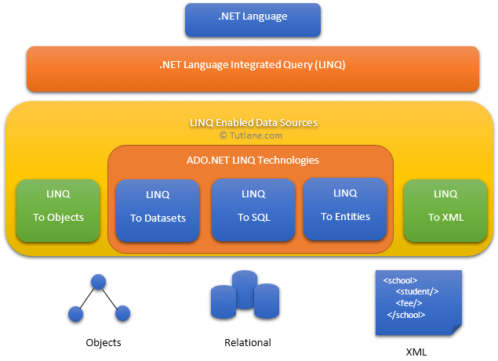

# LINQ - Language Integrated Query

LINQ (language integrated queries) sind in engerem Sinn Extension Methoden des Interfaces
*IEnumerable\<T\>*. Sie erlauben das Filtern, Sortieren, Projizieren, ... von Collections
auf funktionale Art.

Auch in anderen Sprachen gibt es solche Ansätze.

| C#                                      | Java              | JavaScript    |
|-----------------------------------------|-------------------|---------------|
| Extension Methoden von IEnumerable\<T\> | Java Streams      | Arraymethoden |
| Where                                   | filter            | filter        |
| Select                                  | map               | map           |
| SelectMany                              | flatMap           |               |
| FirstOrDefault                          | findFirst         | find          |
| Aggregate                               | reduce            | reduce        |
| ToList                                  | collect(toList()) | Array.from()  |

## Inhalt

1. [Lambda Expressions](01_Lambdas/README.md)
2. [Filterungen mit Where](02_Filterung/README.md)
3. [Projektionen mit Select](03_Projection/README.md)
4. [Gruppierungen mit GroupBy](04_GroupBy/README.md)
5. [Die Query Syntax (optional)](05_QuerySyntax/README.md)
6. [Join und Gruppierung (optional)](06_Join_Grouping/README.md)
7. [Übungsaufgaben](Uebungen/README.md)

Quelle: https://www.tutlane.com/tutorial/linq/linq-introduction-what-is-linq-why-we-use-linq

Weitere Informationen
- Filtering Data: https://docs.microsoft.com/en-us/dotnet/csharp/programming-guide/concepts/linq/filtering-data
- Projection Operations: https://docs.microsoft.com/en-us/dotnet/csharp/programming-guide/concepts/linq/projection-operations
- Join Operations: https://docs.microsoft.com/en-us/dotnet/csharp/programming-guide/concepts/linq/join-operations
- Grouping: https://docs.microsoft.com/en-us/dotnet/csharp/programming-guide/concepts/linq/grouping-data