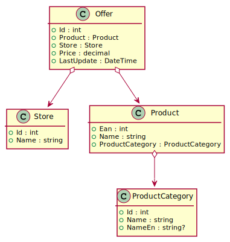
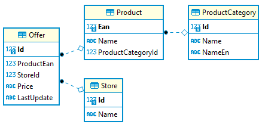
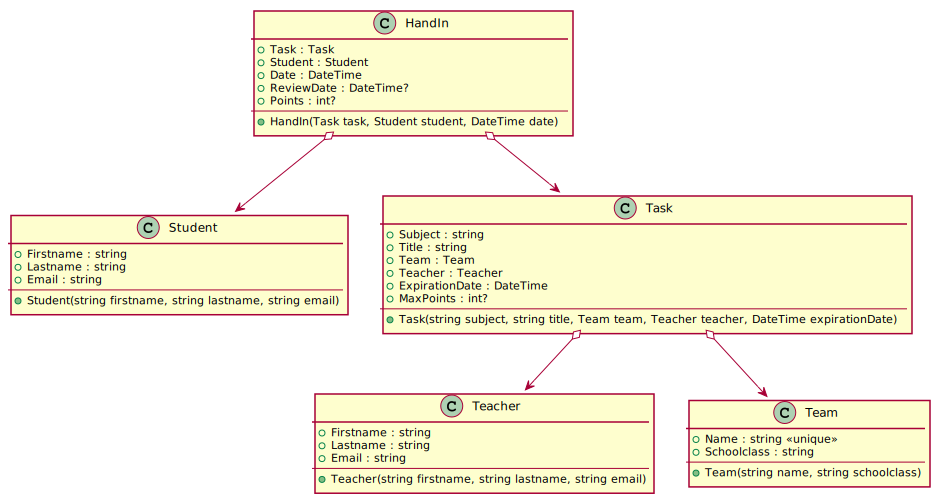
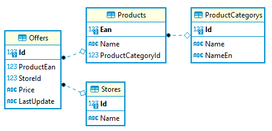

# Klassenmodelle persistieren mit EF Core

> Im Ordner [CodeFirstDemo](../CodeFirstDemo) ist ein lauffähiges Beispiel dieser Erklärungen.

## Anlegen des Musterprojektes (.NET 6)

Um ein Klassenmodell umsetzen zu können, legen wir eine kleine Solution an. Wir nutzen nun
*2 Projekte* und keine Konsolenapplikation:

- **CodeFirstDemo.Application** beinhaltet die Modelklassen und die Logik für den Datenbankzugriff.
  Mit *dotnet add package* können wir die NuGet Pakete für EF Core und Bogus (Musterdaten Generator)
  hinzufügen.
- **CodeFirstDemo.Test** beinhaltet sogenannte *Unit Tests*. Diese rufen unseren Programmcode im
  Application Projekt auf. Dafür wird eine Referenz auf das Application Projekt hinzugefügt.
- **CodeFirstDemo.sln** ist die Solution, die die 2 Projekte beinhaltet und wird in Visual
  Studio (oder Rider) gestartet.

```text
rd /S /Q CodeFirstDemo
md CodeFirstDemo
cd CodeFirstDemo
md CodeFirstDemo.Application
cd CodeFirstDemo.Application
dotnet new classlib
dotnet add package Microsoft.EntityFrameworkCore --version 6.*
dotnet add package Microsoft.EntityFrameworkCore.Sqlite --version 6.*
dotnet add package Microsoft.EntityFrameworkCore.Proxies --version 6.*
dotnet add package Bogus --version 34.*
cd ..
md CodeFirstDemo.Test
cd CodeFirstDemo.Test
dotnet new xunit
dotnet add reference ..\CodeFirstDemo.Application
cd ..
dotnet new sln
dotnet sln add CodeFirstDemo.Application
dotnet sln add CodeFirstDemo.Test
start CodeFirstDemo.sln

```

Nun stellen wir durch Doppelklick auf die Projektdatei (*CodeFirstDemo.Application*) die
Option *TreatWarningsAsErrors* ein.

```xml
	<PropertyGroup>
		<TargetFramework>net8.0</TargetFramework>
		<ImplicitUsings>enable</ImplicitUsings>
		<Nullable>enable</Nullable>
		<TreatWarningsAsErrors>true</TreatWarningsAsErrors>
	</PropertyGroup>
```

**Im Ordner [CodeFirstDemo](../CodeFirstDemo) des Kapitels *03 EF Core* befindet sich eine fertige
Applikation, die eine fertige Implementierung beinhaltet.**

### Nullable reference types und EF Core

In einer Datenbank können manche Felder NULL Werte enthalten (nullable), andere Felder werden
mit NOT NULL definiert. Wir können mit den
Datentypen steuern, ob EF Core ein Feld mit NULL oder NOT NULL anlegt. Deaktivieren wir die
nullable Features von C# 8, dreht sich die Bedeutung um und aus ihrem Modell wird ein anderes
Datenbankschema erzeugt! Wir müssen sich also schon am Beginn Ihres Projektes entscheiden, ob
wir dieses Feature aktivieren oder nicht.

Daher ist das nachträgliche Aktivieren des nullable Features bei EF Core in bestehenden
Projekten sehr gefährlich!


## Code first: Vom Klassenmodell zur Datenbank

Seit Beginn der Programmierausbildung werden Klassen und die Beziehungen zwischen diesen
Klassen als Assoziationen umgesetzt. Betrachten wir das folgende Modell. Es setzt ein kleines
Bestellsystem wie z. B. Geizhals um. Produkte werden in verschiedenen Stores zu unterschiedlichen
Preisen angeboten (offer).

  
<sup>
https://www.plantuml.com/plantuml/uml/ZP51oi8m48NtEKNsFxr05xy5xK8G5TG3X6JQ1fga9DD5aTxTb6cA146xQUQRp7jlI1LGU1nDppgjW8CPSE86i7CgCDcB4FWDdGV-P3n-VqV5IwujKdKM1c8Tq6lRifcj4vUc0VzvukgT6YL6j9u8aqT9NkccbWjI8BKHFS6J2FWObC2bSuY_kpQm69EbAuf_qdW7oOdIfN8Vfrldfryssr1jDxXZSwQOb6fXlqZb4SeyLDHU2QsGjokmAZxQ2m00
</sup>

Nun wollen wir dieses Klassenmodell speichern, also *persistieren*. Dafür stehen uns mehrere
Techniken zur Verfügung:

- Dateien (Serialisierung)
- NoSQL Datenbanken
- Relationale Datenbanken

EF Core unterstützt das Erstellen einer Datenbank, damit diese das Klassenmodell speichern kann.
Dafür schreiben wir wie gewohnt diese Klassen in C#. Um Ordnung zu halten, wird im Projekt *Application*
ein Ordner *Model* erstellt.

### Conventions und Annotations in EF Core

EF Core kann in den meisten Fällen ohne besondere Anweisungen eine Datenbank erzeugen. Das liegt
an den sogenannten *Conventions*, die wir in den nachfolgenden Klassen einhalten:

- Properties mit dem Namen *Id* werden automatisch als Primärschlüssel definiert.
- Id Properties mit dem Datentyp *int* werden automatisch zu AutoIncrement Feldern.
- Properties vom Typ *List&lt;Typname&gt;* finden "automatisch" ihren Weg in die richtige Tabelle. So
  verweist das Property *Pupils* in den vorigen LINQ Beispielen automatisch auf alle Schüler dieser Klasse.  
- Properties vom Typ *Typname* verweisen automatisch auf die Tabelle dieses Typs. So referenziert
  das Property vom Typ *Store* automatisch auf die Tabelle *Store*.
- Fremdschlüsselfelder mit dem Namen *NavigationProperty + PK Name* (wie *StoreId*) werden automatisch zum
  Fremdschlüsselfeld (in diesem Beispiel für die Tabelle *Store*).
- Über NULL oder NOT NULL entscheidet der Datentyp (bei den nullable reference types werden
  Typen mit ? am Ende zu Feldern mit der NULLABLE Eigenschaft).
- Read-only Properties werden nicht in der Datenbank abgebildet.


### Erstellen von Modelklassen: Konstruktoren verwenden

Erstellen wir die Klasse *Store*, bekommen wir durch die Option *Nullable* und *TreatWarningsAsErrors*
eine Fehlermeldung beim Property *Name*:
```c#
public class Store
{
    public int Id { get; set; }
    public string Name { get; set; }   // Error: not initialized
}
```

Wir müssen daher *Konstruktoren* verwenden, um alle Felder zu initialisieren. Allerdings sollte
nicht blind jedes Feld im Konstruktor initialisiert werden. *Id* ist ein AutoIncrement Wert
(Details unter Conventions), daher kann dieser Wert gar nicht im Konstruktor zugewiesen werden.

Die verbesserte Version sieht nun so aus:
```c#
public class Store
{
    public Store(string name)
    {
        Name = name;
    }

    public int Id { get; private set; }      // ID by convention, AutoIncrement by convention
    public string Name { get; set; }         // NOT NULL because nullable reference types are enabled
}
```

*Id* hat nun einen private setter. Da der Primärschlüssel in EF Core nicht veränderbar ist,
definieren wir alle Schlüsselfelder mit dieser Sichtbarkeit. Es macht wenig Sinn von einem
bestehenden Eintrag diesen Wert zu ändern.
Alle anderen Properties haben einen public setter, da wir die Spalten in der Datenbank ja auch
ändern wollen (UPDATE Befehl). Wir bestimmen also, welche Properties wir im Programmverlauf
aktualisieren dürfen. Warum wir nicht nur *get* verwenden ist in den Conventions erklärt.

### Optionale Werte

Die Klasse ProductCategory hat ein Property *NameEn* (englischer Name). Diese Spalte ist optional,
darf also den Wert NULL enthalten. Bei aktivierten nullable reference Types legen wir diese Spalte
daher mit dem Datentyp *string?* an. Sollen optionale int, DateTime, ... Werte gespeichert werden,
wird der entsprechende nullable Datentyp (int?, DateTime?, ...) verwendet. 

```c#
  public class ProductCategory
  {
      public ProductCategory(string name)
      {
          Name = name;
      }

      public int Id { get; private set; }      // ID by convention, AutoIncrement by convention
      public string Name { get; set; }        
      public string? NameEn { get; set; }      // nullable
  }
```

Im Konstruktor wird das Property *NameEn* nicht initialisiert. Es kann über den Initializer
bei Bedarf gesetzt werden:

```c#
var cat = new ProductCategory(name: "Spielzeug") {NameEn = "Toys"};
```

Es ist auch möglich, ein *Argument mit default value* zu dafür zu definieren. Diese Form hat den Vorteil, dass
das zusätzliche Property *nameEn* in IntelliSense erscheint. Durch den default value muss kein
Wert angegeben werden, d. h. der Konstruktor von ProductCategory kann auch mit einem Argument
aufgerufen werden.

```c#
  public class ProductCategory
  {
      public ProductCategory(string name, string? nameEn = null)
      {
          Name = name;
          NameEn = nameEn;
      }

      public int Id { get; private set; }      // ID by convention, AutoIncrement by convention
      public string Name { get; set; }        
      public string? NameEn { get; set; }      // nullable
  }
```


### Navigationen

Das Produkt (Klasse *Product*) verwendet die Klasse *ProductCategory*. Dies ist im Klassenmodell
durch die Verwendung des Typs *ProductCategory* leicht ersichtlich. In einer relationalen
Datenbank kennen wir das Konzept des Fremdschlüssels. Möchten wir Produkte und Kategorien speichern,
würde die Produkttabelle einfach eine Spalte für den Fremdschlüssel (der Kategorie ID) beinhalten.

Beim Definieren der Modelklasse müssen wir dies beachten. Daher legen wir 2 Felder für die
Produktkategorie an: die eigentliche Navigation (*ProductCategory* vom Typ *ProductCategory*)
und ein Feld *ProductCategoryId* vom Typ *int*.

> **Achtung:** Das Fremdschlüsselfeld muss eine bestimmte Namensgebung haben.
> *Navigation Property + Propertyname des Primärschlüssels*. In diesem Fall ist *ProductCategory* der
> Name des Navigation Properties und *Id* der Name des Schlüssels von *ProductCategory*.
> Der Datentyp muss natürlich auch
> dem Datentyp des Primärschlüssels von ProductCategory entsprechen (int). Ansonsten wird das
> Feld nicht als Fremdschlüssel erkannt und hat immer den Wert 0.

Da der Schlüssel *Ean* heißt, greift die Convention (Id als Schlüsselname) nicht mehr. Wir müssen
daher mit Annotations aus dem Namespace *System.ComponentModel.DataAnnotations* das jeweils
nachfolgende Property genauer definieren. Damit der int Wert für die EAN Nummer nicht als
auto increment Wert angelegt wird, setzen wir diese Information mittels der Annotation
*DatabaseGenerated(DatabaseGeneratedOption.None)*

```c#
public class Product
{
    public Product(int ean, string name, ProductCategory productCategory)
    {
        Ean = ean;
        Name = name;
        ProductCategoryId = productCategory.Id;
        ProductCategory = productCategory;
    }

    // Ean is the PK and not an auto increment column. Annotations are used
    // for the next property (ean)
    [Key]
    [DatabaseGenerated(DatabaseGeneratedOption.None)]
    public int Ean { get; private set; }
    public string Name { get; set; }
    public int ProductCategoryId { get; set; }            // Value of the FK
    public ProductCategory ProductCategory { get; set; }  // Navigation property
}
```

Der Konstruktor von Product verlangt diesmal den Primärschlüssel (die EAN), da dieser Wert
von externen Quellen kommt und nicht in der Datenbank generiert wird. Für die Navigation
verlagen wir nur die Instanz von *ProductCategory*. Den Id Wert für das Fremdschlüsselfeld
können wir aus dieser Instanz lesen und müssen es daher nicht als extra Argument anführen.

Nun fehlt noch die Klasse *Offer*, die mit bestehendem Wissen angelegt werden kann:

```c#
public class Offer
{
    public Offer(Product product, Store store, decimal price, DateTime lastUpdate)
    {
        Product = product;
        ProductEan = product.Ean;
        Store = store;
        StoreId = store.Id;
        Price = price;
        LastUpdate = lastUpdate;
    }

    public int Id { get; private set; }
    public int ProductEan { get; set; }     // FK for Product
    public Product Product { get; set; }
    public int StoreId { get; set; }        // FK for Store
    public Store Store { get; set; }
    public decimal Price { get; set; }
    public DateTime LastUpdate { get; set; }
}
```

### Anlegen von protected Konstruktoren

Zum Abschluss müssen wir noch eine Besonderheit von EF Core berücksichtigen. EF Core versucht
beim Lesen eines Datensatzes eine Instanz der entsprechenden Klasse zu erzeugen. Dafür braucht es
aber einen Default Kontruktor. Diese Default Konstruktoren wollen wir allerdings vermeiden. Ein
guter Weg ist das Anlegen dieses Konstruktors als private oder protected Konstruktor. Damit kann
niemand mit *new Store()* ein uninitialisiertes Store Objekt anlegen. Wir verwenden protected,
da wir im nächsten Kapitel auch Vererbung verwenden wollen.

Legen wir nun einen Default Konstruktor an, ergeben sich aufgrund des aktivierten nullable
Features Warnungen bzw. Fehlermeldungen. Wir können aber in diesem Fall mit einer etwas seltsamen
Anweisung Warnungen unterdrücken. In Visual Studio können die *#pragma* Anweisungen mit
*STRG + .* und *Suppress or Configure issues* - *Suppress CS8618 in Source Code* deaktiviert werden.

> **Hinweis:** Das Unterdrucken von Warnungen ist nur gerechtfertigt, wenn wir mit Sicherheit
> ausschließen können, dass dadurch ein Laufzeitfehler entsteht. EF Core garantiert das Initialisieren
> der Felder, daher kann diese Technik hier verwendet werden.

```c#
public class Store
{
    public Store(string name)
    {
        Name = name;
    }
    #pragma warning disable CS8618
    protected Store() { }
    #pragma warning restore CS8618
    public int Id { get; private set; }
    public string Name { get; set; }
}
```

## Anlegen der Datenbank: Der Datenbankkontext

Damit eine Datenbank erzeugt werden kann, brauchen wir einen *Datenbankkontext*. Er ist die
Verbindung zur darunterliegenden Datenbank. Dafür legen wir einen Ordner *Infrastructure* an und
erstellen eine Klasse *StoreContext*. Die Klasse kann beliebig benannt werden, die Endung *Context*
hat sich aber bei .NET Entwicklern durchgesetzt.

```c#
public class StoreContext : DbContext
{
    public StoreContext(DbContextOptions opt) : base(opt) { }

    public DbSet<Store> Stores => Set<Store>();
    public DbSet<Offer> Offers => Set<Offer>();
    public DbSet<Product> Products => Set<Product>();
    public DbSet<ProductCategory> ProductCategories => Set<ProductCategory>();
}
```

Wir erkennen 2 Dinge:

- Es gibt einen Konstruktor, der eine Konfiguration verlangt. Diese Konfiguration gibt an, welche
  Datenbank verwendet werden soll.
- Jede Tabelle wird als *DbSet\<T\>* definiert. Sie geben einfach mit der *Set()* Methode die
  entsprechende Tabelle zurück.

## Schreiben eines Tests zum Anlegen der Datenbank

Wir können das Programm zwar kompilieren, es wird aber nie ausgeführt. Das Projekt *Application*
ist eine Klassenbibliothek und hat daher keine *Main()* Methode. Um den Code aufzurufen, verwenden
wir ein in der Softwareentwicklung sehr bekanntes Werkzeug: Der Unittest.

Unittests sind dafür da, Code aufzurufen und das Ergebnis mit einem erwarteten Wert zu vergleichen.

Zu Beginn haben wir bereits ein Projekt *CodeFirstDemo.Test* angelegt. Nun legen wir eine Klasse
*StoreContextTests* darin an. Die Namensgebung sollte immer *zu testende Klasse* + *Tests* sein.

Die Logik zur Erstellung der Datenbankverbindung geben wir in eine gemeinsame Basisklasse *DatabaseTest*.
Sie erstellt im Konstruktor eine SQLite Datenbank. Damit nach dem Unittest alle Ressourcen
geschlossen werden, implementiert diese Klasse das Interface *IDisposeable*.

**DatabaseTest.cs**
```c#
public class DatabaseTest : IDisposable
{
    protected readonly StoreContext _db;

    public DatabaseTest()
    {
        var opt = new DbContextOptionsBuilder()
            .UseSqlite("Data Source=Stores.db")
            .Options;

        _db = new StoreContext(opt);
    }
    public void Dispose()
    {
        _db.Dispose();
    }
}
```

Nun implementieren wir die eigentliche Testklasse *StoreContextTests*. Sie erbt von *DatabaseTest*,
daher steht die Membervariable *_db* zur Verfügung. Dieser Test prüft nur, ob die Anweisung ohne
Exception ausgeführt werden kann.

**StoreContextTests.cs**
```c#
[Collection("Sequential")] // A file database does not support parallel test execution.
public class StoreContextTests : DatabaseTest
{
    [Fact]
    public void CreateDatabaseTest()
    {
        _db.Database.EnsureCreated();
    }
}
```

Bis jetzt haben wir nirgends gesagt, welche Datenbank wir verwenden wollen. Nun müssen wir dies
angeben. Dafür verwenden wir die Klasse *DbContextOptionsBuilder()* aus dem Namespace
*Microsoft.EntityFrameworkCore*. EF Core arbeitet datenbankenunabhängig. Wir verwenden mit
*UseSqlite()* eine SQLite Datenbank. Mit *UseMysql()* z. B. können wir jederzeit auch eine MySQL
Datenbank erzeugen. Der Provider abstrahiert datenbankspezifische Anweisungen wie das Erstellen
von Autoincrement Werten und die Definition der SQL Datentypen.

3 Dinge sind zudem noch wichtig:

- Die Testklasse und die Testmethode muss public sein.
- Über jeder Testmethode muss die Annotation *[Fact]* aus dem Namespace *Xunit* geschrieben werden.
- Tests werden normalerweise parallel ausgeführt. Da wir die Filedatenbank jedoch immer löschen
  und neu erzeugen, ist eine parallele Ausführung nicht möglich. *[Collection("Sequential")]*
  konfiguriert xUnit so, dass die Tests nacheinander ausgeführt werden.

Klicken wir mit der rechten Maustaste in Visual Studio auf die Testmethode *CreateDatabaseTest*
finden wir im Kontextmenü den Punkt *Run Tests*. Nach erfolgreicher Ausführung erscheint ein
grünes Häkchen. Im Text Explorer (Menü *Test* - *Test Explorer*) ist der Test ebenfalls
aufgelistet.

### Nutzen einer in-memory SQLite Datenbank

SQLite Datenbanken können auch vollständig im Speicher gehalten werden. Gerade für Unittests
ergeben sich mehrere Vorteile:

- Das Erstellen und befüllen der Datenbank ist natürlich viel schneller.
- Die Datenbank wird immer "frisch", also leer bei einer neuen Verbindung erstellt. Dadurch
  beeinflussen sich die Tests nicht.

Im Programm [CodeFirstDemo](../CodeFirstDemo/CodeFirstDemo.Test) werden die Unittests mit einer
in-memory durchgeführt. Hier sind auch Infos über den Connectionstring und die Besonderheiten
im Code abgebildet.

## Ansehen der Datenbank in DBeaver

Nachdem der Unittest ausgeführt wurde, findet sich im Ordner *CodeFirstDemo.Test\bin\Debug\net6.0*
die Datei *Stores.db*. Zum Betrachten der Datenbank kann z. B. DBeaver (https://dbeaver.io/)
verwendet werden. Öffnen wir mit DBeaver die Datenbank und klicken doppelt auf *Tables*,
kann das ER Diagramm der erstellen Datenbank angezeigt werden:



Die Fremdschlüssel wurden also korrekt gesetzt. Sehen wir uns die DDL Statements der Tabelle
*Stores* an, findet sich ein klassisches *CREATE TABLE* Statement, wie es auch von Hand
geschrieben worden wäre:

```sql
CREATE TABLE "ProductCategories" (
    "Id" INTEGER NOT NULL CONSTRAINT "PK_ProductCategories" PRIMARY KEY AUTOINCREMENT,
    "Name" TEXT NOT NULL,
    "NameEn" TEXT NULL
);

CREATE TABLE "Products" (
    "Ean" INTEGER NOT NULL CONSTRAINT "PK_Products" PRIMARY KEY,
    "Name" TEXT NOT NULL,
    "ProductCategoryId" INTEGER NOT NULL,
    CONSTRAINT "FK_Products_ProductCategories_ProductCategoryId" FOREIGN KEY ("ProductCategoryId") REFERENCES "ProductCategories" ("Id") ON DELETE CASCADE
);
```

Falls Fehler in der Datenbank auftreten, können die Modelklassen einfach geändert und mittels
Unittest die Datenbank neu erzeugt werden.

> **Achtung:** Trenne in DBeaver vor dem Starten des Unittests die Verbindung (roter Stecker). Sonst
> kann der Test die Datenbank nicht löschen und bricht mit einem Zugriffsfehler ab.

## Übung

Lege wie unten beschrieben eine Solution mit dem Namen *TeamsManager.sln* und 2
Projekte (*TeamsManager.Application* und *TeamsManager.Test*) an. Vergiss nicht,
die Option *\<TreatWarningsAsErrors\>true\</TreatWarningsAsErrors\>* in der Projektdatei 
zu setzen.

Eine kleine
Datenbank soll erzeugt werden, um Abgaben in MS Teams verwalten zu können. Dabei können
pro Team mehrere Aufgaben (Tasks) definiert werden. Für Aufgaben können Studenten
Arbeiten einrechen (HandIn).


<sup>
https://www.plantuml.com/plantuml/uml/hPB1JiCm38RlVGeVXzQ-09h63e100eJONi2qXWMI51eN9asyEt7TZ6mQ9xZ4wH_P__TRNGJ6ZdjdYzfY2B3alY7Fi2q0ffUc2-pH4Pn2uCxuPr5ly8XuuT3ONAcgIlHntaHrU4eJInWLYmS2oQIJugiOYLQ4zPgwVoCQv_sDo2dENMuAirdlpNjFy_cGl5wthTMEenGk8UoPXP-smJ9vOdXLpsN_-48rxsLT6RPvUfqV1IbPQ5NaDcneysOwPDFwSsHfbx8oZkJn5ZVthV4iyB6SPUWH9Q47XTdHiu2KkY6EHvdyWBMMEnEWFNi9godRgfehUFwjxMaTL-YRQm_Rn1CXfMH_N5J6cuX70ZxGXw7FWmU9EVqbjtfE1ZkEHvaC86ZDiZLZ8ktH20adqnHwGRxfdVq6
</sup>

Das Klassenmodell zeigt keine EF Core spezifischen Properties wie Fremdschlüsselfelder.
Überlege auch einen passenden primary key (auto increment Wert oder ein vorhandenes
Property).

Definiere die public Konstruktoren so, dass die benötigten Informationen bei der
Initialisierung übergeben werden müssen. Für EF Core sind dann protected Konstruktoren
ohne Parameter anzulegen.

Der Kontext soll den Namen *TeamsContextTests* haben. Weiter unten ist der Mustercode
für die Definition der Klasse. Er beinhaltet auch eine Methode *Seed()*, die die Datenbank
mit Musterdaten füllt.

Erstelle danach eine Testklasse im Unittest Projekt mit dem Namen *TeamsContextTests*. Kopiere
den Code weiter unten in diese Testklasse. Sie beinhaltet 2 Tests:

- *CreateDatabaseSuccessTest()* versucht, eine leere Datenbank anzulegen.
- *SeedDatabaseTest()* versucht, Musterdaten zu generieren und die Datenbank zu befüllen.

Es müssen beide Tests erfolgreich durchlaufen. Führe die Tests zur Sicherheit nacheinander
aus, um Zugriffskonflikte bei der Datenbank zu vermeiden.

Nach dem Test *CreateDatabaseSuccessTest* soll das ER Modell der Datenbank in DBeaver so
aussehen. Die Datenbank wird in *TeamsManager.Test\bin\Debug\net6.0* unter dem Namen
*Teams.db* angelegt.



> **Hinweis:** Die Klasse *Task* kommt im Namespace System.Threading.Task ebenfalls vor.
> Bei mehrdeutigen Referenzen muss der volle Klassenname (*Model.Task*) angegeben werden.

### Anlegen des Projektes

```text
rd /S /Q TeamsManager
md TeamsManager
cd TeamsManager
md TeamsManager.Application
cd TeamsManager.Application
dotnet new classlib
dotnet add package Microsoft.EntityFrameworkCore --version 6.*
dotnet add package Microsoft.EntityFrameworkCore.Sqlite --version 6.*
dotnet add package Microsoft.EntityFrameworkCore.Proxies --version 6.*
dotnet add package Bogus --version 34.*
cd ..
md TeamsManager.Test
cd TeamsManager.Test
dotnet new xunit
dotnet add reference ..\TeamsManager.Application
cd ..
dotnet new sln
dotnet sln add TeamsManager.Application
dotnet sln add TeamsManager.Test
start TeamsManager.sln

```

### Kontextklasse
```c#
using Bogus;
using Microsoft.EntityFrameworkCore;
using System;
using System.Linq;
using TeamsManager.Application.Model;

namespace TeamsManager.Application.Infrastructure
{
    public class TeamsContext : DbContext
    {
        public TeamsContext(DbContextOptions opt) : base(opt) { }
        /* TODO: Add your DbSets here */

        public void Seed()
        {
            Randomizer.Seed = new Random(2145);

            var teachers = new Faker<Teacher>("de").CustomInstantiator(f => new Teacher(
                firstname: f.Name.FirstName(),
                lastname: f.Name.LastName(),
                email: f.Internet.Email()))
                .Generate(10)
                .ToList();
            Teachers.AddRange(teachers); SaveChanges();

            var students = new Faker<Student>("de").CustomInstantiator(f => new Student(
                firstname: f.Name.FirstName(),
                lastname: f.Name.LastName(),
                email: f.Internet.Email()))
                .Generate(10)
                .ToList();
            Students.AddRange(students); SaveChanges();

            var teams = new Faker<Team>("de").CustomInstantiator(f => new Team(
                name: f.Commerce.ProductName(),
                schoolclass: $"{f.Random.Int(1, 5)}{f.Random.String2(1, "ABC")}HIF"))
                .Generate(10)
                .ToList();
            Teams.AddRange(teams); SaveChanges();

            var tasks = new Faker<Task>("de").CustomInstantiator(f => new Task(
                subject: f.Commerce.ProductMaterial(),
                title: f.Commerce.ProductAdjective(),
                team: f.Random.ListItem(teams),
                teacher: f.Random.ListItem(teachers),
                expirationDate: new DateTime(2021, 1, 1).AddDays(f.Random.Int(0, 4 * 30))))
                .Rules((f, t) => t.MaxPoints = f.Random.Int(16, 48).OrNull(f, 0.5f))
                .Generate(10)
                .ToList();
            Tasks.AddRange(tasks); SaveChanges();


            var handIns = new Faker<HandIn>("de").CustomInstantiator(f => new HandIn(
                task: f.Random.ListItem(tasks),
                student: f.Random.ListItem(students),
                date: new DateTime(2021, 1, 1).AddDays(f.Random.Int(0, 4 * 30))))
                .Rules((f, h) =>
                {
                    var reviewDate = h.Date.AddDays(f.Random.Int(1, 7)).OrNull(f, 0.5f);
                    h.ReviewDate = reviewDate;
                    h.Points = reviewDate.HasValue && h.Task.MaxPoints.HasValue ? f.Random.Int(0, h.Task.MaxPoints.Value) : null;
                })
                .Generate(20)
                .ToList();
            HandIns.AddRange(handIns); SaveChanges();
        }
    }

}

```

### Unittest
```c#
using Microsoft.EntityFrameworkCore;
using System.Linq;
using TeamsManager.Application.Infrastructure;
using Xunit;

namespace TeamsManager.Test
{
    [Collection("Sequential")]
    public class TeamsContextTests
    {
        private TeamsContext GetDatabase(bool deleteDb = false)
        {
            var db = new TeamsContext(new DbContextOptionsBuilder()
                 .UseSqlite("Data Source=Teams.db")
                 .Options);
            if (deleteDb)
            {
                db.Database.EnsureDeleted();
                db.Database.EnsureCreated();
            }
            return db;
        }
        [Fact]
        public void CreateDatabaseSuccessTest()
        {
            using var db = GetDatabase(deleteDb: true);
        }

        [Fact]
        public void SeedDatabaseTest()
        {
            using var db = GetDatabase(deleteDb: true);
            db.Seed();
            // Multiple assert statements should be avoided in real unit tests, but in this case
            // the database is tested, not the program logic.
            Assert.True(db.Students.Count() == 10);
            Assert.True(db.Teams.Count() == 10);
            Assert.True(db.Teachers.Count() == 10);
            Assert.True(db.HandIns.Count() == 20);
            Assert.True(db.Tasks.Count() == 10);
        }
    }
}

```

### Ausführen der Tests

Gehe zur Kontrolle in der Konsole in das Verzeichnis des Testprojektes. Mit

```text
dotnet test -l "console;verbosity=normal"
```

können von der Kommandozeile aus alle Tests ausgeführt werden. Die Ergebnisse werden über den
Logger auf die Konsole geschrieben. Dieser Befehl funktioniert in dieser Form ab .NET 6.