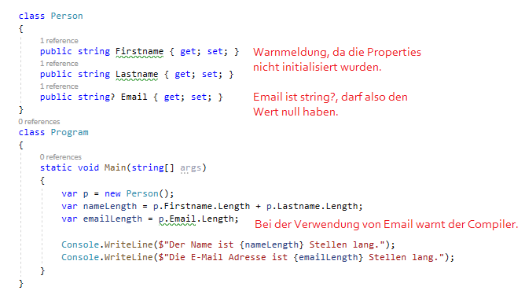
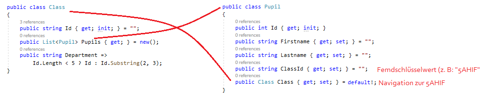
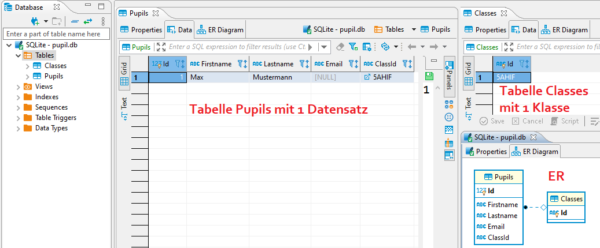
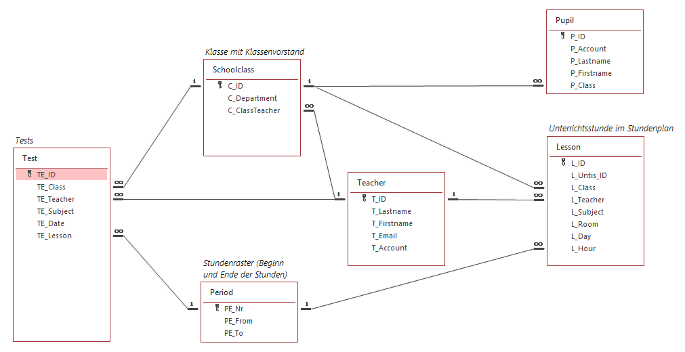

# Code first mit EF Core 5 und C# 9

## Konfiguration des Projektes: Nullable reference Types

Mit C# 8 wurden die *nullable reference types* eingeführt. Der Vorteil ist, dass der Compiler eine
Warnung ausgibt, wenn auf Methoden oder Properties von Objekten zugegriffen wird, die null sein
könnten:

```c#
class Person
{
    public string Firstname { get; set; }
    public string Lastname { get; set; }
}
class Program
{
    static void Main(string[] args)
    {
        var p = new Person();
        var nameLength = p.Firstname.Length + p.Lastname.Length;

        Console.WriteLine($"Der Name ist {nameLength} Stellen lang");
    }
}
```

Dieses Programm liefert einen Laufzeitfehler, da *Firstname* und *Lastname* den Wert *null* haben.
Um solche Situationen zu vermeiden, kann für das Projekt durch Doppelklicken auf den Projektnamen
die *Nullable* Option gesetzt werden:

```xml
<Project Sdk="Microsoft.NET.Sdk">

  <PropertyGroup>
    <OutputType>Exe</OutputType>
    <TargetFramework>net5.0</TargetFramework>
    <Nullable>enable</Nullable>
  </PropertyGroup>
</Project>
```

Nach der Aktivierung entstehen auf einmal grün unterlegte Warnungen in Visual Studio:



- *Firstname* und *Lastname* haben den Datentyp string (ohne ?). Das bedeutet, dass sie nicht
  *null* sein dürfen.
- *Email* hat den Datentyp *string?*. Das bedeutet, dass die Email Adresse *null* sein darf.
- Bei der E-Mail entsteht zwar keine Warnung in der Deklaration der Klasse, jedoch wird beim
  Abfragen der Länge eine Warnung angezeigt.

Wie können wir nun den Compiler zufrieden stellen? Indem wir - wie es auch bei "klassischen"
Programmen sein sollte - initialisieren bzw. eine Abfrage auf *null* einbauen.

```c#
class Person
{
    public string Firstname { get; set; } = "";
    public string Lastname { get; set; } = "";
    public string? Email { get; set; }
}

class Program
{
    static void Main(string[] args)
    {
        var p = new Person();
        var nameLength = p.Firstname.Length + p.Lastname.Length;
        Console.WriteLine($"Der Name ist {nameLength} Stellen lang.");

        if (!string.IsNullOrEmpty(p.Email))
        {
            var emailLength = p.Email.Length;
            Console.WriteLine($"Die E-Mail Adresse ist {emailLength} Stellen lang.");
        }
    }
}
```

Der Compiler führt also eine Codeanalyse durch und erkennt, dass das Feld Email innerhalb der
*if* Abfrage nicht null sein kann. Diese "Intelligenz" liegt in der Dekleration der Methode
*IsNullOrEmpty* im .NET Framework:

```c#
public static bool IsNullOrEmpty([NotNullWhen(false)] String? value);
```

> Was hat das nun mit EF Core und Datenbankzugriff zu tun? In einer Datenbank können manche Felder
> NULL Werte enthalten (nullable), andere Felder werden mit NOT NULL definiert. Sie können mit den
> Datentypen steuern, ob EF Core ein Feld mit NULL oder NOT NULL anlegt. Deaktivieren Sie die
> nullable Features von C# 8, dreht sich die Bedeutung um und aus ihrem Modell wird ein anderes
> Datenbankschema erzeugt! Sie müssen sich also schon am Beginn Ihres Projektes entscheiden, ob
> Sie dieses Feature aktivieren oder nicht.

## Was ist "Code first"

Wir betrachten wieder unseren "Klassiker": Eine Schulklasse, die aus mehreren Schülern besteht.
In C# können wir diesen Sachverhalt mittels 2 Klassen abbilden:



- *Class* hat eine Liste von Schülern (1:n)
- *Pupil* hat einen Verweis auf die Klasse des Schülers (Property *Class*)
- Zusätzlich wird noch der Name der Klasse im Property *ClassId* gespeichert.
- Das Property *Pupil.Class* wird mit dem Wert *default!* initialisiert. Rufzeichen ist der null
  forgiving Operatior. Er bedeutet: "Wir kümmern uns selbst, dass dieser Wert nicht null sein wird".

### Neuigkeiten in C# 9: init und new()

Diese Klassen verwenden bereits neue Sprachfeatures von C# 9: *init* und *new()*.

Mit dem Schlüsselwort *new()* ersparen wir uns z. B. in der Klasse *Class* die Angabe von
*new List<Pupil>();*. Der Compiler weiß aufgrund der linken Seite, welche Instanz zu erzeugen ist.

Statt *set* wird bei Properties manchmal *init* verwendet. Es bedeutet, dass wir den Wert nur im
Initializer setzen dürfen. So ist es möglich, die Klassen-ID bei der Initialisierung zu setzen. Im
weiteren Programmverlauf darf sie allerdings nicht mehr verändert werden.

```c#
var @class = new Class { Id = "5AHIF" };     // @class, da class ein reserviertes Wort ist.
@class.Id = "4AHIF";                         // Compilerfehler
```

Gerade bei Primärschlüsseln ist eine Änderung heikel bzw. wird von EF Core nicht unterstützt.
Deswegen verwenden wir dieses Schlüsselwort bei den Schlüsselfeldern.

## Aus Klassen wird eine Datenbank: Der DbContext

Bevor wir aus den Klassen eine Datenbank erzeugen können, müssen wir EF Core und den Provider für
SQLite über die NuGet Packet Manager Console (*Tools* - *NuGet Packet Manager*) installieren:

```text
Install-Package Microsoft.EntityFrameworkCore
Install-Package Microsoft.EntityFrameworkCore.Sqlite
```

Nun erzeugen wir eine neue Klasse *PupilContext*. Sie repräsentiert die Datenbank mit ihren Tabellen.
In dieser Klasse wird jede Tabelle als *DbSet* angelegt. Später können wir dann mit *db.Tabellenname*
auf diese Tabelle zugreifen und mittels LINQ Abfragen die Daten aus der Datenbank holen.

```c#
public class Class
{
    public string Id { get; init; } = "";
    public List<Pupil> Pupils { get; } = new();
    public string Department =>
        Id.Length < 5 ? Id : Id.Substring(2, 3);
}

public class Pupil
{
    public int Id { get; init; }
    public string Firstname { get; set; } = "";
    public string Lastname { get; set; } = "";
    public string? Email { get; set; }
    public string ClassId { get; set; } = "";
    public Class Class { get; set; } = default!;
}

public class PupilContext : DbContext
{
    public DbSet<Class> Classes => Set<Class>();
    public DbSet<Pupil> Pupils => Set<Pupil>();

    protected override void OnConfiguring(DbContextOptionsBuilder optionsBuilder)
    {
        optionsBuilder.UseSqlite("Data Source=Pupil.db");
    }
}

class Program
{
    static void Main(string[] args)
    {
        // Mit EnsureDeleted wird die Datenbank gelöscht, danach wird mit EnsureCreated
        // die Datenbank basierend auf den Modelklassen neu erstellt. Wird die Datenbank nicht
        // gelöscht, werden Änderungen nicht übernommen (da die Datenbank ja schon existiert).
        using (var db = new PupilContext())
        {
            db.Database.EnsureDeleted();
            db.Database.EnsureCreated();

            var myClass = new Class
            {
                Id = "5AHIF",
                Pupils =
                {
                    new Pupil{Firstname = "Max", Lastname = "Mustermann"}
                }
            };
            db.Classes.Add(myClass);
            db.SaveChanges();
        }
    }
}

```

Wenn wir dieses Programm ausführen, entsteht eine SQLite Datei *Pupil.db*. Betrachten wir
diese Datei in einem Datenbankeditor wie DBeaver, so sehen wir, dass der OR Mapper ganze Arbeit
geleitet hat:

- Es sind 2 Tabellen entstanden: *Pupils* und *Classes*
- Im ER Diagramm ist sichtbar, dass die Fremdschlüssel richtig abgebildet wurden.



## Conventions und Annotations in EF Core

EF Core hat von sich aus eine vernünftige Datenbank aufbauen können. Das liegt an den sogenannten
*Conventions", die wir heimlich in den Klassen eingehalten haben.

- Properties mit dem Namen *Id* werden automatisch als Primärschlüssel definiert.
- Id Properties mit dem Datentyp *int* werden automatisch zu AutoIncrement Feldern.
- Properties vom Typ *List&lt;Typname&gt;* finden "automatisch" ihren Weg in die Richtige Tabelle. So
  verweist das Property *Pupils* automatisch auf alle Schüler dieser Klasse.  
- Properties vom Typ *Typname Propertyname* verweisen automatisch auf die "1er Seite". So referenziert
  *Class Class* automatisch auf die Klasse des Schülers.
- Fremdschlüsselfelder mit dem Namen *Navigation+Id* (wie *ClassId*) werden automatisch mit der
  Navigation (Property *Class*) verbunden.
- Über NULL oder NOT NULL entscheidet der Datentyp (bei den nullable reference types werden
  Typen mit ? am Ende zu Feldern mit der NULLABLE Eigenschaft).
- Read-only Properties (wie *Department*) werden nicht in der Datenbank abgebildet.

```sql
CREATE TABLE "Pupils" (
    "Id" INTEGER NOT NULL CONSTRAINT "PK_Pupils" PRIMARY KEY AUTOINCREMENT,
    "Firstname" TEXT NOT NULL,
    "Lastname" TEXT NOT NULL,
    "Email" TEXT NULL,
    "ClassId" TEXT NOT NULL,
    CONSTRAINT "FK_Pupils_Classes_ClassId" FOREIGN KEY ("ClassId") REFERENCES "Classes" ("Id") ON DELETE CASCADE
);
```

Manchmal wollen wir allerdings in die Generierung der Datenbank eingreifen. Folgende Fälle werden
häufig gebraucht:

- Wir wollen den Tabellennamen steuern (Statt *Classes* wollen wir *Class*).
- Bei Stringfeldern wollen wir eine Länge angeben, damit die Datenbank den entsprechenden *VARCHAR(n)*
  Typ verwendet.

Diese Szenarien werden mit sogenannten *Annotations* in den Modelklassen abgebildet:

```c#
[Table("Class")]                   // Erzeugt die Tabelle "Class"
public class Class
{
    [MaxLength(8)]                 // Erzeugt VARCHAR(8)
    public string Id { get; init; } = "";
    public List<Pupil> Pupils { get; } = new();
    public string Department =>
        Id.Length < 5 ? Id : Id.Substring(2, 3);
}

[Table("Pupil")]
public class Pupil
{
    public int Id { get; init; }
    [MaxLength(255)]
    public string Firstname { get; set; } = "";
    [MaxLength(255)]
    public string Lastname { get; set; } = "";
    [MaxLength(255)]
    public string? Email { get; set; }
    [MaxLength(8)]                // Entspricht ID in der Klasse Class
    public string ClassId { get; set; } = "";
    public Class Class { get; set; } = default!;
}

public class PupilContext : DbContext
{
    public DbSet<Class> Classes => Set<Class>();
    public DbSet<Pupil> Pupils => Set<Pupil>();

    protected override void OnConfiguring(DbContextOptionsBuilder optionsBuilder)
    {
        optionsBuilder.UseSqlite("Data Source=Pupil.db");
    }
}
```

## Übung

Setzen Sie das folgende Datenmodell in Modelklassen um. Berücksichtigen Sie folgende Punkte

- Verwenden Sie die C# Notation für Properties anstatt der Feldnamen mit Unterstrich.
- Legen Sie bei einer 1:n Beziehung immer in der "1er Seite" eine Liste als Navigation an. Bei
  der n Seite verwenden Sie 2 Properties: Eines für den Fremdschlüsselwert und eines für die
  Navigation.
- Die ID Werte für *Teacher* und *Schoolclass* sind Strings (Kürzel), ansonsten handelt es sich um Integer Werte.
- Der Wert *UntisId* in der Tabelle *Lesson* kann weggelassen werden. *Day* und *Hour* sind
  Integer Werte (MO = 1, ...)
- Das Feld *Date* in *Tests* ist ein Datumswert. Verwenden Sie *DateTime* in C#.
- Der Primärschlüssel der Tabelle *Period* heißt P_Nr. Verwenden Sie den Namen *Nr*. Da EF Core
  diesen Wert nicht als Primärschlüssel erkennt, müssen Sie mit folgenden Annotations arbeiten.
  Überlegen Sie, warum die zweite Annotation nötig ist und was diese macht.
- In *Period* wird das Stundenraster (Stunde 1 von 8:00 - 8:50, ...) gespeichert. Verwenden Sie
  für die Zeitangaben den Datentyp *TimeSpan*.

```c#
[Key]
[DatabaseGenerated(DatabaseGeneratedOption.None)]
```

Am Ende soll eine SQLite Datenbank mit dem Namen *TestsDb* ohne Werte erzeugt werden, die diese
Features korrekt abbildet. Kontrollieren Sie das mit einem Datenbankeditor wie z. B. DBeaver.

