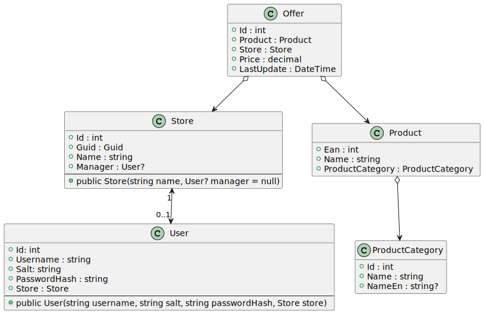

# Erweiterte Konfigurationsmöglichkeiten mit EF Core


<sup>
https://www.plantuml.com/plantuml/uml/XPBRIiD048RlzocMN2asnTu6jGKjAdWer3x0cjqc2ti8Uq2AzDsTpIGrna1xqNI-sVtdcvAL3yo5g1Mf9HTKw2OSg1QXjjoJKZ7lwJPO9-WteV2vUkQqeD84h1wZJ7Lw87XZMW3mmKbJ8NfbXbN20TrvuPOjpFCScqtyLBB44HTuYnh8cE5XghlBjzH4fIx9aQ1Ks_vr6YYbXlbliMKg_2KRYFcoZZynNuyEuyO5QaqAfoczRyI9uDm13xDEHJCOCyD4wjDtkmpMsIAxoVExx7e-NsHjTh_c-tultFH_lt6Mnp80wdvDkkD9MIR4HIarKmXVc0-xXhEGEW_m-91Q92KSQS47CuQWduHsVNaFjolh3XEUKwy4ehKvmIKvZXBxf3KpPwB62iLO2h8xWYkCsojXUDJg1m00
</sup>

## Collection Navigations

Im Klassenmodell hat der Pfeil zwischen *Product* und *Offer* zwei Pfeilspitzen. An einem Ende
kann von der Klasse *Offer* über das Property *Product* zum Produkt navigiert werden. In der
Klasse *Product* ist auch eine besondere Navigation vom Typ *ICollection\<Offer\>* vorhanden.
EF Core unterstützt auch diese Art der Navigation. In *Offers* werden automatisch alle
Angebote zum aktuellen Produkt abgerufen. Das macht LINQ Abfragen besonders einfach.

## Festlegen der Tabellennamen

Die Tabellennamen werden durch den Namen des Properties in der Kontextklasse bestimmt.
So erzeugt der folgende DbContext die Tabellen Stores, Offers, Products und ProductCategories.

```c#
public class StoreContext : DbContext
{
    public StoreContext(DbContextOptions opt) : base(opt) { }
    public DbSet<Store> Stores => Set<Store>();
    public DbSet<Offer> Offers => Set<Offer>();
    public DbSet<Product> Products => Set<Product>();
    public DbSet<ProductCategory> ProductCategories => Set<ProductCategory>();
}
```

Oft sind aber Tabellennamen in der Einzahl, also Store, Offer, ... erwünscht. Mit der Annotation *Table*
über der *Modelklasse*  (nicht im Kontext) aus dem Namespace *System.ComponentModel.DataAnnotations.Schema*
kann das Verhalten abgeändert werden.
```c#
[Table("Offer")]
public class Offer
{
    /* ... */
}
```

### Annotations vs. Konfiguration im DbContext

Der Einsatz von Annotations (also EF Core spezifischen Anweisungen) in den Modelklassen wird oft
diskutiert. Es gibt für alle Konfigurationseinstellungen immer die Möglichkeit, diese auch im
Kontext zu definieren. Dafür wird mit override die Methode *OnModelCreating()* überschrieben.
Der ModelBuilder stellt mit *Entity\<T\>()* eine Methode bereit, die die Konfiguration aller
Properties erlaubt. So kann z. B. der Tabellenname mit *ToTable()* definiert werden:

```c#
public class StoreContext : DbContext
{
    public StoreContext(DbContextOptions opt) : base(opt) { }
    /* .. */
    protected override void OnModelCreating(ModelBuilder modelBuilder)
    {
        modelBuilder.Entity<Offer>().ToTable("Offer");
    }
}
```

Manche Konfigurationsanweisungen müssen in *OnModelCreating()* durchgeführt werden, da es keine
Annotations dafür gibt. Es steht allerdings für jede Annotation eine entsprechende Methode
des ModelBuilders in *OnModelCreating()* bereit.

Welche Technik man wählt ist wohl Geschmackssache. Der Vorteil der Annotations, nämlich die
Konfiguration in derselben Datei wie die Klasse, ist allerdings ein unschlagbarer Vorteil.

## Definieren der Datentypen

Der Datenbankprovider versucht, die C# Datentypen bestmöglich in SQL Datentypen der entsprechenden
Datenbank umzuwandeln. Für SQL Server ist z. B. auf https://docs.microsoft.com/en-us/dotnet/framework/data/adonet/sql-server-data-type-mappings
eine genaue Auflistung zu sehen.

Manchmal gibt es mehrere Möglichkeiten, einen .NET Datentyp in der Datenbank umzusetzen. So können
Stringspalten mit einer Länge als *VARCHAR(n)* definiert werden. Außerdem ist bei numerischen
Datentypen die Angabe der precision möglich wie z. B. *DECIMAL(9,4)*.

Für *decimal* werden standardmäßig 2 Nachkommastellen definiert.

### Problematisch: Die Column Annotation

Oftmals wird die Annotation *Column* zur Definition des SQL Datentyps verwendet:

```c#
public class Store
{
    /* ... */
    [Column(TypeName = "VARCHAR(255")]
    public string Name { get; set; }
}

public class Offer
{
     /* ... */
    [Column(TypeName = "DECIMAL(9,4")]
    public decimal Price { get; set; }
}
```

Allerdings ist der Datentyp abhängig von der Datenbank. So wird z. B. in Oracle *VARCHAR2* zur
Speicherung von strings verwendet. Bei numerischen Werten gibt es mit *DECIMAL* und *NUMBER* (Oracle)
ebenfalls mehrere Möglichkeiten, die abhängig von der Datenbank unterstützt werden oder nicht.

### Besser: Steuerung über entsprechende Annotations

Um die maximale Länge eines String Properties zu steuern, kann die Annotation *MaxLength* verwendet
werden. Der EF Core Provider kann dadurch weiterhin den geeigneten Typ auswählen
(*VARCHAR*, *VARCHAR2*, ...) und eine Längendefinition - wenn unterstützt- angeben.

Für die Angabe der Precision gibt es (in EF Core 6) keine Annotation. Daher muss dieser Wert in der
Methode *OnModelCreating()* der Klasse *StoreContext* definiert werden.

```c#
public class Store
{
    /* ... */
    [MaxLength(255)]
    public string Name { get; set; }
}

public class Offer
{
     /* ... */
    public decimal Price { get; set; }   // No annotation for precision :( --> OnModelCreating
}

public class StoreContext : DbContext
{
    /* ... */
    protected override void OnModelCreating(ModelBuilder modelBuilder)
    {
        modelBuilder.Entity<Offer>().Property(o => o.Price).HasPrecision(9, 4);
    }
}
```
## Definieren von Indizes und mehrteiligen Schlüsseln

In einem *CREATE TABLE* Statement können Schlüssel auch aus mehreren Spalten bestehen.
Durch die Methode *HasKey()* kann dies auch im Context definiert werden:

```c#
public class StoreContext : DbContext
{
    /* ... */
    protected override void OnModelCreating(ModelBuilder modelBuilder)
    {
        modelBuilder.Entity<Offer>().HasKey(o => new { o.StoreId, o.ProductEan });
    }
}
```

**Wir werden allerdings mehrteilige Schlüssel vermeiden!** Navigationen müssen - falls
z. B. eine Bestellung auf ein Offer verweist - auch mehrteilig sein und immer händisch
definiert werden. Daher verwenden wir eine bessere Technik: Wir belassen die auto increment Id und
definieren einen *Unique Index*.

```c#
public class StoreContext : DbContext
{
    /* ... */
    protected override void OnModelCreating(ModelBuilder modelBuilder)
    {
        modelBuilder.Entity<Offer>().HasIndex(o => new { o.StoreId, o.ProductEan }).IsUnique();
    }
}
```

Durch den Unique Index ist sichergestellt, dass ein Produkt im selben Store nicht zu unterschiedlichen
Preisen angeboten werden kann.

Unter https://docs.microsoft.com/en-us/ef/core/modeling/ gibt es eine sehr detaillierte Beschreibung
der weiteren Einstellungsmöglichkeiten. Meist kommt man aber mit den hier gezeigten
Möglichkeiten aus.

## 1:1 Beziehungen

Im Klassendiagramm ist auch eine 1:1 Beziehung zwischen Store und User abgebildet. Dabei muss
ein User einem Store zugeordnet sein, während ein Store 0 oder 1 User als Manageraccount
haben kann.

### Abbilden der Navigations

EF Core definiert bei Beziehungen dem Begriff des sogenannten *Dependent entity*: 
> This is the entity that contains the foreign key properties.
> Sometimes referred to as the 'child' of the relationship
> [<sup>https://docs.microsoft.com/en-us/ef/core/modeling/relationships?tabs=fluent-api%2Cfluent-api-simple-key%2Csimple-key#definition-of-terms</sup>]

Bei 1:1 Beziehungen gehen wir so vor: Beide Klassen (Store und User) haben ein Navigation
Property vom jeweils anderen Typ (User bzw. Store). *Nur eine Klasse darf allerdings ein
Fremdschlüsselfeld besitzen!* In unserem Fall ist dies der Store, der mit *ManagerId* ein
Fremdschlüsselfeld hat.

Außerdem ist eine Seite als *nullable* definiert. Sonst erzeugen wir einen Zustand, wo
wir - um einen Store anlegen zu können - einen User im Konstruktor verlangen. Der User verlangt
wiederum einen Store. Wir gehen davon aus, dass der Store zeitlich zuerst angelegt werden muss.
Daher hat er einen optionalen User.

```c#
public class Store
{
    public Store(string name, User? manager = null)
    {
        Name = name;
        Manager = manager;
    }
    /* ... */
    public int? ManagerId { get; set; }
    public User? Manager { get; set; }
}

public class User
{
    public User(string username, string salt, string passwordHash, Store store)
    {
        Username = username;
        Salt = salt;
        PasswordHash = passwordHash;
        Store = store;
    }
    /* ... */
    public Store Store { get; set; }
}
```

## Manuelle Konfiguration von Beziehungen

Bis jetzt hat EF Core alle Beziehungen über Conventions angelegt. Manchmal muss eine
Beziehung aber händisch konfiguriert werden. Man bekommt dies in der Regel durch eine
Exception mit.

In der Methode *StoreContext.OnModelCreating()* können wir mit *HasOne()* zuerst das
*dependent entity*, also das Entity mit dem FK Feld in der Tabelle, konfigurieren. Mit *WithMany()*
(1:n Beziehung) bzw *WithOne()* (1:1 Beziehung) geben wir den zweiten Teil der Beziehung an.
Dass *ManagerId* das zugehörige Fremdschlüsselfeld ist wird mit *HasForeignKey()* angegeben.

```c#
protected override void OnModelCreating(ModelBuilder modelBuilder)
{
    // 1:1 relationship
    modelBuilder.Entity<Store>()
        .HasOne(s => s.Manager)
        .WithOne(u => u.Store)       // or WithOne() if there is no navigation property.
        .HasForeignKey<Store>(s => s.ManagerId);
}
```

Alle möglichen Szenarien von Beziehungen und deren Konfiguration sind auf
https://docs.microsoft.com/en-us/ef/core/modeling/relationships beschrieben.

## Guid Werte als Alternate Key

Im Bereich der Webapplikationen wird oft eine eindeutige ID benötigt, die als Parameter einer
URL verwendet werden kann. Die interne ID soll dabei nicht verwendet werden, da z. B. aus der URL
*/Store/Delete/4* leicht ableitbar ist, dass es auch einen Store 3 oder 5 geben kann.

Die GUID (oft auch UUID genannt) ist ein 128 bit langer Wert, der oft als Hexstring angegeben wird.
Somit könnte die URL */Store/Delete/6d925883-f6f9-46c4-b47f-0bc80524d0b9* lauten. Hier ist es schon
schwieriger, auf einen anderen Store zu schließen.

Die GUID wird mit dem .NET Typ *Guid* einfach im Model definiert. Da wir sie nicht zuweisen wollen,
hat sie eine *private set* Methode.

```c#
public class Store
{
    public Store(string name, User? manager = null)
    {
        Name = name;
        Manager = manager;
        Guid = Guid.NewGuid();
    }
    #pragma warning disable CS8618 // Non-nullable field must contain a non-null value when exiting constructor. Consider declaring as nullable.
    protected Store() { }
    #pragma warning restore CS8618 // Non-nullable field must contain a non-null value when exiting constructor. Consider declaring as nullable.
    public int Id { get; private set; } 
    public Guid Guid { get; private set; }
    [MaxLength(255)]      // Produces NVARCHAR(255) in SQL Server
    public string Name { get; set; }
    public int? ManagerId { get; set; }
    public User? Manager { get; set; }
}
```

### Konfiguration

Das GUID Property bekommt noch zwei spezielle Einstellungen: Mit *HasAlternateKey()* können
wir EF Core veranlassen, dass es einen UNIQUE Index bekommt. Außerdem ist dies notwendig für
die zweite Konfiguration. Mit *ValueGeneratedOnAdd()* wird EF Core - wie der Name schon sagt -
selbstständig einen GUID Wert beim Einfügen des Datensatzes generieren. Dies funktioniert allerdings
nur, wenn das Property mit *HasAlternateKey()* konfiguriert wurde.

```c#
protected override void OnModelCreating(ModelBuilder modelBuilder)
{
    /* ... */
    modelBuilder.Entity<Store>().HasAlternateKey(s => s.Guid);
    modelBuilder.Entity<Store>().Property(s => s.Guid).ValueGeneratedOnAdd();
}
```

In der Klasse *Store* wird im Konstruktor trotzdem eine neue GUID zugewiesen, da wir vom
Standpunkt des Domain Modellings nicht warten wollen, bis EF Core durch SaveChanges() diese
ID geniert.

Es ist auch möglich, die Properties mit dem Namen *Guid* in *allen Entity Klassen* mit der
oben beschriebenen Konfiguration zu versehen:

```c#
protected override void OnModelCreating(ModelBuilder modelBuilder)
{
    /* ... */
    // Exclude inherited properties
    var searchFlag = System.Reflection.BindingFlags.Public | System.Reflection.BindingFlags.Instance | System.Reflection.BindingFlags.DeclaredOnly;
    foreach (var entity in modelBuilder.Model.GetEntityTypes())
    {
        var type = entity.ClrType;
        if (type.GetProperty("Guid", searchFlag) is not null)
        {
            modelBuilder.Entity(type).HasAlternateKey("Guid");
            modelBuilder.Entity(type).Property("Guid").ValueGeneratedOnAdd();
        }
    }
}
```

## Übung

Verwende die Übung des letzten Kapitels (*Klassenmodelle persistieren mit EF Core*) und
definiere folgende Einstellungen:

- Die Tabellennamen sollen alle in der Einzahl (Team, HandIn, ...) angelegt werden.
- Der Teamname soll maximal 64 Stellen lang sein, die Klasse maximal 16 Stellen.
- Alle anderen string Properties (Name, Mail) sollen maximal 255 Stellen lang sein.
- Stelle mit einem Unique Index sicher, dass ein Student pro Task nur eine Abgabe einreichen kann.

> **Achtung:** Die Musterdaten generieren mehrere HandIns pro Student und Task. Ändere daher
> die Seed Methode in der Contextklasse, sodass nur ein HandIn pro Student und Task erstellt wird.
> Dies kann man nach *Generate(40).GroupBy(h=>new {h.TaskId, h.StudentId}).Select(g=>g.First()).Take(20)*
> sicherstellen.

Hinweis: In SQLite gibt es für Strings nur den Datentyp *TEXT*. Daher ist die Einstellung
der Länge in DBeaver nicht sichtbar.
