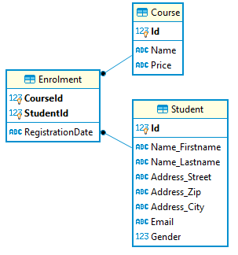

# Weitere Einstellungemöglichkeiten mit OnModelCreating

Im vorigen Kapitel haben wir mit den Conventions und Annotations sehr viel Einfluss auf die Erstellung
der Datenbank nehmen können. Einige Szenarien blieben aber noch unberücksichtigt:

- Tabellen mit mehreren Schlüsselteilen
- Anlegen von Indexfeldern sowie Unique Indizes
- Verwenden von *value objects*, die mehrere Properties zusammenfassen

Als Beispiel für diese Punkte werden wir eine kleine Kursdatenbank erstellen, in der sich Studenten
zu Kursen anmelden können:



## Value objects und Enumerationen

In vielen Datenbanken wird das Geschlecht zur Person abgespeichert. Meist wird ein String (m oder w)
bzw. ein Integer Wert verwendet. Allerdings muss der Entwickler selbst wissen, welcher Wert für
welches Geschlecht steht. Enumerationen helfen, symbolische Namen für int Werte zu definieren.
EF Core speichert den int Wert, durch den Compiler können Sie aber die symbolischen Namen
der Enumeration *Gender* verwenden.

Zusätzlich wollen wir die Adresse speichern. Sie ist eine Sammlung aus den Properties *Street*,
*Zip* (Postleitzahl) und *City*. Wir können diese 3 Properties natürlich direkt in *Student* definieren.
Wenn ein Studierender dann einen Zweitwohnsitz hat, müssten wir *Street2*, ... verwenden.
Außerdem werden die Trainer der Kurse auch eine Adresse besitzen. Das führt zu einer Codeduplizierung,
die wir aber nicht haben wollen.

Ein *value object* ist eine Zusammenfassung von Properties, die zusammen gehören. Im Gegensatz
zu einer 1:1 Beziehung speichert EF Core diese direkt in der Tabelle ab (siehe die Felder im obigen
ER Diagramm). Wir verwenden für
die Deklaration dieser value objects den in C# 9 eingeführten *record* Typ. Er ist nichts anderes
als eine Klasse, für die automatisch Equals so definiert wird, dass alle Properties verglichen werden.

```c#
var a1 = new PersonName { Firstname = "Max", Lastname = "Mustermann" };
var a2 = new PersonName { Firstname = "Max", Lastname = "Mustermann" };
Console.WriteLine(a1 == a2);  // Liefert true, wenn PersonName ein record ist.
```

## Indizes

In der Klasse *CoursesContext* überschreiben wir die Methode *OnModelCreating*. Diese Methode
erlaubt uns eine tiefgreifendere Konfiguration für Sachverhalte, für die es keine Annotations gibt.
Ein solcher Fall ist der Index. Im nachfolgenden Beispiel wird mit

```c#
modelBuilder.Entity<Student>().HasIndex(s => s.Email).IsUnique();
```

ein UNIQUE INDEX auf die Spalte Email in der Tabelle Student gelegt.

## Primärschlüssel mit mehreren Teilen

Auch bei Primärschlüsseln, die aus mehreren Teilen bestehen, müssen wir in der Methode
*OnModelCreating* die entsprechende Anweisung schreiben. Beachte, dass wir hier die Felder
mit den Fremdschlüsselwerten und nicht die Navigationen verwenden.

```c#
modelBuilder.Entity<Enrolment>().HasKey(e => new { e.CourseId, e.StudentId });
```

Die konkrete Umsetzung unserer kleinen Kursdatenbank sieht dann so aus:

```c#
// Das Geschlecht wird als int Wert in der DB gespeichert, wir verwenden aber einen symbolischen
// Namen dafür.
public enum Gender { MALE = 1, FEMALE}

// Der Record Typ generiert automatisch Equals und den == Operator basierend auf allen Feldern.
// Wichtig: Er ist durch die init Properties "immutable". 
public record PersonName
{
    [MaxLength(255)]
    public string Firstname { get; init; } = "";
    [MaxLength(255)]
    public string Lastname { get; init; } = "";
}

public record Address
{
    [MaxLength(255)]
    public string Street { get; init; } = "";
    [MaxLength(8)]
    public string Zip { get; init; } = "";
    [MaxLength(255)]
    public string City { get; init; } = "";
}
```

```c#
[Table("Course")]
public class Course
{
    // Autoincrement Wert für die Kurs ID
    public int Id { get; init; }
    public string Name { get; set; } = "";
    public decimal? Price { get; set; }
    public List<Enrolment> Enrolments { get; set; } = new();
}

[Table("Enrolment")]
public class Enrolment
{
    public int CourseId { get; init; }
    public int StudentId { get; init; }
    public DateTime RegistrationDate { get; set; }
    public Course Course { get; init; } = default!;
    public Student Student { get; init; } = default!;
}

[Table("Student")]
public class Student
{
    public int Id { get; init; }
    public PersonName Name { get; set; } = default!;
    public Address Address { get; set; } = default!;
    [MaxLength(255)]
    public string Email { get; set; } = "";
    public Gender Gender { get; set; }
    public List<Enrolment> Enrolments { get; } = new();
}
```

```c#
public class CoursesContext : DbContext
{
    public DbSet<Course> Courses => Set<Course>();
    public DbSet<Enrolment> Enrolments => Set<Enrolment>();
    public DbSet<Student> Students => Set<Student>();


    protected override void OnConfiguring(DbContextOptionsBuilder optionsBuilder)
    {
        optionsBuilder.UseSqlite("Data Source=Courses.db");
    }

    // Wir konfigurieren einige Dinge, für die es keine Annotations gibt. Das ist die
    // sogenannte "FluentAPI" in EF Core.
    protected override void OnModelCreating(ModelBuilder modelBuilder)
    {
        // Mehrteiliger Schlüssel
        modelBuilder.Entity<Enrolment>().HasKey(e => new { e.CourseId, e.StudentId });
        // Unique Index
        modelBuilder.Entity<Student>().HasIndex(s => s.Email).IsUnique();
        // decimal wird als DECIMAL(9,4) abgespeichert. Standard: Nur 2 Nachkommastellen.
        modelBuilder.Entity<Course>().Property(c => c.Price).HasPrecision(9, 4);

        // Value objects müssen so definiert werden.
        modelBuilder.Entity<Student>().OwnsOne(s => s.Address);
        modelBuilder.Entity<Student>().OwnsOne(s => s.Name);
    }
}
```

```c#
static void Main(string[] args)
{
    using (var db = new CoursesContext())
    {
        db.Database.EnsureDeleted();
        db.Database.EnsureCreated();

        var student1 = new Student
        {
            Name = new PersonName { Firstname = "Max", Lastname = "Mustermann"},
            Address = new Address { Street = "Stephansplatz 1", Zip = "1010", City = "Wien" },
            Gender = Gender.MALE,
            Email = "mustermann@spengergasse.at"
        };

        var student2 = new Student
        {
            Name = new PersonName { Firstname = "Maximilia", Lastname = "Musterfrau" },
            Address = new Address { Street = "Stephansplatz 2", Zip = "1010", City = "Wien" },
            Gender = Gender.FEMALE,
            Email = "musterfrau@spengergasse.at"
        };

        var course = new Course
        {
            Name = "Advanced EF Core",
            Price = 1234.5678M,
            Enrolments = new()
            {
                new Enrolment
                {
                    Student = student1,
                    RegistrationDate = new DateTime(2000, 12, 1)
                },
                new Enrolment
                {
                    Student = student2,
                    RegistrationDate = new DateTime(2000, 12, 2)
                },
            }
        };
        db.Courses.Add(course);
        db.SaveChanges();
    }
}
```

