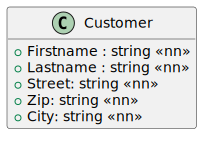
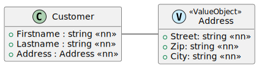
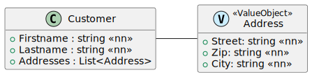
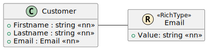
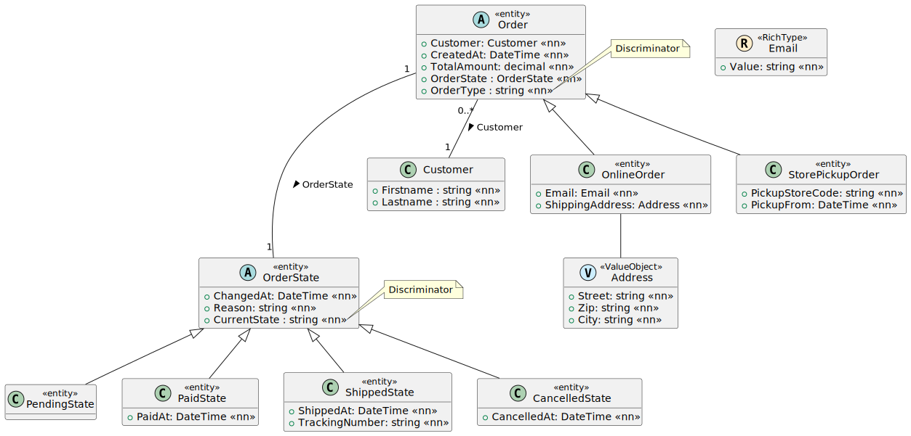
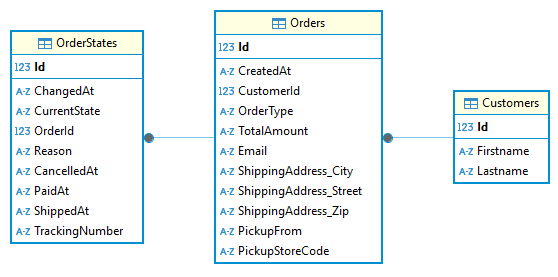
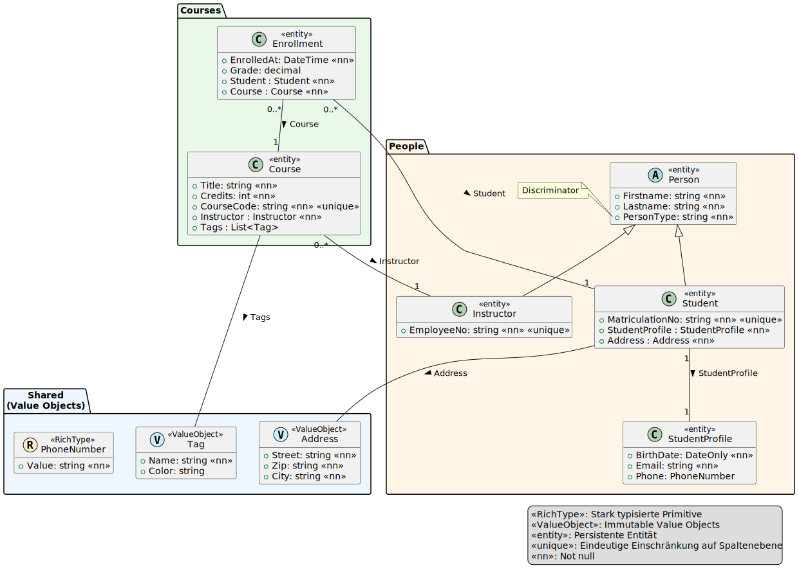

= Vererbung und andere OOP Konzepte
:source-highlighter: rouge
:icons: font
:lang: DE
:hyphens:
:figure-caption!:
ifndef::env-github[:icons: font]
ifdef::env-github[]
:caution-caption: :fire:
:important-caption: :exclamation:
:note-caption: :paperclip:
:tip-caption: :bulb:
:warning-caption: :warning:
endif::[]

== Value Objects

=== Einbinden eines (1) value objects

Oft bestehen Entities aus Properties, die thematisch eng zusammen gehören.
So besteht eine Adresse aus Straße, PLZ und Ort.

.link:https://www.plantuml.com/plantuml/uml/VS-z2i9044NXVf_Yzhw1X108MDdPsItPCHdOdp1pKmJntHNi9DYUhpg3CngtaaEM1y46qtaXaffCr5R3eaaWPUME8bnQyX2c7DqnRivMnF0C072wg3bhB88pdAPrHjVLslTVliP_UgE9y93kkXxsKRd_mYiCKjFdvmq0[PlantUML Source]

Im OOP Design würden wir mit diesen 3 Properties einen eigenen Typ definieren, damit wir ihn im Programmcode öfters verwenden können.

.link:https://www.plantuml.com/plantuml/uml/VO-zIiL048NxVOe16qNl2yXbYIn99LW8AUpMx9YCx4-OcIs2-Eu6TDKYtAc6ynNVEPsePwqfceXl2bg0QLuK0Z5EIYMRXG82fbKtIAXB2MBC5Bq8k2fQ4Z9y6DZlTY0MpJuXt8CeKvxXVCxPsc_yw2_HXn0OHNRuypNwsNH_ELoFTrVEzVqmtC3eOyMdrtUS5AnjNPwL4VNGz4BhOUv8jmR-oNzNdawjWkamXvhY5m00[PlantUML Source]

Mit der 1:1 Beziehung haben wir schon das Wissen, diese Relation mit 2 Tabellen in der Datenbank darzustellen.
Daraus ergibt sich jedoch ein Nachteil, dass beim Lesen des Kunden samt Adresse ein JOIN durchgeführt werden muss.
Effektiver wäre es, wenn wir zwar getrennte Typen für Customer und Adresse verwenden, diese aber in einer Datenbanktabelle gespeichert werden würden:

[%header,format=dsv,separator=;]
|===
Firstname;Lastname;Address_Street;Address_Zip;Address_City
Max;Mustermann;Spengergasse 20;1050;Wien
|===

Wir definieren zuerst die Modelklassen für _Customer_ und _Address_.
Die Klasse _Customer_ ist eine Modelklasse.
Sie hat daher einen protected default Konstruktor.
Die Klasse _Address_ ist ein _value object_.
Sie hat *keinen primary key und auch keinen default Konstruktor*.

[source,csharp]
----
public class Customer
{
    protected Customer() { }
    public Customer(string firstname, string lastname, Address address)
    {
        Firstname = firstname;
        Lastname = lastname;
        Address = address;
    }
    public int Id { get; set; }
    public string Firstname { get; set; }
    public string Lastname { get; set; }
    public Address Address { get; set; }
}

public class Address
{
    public Address(string street, string zip, string city)
    {
        Street = street;
        Zip = zip;
        City = city;
    }
    public string Street { get; set; }
    public string Zip { get; set; }
    public string City { get; set; }
}
----

Mit dieser Konfiguration würde EF Core allerdings eine 1:n Beziehung in der Datenbank erstellen und einen Fehler liefern, da Address keinen primary key besitzt.
Wir müssen in der Methode _OnModelCreating_ im Context das value object konfigurieren.
Dafür gibt es die Methode _OwnsOne_.

[source,csharp]
----
protected override void OnModelCreating(ModelBuilder modelBuilder)
{
    modelBuilder.Entity<Customer>().OwnsOne(c => c.Address);
}
----

=== Listen von value objects

Wenn Kunden mehrere Adressen haben können, brauchen wir eine Liste von Adressen.

.link:https://www.plantuml.com/plantuml/uml/VO_DIiKm44RtUOe1DuhU5v0IheJRrGKNGXVkOZEs8_afCvD54T_TWAqBAMRv7S8vSnRrh3L54_5TGGimJRD28CPHgMGpKq30jEWA2NKkGOmPenS1LqLBGePF0-tTzyIYsIU4Hn1boXDqNSxM_k2h_uy-XS0eWjBmbKIxRR3cQ_TjI_i6jyF3ZNENIz_VmU1ZnUUtZzOBrkunByg8UgXwfULmTwJhNz3alsUUJdk2EMCEDSLl[PlantUML Source]

Die Abbildung in den Modelklassen erfolgt über eine Liste.
Das Entity _Customer_ besitzt keine Liste von Adressen im Konstruktor, da wir diese nach dem Anlegen befüllen.

[source,csharp]
----
public class Customer
{
    protected Customer() { }
    public Customer(string firstname, string lastname)
    {
        Firstname = firstname;
        Lastname = lastname;
    }
    public int Id { get; set; }
    public string Firstname { get; set; }
    public string Lastname { get; set; }
    public List<Address> Addresses { get; } = new();
}

public class Address
{
    public Address(string street, string zip, string city)
    {
        Street = street;
        Zip = zip;
        City = city;
    }
    public string Street { get; set; }
    public string Zip { get; set; }
    public string City { get; set; }
}
----

Nun müssen wir das value object mit _OwnsMany_ im Context konfigurieren:

[source,csharp]
----
protected override void OnModelCreating(ModelBuilder modelBuilder)
{
    modelBuilder.Entity<Customer>().OwnsMany(c => c.Addresses).HasKey("Id");
}
----

==== Interne Abbildung in der Datenbank

Eine Liste von value objects kann nicht direkt in der Customer Tabelle gespeichert werden.
Deswegen legt EF Core intern eine eigene Tabelle _Address_ an.

[source,sql]
----
CREATE TABLE "Address" (
    "Id" INTEGER NOT NULL CONSTRAINT "PK_Address" PRIMARY KEY AUTOINCREMENT,
    "Street" TEXT NOT NULL,
    "Zip" TEXT NOT NULL,
    "City" TEXT NOT NULL,
    "CustomerId" INTEGER NOT NULL,
    CONSTRAINT "FK_Address_Customers_CustomerId" FOREIGN KEY ("CustomerId") REFERENCES "Customers" ("Id") ON DELETE CASCADE
);
----

[NOTE]
Ohne die Option _HasKey("Id")_ würde EF Core einen zusammengesetzten Schlüssel aus _Id_ und _CustomerId_ anlegen.
SQLite unterstützt aber keine zusammengesetzten Schlüssel mit einem AUTO_INCREMENT Teil.
Es würde die Fehlermeldung `SqliteException: SQLite Error 19: 'NOT NULL constraint failed: Address.Id'.` beim Einfügen einer Adresse entstehen.

== Converter

=== Eingebaute Converter

In der vorigen Übung mussten wir die enum _Weekday_ als _string_ in der Datenbank speichern.
Das hat folgenden Grund: Enums sind Zahlenwerte.
Ohne Converter würde statt _MO_ einfach der Wert 0 gespeichert werden.
Ändern wir nun die enum im Code, würden wir auch den Wochentag ändern.
Um das zu verhindern, wollen wir die _string Repräsentation_ speichern.
Hier gibt es einen vordefinierten Converter, den wir im Context konfigurieren können:

[source,csharp]
----
protected override void OnModelCreating(ModelBuilder modelBuilder)
{
    modelBuilder.Entity<OpeningHour>().Property(o => o.Weekday).HasConversion<string>();
}
----

_HasConversion<string>()_ bedeutet, dass einfach die _ToString()_ Methode vor der Speicherung aufgerufen wird.
Nach der Speicherung wird mit _Parse_ der Wert im Objekt wiederhergestellt.

=== Userdefinierte Converter

Die vorige Technik hat bei manchen Datentypen einen Nachteil: Es wird die locale Einstellung des Servers verwendet, der die App ausführt.
Dies kann zu unerwarteten Ergebnissen führen, wenn mehrere Server auf die Datenbank zugreifen.
Wir können daher auch einen benutzerdefinierten Converter schreiben, der den zu speicherten Wert selbst festlegt.

Wir möchten nun die Werte _From_ und _To_ in _OpeningHour_ aus dem letzten Übungsbeispiel nicht als Zeitwert, sondern auf Minute genau als String speichern.
Der Converter besteht aus 2 Argumenten:

* Das erste Argument konvertiert den Objektwert in den Datenbankwert (in unserem Fall _string_).
* Das zweite Argument konvertiert den Datenbankwert in den Objektwert (_TimeOnly_).

[source,csharp]
----
protected override void OnModelCreating(ModelBuilder modelBuilder)
{
    modelBuilder.Entity<OpeningHour>().Property(o => o.From).HasConversion(
        objVal => objVal.ToString("HH:mm"),
        dbVal => TimeOnly.Parse(dbVal));
    modelBuilder.Entity<OpeningHour>().Property(o => o.To).HasConversion(
        objVal => objVal.ToString("HH:mm"),
        dbVal => TimeOnly.Parse(dbVal));
}
----

Das Ergebnis ist nun ein String der Form _HH:mm_ in der Datenbanktabelle _OpeningHour_:

[%header,format=tsv]
|===
Id	StoreDetailId	Weekday	From	To
1	1	MO	08:00	16:00
|===

=== Rich types

Wir möchten nun in der Entity _Customer_ die E-Mail Adresse speichern.
Strings haben den Nachteil, dass jeder Wert zulässig ist.
Bei E-Mail Adressen wird allerdings ein bestimmter Aufbau verlangt.
Um nur gültige E-Mail Adressen anlegen zu können, definieren wir einen eigenen Typ für _Email_:

.link:https://www.plantuml.com/plantuml/uml/VO-zgiCm38LtFuNWBhUqUO4IJ20aKwTGkfjOZGN-2POoXD9tho5DXmxL8j07dyvfM4oM9NZbyIuW2J9DJi1Inb4eHUN88c2OPOM0uf9bfKPlcA5TM5B030y5POuzPPPe0i8PM3B52UewHgqtV36_Q1SC-OAs_IRF_TL-XV_XzDVtNTUs1nXeTDTrHj1wZt0pVi5lVx5yebRLvb8DHbjglm00[PlantUML Source]

In der Implementierung können wir die Klasse _MailAddress_ aus .NET verwenden.
Diese prüft automatisch, ob die E-Mail Adresse korrekt ist.

[source,csharp]
----
public class Customer
{
    protected Customer() { }
    public Customer(string firstname, string lastname, Email email)
    {
        Firstname = firstname;
        Lastname = lastname;
        Email = email;
    }

    public int Id { get; set; }
    public string Firstname { get; set; }
    public string Lastname { get; set; }
    public Email Email { get; set; }
}

public class Email
{
    public Email(string value)
    {
        Value = new System.Net.Mail.MailAddress(value);
    }
    public System.Net.Mail.MailAddress Value { get; }
}
----

So können wir die Klasse _Customer_ allerdings nicht mit EF Core in der Datenbank abbilden.
Schließlich weiß EF Core nicht, welcher Wert für den user defined type _Email_ in die Datenbank geschrieben werden soll.
Ein Converter behebt dieses Problem, und sorgt für eine definierte Umwandlung in einen String:

[source,csharp]
----
protected override void OnModelCreating(ModelBuilder modelBuilder)
{
    modelBuilder.Entity<Customer>().Property(c => c.Email).HasConversion(
        objVal => objVal.Value.Address,
        dbVal => new Email(dbVal));
}
----

== Vererbung

Ein wesentliches Konzept der OOP ist die _Vererbung_.
Gemeinsam mit den vorher gelernten Konzepten können wir nun ein kleines Domainmodel eines Bestellmanagements modellieren:

.link:https://www.plantuml.com/plantuml/uml/TLF1Rfmm4BtxAqRaqZJPgBrQ4Kf4u5HrezrL3hrvORgumGRPms7LvjyxWNYXnHpjD_FUpFFpWoVbg3UDg7M5WAQZCnYakgsy46MZl8UizzGQTF1R0DmKsdcooY18yEIqFS7zlRLf-Wv-KolOMo3BZT8DtyAdtUrLKUHvbbt3JfVruTmXfEaWmamlgkanmgAEVALAWf5kwofq3ACbJUUFzfimiPncdsRC72h2wf4aF2d2WpOuGmyjgURHjBrblC9I6zNCu45lJzm74gR3_nMyJDI3STpaoztTvmGs6qY-9jE84fBqSag4i2qJEtsg2TgVevYK5thnf7tfjD5MKUi4sWhU6uBFZrNbqFl1wPVRgopBywAuXi7MxV4NbZGpUqyEaPRloT0FtKNlCxPxzP6tjj4Musyp141USX1iszUwwvZhOsuvBJ2PDx6oTw4WQExP1NpMvMlVnOL7R2ZBscgHhKj5uLgpZ4OqUk7r5_chbJsjHco7ohSsef_rpZ7HoBaqTn68e2_bFvrhoGXEFVCD4qT6VmiLIbVnpHY9hXKwXsV4bUO1NFzvxEqhp_MzDqTqo_L7WKpP4fjcJIB0CP55XlfkyoSTVHJp-2pHy77vksx6RpkpV_ouqpaHOcvnO9eAHF0tXaqEHk6mu6h10qltflaB[PlantUML Source]

=== Umsetzung der Modelklassen

Die Klasse _Order_ wird syntaktisch wie gewohnt umgesetzt, hat aber einige Besonderheiten:

[source,csharp]
----
public abstract class Order  // <1>
{
    protected Order() { }  // <2>
    protected Order(Customer customer, DateTime createdAt, decimal totalAmount)
    {
        Customer = customer;
        CreatedAt = createdAt;
        TotalAmount = totalAmount;
    }

    public int Id { get; private set; }
    public DateTime CreatedAt { get; set; }
    public Customer Customer { get; set; }
    public OrderState? OrderState { get; set; }  // <3>
    public decimal TotalAmount { get; set; }
    public string OrderType { get; private set; } = default!;  // <4>
}
----

<1> Im Model ist die Klasse _Order_ als _abstract_ ausgewiesen.
    Schließlich macht es keinen Sinn, eine allgemeine Order zu erstellen.
    Daher verwenden wir das Schlüsselwort _abstract_.
<2> Der gewohnte default Konstruktor für EF Core wird ebenfalls angelegt.
<3> Die 1:1 Beziehung von _Order_ zu _OrderState_ können wir nur als 1:0 oder 1 definieren.
    Order ist die _principal entity_, und hat daher eine nullable Navigation zu _OrderState_.
    Ein Order hat daher _0 oder 1 States_.
    Dieses Feld wird auch nicht im Konstruktor angefordert, da wir zunächst einmal eine Order in der Datenbank anlegen müssen.
<4> Im Modell gibt es den Hinweis _Discriminator_ beim Feld _OrderType_.
    Der Discriminator speichert einfach den Typnamen des Orders (_OnlineOrder_ oder _StorePickupOrder_).
    Daher wird er auch mit null (_default!_) initialisiert und hat keinen öffentlichen Setter.
    Er wird von EF Core selbstständig verwaltet.

[IMPORTANT]
Initialisiere den Discriminator nicht mit _string.Empty_ oder anderen Werten außer _null_.
EF Core kann den Datensatz dann nicht korrekt zurücklesen.

Die Klassen _OnlineOrder_ und _StorePickupOrder_ werden nun angelegt:

[source,csharp]
----
public class OnlineOrder : Order
{
    public OnlineOrder(
        Customer customer, DateTime createdAt, decimal totalAmount,
        Email email, Address shippingAddress)
        : base(customer, createdAt, totalAmount)
    {
        Email = email;
        ShippingAddress = shippingAddress;
    }

    protected OnlineOrder() { }

    public Email Email { get; set; }
    public Address ShippingAddress { get; set; }
}

public class StorePickupOrder : Order
{
    public StorePickupOrder(
        Customer customer, DateTime createdAt, decimal totalAmount,
        string pickupStoreCode, DateTime pickupFrom)
        : base(customer, createdAt, totalAmount)
    {
        PickupStoreCode = pickupStoreCode;
        PickupFrom = pickupFrom;
    }

    protected StorePickupOrder() { }

    public DateTime PickupFrom { get; set; }
    public string PickupStoreCode { get; set; }
}

public class Email
{
    public Email(string value)
    {
        Value = new System.Net.Mail.MailAddress(value);
    }

    public System.Net.Mail.MailAddress Value { get; }
}

public class Address
{
    public Address(string street, string zip, string city)
    {
        Street = street;
        Zip = zip;
        City = city;
    }

    public string City { get; set; }
    public string Street { get; set; }
    public string Zip { get; set; }
}
----

Beachte den Konstruktor. Er leitet die Felder der Basisklasse an den _public_ Konstruktor der Basisklasse weiter.
Die Klassen _Email_ als rich type und _Address_ als value object werden wie vorher erklärt angelegt.

[IMPORTANT]
Verwende immer die Konstruktorweiterleitung zum public Konstruktor der Basisklasse.
Sonst wird der protected default Konstruktor aufgerufen und die Felder in _Order_ haben den Wert _null_!

Die Unterklassen haben *kein Property Id*, da es von _Order_ vererbt wird!

Unseren OrderState setzen wir ebenfalls mit Vererbung um.
Da _OrderState_ das _dependent entity_ der 1:1 Beziehung zu _Order_ ist, besitzt es das _ForeignKey_ Attribut.

[source,csharp]
----
public abstract class OrderState
{
    protected OrderState() { }
    protected OrderState(Order order, DateTime changedAt, string reason)
    {
        Order = order;
        ChangedAt = changedAt;
        Reason = reason;
    }
    public int Id { get; private set; }
    public DateTime ChangedAt { get; set; }
    [ForeignKey("OrderId")]
    public Order Order { get; set; }
    public string Reason { get; set; }
    // Discriminator, managed by EF Core.
    public string CurrentState { get; private set; } = default!;
}

public class PendingState : OrderState
{
    protected PendingState() { }
    public PendingState(Order order, DateTime changedAt, string reason)
        : base(order, changedAt, reason) { }

}
public class PaidState : OrderState
{
    protected PaidState() { }
    public PaidState(Order order, DateTime changedAt, string reason, DateTime paidAt)
        : base(order, changedAt, reason)
    {
        PaidAt = paidAt;
    }
    public DateTime PaidAt { get; set; }
}
public class ShippedState : OrderState
{
    protected ShippedState() { }
    public ShippedState(Order order, DateTime changedAt, string reason, DateTime shippedAt,
        string trackingNumber) : base(order, changedAt, reason)
    {
        ShippedAt = shippedAt;
        TrackingNumber = trackingNumber;
    }
    public DateTime ShippedAt { get; set; }
    public string TrackingNumber { get; set; }
}
public class CancelledState : OrderState
{
    protected CancelledState() { }
    public CancelledState(Order order, DateTime changedAt, string reason, DateTime cancelledAt)
        : base(order, changedAt, reason)
    {
        CancelledAt = cancelledAt;
    }
    public DateTime CancelledAt { get; set; }
}

----
=== Konfiguration des Discriminator Feldes

By convention würde EF Core ein Feld mit dem Namen _Discriminator_ als solchen automatisch erkennen.
Da wir aber _OrderType_ bzw. _CurrentState_ verwenden, müssen wir mit der Methode _HasDiscriminator()_ in _OnModelCreating_ im Context eine Konfiguration vornehmen:

[source,csharp]
----
protected override void OnModelCreating(ModelBuilder modelBuilder)
{
    modelBuilder.Entity<OrderState>().HasDiscriminator<string>(o => o.CurrentState);
    modelBuilder.Entity<Order>().HasDiscriminator<string>(o => o.OrderType)
        .HasValue<OnlineOrder>("Online")
        .HasValue<StorePickupOrder>("Pickup");

    // Other config.
    modelBuilder.Entity<OnlineOrder>().Property(o => o.Email).HasConversion(
        objVal => objVal.Value.Address,
        dbVal => new Email(dbVal));
    modelBuilder.Entity<OnlineOrder>().OwnsOne(o => o.ShippingAddress);        
}
----

Wir können den Discriminator auf 2 Arten definieren:

* In der ersten Form (ohne _HasValue()_) wird einfach der Typname als String verwendet (also _PaidState_, _PendingState_, _ShippedState_ und _CancelledState_).
* In der zweiten Form können wir eigene Werte für das Datenbankfeld verwenden.

=== Das erzeugte Datenbankschema

Das erzeugte Datenbankschema hat überraschend wenig mit unserem Modelklassen zu tun.
**Es werden nur 3 Tabellen erzeugt.**

Bei genauerer Betrachtung erkennen wir aber:

* Address ist ein _value object_. Es findet sich in den Spalten _ShippingAddress_City_, _ShippingAddress_Street_ und _ShippingAddress_Zip_ wieder.
* Email ist ein _rich type_. Er wird mit Hilfe des Converters als String abgebildet.
* Die Vererbung wird nur mit einer Tabelle, nämlich der Basisklasse abgebildet.
  Dies wird als _table per hierarchy (TPH) bezeichnet.
  Sie besitz mit _OrderType_ den Discriminator.
  Die Felder der Unterklassen von _Order_ (_Email_ _ShippingAddress..._, _PickupFrom_ und _PickupStoreCode_, sind stets _nullable_.
  In der Datenmodellierung wird dies als _rollup_ bezeichnet.

[source,sql]
----
CREATE TABLE "Orders" (
    "Id" INTEGER NOT NULL CONSTRAINT "PK_Orders" PRIMARY KEY AUTOINCREMENT,
    "CreatedAt" TEXT NOT NULL,
    "CustomerId" INTEGER NOT NULL,
    "OrderType" TEXT NOT NULL,
    "TotalAmount" TEXT NOT NULL,
    "Email" TEXT NULL,
    "ShippingAddress_City" TEXT NULL,
    "ShippingAddress_Street" TEXT NULL,
    "ShippingAddress_Zip" TEXT NULL,
    "PickupFrom" TEXT NULL,
    "PickupStoreCode" TEXT NULL,
    CONSTRAINT "FK_Orders_Customers_CustomerId" FOREIGN KEY ("CustomerId") REFERENCES "Customers" ("Id") ON DELETE CASCADE
);
----

.Orders
[%header,format=tsv]
|===
Id	CreatedAt	CustomerId	OrderType	TotalAmount	Email	ShippingAddress_City	ShippingAddress_Street	ShippingAddress_Zip	PickupFrom	PickupStoreCode
1	2025-11-05 13:00:00	1	Online	123.45	ada@example.org	Wien	Main St 1	1010	[NULL]	[NULL]
|===

Da eine _OnlineOrder_ angelegt wurde (siehe _OrderType_), haben die Felder _PickupFrom_ und _PickupStoreCode_ den Wert NULL.

.OrderStates
[%header,format=tsv]
|===
Id	ChangedAt	CurrentState	OrderId	Reason	CancelledAt	PaidAt	ShippedAt	TrackingNumber
1	2025-11-05 14:00:00	PaidState	1	Payment received	[NULL]	2025-11-05 14:00:00	[NULL]	[NULL]
|===

Da ein _PaidState_ angelegt wurde (siehe _CurrentState_), haben die Felder _CancelledAt_, _ShippedAt_ und _TrackingNumber_ den Wert NULL.

.Customers
[%header,format=tsv]
|===
Id	Firstname	Lastname
1	Ada	Lovelace
|===

== Übung

Lade die Datei link:EfCoreInheritance20251108.7z[EfCoreInheritance20251108.7z] herunter und entpacke sie in dein Repo.
Alternativ kannst du mit `git clone https://github.com/Die-Spengergasse/course-pos-csharp_basics` das Repo klonen und das Programm aus dem Verzeichnis _03 EF Core/03b_EfCoreInheritance/EfCoreInheritance_ kopieren.

[IMPORTANT]
Die 7z Datei darf nicht im Repo sein. Das Archiv soll auch nicht in einen eigenen Ordner entpackt werden,
sodass eine Struktur _EfCoreInheritance20251108/EfCoreInheritance_ entsteht.
Der Ordner _EfCoreInheritance_ soll im Hauptordner des Repos sein.

Es soll ein kleines Kursverwaltungssystem implementiert werden.
Das Domain Model sieht so aus:

.link:https://www.plantuml.com/plantuml/uml/ZLHTRkCs47xNAGOoiBjfrulseOj2S8rr7Aa8a3f6REIXA53GqbXYGv4gEIpWjhbDRfABbQ8aMt8Ljtf8EFCDl_dcX_vYY6cofGZUmzHzSCSEoXAyWmrnuLr1mJC4B2iwG8bKgCm4nsZCKMROn0blWEPvGS5izi3JOdkeS3wF71dJJq27YXkEcX3McfUS-1_e0X-Pi7Y_-mrJgcDloz8Isma43q2361U8aZWTwfWrQiCDEGT2N7jVN-gKLlBVhKyOSoVB4i-nFfgqqAylyidA79ZTmwPYWb3Y3cKjGChwoaeHI2j4W39hIgdB_67iWpLBdrYEPXmEWgh18TmKJ6FsY_mmgEKg16PW_Mk3mYIEayz90dy50AbWna65ahYovGurp6RmuU7Z94dYUBcyWgwjC9_x2m1VU-u836dk2cpgSSXpSEHRP9b6OppNuyV9Skao9bVGwtoFRaCQaSxvFFGphqRzIpUNYmAsBFz_oLUinF4KIYZT8PxykTVdDQfAODlMnW3NikIx-BDdPZjtaQNKzHUrKH9EAzMbJxWs9D_ISCSkW0sd6yrRev2A40Jk2TI-LH15frikueQRj7uOaf7IpaQP-LkdFcx8PYXfHFbFpELChM34bLofCmrmUXnDU4kqrchF1K84GyUWicvx8kXEOoE-bIwZJPto4NLnMGbrGBmaR4Wtr3D2USqr5JUCC8BwxxqKXu7gk6HSZ4xAlwwe_yYwrE_X4JNgdPKvIdW7N19gYN2DVt8il3U0un2cjfh-FMz76K2_0qFeT2NyDeJfrF_xrmJ2-Pal7ApuKbbjqBGxtbemYHV9z_6YzzlXaR66RJc9DzwMneoJYUfwXu3dMgeC_skVUhL7S386R5kM6uVUSKCpTpuRU2or4g8St-u6n6n1pRItl1pkw8-QrI8pJ7d9n637k-KUhSs1pQ6_qqvLwmo_-VJfg-F81aM6yvuT1ZtvmqjTxi64ByItcTlunWg3uBXqq-uL-e3E23l5TO1hBa37u0o7Va6PsLBy0m00[PlantUML Source]

Beachte für die Umsetzung folgende Punkte:

* Die Tabellen _Person_, _Course_, etc. sollen in Einzahl angelegt werden.
  Stelle dies durch Konfiguration sicher.
  Beachte bei der Konfiguration, dass nicht alle Klassen zu Tabellen werden.
* Das Discriminator Feld _Person.PersonType_ soll die Werte _S_ für Students und _I_ für Instruktoren haben.
* _Course.Tags_ ist eine Liste von _value objects_.
  Daher soll die Klasse _Tag_ keine Id und keinen default Konstruktor haben.
* _Student.Address_ ist ein _value object_.
  Die Felder müssen in die Tabelle integriert werden (_Address_Street_, etc.)
* Die mit _nn_ gekennzeichneten Felder sind erforderlich (not null), andere Felder sind nullable.
* Nötige primary keys sollen den Namen _Id_ (autoicrement) haben.
* Der Fremdschlüssel für die 1:1 Beziehung in _StudentProfile_ soll _StudentId_ heißen.
* _StudentProfile.Phone_ ist nullable.
  Der Converter muss daher mit _null_ umgehen können.
  Beachte, dass Operatoren wie `?.` in der Expression nicht verwendet werden können.
  Verwende daher die klassische bedingte Zuweisung.
* Für die Properties _Course.CourseCode_, _Instructor.EmployeeNo_ und _Student.MatriculationNo_ soll ein unique Index erstellt werden.

Im Projekt gibt es die Klasse _EfCoreInheritance.Test.UniversityContextTests_.
Schreibe einen Unittest _AddEnrollmentTest_, der ein Enrollmenmt in der Datenbank einfügt.

In der Klasse _EfCoreInheritance.Test.GradingTests_ sind vordefinierte Tests.
Sie prüfen die Implementierung auf Richtigkeit.

Die erzeugte Datenbank soll folgendes Schema haben:

[source,sql]
----
CREATE TABLE "Person" (
    "Id" INTEGER NOT NULL CONSTRAINT "PK_Person" PRIMARY KEY AUTOINCREMENT,
    "Firstname" TEXT NOT NULL,
    "Lastname" TEXT NOT NULL,
    "PersonType" TEXT NOT NULL,
    "EmployeeNo" TEXT NULL,
    "MatriculationNo" TEXT NULL,
    "Address_Street" TEXT NULL,
    "Address_Zip" TEXT NULL,
    "Address_City" TEXT NULL
);
CREATE UNIQUE INDEX "IX_Person_EmployeeNo" ON "Person" ("EmployeeNo");
CREATE UNIQUE INDEX "IX_Person_MatriculationNo" ON "Person" ("MatriculationNo");

CREATE TABLE "Course" (
    "Id" INTEGER NOT NULL CONSTRAINT "PK_Course" PRIMARY KEY AUTOINCREMENT,
    "Title" TEXT NOT NULL,
    "Credits" INTEGER NOT NULL,
    "CourseCode" TEXT NOT NULL,
    "InstructorId" INTEGER NOT NULL,
    CONSTRAINT "FK_Course_Person_InstructorId" FOREIGN KEY ("InstructorId") REFERENCES "Person" ("Id") ON DELETE CASCADE
);
CREATE UNIQUE INDEX "IX_Course_CourseCode" ON "Course" ("CourseCode");
CREATE INDEX "IX_Course_InstructorId" ON "Course" ("InstructorId");

CREATE TABLE "StudentProfile" (
    "Id" INTEGER NOT NULL CONSTRAINT "PK_StudentProfile" PRIMARY KEY AUTOINCREMENT,
    "BirthDate" TEXT NOT NULL,
    "Email" TEXT NOT NULL,
    "Phone" TEXT NULL,
    "StudentId" INTEGER NOT NULL,
    CONSTRAINT "FK_StudentProfile_Person_StudentId" FOREIGN KEY ("StudentId") REFERENCES "Person" ("Id") ON DELETE CASCADE
);
CREATE UNIQUE INDEX "IX_StudentProfile_StudentId" ON "StudentProfile" ("StudentId");

CREATE TABLE "Enrollment" (
    "Id" INTEGER NOT NULL CONSTRAINT "PK_Enrollment" PRIMARY KEY AUTOINCREMENT,
    "EnrolledAt" TEXT NOT NULL,
    "Grade" TEXT NULL,
    "StudentId" INTEGER NOT NULL,
    "CourseId" INTEGER NOT NULL,
    CONSTRAINT "FK_Enrollment_Course_CourseId" FOREIGN KEY ("CourseId") REFERENCES "Course" ("Id") ON DELETE CASCADE,
    CONSTRAINT "FK_Enrollment_Person_StudentId" FOREIGN KEY ("StudentId") REFERENCES "Person" ("Id") ON DELETE CASCADE
);
CREATE INDEX "IX_Enrollment_CourseId" ON "Enrollment" ("CourseId");
CREATE INDEX "IX_Enrollment_StudentId" ON "Enrollment" ("StudentId");

CREATE TABLE "Tag" (
    "Id" INTEGER NOT NULL CONSTRAINT "PK_Tag" PRIMARY KEY AUTOINCREMENT,
    "Name" TEXT NOT NULL,
    "Color" TEXT NULL,
    "CourseId" INTEGER NOT NULL,
    CONSTRAINT "FK_Tag_Course_CourseId" FOREIGN KEY ("CourseId") REFERENCES "Course" ("Id") ON DELETE CASCADE
);
CREATE INDEX "IX_Tag_CourseId" ON "Tag" ("CourseId");
----

