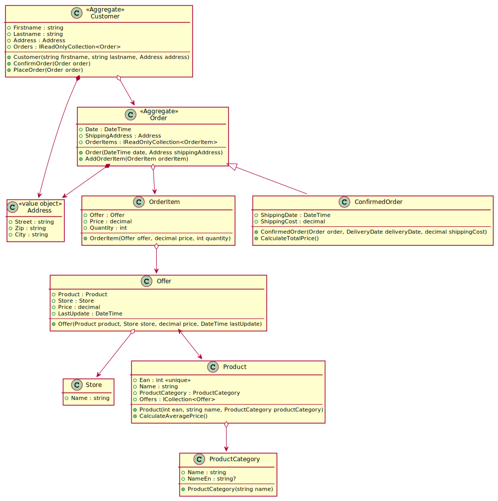
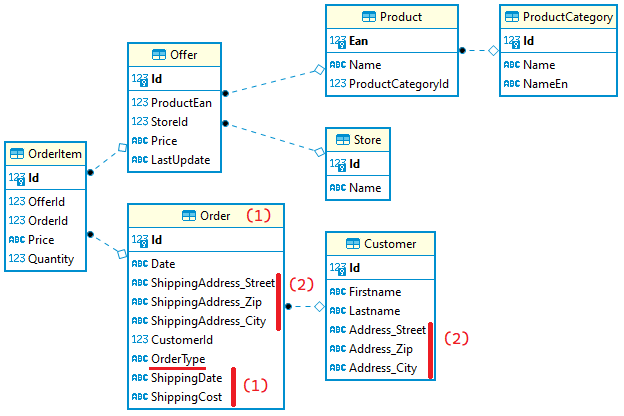
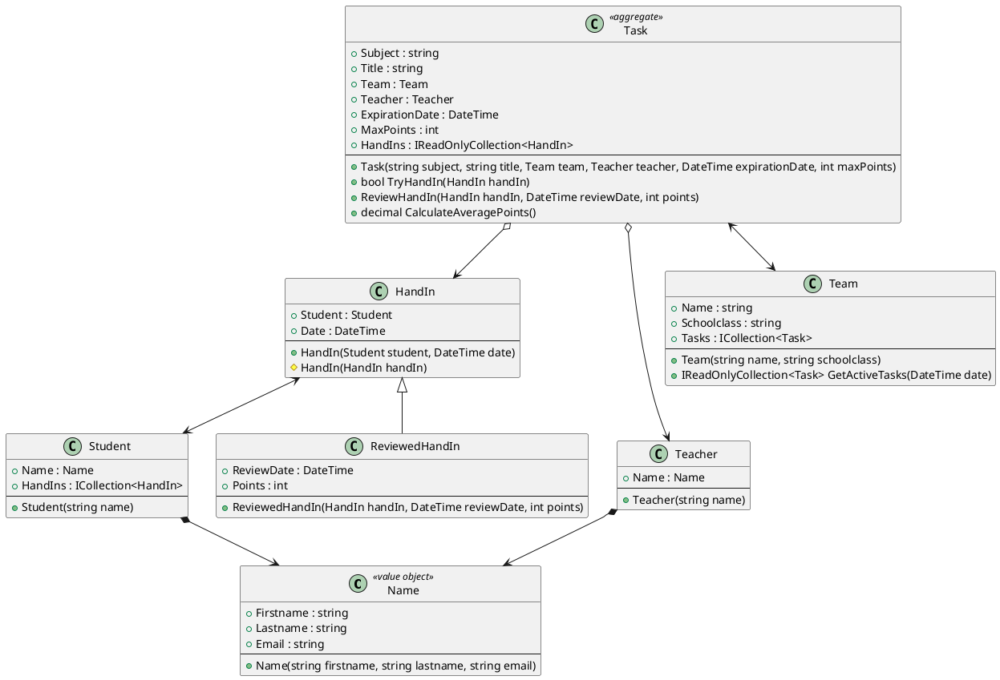

# Rich Domain Models mit EF Core

**Erweiterter Lehrplaninhalt für 3. JG, verpflichtend für 4. JG**

## Was ist ein "Rich Domain Model"?

Bis jetzt waren unsere Modelklassen reine datenhaltende Klassen. Sie enthielten
keinerlei Logik. Dies bezeichnet man auch als "Anemic Domain Model". Solche Modelle
haben jedoch Nachteile:

- Die Logik wird in der darüberliegenden Schicht untergebracht. Dies erhöht die Gefahr
von Codeduplizierungen.
- Oft sind Validierungen erforderlich (eine Bestellung kann z. B. nur aufgegeben werden, wenn
der Kunde ein Zahlungsmittel hinterlegt hat). Die Modelklassen können nach Belieben erstellt
werden, also kann auch ohne Prüfung eine Bestellung in die Datenbank geschrieben werden.
- Die darüberliegende Schicht (Servicelayer) ist mit reinen CRUD Operationen "überfrachtet".

Daher wollen wir uns von reinen Modelklassen lösen und gehen zurück zum Beginn der
Programmierausbildung. Dort wurden Klassen mit Feldern und Methoden definiert. An eine
Persistierung wurde gar nicht gedacht, alle Daten waren im Hauptspeicher verfügbar.
Genau diese Technik verwenden wir beim Erstellen von Rich Domain Models wieder. Wir achten
nicht darauf, wie die Persistenz die Daten ablegt und schreiben einfach die Klassen aus
dem logischen Blickwinkel.

Eine gute Einführung ist auf der Seite
https://paulovich.net/rich-domain-model-with-ddd-tdd-reviewed/
dargestellt.

## Ein kleines Bestellsystem

Würde - bevor das Thema Persistenz behandelt wurde - ein kleines Bestellsystem entworfen
werden, könnte es so aussehen:


<sup>
https://www.plantuml.com/plantuml/uml/VLJ1RjmW4BtlLt1qslKFH9QRo4cbI56JDkcbDsec3XK61yQHLcd-lU01rakskmS3Z-7DcpSB5mwvnNbKcsSfWC4uuOwDWCz6k4slk7Fi0Oq5zhPX_lVv6n-1dJE7LkfXyxw9CNTFJs1P2hgtHimz-hWu8vY8peamHSe-G09wEN95u2rt-7CI7CFEbHyUvKZnTLrJo9AlIdac6hTHgWlVRU9aKyYnpKHCPVepNm0fDtNTqka8D068_B78jEmumc3ixhWb6RhM6VnoABxWgIY8QJu6HKMsbEMQ1pwfaJNDhENB36txt_obqlDI-yf5vtTlEgCKz2YDRXQmFQgu2kc1worRITv-y6KwN9yHHyTLFokFNRw2vGCihQz2mV4yDQ4WIsvS2c71kQPvvMe6Pdx_yNBRDhdpW1O02nT-oQb0EecxzR-NkBlPeHb3qvlBOR0mS8GzzLTf7UgF7j_oet0Kwj4uYrPR4Qt-0LpSQRLRMHusIykJgFJlU4eoilcA9o3bv3GcmutsXyQ5l5g-p8HltBvNl8SZc--RxCUdq918db5gqt8aDeSMnzsxAcunTUjPJfCluPHNDmZZ2RyeeF2CgiaNNN1ScUCEavxbTcMsAi-OIRFWHu1psH4FOEbGT2Fw3aGSZSWrdpIaCmwBrp0NjwSjU-RVDb3o5Unk8HVxnUeLTAiKvOryDCZL_ZuM1TJpLF-DfRFSycpLs-ejyTgNySJZ_dtc6kaQIer5_t8dYCs4R_cGXsFi9R84kVaKjOW4N80MywZ-0G00
</sup>

Dieses Rich Domain Model bietet durch die Verwendung von Methoden viele Vorteile:

- **ConfirmOrder()** berechnet die ShippingCost und das ShippingDate aufgrund der
  Daten im Customer. Diese Methode ist daher in dieser Klasse viel besser aufgehoben als
  in einer darüberliegenden Schicht.
- **PlaceOrder()** fügt eine Bestellung in die Liste *Orders* ein und kann Prüfungen durchführen.
- **AddOrderItem()** prüft, ob das Angebot schon in den OrderItems enthalten ist. Wenn ja,
  wird die Anzahl einfach erhöht statt ein neues OrderItem anzulegen.
- **CalculateAveragePrice()** kann aufgrund der Liste der Offers berechnen, zu welchem
  Preis im Mittel das Produkt angeboten wird.

Diese Methoden brauchen natürlich die Daten in den Klassen, damit sie funktionieren. Das muss
beim Definieren der Methoden im Klassenmodell immer berücksichtigt werden. So kann z. B. 
*CalculateAveragePrice()* nur den Durchschnittspreis berechnen, wenn sich eine Liste der Offers
in der Klasse befindet.
**Methoden in der Domain können nicht auf die Datenbank greifen und nach Belieben "nachladen"!**

Folgende Designpatterns fallen auf:

### Aggregates

Einige Klassen wie *Customer* und *Ordner* verwalten eine Collection (die Liste der Orders oder
die Liste der OrderItems). Daher bezeichnen wir die Klasse als *Aggregate*. Ein *Aggregate*
verwaltet die Elemente "seiner" Collection und achtet darauf, dass nicht falsche Werte
hinzugefügt werden können. Beachte den Datentyp der Collection: *IReadOnlyList\<T\>*.
Dadurch ist es nicht möglich, z. B. außerhalb der *PlaceOrder()* Methode eine Bestellung
hinzuzufügen. Deswegen hat die Klasse *Order* auch keine Navigation zum *Customer*, da der
Kunde die Bestellungen verwaltet und der Zugriff auch immer über den Kunden erfolgt.

### Beidseitige Navigations

Die Pfeile in diesem Diagramm haben manchmal 2 Pfeilspitzen. So speichert *Product* eine
Liste der Klasse *Offer*. Somit kann sehr bequem auf alle Angebote des Produktes zugegriffen
werden. Umgekehrt speichert die Klasse *Offer* das zugehörige *Product*. Wir sprechen hier
von einer *beidseitigen Navigation*.

### Verwenden von Vererbung

Oftmals durchlaufen Objekte einen State, wo Informationen hinzugefügt werden. Eine Bestellung
(*Order*) wird mit den Grunddaten angelegt. Wird die Bestellung bearbeitet, entstehen
neue Daten (*ShippingDate* und *ShippingCost*). Ohne Vererbung müssten diese Felder
nullable sein, da erst nach der Bearbeitung Werte zur Verfügung stehen. Dies sollte jedoch
vermieden werden. Was passiert, wenn z. B. *ShippingDate* ausgefüllt wird, aber *ShippingCost*
noch null ist?

Vererbung hilft also, nullable Werte zu reduzieren und erhöht so die Sicherheit des Codes.

### Value Objects

Oft werden Properties, die logisch zusammenhängend sind (also ein "zusammengesetztes Attribut" bilden)
als einzelne Properties in den Modelklassen definiert:

```c#
public class Customer 
{
    /* ... */
    public string Street {get; set;}
    public string Zip {get; set;}
    public string City {get; set;}
}

public class Shop 
{
    /* ... */
    public string Street {get; set;}
    public string Zip {get; set;}
    public string City {get; set;}
}
```

Die mit C# 9 eingeführten Records (sind immutable und bieten eine Überladung von *Equals*) helfen
uns, mit sehr wenig Code solche zusammengesetzten Attribute zu definieren.

```c#
public record Address(string Street, string Zip, string City);
public class Customer 
{
    /* ... */
    public Address Address {get; set;}
}

public class Shop 
{
    /* ... */
    public Address Address {get; set;}
}
```

In der Sprache der Domainmodellierung bezeichnen wir diese Klassen als *value objects*. Sie werden
später in die Datenbanktabelle als eigene Spalten (1 Spalte pro Property) integriert.

## Umsetzung mit EF Core

Im Projekt [RichDomainModelDemo](../RichDomainModelDemo) ist dieses Modell fertig mit
Unittests und Kommentaren umgesetzt. Die erzeugte Datenbank hat folgendes Aussehen:



### Vererbung

In EF Core kann Vererbung ohne besondere Berücksichtigung verwendet werden:

```c#
[Table("Order")]
public class Order
{
    public Order(DateTime date, Address shippingAddress) { /* ... */ }
    public Order(Order order) { /* ... */ }
    #pragma warning disable CS8618 
    protected Order() { }
    #pragma warning restore CS8618

    public int Id { get; private set; }
    /* ... */
}
public class ConfirmedOrder : Order
{
    public ConfirmedOrder(Order order, DateTime shippingDate, decimal shippingCost) : base(order)
    {
        /* ... */
    }
    #pragma warning disable CS8618
    protected ConfirmedOrder() { }               // For EF Core
    #pragma warning restore CS8618
    public DateTime ShippingDate { get; set; }
    /* ... */
}
```

Da EF Core einen parameterlosen Konstruktor braucht, wird dieser *protected* angelegt.
Dies ist notwendig, damit die Weiterleitung des Konstruktors von *ConfirmedOrder* auf
*Order* funktioniert.

Es wird im Hintergrund eine Tabelle (Table per Hierarchy, TBH) *Order* in der Datenbank angelegt.
Alle Attribute der Unterklassen werden automatisch als nullable definiert und zu dieser
Tabelle hinzugefügt. Zusätzlich
wird eine Spalte *Discriminator* erzeugt. Sie beinhaltet den Namen des konkreten Typs
(*Order* oder *ConfirmedOrder*). Damit kann EF Core auch den richtigen C# Typ wiederherstellen
und der gelesene Datensatz kann z. B. mit *is* geprüft werden. Dies ist auch im ER
Diagramm unter (1) erkennbar.

#### Mapping des Discriminators

Soll der Wert des Discriminators als Property verfügbar gemacht werden, kann ein string
Property dafür definiert werden. Es darf allerdings nicht den Namen *Discriminator*
haben, deswegen verwenden wir hier den Namen *OrderType*. Damit das Property auch als
Discriminator verwendet wird, wird es in *OnModelCreating()* mit der Methode
*HasDiscriminator()* definiert.

Das Property ist wichtig, um UPDATE Statements zu erzeugen, wenn ein Datensatz von
*Order* auf *ConfirmedOrder* geändert wird. Ansonsten aktualisiert EF Core nicht den
Wert des Discriminators!

```c#
[Table("Order")]
public class Order
{
    /* ... */
    public int Id { get; private set; }
    public string OrderType { get; private set; } = default!;
    /* ... */
}

public class StoreContext : DbContext
{
    /* ... */
    protected override void OnModelCreating(ModelBuilder modelBuilder)
    {
        modelBuilder.Entity<Order>().HasDiscriminator(o => o.OrderType);
    }
}
```

### Value objects

Im ER Diagramm fällt bei den Tabellen *Order* und *Customer* auf, dass die
Properties der Adressklasse in die Tabelle integriert wurden. Das Namensschema ist
*Property Name des Value Objects + Property Name im Value Object*. Dadurch muss
die Datenbank keine JOIN Operation durchführen, wenn die Adresse eines Kunden
gelesen wird.

Da ein Value object zusammenhängende Properties darstellt, definieren wir es als
C# 9 Record. Dadurch muss - wenn ein Property geändert werden soll - ein neues Objekt
erstellt werden. Zudem definiert ein Record automatisch *Equals()* und den 
Vergleichsoeprator über die Inhaltsgleichheit aller Properties.

Value objects müssen mit *OwnsOne()* definiert werden, da EF Core sonst versucht eine
Tabelle Address anzulegen und scheitert, da der Record keinen Primärschlüssel hat.

```c#
public record Address([MaxLength(255)] string Street, [MaxLength(255)] string Zip, [MaxLength(255)] string City);

public class StoreContext : DbContext
{
    /* ... */
    protected override void OnModelCreating(ModelBuilder modelBuilder)
    {
        modelBuilder.Entity<Customer>().OwnsOne(c => c.Address);
        modelBuilder.Entity<Order>().OwnsOne(o => o.ShippingAddress);
    }
}
```

### Lazy Loading und Collection Navigations

Nach unserem Klassenmodell soll die Klasse *Product* eine Methode *CalculateAveragePrice()*
besitzen. Dies ist auf den ersten Blick einfach, auf den zweiten Blick ergeben sich
jedoch Schwierigkeiten. Da die Daten aus einer relationalen Datenbank gelesen werden,
stehen innerhalb der Klasse *Product* nur die Properties, die in der selben Tabelle gemappt
sind, zur Verfügung.

Für die Logik benötigen wir jedoch alle Angebote des Produktes. Die Implementierung
sieht so aus:

```c#
public class Product
{
    public Product(int ean, string name, ProductCategory productCategory)
    {
      /* ... */
    }
    #pragma warning disable CS8618
    protected Product() { }
    #pragma warning restore CS8618

    public int ProductCategoryId { get; set; }            // Value of the FK
    public virtual ProductCategory ProductCategory { get; set; }  // Navigation property

    public virtual ICollection<Offer> Offers { get; } = new List<Offer>();
    public decimal AveragePrice => Offers.Average(o => o.Price);
}
```

Wir erkennen, dass *Offers* vom Typ *ICollection\<T\>* ist und als *virtual* definiert
wurde. Damit EF Core die Daten bei Bedarf nachladen kann, muss ein sogenanntes
Proxy Objekt erstellt werden, welches die Liste Offers mit entsprechender Logik
zum Nachladen überschreibt. Deswegen sind alle unsere Navigation Properties, die auf
andere Tabellen verweisen, als *virtual* gekennzeichnet.

> **Hinweis:** Das Lazy Loading Feature wird kontrovers diskutiert. Es entsteht der
> Eindruck, dass die Daten im Speicher - also sofort vorhanden - sind. In Wirklichkeit
> werden indirekte Datenbankabfragen generiert. Die Methoden, die Navigations auf diesem
> Wege nutzen, müssen also darauf Rücksicht nehmen. Ein guter Beitrag über das
> N + 1 Problem ist auf
> https://blog.jetbrains.com/dotnet/2021/02/24/entity-framework-core-5-pitfalls-to-avoid-and-ideas-to-try/
> zu finden.

Um das Feature zu aktivieren, muss in den Optionen *UseLazyLoadingProxies()* aktiviert
werden. In den Unittests erledigt dies die Methode *TestHelpers.GetDbContext()*:

```c#
public static StoreContext GetDbContext(bool deleteDB = false)
{
    /* ... */
    return new StoreContext(opt
        .UseLazyLoadingProxies()
        .LogTo((message) => Debug.WriteLine(message), Microsoft.Extensions.Logging.LogLevel.Information)
        .Options);
}
```

### Aggregates: Readonly Collections und Backing Fields

Ein *Aggregate* ist eine Klasse, die eine Menge von Datensätzen verwaltet. In unserem
Modell ist die Klasse *Customer* ein Aggregate für die Bestellungen (*Order*). Somit
können Bestellungen nur über den Customer hinzugefügt und entfernt werden. Um das
zu erreichen, muss die Implementierung entsprechend abgesichert werden.
- *Customer* gibt die Liste der Bestellungen als *IReadOnlyCollection* nach außen. Somit
  kann durch *Add()* nichts ohne Kontrolle hinzugefügt oder entfernt werden.
- Innerhalb der Klasse benötigen wir natürlich Schreibzugriff. Daher legen wir ein
  sogenanntes *Backing Field* an. Dieses Feld ist vom Typ *List\<T\>* und erlaubt
  den Vollzugriff. EF Core erkennt Backing Fields durch eine Convention:
  *_\<\<Propertyname\>\>*. Somit wird *_orders* automatisch mit *Orders* verbunden
  und befüllt.
- Die Klasse *Order* hat keinen Kunden im Konstruktor. Somit ist auch das Hinzufügen
  über die Datenbank selbst nicht möglich. EF Core setzt automatisch den Kunden,
  wenn er über die Navigation *_orders* des Kunden hinzugefügt wird. Deswegen
  setzen wir mit *Customer = default!* im Konstruktor die Navigation auch auf den
  Defaultwert (null).
- Damit der Kunde der Bestellung nicht neu gesetzt werden kann, sind die Properties
  *CustomerId* und *Customer* mit der Sichtbarkeit *private set* versehen.
- Die Navigations zum Kunden in der Klasse *Order* können auch weggelassen werden, was
  allerdings zu Fehlern bei der UPDATE Generierung führen kann. Außerdem können
  z. B. Statistikabfragen schwerer ausgeführt werden.

```c#
public class Customer
{
    /* ... */
    protected List<Order> _orders = new();
    public virtual IReadOnlyCollection<Order> Orders => _orders; 
    public void AddOrder(Order order)
    {
        _orders.Add(order);
    }
}

public class Order
{
    public Order(DateTime date, Address shippingAddress)
    {
        Date = date;
        ShippingAddress = shippingAddress;
        Customer = default!;
    }
    public int CustomerId { get; private set; } 
    public virtual Customer Customer { get; private set; }
    /* ... */
}
```

## Übung

Erweitere das Übungsmodell über die Abgabenverwaltung aus den vorigen Kapiteln.
- Der Name wird als value object definiert. Verwende C# 9 Records zur Definition
  des Objektes. Achte auf die korrekte Konfuration im Context mittels *OwnsOne()*.
- In der Klasse *Team* liefert die Methode *GetActiveTasks()* alle Tasks zurück, wo das
  *ExpirationDate* größer als das übergebene Datum ist.
- Task ist ein Aggregate für die Abgaben (hand ins).
  - Niemand darf Abgaben direkt in die Datenbank schreiben. Stelle dies durch die
    Verwendung einer *IReadOnlyCollection* sicher. Zudem hat HandIn keinen Task
    im Konstruktor.
  - *TryHandIn()* fügt eine Abgabe hinzu, wenn das gespeicherte Abgabedatum innerhalb
    des Abgabezeitraumes (*ExpirationDate*) liegt. Ist dem nicht so, liefert die
    Methode false.
  - *ReviewHandIn()* aktualisiert die übergebene Abgabe und erzeugt ein *ReviewedHandIn*.
  - *CalculateAveragePoints()* kann als Property ausgeführt werden und berechnet die
    durchschnittlichen Punkte der Abgaben. Berücksichtige nur Abgaben vom Typ *ReviewedHandIn*.

Erstelle für die Klasse Task eine Testklasse *TaskTests* im Unittest Projekt. Prüfe danach deine
Implementierung durch jeweils einen Success-Test pro Methode.

