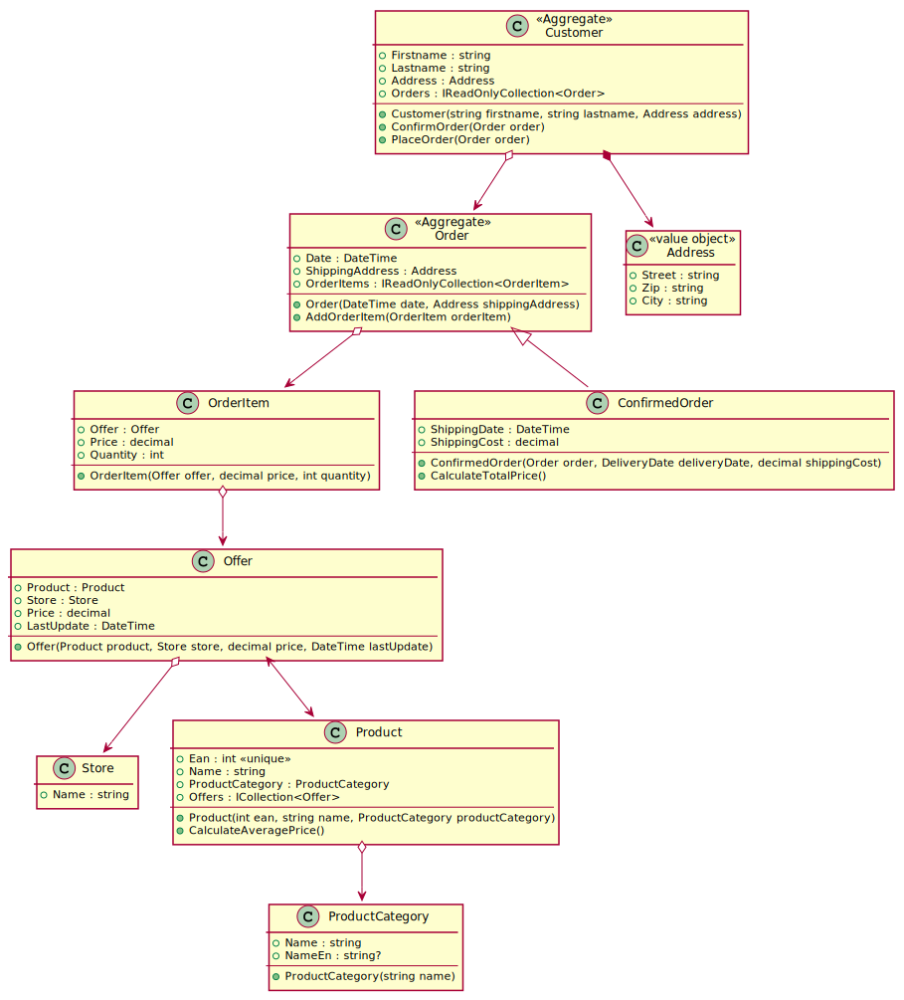

# Rich Domain Models mit EF Core

**Erweiterter Lehrplaninhalt (= schwer)**

## Was ist ein "Rich Domain Model"?

Bis jetzt waren unsere Modelklassen reine datenhaltende Klassen. Sie enthielten
keinerlei Logik. Dies bezeichnet man auch als "Anemic Domain Model". Solche Modelle
haben jedoch Nachteile:

- Die Logik wird in der darüberliegenden Schicht untergebracht. Dies erhöht die Gefahr
von Codeduplizierungen.
- Oft sind Validierungen erforderlich (eine Bestellung kann z. B. nur aufgegeben werden, wenn
der Kunde ein Zahlungsmittel hinterlegt hat). Die Modelklassen können nach Belieben erstellt
werden, also kann auch ohne Prüfung eine Bestellung in die Datenbank geschrieben werden.
- Die darüberliegende Schicht (Servicelayer) ist mit reinen CRUD Operationen "überfrachtet".

Daher wollen wir uns von den reinen Modelklassen lösen und gehen zurück zum Beginn der
Programmierausbildung. Dort wurden Klassen mit Feldern und Methoden definiert. An eine
Persistierung wurde gar nicht gedacht, alle Daten waren im Hauptspeicher verfügbar.
Genau diese Technik verwenden wir beim Erstellen von Rich Domain Models wieder. Wir achten
nicht darauf, wie die Persistenz die Daten ablegt und schreiben einfach die Klassen aus
dem logischen Blickwinkel.

Eine gute Einführung ist auf der Seite
https://paulovich.net/rich-domain-model-with-ddd-tdd-reviewed/
dargestellt.

## Ein kleines Bestellsystem

Würde - bevor das Thema Persistenz behandelt wurde - ein kleines Bestellsystem entworfen
werden, könnte es so aussehen:


<sup>
https://www.plantuml.com/plantuml/uml/VLJ1RjmW4BtxApXkslKFH9QRo4cbI56JDkcbDsec3XK61yQHLcd-lU01rakskmS3Z-7DcpSB5mwvnNbKrRCKm62SSCT6m6SZNDKhxXnxG6E1lLNC_pv_uoEmS-RGIZrKxrMCkNjw0ijIqBqrOkxHnyKPmKHqJeGfKlO14j3BaIi2Rxd3dvFW67Qk_F0eHuglwvf2bdoRb6UYSHkbkl3T9ausXHpRJCHKfZ_p1P1oKzSjdOv04u387ujCouuZ3CRkZbkIeMkTmI-7uWkU3GKnpSUWgCYMibppm2SrigQPjNoPeMt_cxzKUbvgNxde_EvDPvI27gNHpGAsHnLlGdhWUijMahSVV9aErsV4qN7LpyfZbwzW-G1BwpUXu7YUcb2G9JSkXR3WNDEySZK3Cx__UBbjcznvG0k0XGk_v5GWdSJT-jzBtDtiq8oXwStbC5WOECAU-gkq3lL7Zs_vKJWAzMYSHQkjY5R_02xkjDgjBG-RXUL9LFftF2KPsNp54v1oSXgJuKRxG-D2lbc-p8HltBvNl8SZc-zLzkDJQ4WapoYrQJaIcqEBu-vT5RUOklKifycNSCgh6uJnX5yKK7X6rUIBBZYkp767ISzokpBR9i-OIRFWHu1psH5FfKUJWLXYrRd0azLtnc7nzELAzhHbW_n31ag-Wjqjv6A_M3rvRfMYl7wF1hdQNxwYW7gUwh-nJfRxctrvMpqSNlioddZ9lyzS8zqvgR5eLhQTs4pubgzsECPU8akGcqzHFqX0TG5QpAFw1m00
</sup>

Dieses Rich Domain Model bietet durch die Verwendung von Methoden viele Vorteile:

- **ConfirmOrder()** berechnet die ShippingCost und das ShippingDate aufgrund der
  Daten im Customer. Diese Methode ist daher in dieser Klasse viel besser aufgehoben als
  in einer darüberliegenden Schicht.
- **PlaceOrder()** fügt eine Bestellung in die Liste *Orders* ein und kann Prüfen durchführen.
- **AddOrderItem()** prüft, ob das Angebot schon in den OrderItems enthalten ist. Wenn ja,
  wird die Anzahl einfach erhöht statt ein neues OrderItem anzulegen.
- **CalculateAveragePrice()** kann aufgrund der Liste der Offers berechnen, zu welchem
  Preis im Mittel das Produkt angeboten wird.

Diese Methoden brauchen natürlich die Daten in den Klassen, damit sie funktionieren. Das muss
beim Definieren der Methoden im Klassenmodell immer berücksichtigt werden. So kann z. B. 
*CalculateAveragePrice()* nur den Durchschnittspreis berechnen, wenn sich eine Liste der Offers
in der Klasse befindet.
**Methoden in der Domain können nicht auf die Datenbank greifen und nach belieben "nachladen"!**

Folgende Designpatterns fallen auf:

### Aggregates

Einige Klassen wie *Customer* und *Ordner* speichern eine Collection (die Liste der Orders oder
die Liste der OrderItems). Daher bezeichnen wir die Klasse als *Aggregate*. Ein *Aggregate*
verwaltet die Elemente "seiner" Collection und achtet darauf, dass nicht falsche Werte
hinzugefügt werden können. Beachte den Datentyp der Collection: *IReadOnlyList\<T\>*.
Dadurch ist es nicht möglich, z. B. außerhalb der *PlaceOrder()* Methode eine Bestellung
hinzuzufügen. Deswegen hat die Klasse *Order* auch keine Navigation zum *Customer*, da der
Kunde die Bestellungen verwaltet.

### Beidseitige Navigations

Die Pfeile in diesem Diagramm haben manchmal 2 Pfeilspitzen. So speichert *Product* eine
Liste der Klasse *Offer*. Somit kann sehr bequem auf alle Angebote des Produktes zugegriffen
werden. Umgekehrt speichert die Klasse *Offer* das zugehörige *Product*. Wir sprechen hier
von einer *beidseitigen Navigation*.

### Verwenden von Vererbung

Oftmals durchlaufen Objekte einen State, wo Informationen hinzugefügt werden. Eine Bestellung
(*Order*) wird mit den Grunddaten angelegt. Wird die Bestellung dann bearbeitet, entstehen
neue Daten (*ShippingDate* und *ShippingCost*). Ohne Vererbung müssten diese Felder
nullable sein, da erst nach der Bearbeitung Werte zur Verfügung stehen. Dies sollte jedoch
vermieden werden. Was passiert, wenn z. B. *ShippingDate* ausgefüllt wird, aber *ShippingCost*
noch null ist?

Vererbung hilft also, nullable Werte zu reduzieren und erhöht so die Sicherheit des Codes.

### Value Objects

Oft werden Properties, die logisch zusammenhängend sind (also ein "zusammengesetztes Attribut" bilden)
als einzelne Properties in den Modelklassen definiert:

```c#
public class Customer 
{
    /* ... */
    public string Street {get; set;}
    public string Zip {get; set;}
    public string City {get; set;}
}

public class Shop 
{
    /* ... */
    public string Street {get; set;}
    public string Zip {get; set;}
    public string City {get; set;}
}
```

Die mit C# 9 eingeführten Records (sind immutable und bieten eine Überladung von *Equals*) helfen
uns, mit sehr wenig Code solche zusammengesetzten Attribute zu definieren.

```c#
public record Address(string Street, string Zip, string City);
public class Customer 
{
    /* ... */
    public Address Address {get; set;}
}

public class Shop 
{
    /* ... */
    public Address Address {get; set;}
}
```

In der Sprache der Domainmodellierung bezeichnen wir diese Klassen als *value objects*. Sie werden
später in die Datenbanktabelle als eigene Spalten (1 Spalte pro Property) integriert.

https://blog.jetbrains.com/dotnet/2021/02/24/entity-framework-core-5-pitfalls-to-avoid-and-ideas-to-try/

## Umsetzung mit EF Core

Im Projekt [RichDomainModelDemo](../RichDomainModelDemo) ist dieses Modell fertig mit
Unittests und Kommentaren umgesetzt.