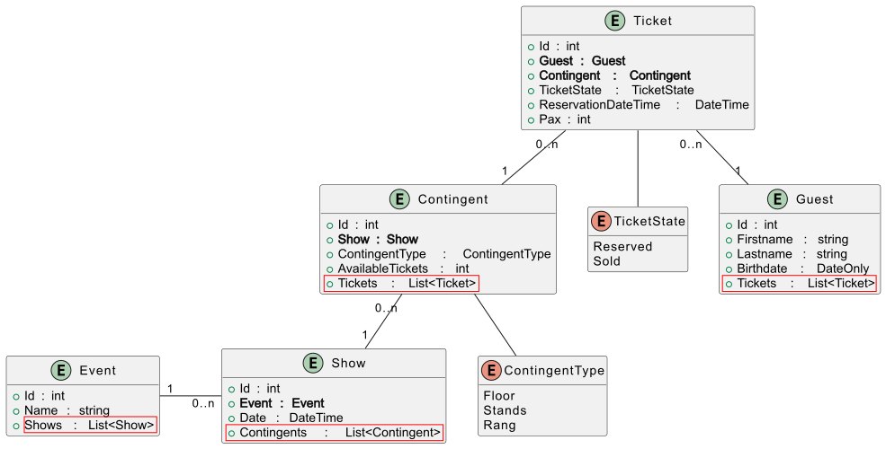

= Services mit EF Core
:source-highlighter: rouge
:icons: font
:lang: DE
:hyphens:
ifndef::env-github[:icons: font]
ifdef::env-github[]
:caution-caption: :fire:
:important-caption: :exclamation:
:note-caption: :paperclip:
:tip-caption: :bulb:
:warning-caption: :warning:
endif::[]

[NOTE]
Für dieses Kapitel solltest du das Kapitel link:../../02%20Linq/02_Filterung/README.md[Filtern mit Where, All und Any] und link:../../02%20Linq/03_Projection/README.md[Projektionen mit Select] aus dem Bereich LINQ beherrschen.

== Abfragen mit DTO Klassen für das Domain Model schreiben

Bis jetzt konnten wir mit dem OR Mapper EF Core Datenbanken erstellen und mit dem Paket Bogus Daten generieren.
Es gibt allerdings noch weitere Aufgaben, die wir in Umgang mit Datenbanken erledigen müssen:

* Abfragen (Queries) schreiben
* Businesslogik implementieren

Als konkretes Beispiel wollen wir ein Event Management System erstellen.

Das Domain Model sieht so aus:

link:https://www.plantuml.com/plantuml/uml/TL9BJm8n4BxlhsZsQY1wtHY33p4cn1ZWwANQaMtiWxIpA37-TzkEkziibGlzlg7VOyh28tVOQLMrKW03lSSZqu2j5Ru2WpB0-qCuiE-AXS_Pes0DamO9FN4D0Njqqko8shJsqmTk9JrUHd1L_LIzLCHb9J9fo8oeEuvHF7vjfGOYRwt1u0K61vEHIbR9epwVpqtDPWhUSSRgYvhr1YyOqtIQZTUsnptyfLegQrqwRP0RuTDnpSrkB95TB5T90PhKbOY9KpEnfXzT7xXK_5M5hcyVW3vN96eed22L7PM6obGtkkVJG4zSQGka5SfYlu8rU7074BG5gqHM_Q43_q_hfNGUpUd_OSMBz8rqs8hI2vVBPY68AQUWW0q5dMu_tppICA_Vi0pHc7R1KLhJXpp9-yo_A46CI0gJjnXDotCAIwF8vJ4MO4IdrIy0[PlantUML Source]

[NOTE]
Von besonderer Bedeutung sind die _Navigation Properties_.
Mit den fett gedruckten Properties können wir auf das verknüpfte Entity zugreifen.
Mit den Listen können wir von der "1"-Seite einer 1:n Beziehung auf die "n"-Seite zugreifen.
Somit müssen wir in LINQ keine Joins schreiben, sondern können die Navigation Properties verwenden.

Ein Service ist eine Klasse, die im Konstruktor eine DbContext Instanz übergeben bekommt und Methoden bereitstellt, die Operationen auf der Datenbank ausführen.

[source,csharp]
----
public class EventService
{
    private readonly EventContext _db;

    public EventService(EventContext db)
    {
        _db = db;
    }
}
----

Mit Hilfe des Feldes `_db` können wir jetzt Abfragen auf der Datenbank ausführen.
Unsere Klasse soll z. B. alle Shows in einem Zeitbereich zurückliefern.
Eine Methode könnte so aussehen:

[source,csharp]
----
public List<Show> GetShowsInDateRange(DateTime start, DateTime end)
{
    return _db.Shows
        .Where(s => s.Date >= start && s.Date <= end)
        .ToList();
}
----

Da EF Core LINQ Abfragen in SQL übersetzt, wird die Abfrage in der Methode in eine SQL Anweisung umgewandelt.
Es wird nicht die ganze Tabelle in den Speicher geladen, sondern nur die passenden Datensätze abgefragt.

[source,sql]
----
SELECT "s"."Id", "s"."Date", "s"."EventId"
FROM "Shows" AS "s"
WHERE "s"."Date" >= @__start_0 AND "s"."Date" <= @__end_1
----

Diese Methode liefert uns eine Liste der Modelklasse _Show_ zurück.
Es gibt allerdings Situationen, in denen wir nicht nur filtern möchten, sondern auch

* nur bestimmte Felder zurückliefern wollen
* Felder aus mehreren Tabellen benötigen
* Felder berechnen müssen.

Hier definieren wir sogenannte *DTO (Data Transfer Object) Klassen*, die nur die benötigten Felder enthalten.

Ein Beispiel liefert alle Events und die Anzahl der Shows pro Event:

[source,csharp]
----
public record EventWithShowCountDto(int EventId, string EventName, int ShowCount);
----

Hier wird ein _positional record_ in C# erstellt.
Der Compiler erstellt eine Klasse mit 3 read-only Properties und einem Konstruktor, der die Properties initialisiert.
Dadurch ersparen wir uns viel Boilerplate Code.
Beachte, dass die Argumente deswegen mit einem Großbuchstaben beginnen, weil sie zu Properties werden.

Nun verwenden wir dieses DTO in einer Abfragemethode:

[source,csharp]
----
public List<EventWithShowCountDto> GetEventsWithShowCount()
{
    return _db.Events
        .Select(e => new EventWithShowCountDto(e.Id, e.Name, e.Shows.Count))
        .ToList();
}
----

Das _Select_ führt die Projektion auf das DTO durch.
EF Core lädt alle Daten aus den Navigation Properties automatisch mit, um die Anzahl der Shows zu ermitteln.
Mit _ToList()_ wird die Abfrage ausgeführt und die Ergebnisse in eine Liste umgewandelt.

Im generierten SQL sehen wir, dass die Daten aus zwei Tabellen abgefragt werden:

[source,sql]
----
SELECT 
    "e"."Id", "e"."Name",
    (SELECT COUNT(*) FROM "Shows" AS "s" WHERE "e"."Id" = "s"."EventId")
FROM "Events" AS "e"
----

----
EventId  EventName         ShowCount
-------------------------------------
      1  Stage And Screen          3
      2  Funk                      4
      3  World                     5
      4  Rap                       9
      5  Country                   4
----

Nun möchten wir für bestimmte Events die Shows mit zurückliefern.
Wir können verschachtelte DTOs erstellen, die diese Struktur abbilden:

[source,csharp]
----
public record EventWithShowsDto(int EventId, string EventName, List<ShowDto> Shows);
public record ShowDto(int ShowId, DateTime Date);
----

Die Abfragemethode sieht dann so aus:

[source,csharp]
----
public List<EventWithShowsDto> GetEventsWithShows()
{
    return _db.Events
        .Select(e => new EventWithShowsDto(
            e.Id, e.Name,
            e.Shows.Select(s => new ShowDto(s.Id, s.Date)).ToList()))
        .ToList();
}
----

Beachte das _ToList()_ im inneren _Select_, da die DTO Klasse _EventWithShowsDto_ eine Liste von _ShowDto_ Objekten erwartet.

[source,json]
----
[
    {"eventId":1,"eventName":"Stage And Screen","shows":[
        {"showId":1,"date":"2024-05-04T19:00:00"},
        {"showId":14,"date":"2024-04-27T18:00:00"},
        {"showId":15,"date":"2023-12-23T19:00:00"}]},
    {"eventId":2,"eventName":"Funk","shows":[
        {"showId":3,"date":"2023-06-16T18:00:00"},
        {"showId":5,"date":"2023-10-08T19:00:00"},
        {"showId":9,"date":"2024-05-28T20:00:00"},
        {"showId":25,"date":"2023-07-16T18:00:00"}]},
    {"eventId":3,"eventName":"World","shows":[
        {"showId":8,"date":"2024-03-09T19:00:00"},
        {"showId":10,"date":"2024-02-05T20:00:00"},
        {"showId":18,"date":"2024-02-20T18:00:00"},
        {"showId":21,"date":"2023-10-31T19:00:00"},
        {"showId":22,"date":"2024-02-09T18:00:00"}]},
    {"eventId":4,"eventName":"Rap","shows":[
        {"showId":2,"date":"2023-07-28T19:00:00"},
        {"showId":6,"date":"2023-10-28T18:00:00"},
        {"showId":7,"date":"2023-07-29T19:00:00"},
        {"showId":12,"date":"2023-10-21T19:00:00"},
        {"showId":13,"date":"2023-09-25T18:00:00"},
        {"showId":16,"date":"2024-04-04T18:00:00"},
        {"showId":17,"date":"2024-05-02T18:00:00"},
        {"showId":20,"date":"2024-02-04T18:00:00"},
        {"showId":24,"date":"2024-01-30T18:00:00"}]},
    {"eventId":5,"eventName":"Country","shows":[
        {"showId":4,"date":"2023-12-20T18:00:00"},
        {"showId":11,"date":"2023-09-24T19:00:00"},
        {"showId":19,"date":"2024-01-12T18:00:00"},
        {"showId":23,"date":"2023-06-11T20:00:00"}]}
]
----

Wir sehen, dass wir mit verschachtelten DTOs hierarchische Datenstrukturen abbilden können.
Dies wird dann beim Erstellen einer Rest API sehr nützlich, da das Frontend oft diese Strukturen benötigt.

Möchten wir Parameter verwenden, können wir dies natürlich auch einbauen.

[source,csharp]
----
public EventWithShowsDto? GetEventsWithShows(int eventId)
{
    return _db.Events
        .Where(e => e.Id == eventId)
        .Select(e => new EventWithShowsDto(
            e.Id, e.Name,
            e.Shows.Select(s => new ShowDto(s.Id, s.Date)).ToList()))
        .FirstOrDefault();
}
----

[NOTE]
Wir schreiben _FirstOrDefault()_ nicht als erstes Statement, da wir Navigation Properties für die Projektion benötigen und diese mit EF Core nur vor der Ausführung der Abfrage automatisch geladen werden.

Diese Abfrage verwendet am Ende _FirstOrDefault()_, um nur ein einzelnes Ergebnis zurückzuliefern.
_FirstOrDefault()_ führt die Abfrage aus und gibt das erste Element der Abfrage zurück oder _null_, wenn kein Element gefunden wurde.
Deswegen ist der Rückgabewert der Methode auch nullable.

Das generierte SQL filtert zuerst die Events Tabelle und führt dann mit dem Ergebnis als Unterabfrage den Join auf die Shows Tabelle aus:

.Generiertes SQL
[source,sql]
----
SELECT "t"."Id", "t"."Name", "s"."Id", "s"."Date"
FROM (
    SELECT "e"."Id", "e"."Name" FROM "Events" AS "e" WHERE "e"."Id" = @__eventId_0 LIMIT 1
) AS "t"
LEFT JOIN "Shows" AS "s" ON "t"."Id" = "s"."EventId"
ORDER BY "t"."Id"
----

Solche Abfragemethoden können natürlich auch komplexere Berechnungen durchführen.
Wenn wir z. B. ein Dashboard befüllen wollen, benötigen wir Daten aus vielen verknüpften Tabellen.
Diese Methode berechnet zu jedem Kontingent die Anzahl der verkauften und reservierten Tickets.
_Pax_ ist die Anzahl der Begleitpersonen. Mit dem Gast selbst sind es also _Pax + 1_ Personen pro Ticket.

[source,csharp]
----
public record ContingentStatistics(int SoldTickets, int ReservedTickets, Show Show);
public ContingentStatistics CalcContingentStatistics(int contingentId)
{
    var statistics = _db.Contingents
        .Where(c => c.Id == contingentId)
        .Select(c => new ContingentStatistics(
            c.Tickets.Where(t => t.TicketState == TicketState.Sold).Sum(t => t.Pax + 1),
            c.Tickets.Where(t => t.TicketState == TicketState.Reserved).Sum(t => t.Pax + 1),
            c.Show))
        .FirstOrDefault();
    if (statistics is null) { throw new ApplicationException("Invalid contingent id"); }
    return statistics;
}
----

== Eager Loading vs. Projektion

Ein häufiger Fehler bei der Arbeit mit EF Core ist die Annahme, dass man immer `.Include()` verwenden muss, um auf verknüpfte Daten zuzugreifen.
Tatsächlich gibt es zwei grundlegend verschiedene Ansätze.

=== Eager Loading (Laden der gesamten Entities)

Beim **Eager Loading** sagen wir EF Core explizit, welche Navigation Properties (verknüpfte Tabellen) zusammen mit der Haupt-Entity geladen werden sollen.
Das Ergebnis sind vollständige Instanzen deiner Model-Klassen.

[source,csharp]
----
// Wir laden das Event-Objekt UND alle zugehörigen Show-Objekte vollständig in den Speicher
var eventWithShows = _db.Events
    .Include(e => e.Shows) 
    .FirstOrDefault(e => e.Id == 1);

// Danach können wir auf die Liste zugreifen
Console.WriteLine(eventWithShows.Shows.Count);
----

* **Vorteil:** Man erhält "echte" Entities, die man ändern und wieder mit `_db.SaveChanges()` speichern kann.
* **Nachteil:** Es werden oft viel mehr Daten geladen (alle Spalten), als eigentlich für die Anzeige benötigt werden.

=== Projektion (Abbildung auf DTOs)

Bei der **Projektion** verwenden wir `.Select()`, um genau zu definieren, welche Daten wir benötigen.
EF Core ist hier "intelligent" genug: Wenn du im `Select` auf ein Navigation Property zugreifst, erstellt EF Core den nötigen SQL-Join automatisch.

[source,csharp]
----
var eventDto = _db.Events
    .Where(e => e.Id == 1)
    .Select(e => new EventWithShowCountDto(
        e.Id, 
        e.Name, 
        e.Shows.Count // EF Core generiert hierfür automatisch den Join/Subquery!
    ))
    .FirstOrDefault();
----

[NOTE]
====
**Die goldene Regel:**
Wenn du `.Select()` verwendest, ist ein zusätzliches `.Include()` absolut **unnötig** und wird von EF Core ignoriert.
Das `Select` definiert bereits alles, was geladen werden muss.
====

=== Vergleich der Ansätze

[cols="1,2,2", options="header"]
|===
| Merkmal | Eager Loading (`.Include`) | Projektion (`.Select`)
| **Rückgabetyp** | Model-Klasse (z. B. `Event`) | DTO-Klasse (z. B. `EventDto`)
| **Verwendung** | Wenn Daten geändert/gelöscht werden sollen. | Wenn Daten nur angezeigt werden (Read-only / API).
| **Performance** | Schlechter (lädt alle Spalten beider Tabellen). | Optimal (lädt nur die benötigten Spalten).
| **Navigation** | Man muss `.Include()` manuell hinschreiben. | EF Core erkennt Abhängigkeiten im `Select` automatisch.
|===

[IMPORTANT]
====
In modernen Web-APIs solltest du zu bevorzugt Projektionen auf DTOs verwenden.
Das schont die Datenbankressourcen und verhindert, dass interne Datenbankstrukturen (Entities) eins zu eins nach außen (Frontend) gegeben werden.
====

== Performance-Optimierung mit AsNoTracking()

Standardmäßig "beobachtet" EF Core alle Entities, die aus der Datenbank geladen werden.
Dies geschieht durch den sogenannten **Change Tracker**. Das ist nützlich, wenn wir Daten ändern wollen, aber es kostet Performance und Arbeitsspeicher.

=== Der Change Tracker

Wenn du eine Liste von Mitgliedern lädst, erstellt EF Core im Hintergrund eine Kopie (einen Snapshot) jedes Objekts.
Wenn du später ein Property änderst und `_db.SaveChanges()` aufrufst, vergleicht EF Core das aktuelle Objekt mit dem Snapshot, um zu wissen, welches SQL `UPDATE` gesendet werden muss.

=== Wann ist Tracking unnötig?

In einem Service gibt es viele Methoden, die Daten nur **lesen**, um sie z. B. in einer Liste anzuzeigen.
Hier wird niemals `SaveChanges()` aufgerufen. In diesen Fällen sollten wir das Tracking deaktivieren.

[source,csharp]
----
public List<Member> GetAllMembersReadOnly()
{
    return _db.Members
        .AsNoTracking() // Deaktiviert die Erstellung von Snapshots
        .Where(m => m.IsActive)
        .ToList();
}
----

=== Die Vorteile von AsNoTracking()

1. **Weniger Speicherverbrauch:** EF Core muss keine Snapshots der Objekte im RAM behalten.
2. **Höhere Geschwindigkeit:** Der Vergleichsalgorithmus beim Speichern wird übersprungen.
3. **Keine Seiteneffekte:** Es kann nicht passieren, dass versehentlich Daten in der DB geändert werden, nur weil man ein Property im Speicher für eine Anzeige kurzzeitig geändert hat.

[NOTE]
====
Benutze `AsNoTracking()` **nur**, wenn du die geladenen Objekte danach nicht verändern und wieder speichern möchtest.
Wenn du ein Objekt lädst, `AsNoTracking()` nutzt und dann `SaveChanges()` aufrufst, wird die Änderung **nicht** in die Datenbank übernommen.
====

=== Zusammenhang mit DTOs / Projektionen

Ein wichtiger Punkt zur Entwarnung: Wenn du `.Select()` verwendest, um Daten in ein **DTO oder Record** zu transformieren, wird das Tracking für diese Objekte **automatisch deaktiviert**.

[source,csharp]
----
// Hier ist AsNoTracking() technisch nicht nötig, da Records/DTOs 
// vom Change Tracker ohnehin ignoriert werden.
return _db.Members
    .Select(m => new MemberDto(m.FirstName, m.LastName))
    .ToList(); 
----

[NOTE]
====
Gewöhne dir an, bei allen Methoden, die eine Liste von Entities (`List<MyEntity>`) zurückgeben und nur für die Anzeige gedacht sind, standardmäßig `.AsNoTracking()` zu verwenden.
====

== Methoden für Datenänderungen schreiben

Mit den DbSets können wir auf die Datenbank auch schreibend zugreifen.
In _EventContext_ sind für die einzelnen Entities die folgenden DbSets definiert:

[source,csharp]
----
public class EventContext : DbContext
{
    public DbSet<Contingent> Contingents => Set<Contingent>();
    public DbSet<Event> Events => Set<Event>();
    public DbSet<Guest> Guests => Set<Guest>();
    public DbSet<Show> Shows => Set<Show>();
    public DbSet<Ticket> Tickets => Set<Ticket>();
}
----

Im Rahmen von Unittests haben wir bereits Daten eingefügt.
Die Möglichkeiten, Daten mit Hilfe des DbSets zu ändern sind hier kurz zusammengefasst:

[source,csharp]
----
using var db = GetDbContext();

// Add a new guest
var guest = new Guest("firstname", "lastname", new DateOnly(2006, 12, 24));
db.Add(guest);
// Produces INSERT INTO "Guests" ("BirthDate", "Firstname", "Lastname") VALUES (@p0, @p1, @p2) RETURNING "Id";
db.SaveChanges();

// Update an existing guest
var existingGuest = db.Guests.First(g => g.Id == 1);
existingGuest.Lastname = "new lastname";
// Produces UPDATE "Guests" SET "Lastname" = @p0 WHERE "Id" = @p1 RETURNING 1;
db.SaveChanges();

// Delete a guest
db.Guests.Where(g => g.Lastname == "lastname").ExecuteDelete();
// Produces DELETE FROM "Guests" AS "g"WHERE "g"."Lastname" = 'lastname'
db.SaveChanges();
----

Oft müssen wir bei Datenänderungen auch Geschäftslogik implementieren.
So können wir z. B. nur Tickets reservieren, wenn noch genügend Tickets im Kontingent verfügbar sind.
Die nachfolgende Methode implementiert die Logik zum Erstellen einer Reservierung.
Dabei sind folgende Bedingungen zu prüfen:

* Die Schlüsselwerte in _guestId_, _contingentId_ müssen existieren.
* Eine Reservierung darf nur bis 14 Tage vor der Show erfolgen.
* Pro Gast und Kontingent darf nur eine Reservierung oder ein Kauf vorliegen.
* Es müssen noch genügend Tickets im Kontingent verfügbar sein.

[source,csharp]
----
public int CreateReservation(int guestId, int contingentId, int pax, DateTime dateTime)
{
    var contingent = _db.Contingents
        .Include(c => c.Show).Include(c => c.Tickets)
        .FirstOrDefault(c => c.Id == contingentId);

    if (contingent is null)
        throw new EventServiceException("Invalid contingent id.");
    if (contingent.Show.Date < dateTime.AddDays(14))
        throw new EventServiceException("The show is too close in time.");

    var guest = _db.Guests.FirstOrDefault(g => g.Id == guestId);
    if (guest is null)
        throw new EventServiceException("Invalid guest id.");

    if (_db.Tickets.Any(t => t.Contingent.Id == contingentId && t.Guest.Id == guestId && t.ReservationDateTime.Date == dateTime.Date))
        throw new EventServiceException("A reservation or purchase has already been made for this contingent.");

    var soldOrReserved = contingent.Tickets.Sum(t => t.Pax + 1);
    if (soldOrReserved + pax + 1 > contingent.AvailableTickets)
        throw new EventServiceException("Show is sold out.");
    var ticket = new Ticket(guest, contingent, TicketState.Reserved, dateTime, pax);
    _db.Tickets.Add(ticket);
    _db.SaveChanges();
    return ticket.Id;
}
----

Natürlich werden auch hier wieder SQL Anweisungen generiert, um die Geschäftslogik umzusetzen.
Beachte die Filterung nach _dateTime.Date_.
Hier werden SQLite spezifische Funktionen verwendet, um das Datum zu vergleichen.
In anderen Datenbanksystemen werden andere Funktionen verwendet.

[source,sql]
----
-- Laden der Daten aus Contingents mit zugehöriger Show und Tickets
-- _db.Contingents.Include(c => c.Show).Include(c => c.Tickets).FirstOrDefault(c => c.Id == contingentId);
SELECT "t"."Id", "t"."AvailableTickets", "t"."ContingentType", "t"."ShowId", "t"."Id0", "t"."Date", "t"."EventId", "t0"."Id", "t0"."ContingentId", "t0"."GuestId", "t0"."Pax", "t0"."ReservationDateTime", "t0"."TicketState"
FROM (
    SELECT "c"."Id", "c"."AvailableTickets", "c"."ContingentType", "c"."ShowId", "s"."Id" AS "Id0", "s"."Date", "s"."EventId"
    FROM "Contingents" AS "c"
    INNER JOIN "Shows" AS "s" ON "c"."ShowId" = "s"."Id"
    WHERE "c"."Id" = @__contingentId_0
    LIMIT 1
) AS "t"
LEFT JOIN "Tickets" AS "t0" ON "t"."Id" = "t0"."ContingentId"
ORDER BY "t"."Id", "t"."Id0"

-- Laden des Gastes
-- _db.Guests.FirstOrDefault(g => g.Id == guestId)
SELECT "g"."Id", "g"."BirthDate", "g"."Firstname", "g"."Lastname"
FROM "Guests" AS "g"
WHERE "g"."Id" = @__guestId_0
LIMIT 1

-- Prüfen, ob bereits eine Reservierung oder ein Kauf für diesen Gast und Kontingent existiert
-- _db.Tickets.Any(t => t.Contingent.Id == contingentId && t.Guest.Id == guestId && t.ReservationDateTime.Date == dateTime.Date)
SELECT EXISTS (
    SELECT 1
    FROM "Tickets" AS "t"
    INNER JOIN "Contingents" AS "c" ON "t"."ContingentId" = "c"."Id"
    INNER JOIN "Guests" AS "g" ON "t"."GuestId" = "g"."Id"
    WHERE "c"."Id" = @__contingentId_0 AND "g"."Id" = @__guestId_1 AND rtrim(rtrim(strftime('%Y-%m-%d %H:%M:%f', "t"."ReservationDateTime", 'start of day'), '0'), '.') = @__dateTime_Date_2)

-- Einfügen des neuen Tickets
INSERT INTO "Tickets" ("ContingentId", "GuestId", "Pax", "ReservationDateTime", "TicketState")
VALUES (@p0, @p1, @p2, @p3, @p4)
RETURNING "Id";
----

== Übung: Fitnesscenter

Lade die Datei link:Fitnesscenter20251207.7z[Fitnesscenter20251207.7z] herunter und entpacke den Ordner _Fitnesscenter_ in dein Repo.
Achte darauf, dass nur der Ordner _Fitnesscenter_ im obersten Ordner in deinem Repo liegt.

[NOTE]
Diese Aufgabe war eine Klausuraufgabe in Fachtheorie (Aufgabe 2).
Du solltest sie bei der Klausur in 1.5 Stunden ohne KI Unterstützung lösen können.

In der Datei _fitness.db_ befindet sich die SQLite Datenbank mit den Musterdaten.
Du kannst sie mit einem Datenbankbetrachter öffnen, um die Daten zu inspizieren.

Das nachfolgende Modell zeigt eine Umsetzung eines Fitnesscenters.
Zum Besuchen des Studios müssen sich Kunden anmelden.
Die Kundendaten sind im Entity _Member_ gespeichert.
Es gibt 2 Arten von Memberships: _Basic_ und _Premium_.
Bei jeden Besuch meldet sich der Kunde an der Tür mit einem QR Code an.
Bei der Anmeldung wird ein Datensatz in _Visit_ geschrieben.
Verlässt der Kunde wieder das Fitnesscenter, wird _Visit.End_ auf den Zeitstempel gesetzt.

Als Service bietet das Studio auch begleitete Trainings an.
Alle Trainer:innen sind im Entity _Trainer_ registriert.
Die Spezialisierung gibt den bevorzugten Bereich des Trainers (Yoga, Krafttraining, ...) an.

Die Trainer:innen bieten Trainingsessions (_TrainingSession_) an.
Eine Session findet zu einer bestimmten Zeit in einem bestimmten Raum statt.
Damit nicht zu viele Mitglieder:innen teilnehmen, kann die Anzahl durch das Property _TrainingSession.MaxParticipants_ begrenzt werden.

Mitglieder:innen können sich über eine App zu diesen Sessions anmelden.
Bei der Anmeldung entsteht ein Eintrag im Entity _Participation_.
Nach der Session können die Mitglieder:innen den Trainer bewerten.
Das Feld _Participation.Rating_ sieht einen Zahlenwert von 1 (schlecht) bis 5 (super) vor.

Das folgende Modell zeigt die im Projekt vorhandenen Entities.

image::./fitness_2059.svg[]
link:https://www.plantuml.com/plantuml/uml/jLJHJi8m57tlLpHx5gAl3PcOC1CY6CA8xsLhv2PhjxGN0nh_tRMZ5cPLYF45s3dtSdlEkTtO8DUubHNPG2cea0tkAKVKiDwYCCUe5BYfIqD8KN5Zw5p8jT1qDCeK0kxJbBuHIgSbew2mXHSFLrIfD6t1Uz067xaKZ1hKe9vR-a3D-7TC9ZbKN-5khDb0izetaRQx0k55vA2Abfnm52kG8j1JqnKmkgxhAk1FO00DepCmE78F5brmZL10mn5gvTaJC2NltX3NTOOVNWCxV8T3v3QBsAapLGRuDenSrhKyQsBSuhY3Ayr1jKWkZ3cItOE3yAxXFrSXRqG1l89NPtdWGwZP3eLMl0gn_aLBOCxHvFKp_oECj_amznam6s4iutWOawrsekUWx7tqq_qYyTtdDYhiinTjRy0laXsiOX7lVjdt9SUstFsrM-e3dzmaT318QN8z7AgakrTnxlJKnFlVA-gTY_IUVPdji9qshdxDptF9MAZIlaC_0000[PlantUML Source]

In der Datei _Fitnesscenter.Application/Infrastructure/FitnessContext.cs_ steht ein vollständig implementierter DbContext zur Verfügung.
Das Model ist bereits in _Fitnesscenter.Application/Model_ implementiert.
*Es muss keine Implementierung des Modelles vorgenommen werden, dieses Modell soll im Service verwendet werden.*

=== Implementierung der Servicemethoden

Führe die Implementierungen in _Fitnesscenter.Application/Services/FitnessService.cs_ durch.
Verwende den über Dependency Injection bereitgestellten _FitnessContext_.

==== public List<ActiveMemberDto> GetActiveMembers()

Diese Methode soll alle aktiven Mitglieder (_Member.IsActive_ ist _true_) zurückgeben.
Als Rückgabetyp steht der folgende Record zur Verfügung.

[source,csharp]
----
public record ActiveMemberDto(
  int Id, string FirstName, string LastName, string Email);
----

Id: Mitglieder ID, First- und Lastname: Name des Mitgliedes, Email: Email des Mitgliedes.

==== public List<TrainingSessionWithCountDto> GetTrainingSessionsWithParticipantCounts()

Diese Methode soll alle Trainings-Sessions zurückliefern.
Es soll auch die Anzahl der Teilnehmer (_Participations_) mitgeliefert werden.
Als Rückgabetyp steht Ihnen der folgende Record zur Verfügung.

[source,csharp]
----
public record TrainingSessionWithCountDto(
    int Id, string RoomName, DateTime DateTime,
    string TrainerFirstName, string TrainerLastName, int ParticipantCount);
----

==== public MemberWithVisitsDto? GetMemberWithVisits(int memberId)

Diese Methode soll die Daten eines Mitgliedes mit allen Besuchen (_Visits_) zurückliefern.
Als Rückgabetyp steht Ihnen der folgende Record zur Verfügung.

[source,csharp]
----
public record VisitDto(DateTime Start, DateTime? End);
public record MemberWithVisitsDto(int Id, string FirstName, string LastName, string Email, List<VisitDto> Visits);
----

==== public List<Member> GetMembersWithoutParticipation()

Diese Methode soll alle Mitglieder zurückliefern, die sich zu keiner Trainings-Session angemeldet haben.
Prüfe daher, ob Datensätze in _Participations_ für das Mitglied existieren.

==== public List<MaxRatingCountPerTrainer> GetMaxRatingCountPerTrainer()

Diese Methode soll ermitteln, wie viele Bestnoten (_Participation.Rating_ = 5) ein Trainer bekommen hat.
Dabei sollen die Ratings über alle Training-Sessions aufsummiert werden.
Pro Training-Sessions soll über alle Participations mit dem Rating = 5 gezählt werden.
Als Rückgabetyp steht Ihnen der folgende Record zur Verfügung.

[source,csharp]
----
public record MaxRatingCountPerTrainer(
  int Id, string FirstName, string LastName, int MaxRatingCount);
----

Id: ID des Trainers, First- und Lastname: Vor- und Zuname des Trainers, MaxRatingCount: Anzahl der Ratings mit Wert 5.

==== public Participation RegisterMemberToTrainingSession(int memberId, int trainingSessionId)

Diese Methode soll ein Mitglied zu einer Trainingssession anmelden.
Dafür soll ein Datensatz in _Participation_ geschrieben werden.
Als Rating wird _null_ eingetragen.
Beachte die folgende Randbedingungen:

* Wurde der Parameter _memberId_ nicht in _Members_ gefunden, so ist eine _FitnessServiceException_ mit dem Text _Member not found._ zu werfen.
* Wurde der Parameter _trainingSessionId_ nicht in _TrainingSessions_ gefunden, so ist eine _FitnessServiceException_ mit dem Text _TrainingSession not found._ zu werfen.
* Hat sich das Mitglied bereits für diese Session angemeldet, so ist eine _FitnessServiceException_ mit dem Text _Member already registered._ zu werfen.
* Ist die Session voll (es sind bereits so viele Mitglieder wie in _TrainingSession.MaxCount_ definiert angemeldet), so ist eine _FitnessServiceException_ mit dem Text _Training Session is already full._ zu werfen.

Gib das erstellte Entity als Rückgabewert zurück.
Beachte den Text der Fehlermeldung genau (mit dem Punkt am Ende), er wird im vorgegebenen Test geprüft.

==== public void UpdateRating(int memberId, int trainingSessionId, int rating)

Diese Methode soll das Rating eines Mitgliedes für eine Trainings Session aktualisieren.
Dafür soll der Wert _Participation.Rating_ auf den Wert von _rating_ gesetzt werden.
Beachte folgende Randbedingungen:

* Das Rating muss ein Wert zwischen 1 und 5 sein.
  Falls nicht, so ist eine _FitnessServiceException_ mit dem Text _Rating must be between 1 and 5._ zu werfen.
* Hat das Mitglied die Trainingssession gar nicht besucht (d. h. es gibt keinen Eintrag in _Participations_), so ist eine _FitnessServiceException_ mit dem Text _Participation not found._ zu werfen.

Beachte den Text der Fehlermeldung genau (mit dem Punkt am Ende), er wird im vorgegebenen Test geprüft.

=== Testen der Implementierung

Verwende die vorgegebenen Tests in _Fitnesscenter.Test/GradingTests.cs_, um die Implementierung zu prüfen.
