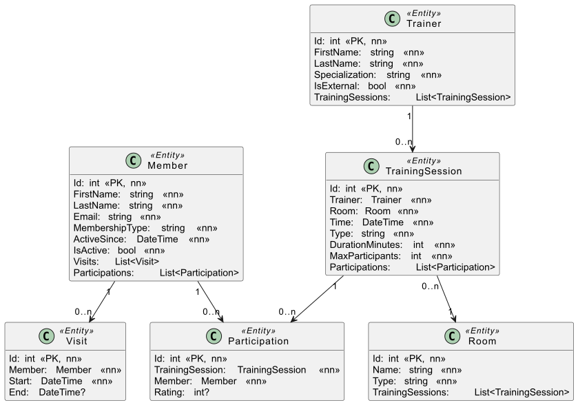

= PLF in Programmieren und Software Engineering
:source-highlighter: rouge
:icons: font
:pdf-page-header: true
:lang: DE
:hyphens:
:figure-caption!:
ifndef::env-github[:icons: font]
ifdef::env-github[]
:caution-caption: :fire:
:important-caption: :exclamation:
:note-caption: :paperclip:
:tip-caption: :bulb:
:warning-caption: :warning:
endif::[]

____
[.lead]
Klasse: 6AAIF +
Datum: DO, 26. Februar 2026 +
Stoff: Services +
Arbeitszeit: 2 UE
____

== Wichtiger Hinweis vor Arbeitsbeginn

Lade die Datei link:Plf6aaif_20260226.7z[Plf6aaif_20260226.7z].
Sie beinhaltet das Vorlagenprojekt für die weitere Implementierung.

== Aufgabe: Services mit EF Core

Das nachfolgende Modell zeigt eine Umsetzung eines Fitnesscenters.
Zum Besuchen des Studios müssen sich Kunden anmelden.
Die Kundendaten sind im Entity _Member_ gespeichert.
Es gibt 2 Arten von Memberships: _Basic_ und _Premium_.
Bei jeden Besuch meldet sich der Kunde an der Tür mit einem QR Code an.
Bei der Anmeldung wird ein Datensatz in _Visit_ geschrieben.
Verlässt der Kunde wieder das Fitnesscenter, wird _Visit.End_ auf den Zeitstempel gesetzt.

Als Service bietet das Studio auch begleitete Trainings an.
Alle Trainer:innen sind im Entity _Trainer_ registriert.
Die Spezialisierung gibt den bevorzugten Bereich des Trainers (Yoga, Krafttraining, ...) an.

Die Trainer:innen bieten Trainingsessions (_TrainingSession_) an.
Eine Session findet zu einer bestimmten Zeit in einem bestimmten Raum statt.
Damit nicht zu viele Mitglieder:innen teilnehmen, kann die Anzahl durch das Property _TrainingSession.MaxParticipants_ begrenzt werden.

Mitglieder:innen können sich über eine App zu diesen Sessions anmelden.
Bei der Anmeldung entsteht ein Eintrag im Entity _Participation_.
Nach der Session können die Mitglieder:innen den Trainer bewerten.
Das Feld _Participation.Rating_ sieht einen Zahlenwert von 1 (schlecht) bis 5 (super) vor.

Das folgende Modell zeigt die im Projekt vorhandenen Entities.

=== Implementierung der Servicemethoden

Führen Sie die Implementierungen in _Fitnesscenter.Application/Services/FitnessService.cs_ durch.
Verwenden Sie den über Dependency Injection bereitgestellten _FitnessContext_.

==== List<Participation> GetParticipationsOfMember(int memberId)

Diese Methode soll alle Teilnahmen (Participations) eines Mitglieds zurückliefern.
Vergleichen Sie dafür die Member ID mit dem übergebenen Parameter _memberId_.

==== List<Trainer> GetTrainerWithTrainingSessionsOnDate(DateOnly date)

Diese Methode soll alle Trainer zurückliefern, die (mindestens) eine Training Session an dem im Parameter _date_ übergebenen Tag abhalten.

Hinweis: Sie können mit _DateOnly.FromDateTime(dateTime)_ den gespeicherten Datums/Zeitwert in _TrainingSession.Time_ in einen _DateOnly_ Wert konvertieren und diesen dann vergleichen.

==== List<TrainingSession> GetFullTrainingSessions()

Diese Methode soll alle Training Sessions zurückliefern, die voll sind.
Eine Training Session ist voll, wenn die Anzahl der Teilnehmer (Participations) gleich der Anzahl in _MaxParticipants_ ist.

==== List<TrainingSession> GetSessionsWithMembershipType(string membershipType)

Diese Methode soll alle Training Sessions zurückliefern, in denen (mindestens) ein Mitglied den übergebenen _membershipType_ besitzt.
Vergleichen Sie hierfür _Member.MembershipType_ mit dem übergebenen Parameter.

==== List<Trainer> GetTrainersWithMinimalRatingCount(int count)

Diese Methode soll alle Trainer zurückliefern, die eine gewisse Anzahl an minimalen Ratings (Rating = 1) bekommen haben.
Vergleichen Sie hierfür die Gesamtanzahl der minimalen Ratings des Trainers mit dem _count_ Parameter.

==== List<RoomWithTrainingSessionsDto> GetRoomsWithTrainingSessions(DateTime timeFrom, DateTime timeTo)

Diese Methode soll alle Räume mit ihren Training Sessions liefern.
Sie sollen allerdings nur die Training Sessions berücksichtigen, die im übergebenen Zeitraum liegen.
Vergleichen Sie hierfür das Property _TrainingSession.Time_ mit den Parametern.
_TrainingSession.Time_ muss >= _timeFrom_ und <= _timeTo_ sein.

Als Rückgabetyp stehen Ihnen folgende DTO Klassen zur Verfügung:

[source,csharp]
----
public record RoomWithTrainingSessionsDto(
    int RoomId, string RoomName, List<TrainingSessionDto> Sessions);
public record TrainingSessionDto(
    int TrainerId, string TrainerFirstname, string TrainerLastname, DateTime Time);
----

==== TrainingSession AddTrainingSession(Trainer trainer, Room room, string type, DateTime time, int durationMinutes, int maxParticipants)

Diese Methode soll eine Training Session anlegen.
Dabei sind folgende Randbedingungen zu berücksichtigen:

* Die Zeit (Parameter _time_) darf nicht vor Geschäftsbeginn um 8 Uhr sein.
  Hinweis: Verwenden Sie das Property _Hour_ von _DateTime_, um die Stunde abzurufen.
  Wird diese Bedingung verletzt, werfen Sie eine Exception mit _throw new FitnessServiceException("Invalid time.")_
* Das Ende der Trainingsession darf nicht nach Geschäftsschluss um 20 Uhr sein.
  Berücksichtigen Sie die Dauer der Trainingsession in _durationMinutes_.
  Hinweis: Verwenden Sie _AddMinutes(int)_, um eine Anzahl an Minuten zu einem Datums/Zeitwert zu addieren.
  Wird diese Bedingung verletzt, werfen Sie eine Exception mit _throw new FitnessServiceException("Invalid time.")_
* Der Wert in _maxParticipants_ darf nicht kleiner als 3 sein.
  Wird diese Bedingung verletzt, werfen Sie eine Exception mit _throw new FitnessServiceException("Invalid max participants.")_
* Es dürfen nur Training Sessions angelegt werden, die nach der letzten Training Session des Trainers ist.
  Hinweis: Verwenden Sie _Max()_, um das Datum der letzten Trainingsession des Trainers herauszufinden.
  Das Datum steht im Property _TrainingSession.Time_.
  Wird diese Bedingung verletzt, werfen Sie eine Exception mit _throw new FitnessServiceException("Time must be after the last training session.")_

Werden alle Bedingungen erfüllt, legen Sie eine neue Trainingsession mit den übergebenen Parameterwerden an und speichern Sie diese in der Datenbank.
Geben Sie die erstellte Trainingsession zurück.

==== Visit AddVisit(int memberId, DateTime dateTime)

Diese Methode soll einen Datensatz in _Visits_ anlegen.
Wird die übergebene _memberId_ nicht gefunden, werfen Sie mit _throw new FitnessServiceException("Invalid member id.")_ eine Exception.

Bevor Sie einen neuen Datensatz anlegen, sollen alle bestehenden Visits Datensätze des Members geschlossen werden.
Setzen Sie dafür den _End_ Wert dieser Visits, wenn dieser _null_ ist, auf den Wert von _dateTime_.
Sie können dies mit einer _foreach_ Schleife lösen.

Danach erstellen Sie den neuen Visit Datensatz. Als Wert für _end_ fügen Sie _null_ ein.

=== Testen der Implementierung

Verwende die vorgegebenen Tests in _Fitnesscenter.Test/GradingTests.cs_, um die Implementierung zu prüfen.

=== Bewertung

[%header,cols="8,1",format=tsv]
|===
Aufgabe (24 Punkte in Summe)	Ges
Die Methode GetParticipationsOfMember liefert die korrekten Daten.	2
Die Methode GetTrainerWithTrainingSessionsOnDate liefert die korrekten Daten.	2
Die Methode GetFullTrainingSessions liefert die korrekten Daten.	2
Die Methode GetSessionsWithMembershipType liefert die korrekten Daten.	2
Die Methode GetTrainersWithMinimalRatingCount liefert die korrekten Daten.	3
Die Methode GetRoomsWithTrainingSessions liefert die korrekten Daten.	3
AddTrainingSession liefert Invalid time, wenn die Zeit vor Geschäftsbeginn um 8 Uhr ist.	1
AddTrainingSession liefert Invalid time, wenn die Session nach Geschäftsschluss um 20 Uhr endet.	1
AddTrainingSession liefert Invalid max participants, wenn maxParticipants kleiner als 3 ist.	1
AddTrainingSession liefert Time must be after the last training session, wenn der Wert in time kleiner als die letzte Session des Trainers ist.	2
AddTrainingSession legt den Datensatz korrekt an, wenn alle Bedingungen erfüllt wurden.	2
AddVisit beendet korrekt alle offenen Visits des Members und legt den Datensatz an.	3
|===

24 - 22 Punkte: Sehr gut, 21 - 19 Punkte: Gut, 18 - 16 Punkte: Befriedigend, 15 - 13 Punkte: Genügend, 12 - 0 Punkte: Nicht genügend.
