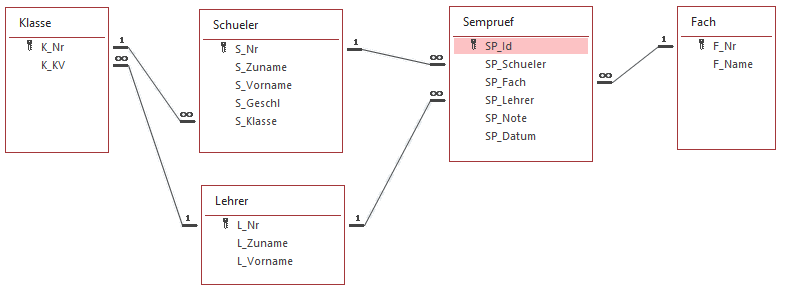

# Seeden einer Datenbank mit Musterdaten

In diesem Programm wird die Datenbank mit den Semesterprüfungen automatisch mit Werten befüllt.
Dabei wird das Paket [Bogus](https://github.com/bchavez/Bogus) verwendet. Es ist eine .NET Portierung
von faker.js und beinhaltet Datasets für Namen, Vornamen, Adressen, ...

In der Solution wird die Semesterprüfungs Datenbank mit folgendem Schema erstellt:

Die Erklärung ist in den Kommentaren der Datei [Program.cs](Program.cs) enthalten.
