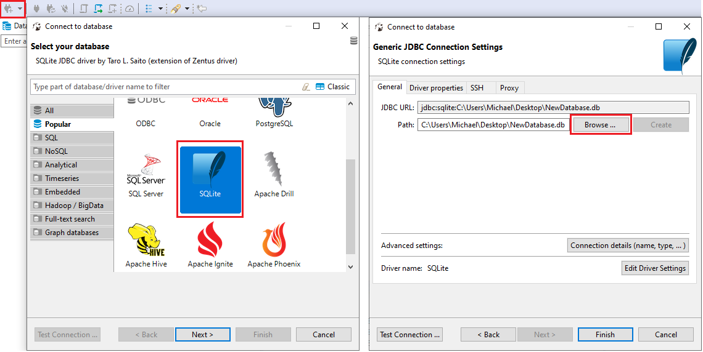
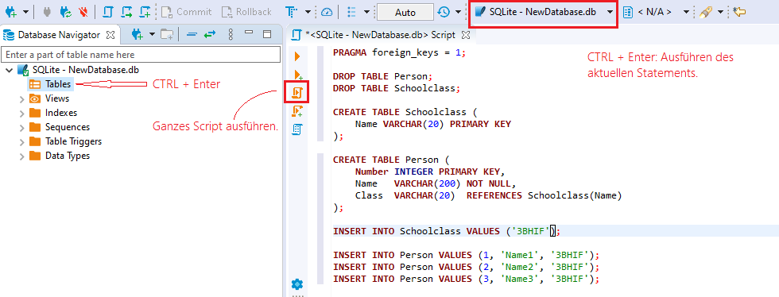
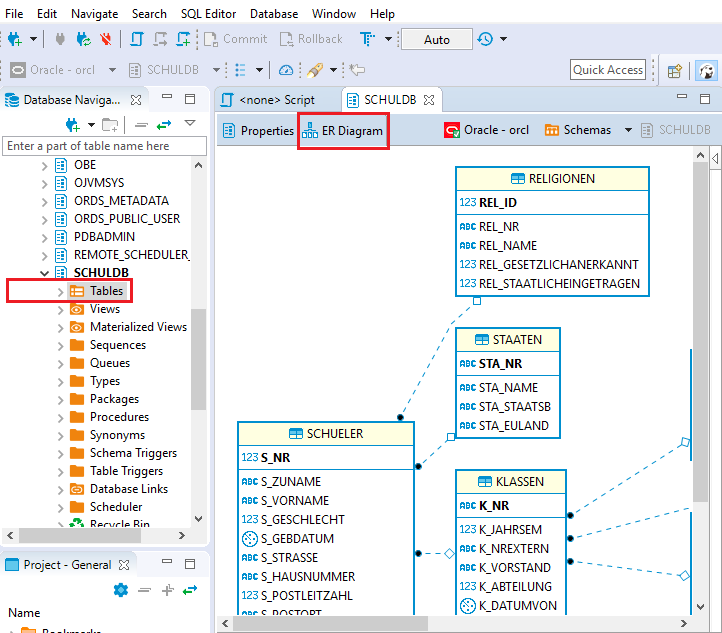

# Arbeiten mit DBeaver Community

Als SQL Editor kann DBeaver verwendet werden. Er kann sich über die JDBC Treiberarchitektur
zu verschiedenen Datenbanken - darunter auch Oracle - verbinden. Das Programm kann auf der 
[DBeaver Downloadseite](https://dbeaver.io/download/)
heruntergeladen werden.

## Erstellen eine SQLite Datenbank

Unter Connect können verschiedene Datenbanktreiber gewählt werden. Wird in SQLite eine nicht existierende
Datei angegeben, so wird eine leere Datenbank angelegt.

## Ausführen von SQL Befehlen

Mit *CTRL + Enter* erzeugt man ein neues Worksheet. Im oberen Bereich wird die Treiberverbindung
angezeigt. Hier muss kontrolliert werden, ob auch auf die richtige Datenbank zugegriffen wird.

> **Wichtig:** Zum Aktivieren der Fremdschlüssel ist zu Beginn der Session in SQLite das Statement
> *PRAGMA foreign_keys = 1;* auszuführen. Sonst können auch Fremdschlüssel in die Tabellen
> geschrieben werden, die keinen entsprechenden Primärschlüssel in der referenzierten Tabelle haben.

## Diagramme erzeugen

Ein nettes Feature ist das automatische Erzeugen von ER Diagrammen von einem Schema aus. Dies erreicht
man im Kontextmenü des Schemas in der Navigation:

## Zugriff auf Access Datenbanken
Sie können auch eine neue Verbindung zu einer Access Datenbank herstellen. Dabei wird beim erstmaligen
Verbinden der JDBC Treiber geladen.

