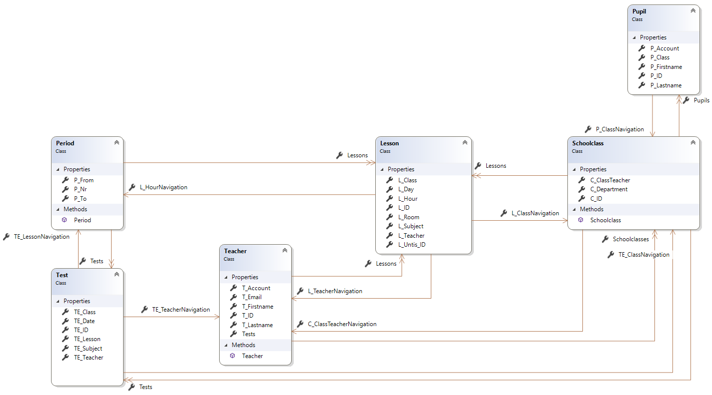

# Entity Framework Core

## Tools zum Erstellen von Datenbanken

- DBeaver: [Information zur Installation und Konfiguration](Dbeaver.md)
- JetBrains DataGrip: [Information zur Installation und Konfiguration](DataGrip.md)

## (Täglich) verwendete Befehle

### SQLite

#### CLI Tools (Windows, Linux, macOS)

Einmalige Installation der dotnet ef Tools:

```powershell
dotnet tool update --global dotnet-ef
```

Installation der NuGet Pakete und Generieren der Modelklassen. Der Datenbankname ist natürlich 
anzupassen:

```powershell
dotnet add package Microsoft.EntityFrameworkCore.Tools
dotnet add package Microsoft.EntityFrameworkCore.Sqlite
dotnet ef dbcontext scaffold "DataSource=MyDb.db" Microsoft.EntityFrameworkCore.Sqlite --output-dir Model --use-database-names --force --data-annotations
```

#### Packet Manager Console (Visual Studio)

```powershell
Install-Package Microsoft.EntityFrameworkCore.Tools   # EF Tools installieren
Install-Package Microsoft.EntityFrameworkCore.Sqlite  # SQLite Treiber installieren
# Modelklassen aus der Datenbank MyDb, die im selben Verzeichnis wie die Solution liegt,
# in den Ordner Model generieren. Dabei werden bestehende Dateien überschrieben.
Scaffold-DbContext "DataSource=MyDb.db" Microsoft.EntityFrameworkCore.Sqlite -OutputDir Model -UseDatabaseNames -Force -DataAnnotations
```

### MySQL

Die Strings in Klammer sind durch die echten Werte ohne Klammer zu ersetzen. Die CLI Anweisungen
werden analog dazu geändert.

```powershell
Install-Package Microsoft.EntityFrameworkCore.Tools   # EF Tools installieren
Install-Package Pomelo.EntityFrameworkCore.MySql      # MySQL Treiber installieren
Scaffold-DbContext "Server=localhost;Database=(dbname);User=(username);Password=(password);TreatTinyAsBoolean=true;" "Pomelo.EntityFrameworkCore.MySql" -OutputDir Model -UseDatabaseNames -Force -DataAnnotations
```

## Modell unserer Musterdatenbank

[Download der Tests Datenbank](Tests.db)



