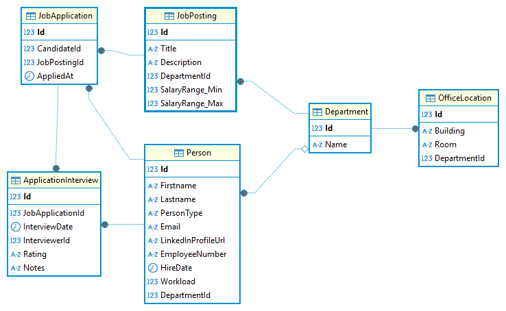

= PLF in Programmieren und Software Engineering
:source-highlighter: rouge
:icons: font
:pdf-page-header: true
:lang: DE
:hyphens:
:figure-caption!:
ifndef::env-github[:icons: font]
ifdef::env-github[]
:caution-caption: :fire:
:important-caption: :exclamation:
:note-caption: :paperclip:
:tip-caption: :bulb:
:warning-caption: :warning:
endif::[]

____
[.lead]
Klasse: 5AAIF +
Datum: DI, 16. Dezember 2025 +
Arbeitszeit: 3 UE
____

== Wichtiger Hinweis vor Arbeitsbeginn

Auf dem Laufwerk _Z_ finden Sie die Datei _Plf5aaif_20251216.7z_.
Klicken Sie mit der rechten Maustaste auf die Datei und wählen Sie _Weitere Optionen_ - _7-Zip_ und _Extract here_.
Gehen Sie dann in den Ordner _Plf5aaif_ und starten Sie die Datei _start_solution.cmd_.
Diese Datei lädt zuerst alle Dependencies aus dem Internet und startet dann die sln Datei in diesem Ordner.
Sie müssen das Programm nicht abgeben, denn Sie arbeiten direkt am Netzlaufwerk.

[WARNING]
====
Füllen Sie die Datei _README.md_ in _Plf5aaif/README.md_ mit Ihren Daten (Klasse, Name und Accountname) aus.
Sie sehen die Datei in Visual Studio unter _Solution Items_ nach dem Öffnen der Solution.
*Falls Sie dies nicht machen, kann Ihre Arbeit nicht zugeordnet und daher nicht bewertet werden!*
====

[WARNING]
====
Während der Prüfung ist der Internetzugriff gesperrt.
Führen Sie daher niemals _Build_ - _Rebuild Solution_ aus, denn dadurch werden die lokalen Pakete gelöscht.
Arbeiten Sie immer mit _Build_ - _Build Solution_ (F6).
====

== Aufgabe: Object Relation Mapping

Ein Unternehmen möchte eine Plattform für Bewerberinnen und Bewerber entwickeln.
Das System verwaltet die Daten der Mitarbeiter (_Employee_), die Job Interviews durchführen.
Die Mitarbeiter können für die jeweilige Abteilung (_Department_) Jobangebote (_JobPosting_) erstellen.
Ein Bewerber (_Candidate_) kann sich für dieses Jobangebot bewerben.
Dadurch entsteht eine _JobApplication_ (Bewerbung).
Der Mitarbeiter kann nun für die Bewerbung ein _ApplicationInterview_ durchführen und bewerten.

Das Domain Model sieht so aus:

[plantuml,format=svg]
----
include::model.puml[]
----

=== Arbeitsauftrag

==== Erstellung der Modelklassen

Implementieren Sie das dargestellte Diagramm Modelklassen für den OR Mapper.

Im Projekt _Plf5aaif.Application_ befinden sich leere Klassen sowie die Klasse _JobApplicationContext_, die Sie nutzen sollen.

Beachten Sie bei der Umsetzung folgende Punkte:

*Allgemeine Anforderungen*

* Legen Sie nötige Konstruktoren an.
  Ein _public_ Konstruktor soll alle im Modell enthaltenen Properties initialisieren.
  Ergänzen Sie bei Bedarf die für den OR Mapper nötigen Konstruktoren.
* Beachten Sie Attribute Constraints wie _not null_ (`++<<nn>>++`).
* Verwenden sie eigene primary keys mit dem Namen _Id_ (autoincrement), außer im Modell ist mit _PK_ explizit ein Schlüssel mit `++<<PK>>++` angegeben.
* Die Foreign Keys werden nach der Convention Propertyname + Name des PK generiert. Dies ist z. B. bei der Zuweisung des FKs der dependent Entities wichtig.

*Fachliche Anforderungen*

* Die generierten Tabellennamen sollen in Einzahl erzeugt werden (_Person_, _Department_, ...).
* Für eine _JobApplication_ kann es maximal ein _ApplicationInterview_ geben.
  Implementieren Sie die _1:0..1_ Beziehung entsprechend.
* Das Attribut _Employee.EmployeeNumber_ soll ein _unique constraint_ besitzen.
* Es dürfen nicht 2 JobApplications mit den gleichen Werten in _Candidate_ und _JobPosting_ angelegt werden können.
  Stellen Sie dies durch ein unique constraint über diese 2 Spalten (bzw. die darunterliegenden Fremdschlüssel) sicher.
* Das Attribut _JobPosting.SalaryRange_ soll als _value object_ definiert werden.
  Die erzeugten Spalten sollen _SalaryRange_Max_ und _SalaryRange_Min_ in der Datenbank heißen (Standardverhalten in EF Core).
* Das Attribut _Department.OfficeLocations_ soll als Liste von _value objects_ definiert werden.
  Stellen Sie durch Konfiguration sicher, dass der primary key der erzeugten Tabelle _Id_ heißt.
* Das Attribut _Employee.Workload_ soll als _rich type_ definiert und als _int_ gespeichert werden.
* Das Attribut _Person.PersonType_ soll als discriminator definiert werden.
* Die Enum in _ApplicationInterview.Rating_ soll als String mit den folgenden Werten in der Datenbank gespeichert werden:
  _AA_ für Excellent, _A_ für Good, _B_ für Satisfactory, _C_ für Poor.
  Beachten Sie, dass der Wert auch _null_ sein kann.
* Implementieren Sie die Klasse _EmploymentPercentage_ so, dass im Konstruktor der Wert geprüft wird.
  Ist der Wert nicht im Bereich von 0 - 100 (inklusive), so ist eine _ArgumentException_ zu werfen.
* Implementieren Sie die Klasse _SalaryRange_ so, dass im Konstruktor der Wert geprüft wird.
  Ist der Wert von _min_ größer als der Wert von _max_, so ist eine _ArgumentException_ zu werfen.

[NOTE]
Falls Sie Probleme mit rich types oder enums haben, können Sie diese auch als einfaches Stringfeld implementieren.

Das durch den OR Mapper erzeugte Datenbankschema soll so aussehen:

Der vorgegebene Test _T00_CanCreateDatabaseTest_ in _GradingTests_ prüft, ob mit Ihrer Implementierung überhaupt eine Datenbank erzeugt werden kann.
*Läuft dieser Test nicht durch, können Sie keine positive Note erhalten.*

Der vorgegebene Test _T00_SchemaTest_ in _GradingTests_ verwenden, um das Gesamtmodell zu prüfen. 
Läuft dieser Test erfolgreich durch, sind Sie positiv.

==== Verfassen von Tests

In der Klasse _JobApplicationContextTests_ im Projekt _Plf5aaif.Test_ sollen Testmethoden verfasst werden, die die Richtigkeit der Konfiguration des OR Mappers beweisen sollen.

* _T01_InsertJobPostingWithApplicationInterviewTest_ zeigt, dass Sie eine _JobApplication_ für ein _JobPosting_ samt _ApplicationInterview_ speichern können.
* _T02_JobApplicationCandidateAndJobPostintIsUniqueTest_ zeigt, dass beim Einfügen einer zweiten _JobApplication_ für den selben Kandidaten und das selbe Job Posting eine _DbUpdateException_ geworfen wird.
* _T03_AddDepartmentWithOfficeLocations_ zeigt, dass Sie eine Abteilung (_Department_) mit mehreren _OfficeLocations_ speichern klnnen.
  Achten Sie im Assert darauf, dass Sie ohne _Include_ beim Laden des Departments auch auf die Liste der _OfficeLocations_ zugreifen können (Anzahl prüfen).
* _T04_SalaryRangeThrowsExceptionWhenMinMaxIsInvalidTest_ zeigt, dass der Konstruktor der Klasse _SalaryRange_ bei ungültigen Argumenten eine _ArgumentException_ wirft.

=== Bewertung

Um eine positive Beurteilung erreichen zu können, muss das Programm kompilieren und die implementierten Modelklassen müssen ein Erzeugen der Datenbank über den OR Mapper ermöglichen.

[%header,cols="8,1",format=tsv]
|===
Aufgabe (36 Punkte in Summe)	Ges
Das Entity Department wird mit den definierten Feldern Datenbank abgebildet.	1
Das Entity Person wird mit den definierten Feldern Datenbank abgebildet.	1
Das Entity Employee wird mit den definierten Feldern Datenbank abgebildet.	1
Das Entity Candidate wird mit den definierten Feldern Datenbank abgebildet.	1
Das Entity UserJobPosting wird mit den definierten Feldern Datenbank abgebildet.	1
Das Entity JobApplication wird mit den definierten Feldern Datenbank abgebildet.	1
Das Entity ApplicationInterview wird mit den definierten Feldern Datenbank abgebildet.	1
Die 1:1 Beziehung zwischen JobApplication und ApplicationInterview ist korrekt konfiguriert.	2
Employee.EmployeeNumber ist unique	1
Das Tupel JobApplication.Candidate und JobPosting ist unique.	2
JobPosting.SalaryRange ist als value object definiert.	2
Depertment.OfficeLocations ist als Liste von value objects definiert.	2
Employee.Workload ist als rich type mit converter definiert.	2
Person.Type ist als Discriminator definiert.	1
ApplicationInterview.Rating wird mit den korrekten Werten (AA, A, B und C) gespeichert.	3
Die Klasse SalaryRange wirft eine ArgumentException bei ungültigen Argumenten.	1
Die Klasse EmploymentPercentage wirft eine ArgumentException bei ungültigen Argumenten.	1
Der Test T01_InsertJobPostingWithApplicationInterviewTest hat den richtigen Aufbau.	2
Der Test T01_InsertJobPostingWithApplicationInterviewTest läuft durch.	1
Der Test T02_JobApplicationCandidateAndJobPostintIsUniqueTest hat den richtigen Aufbau.	2
Der Test T02_JobApplicationCandidateAndJobPostintIsUniqueTest läuft durch.	1
Der Test T03_AddDepartmentWithOfficeLocations hat den richtigen Aufbau.	2
Der Test T03_AddDepartmentWithOfficeLocations läuft durch.	1
Der Test T04_SalaryRangeThrowsExceptionWhenMinMaxIsInvalidTest hat den richtigen Aufbau.	2
Der Test T04_SalaryRangeThrowsExceptionWhenMinMaxIsInvalidTest läuft durch.	1
|===

36 - 32 Punkte: Sehr gut, 31 - 28 Punkte: Gut, 27 - 23 Punkte: Befriedigend, 22 - 19 Punkte: Genügend, 18 - 0 Punkte: Nicht genügend.
