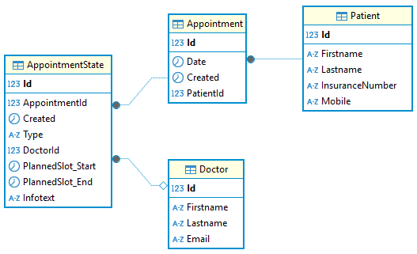

= PLF in Programmieren und Software Engineering
:source-highlighter: rouge
:icons: font
:pdf-page-header: true
:lang: DE
:hyphens:
:figure-caption!:
ifndef::env-github[:icons: font]
ifdef::env-github[]
:caution-caption: :fire:
:important-caption: :exclamation:
:note-caption: :paperclip:
:tip-caption: :bulb:
:warning-caption: :warning:
endif::[]

____
[.lead]
Klasse: 5AKIF +
Datum: MI, 26. November 2025 +
Arbeitszeit: 3 UE
____

== Wichtiger Hinweis vor Arbeitsbeginn

Auf dem Laufwerk _Z_ finden Sie die Datei _Plf5akif.7z_.
Klicken Sie mit der rechten Maustaste auf die Datei und wählen Sie _Weitere Optionen_ - _7-Zip_ und _Extract here_.
Gehen Sie dann in den Ordner _Plf5akif_ und starten Sie die Datei _start_solution.cmd_.
Diese Datei lädt zuerst alle Dependencies aus dem Internet und startet dann die sln Datei in diesem Ordner.
Sie müssen das Programm nicht abgeben, denn Sie arbeiten direkt am Netzlaufwerk.

[WARNING]
====
Füllen Sie die Datei _README.md_ in _Plf5akif/README.md_ mit Ihren Daten (Klasse, Name und Accountname) aus.
Sie sehen die Datei in Visual Studio unter _Solution Items_ nach dem Öffnen der Solution.
*Falls Sie dies nicht machen, kann Ihre Arbeit nicht zugeordnet und daher nicht bewertet werden!*
====

[WARNING]
====
Während der Prüfung ist der Internetzugriff gesperrt.
Führen Sie daher niemals _Build_ - _Rebuild Solution_ aus, denn dadurch werden die lokalen Pakete gelöscht.
Arbeiten Sie immer mit _Build_ - _Build Solution_ (F6).
====

== Aufgabe: Object Relation Mapping

Für eine Arztpraxis soll ein Buchungssystem für Termine entwickelt werden.
Patienten sollen einen Termin (Appointment) buchen können.
Der Arzt (Doctor) kann den Termin bestätigen oder ablehnen.
Wird der Termin bestätigt, hat das Appointment den Status _ConfirmedAppointmentState_.
Wird der Termin abgesagt, hat das Appointment den Status _CandelledAppointmentState_.

Das Domain Model hat folgendes Aussehen:

[plantuml,format=svg]
----
include::model.puml[]
----

=== Arbeitsauftrag

==== Erstellung der Modelklassen

Implementieren Sie das dargestellte Diagramm als EF Core Modelklassen.
Im Projekt _Plf5akif.Application_ befinden sich leere Klassen sowie die Klasse _AppointmentContext_, die Sie nutzen sollen.
Beachten Sie bei der Umsetzung folgende Punkte:

* Legen Sie nötige Konstruktoren an.
  Ein _public_ Konstruktor soll alle im Modell enthaltenen Properties initialisieren.
  Ergänzen Sie die für EF Core nötigen _protected_ Konstruktoren.
* Beachten Sie Attribute Constraints wie _not null_ (`++<<nn>>++`).
* Verwenden sie eigene primary keys mit dem Namen _Id_ (autoincrement), außer im Modell ist mit _PK_ explizit ein Schlüssel mit `++<<PK>>++` angegeben.
* Die Foreign Keys werden nach der Convention Propertyname + Name des PK generiert. Dies ist bei der Zuweisung des FKs der dependent Entities wichtig.
* Die generierten Tabellennamen sollen in Einzahl erzeugt werden (_AppointmentState_, _Appointment_, _Patient_ und _Doctor_).
* Das Attribut _Email_ in _Doctor_ soll unique sein.
* Es sollen nicht zwei Appointments für den selben Patienten am selben Tag angelegt werden können. Stellen Sie dies durch ein unique constraint über diese 2 Spalten sicher.
* Das Attribut _PlannedSlot_ soll in _ConfirmedAppointmentState_ als _value object_ definiert werden.
* Der Discriminator in _AppointmentState_ soll in _Type_ geschrieben werden und den Wert _Confirmed_ für ein AppointmentState des Typs _ConfirmedAppointmentState_ und _Cancelled_ für den Typ _CancelledAppointmentState_ haben.
* Das Attribut _InsuranceNumber_ soll in _Patient_ als rich type definiert und als String in der Datenbank gespeichert werden.
* Der rich type _InsuranceNumber_ soll prüfen, ob der String 10 Stellen lang ist.
  Verwenden Sie dafür das Property _Length_.
  Falls nicht, werfen Sie mit `throw new AppointmentException("Invalid InsuranceNumber");` eine Exception.
* Das Attribut _Mobile_ soll in _Patient_ als rich type definiert und als String gespeichert werden. Beachten Sie, dass das Attribut auch null sein kann.

Das durch den OR Mapper erzeugte Datenbankschema soll so aussehen:

Sie können den vorgegebenen Test _T00_SchemaTest_ in _GradingTests_ verwenden, um das Gesamtmodell zu prüfen. 
Läuft dieser Test erfolgreich durch, sind Sie positiv.

==== Verfassen von Tests

In der Klasse _AppointmentContextTests_ im Projekt _Plf5akif.Test_ sollen Testmethoden verfasst werden, die die Richtigkeit der Konfiguration des OR Mappers beweisen sollen.

* _AddPatientTest_ zeigt, dass Sie einen Patienten in die Datenbank einfügen können.
* _InsuranceNummerNotValidTest_ zeigt, dass die Validierung in _InsuranceNumber_ funktioniert.
  Sie müssen im Test nur eine Instanz dieser Klasse anlegen und das Fehlerverhalten prüfen.
* _AddAppointmentWithStateConfirmedTest_ zeigt, dass Sie ein Appointment mit dem Status _ConfirmedAppointmentState_ erzeugen und in der Datenbank speichern können.
* _DoctorEmailThrowsDbUpdateExceptionIfNotUniqueTest_ zeigt, dass beim Einfügen eines zweiten Doctor Datensatzes mit selber E-Mail eine DbUpdateException geworfen wird.

=== Bewertung

Um eine positive Beurteilung erreichen zu können, muss das Programm kompilieren und die registrierten Klassen müssen mit der EF Core Funktion `EnsureCreated()` eine Datenbank ohne Laufzeitfehler erzeugen.

[%header,cols="8,1",format=tsv]
|===
Aufgabe (36 Punkte in Summe)	Ges
Das Entity Doctor wird korrekt in der erzeugten Datenbank abgebildet.	2
Das Entity Patient wird korrekt in der erzeugten Datenbank abgebildet.	2
Das Entity Appointment wird korrekt in der erzeugten Datenbank abgebildet.	2
Das Entity AppointmentState wird korrekt in der erzeugten Datenbank abgebildet.	2
Das Entity ConfirmedAppointmentState wird korrekt in der erzeugten Datenbank abgebildet.	2
Das Entity CancelledAppointmentState wird korrekt in der erzeugten Datenbank abgebildet.	2
Das Attribut Doctor.Email ist unique	1
Die Attribute Appointment.Date und Appointment.PatientId sind unique.	2
Der Discriminator wurde in AppointmentState.Type gemappt.	1
Der Discriminator in AppointmentState.Type hat die korrekten Werte.	2
Das Attribut ConfirmedAppointmentState.TimeSlot ist als value object definiert.	2
Das Attribut Patient.Mobile ist als rich type definiert.	2
Das Attribut Patient.InsuranceNumber ist als rich type definiert.	2
Der Test AddPatientTest hat den richtigen Aufbau.	2
Der Test AddPatientTest läuft durch.	1
Der Test InsuranceNummerNotValidTest hat den richtigen Aufbau.	2
Der Test InsuranceNummerNotValidTest läuft durch.	1
Der Test AddAppointmentWithStateConfirmedTest hat den richtigen Aufbau.	2
Der Test AddAppointmentWithStateConfirmedTest läuft durch.	1
Der Test DoctorEmailThrowsDbUpdateExceptionIfNotUniqueTest hat den richtigen Aufbau.	2
Der Test DoctorEmailThrowsDbUpdateExceptionIfNotUniqueTest läuft durch.	1
|===

36 - 32 Punkte: Sehr gut, 31 - 28 Punkte: Gut, 27 - 23 Punkte: Befriedigend, 22 - 19 Punkte: Genügend, 18 - 0 Punkte: Nicht genügend.
