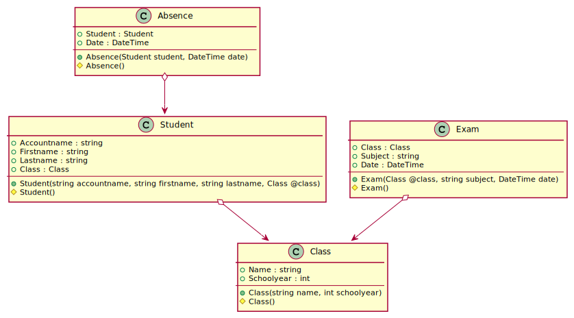

# Presence Manager

Das Unterrichtsministerium hat die Präsenzpflicht gem. Erlass auf
[www.bmbwf.gv.at](https://www.bmbwf.gv.at/Themen/schule/beratung/corona/sichereschule.html)
bis 28. Februar 2022 ausgesetzt. Das bedeutet, dass sich SchülerInnen und Studierende tageweise
vom Präsenzunterricht abmelden können.

Unsere Schule möchte diese Abmeldungen elektronisch erfassen. Das folgende Klassenmodell zeigt
eine mögliche Umsetzung:


<sup>
https://plantuml.io/plantuml/uml/VL1BJiD03Dtd52EnIKLpWInGAZuhnAPSm9qO4fIPeDYHg11tfux74IEYTb57RvxzFWqnJ3o7eUZw5Xs6JpwxWDoDBHM57u38tI__tuMx_6vV8A2h7V7KntU5ZhuRn-6CC5qU-iWBMbMLlYxRfV9TX81xuJXQbtOBxqPvk-8dgHvvRZ6owHwy7-V8yR_yKp_H5luCcx2cgJLLRZL9cbamIV6Si3SHov013D3BZPUHGjb5YMM1nggwKwuLV3WHHeyMrOYrTQ3m0x1aaV7Q1yojfnEbxPBE_KftBJ0cLqOMLwOjhapFV3r-GJ1JUMtgSpvzeEUyt-isvMBvjwUrHj9ZsuQNDN4h7rc13SPs3iCl
</sup>
## Beschreibung der Klassen

#### Klasse Class

Speichert eine Schulklasse. Da es jedes Jahr eine 5AAIF gibt, muss das Schuljahr zusätzlich
gespeichert werden. Legen Sie einen Autoincrement Wert als Primärschlüssel an.

- **Name:** Der Name der Klasse, z. B. *5AAIF*.
- **Schoolyear:** Das Jahr, an dem das Schuljahr beginnt (z. B. 2021 für 2021/22).

Stellen Sie durch eine Konfiguration sicher, dass pro Schuljahr nur eine Klasse mit dem selben
Namen angelegt werden kann. Es darf also keine zweite 5AAIF im selben Schuljahr angelegt werden.


#### Klasse Student

Speichert den Studierenden mit dem Accountnamen als Primärschlüssel. Im Modell sind die
Fremdschlüsselfelder nicht abgebildet. Legen Sie daher ein zusätzliches Property zum Speichern
der Klassen ID an.

- **Accountname:** Der schulinterne Accountname in der Form *ABC123456*. Er soll in der Datenbank
  als Primärschlüssel definiert werden. Stellen Sie dies durch eine Annotation sicher.
- **Firstname** und **Lastname**: Der Name des Studierenden. Er soll maximal 256 Zeichen lang sein.
  Stellen Sie dies durch eine Annotation sicher.
- **Class:** Die Klasse, die der Studierende besucht (z. B. 5AAIF im Schuljahr 2021). Hinweis:
  Das Wort class (kleingeschrieben) ist ein reserviertes Wort. Sie müssen Variablen bzw. Parameter
  mit diesem Namen daher mit *@class* anlegen.

#### Klasse Absence

 Speichert die Abmeldung für einen spezifischen Tag. Legen Sie einen Autoincrement Wert als
 Primärschlüssel an. Im Modell sind die Fremdschlüsselfelder nicht abgebildet. Legen Sie daher ein
 zusätzliches Property zum Speichern der Student ID an. Beachten Sie, dass der Accountname der
 Primärschlüssel des Students ist.

 - **Student:** Der Studierende, der sich abgemeldet hat.
 - **Date:** Der Tag, für den die Abmeldung gilt. Es wird als Zeitwert immer 0:00 gespeichert.

#### Klasse Exam

 Speichert Prüfungen, die in einer Klasse statt finden. Dies ist deswegen wichtig, damit eine mögliche
 Abmeldung an einem Tag, an dem eine Prüfung stattfindet, speziell gekennzeichnet werden kann.
Im Modell sind die
Fremdschlüsselfelder nicht abgebildet. Legen Sie daher ein zusätzliches Property zum Speichern
der Klassen ID an.
 
- **Class:** Die Klasse, in der die Prüfung statt findet.
- **Subject:** Der Gegenstand der Prüfung (z. B. POS).
- **Date:** Der Tag der Prüfung. Als Zeitwert wird immer 0:00 gespeichert, da die genaue Uhrzeit
  unerheblich ist (eine Abmeldung kann nur tageweise erfolgen).

## Arbeitsauftrag

### Anlegen der Projektstruktur

Legen Sie für die Applikation und für die Tests zwei unabhängige Projekte an. Dafür erstellen
Sie zuerst einen Ordner PresenceManager_ACC123456, wobei ACC123456 durch Ihren Accountnamen
zu ersetzen ist. Danach legen Sie in diesem Ordner 2 Unterordner samt Projekt an:
- *PresenceManager_ACC123456.Application:* Applikationsprojekt vom Typ *classlib*.
- *PresenceManager_ACC123456.Text:* Testprojekt vom Typ *xunit*. Verweist auf das Projekt 
  *PresenceManager_ACC123456.Application*

Im Ordner PresenceManager_ACC123456 ist zum Schluss ein Solutionfile anzulegen, welches diese
2 Projekte beinhaltet. Die Ordnerstruktur soll am Ende so aussehen:

```text
PresenceManager_ACC123456
          |
          +----------  PresenceManager_ACC123456.Application
          |                             |
          |                             +-------------------- PresenceManager_ACC123456.Application.csproj
          +----------  PresenceManager_ACC123456.Text
          |                             |
          |                             +-------------------- PresenceManager_ACC123456.Application.csproj
          |
          +----------- PresenceManager_ACC123456.sln
```

#### Hinzufügen der NuGet Pakete

Im Projekt *PresenceManager_ACC123456.Application* sollen die Pakete *Microsoft.EntityFrameworkCore*
und *Microsoft.EntityFrameworkCore.Sqlite* in der Version 6.* eingebunden werden.

> **Hinweis:** Im Kapitel *03 EF Core/02_CodeFirstEfCore5* in den Unterlagen auf https://github.com/schletz/Pos3xhif
> haben Sie ein Beispielskript, welches solche Projektstrukturen anlegt.

### Hinzufügen der Tests in das Testprojekt

Legen Sie im Testprojekt 3 Klassendateien an: *PresenceContextTests.cs*, *ImplementationTests.cs*
und *PresenceContextMethodsTest.cs*. Ersetzen Sie danach die erstellten leeren Klasse durch
den entsprechendem Code aus dem Anhang unten in diesem Dokument.

### Anlegen der Modelklassen

Erstellen Sie direkt im Application Projekt die Dateien für Ihre Implementierung:
- Absence.cs
- Class.cs
- Exam.cs
- Student.cs
- PresenceContext.cs

Ihre Modelklassen dürfen keine public Default Konstruktoren (also parameterlose Konstruktoren mit
der Sichtbarkeit public) haben. Außerdem darf der Primärschlüssel keine public set Methode haben.

Implementieren Sie nun die Modelkalssen gemäß dem oben beschriebenen Modell. Der Datenbankcontext
hat folgenden Aufbau:

**PresenceContext.cs**
```c#
public class PresenceContext : DbContext
{
    private PresenceContext GetDatabase(bool deleteDatabase = false)
    {
        var options = new DbContextOptionsBuilder()
            .UseSqlite("Data Source=Presence.db")
            .Options;
        var db = new PresenceContext(options);
        if (deleteDatabase)
        {
            db.Database.EnsureDeleted();
            db.Database.EnsureCreated();
        }
        return db;
    }

    public PresenceContext(DbContextOptions opt) : base(opt) { }

    /* TODO: Your DbSets */

    protected override void OnModelCreating(ModelBuilder modelBuilder)
    {
        /* TODO: Your configuration */
    }

    public bool TryAddAbsence(Absence absence)
    {
        // TODO: Your implementation
        return true;
    }
}
```

### Implementierung von TryAddAbsence
In der Klasse *PresenceContext* ist eine leere Methode *TryAddAbsence()* vorhanden. Sie soll
eine Abmeldung nach folgendem Verhalten in die Datenbank einfügen:

- Hat die Klasse des Studierenden, der sich abmelden möchte, ein Exam, so wird false geliefert
  und die Abmeldung wird nicht gespeichert.
- Ansonsten wird versucht, diese Abmeldung zu speichern.
- Tritt bei *SaveChanges()* eine Exception (DbUpdateException) auf, wird false geliefert.

Verwenden Sie zum Prüfen des Termines keine Schleifen (foreach, for, ...) sondern die *Any()*
Methode von LINQ. Lösungen mit Schleifen werden nicht als richtig gewertet.

Legen Sie danach eine neue Testklasse mit dem Namen *PresenceContextMethodsTest.cs* im
Testprojekt an. Sie soll mit 3 Unittests die Richtigkeit der Methode beweisen:
- *AddAbsenceSuccessTest* prüft, ob eine Absenz erfolgreich eingetragen werden konnte.
  Vergessen Sie nicht, vor dem Assert die Datenbank zu schließen und sie mit 
  `GetDatabase(deleteDatabase: false)` erneut zu öffnen. Nur so können Sie prüfen, ob die Daten
  wirklich physisch auf die Platte geschrieben wurden.
- *AddAbsenceReturnsFalseIfExamIsOnThatDayTest* prüft, ob die Methode false liefert wenn an
  diesem Tag eine Prüfung (Exam) für diese Klasse eingetragen wurde.
- *AddAbsenceReturnsFalseIfAbsenceOnSameDayIsPresent* prüft, ob die Methode false liefert wenn an
  diesem Tag bereits für diesen Studierenden eine Abmeldung eingetragen wurde.

## Beurteilung

#### Genügend
Der Unittest *CreateDatabaseTest()* und *CreateDatabaseWithSeedTest()* läuft erfolgreich durch.

#### Befriedigend
Es laufen alle Tests der Klasse *ImplementationTests* erfolgreich durch. Es müssen alle
Anforderungen für ein Genügend erfüllt sein, sonst kann diese Beurteilung nicht gegeben werden.

#### Gut
Die Methode *TryAddAbsence()* ist korrekt implementiert. Es sind keine Unittests zur Prüfung
nötig. Es müssen alle Anforderungen für ein Befriedigend erfüllt sein, sonst kann diese Beurteilung
nicht gegeben werden.

#### Sehr gut
Die Richtigkeit der Methode wird durch die 3 Unittests bewiesen. Es müssen alle Anforderungen für
ein Gut erfüllt sein, sonst kann diese Beurteilung nicht gegeben werden.

## Abgabe

Erstellen Sie eine ZIP Datei des Ordners *PresenceManager_ACC123456* und geben Sie diese
Datei in Teams ab. Benennen Sie diese Datei ebenfalls nach dem Ordnernamen (also auch 
*PresenceManager_ACC123456*), wobei *ACC123456* durch Ihren Accountnamen zu ersetzen ist.

## Anhang: Codedateien

### Testklassen

**PresenceContextTests.cs**
```c#
[Collection("Sequential")]
public class PresenceContextTests
{
    private PresenceContext GetDatabase(bool deleteDatabase = false)
    {
        var options = new DbContextOptionsBuilder()
            .UseSqlite("Data Source=Presence.db")
            .Options;
        var db = new PresenceContext(options);
        if (deleteDatabase)
        {
            db.Database.EnsureDeleted();
            db.Database.EnsureCreated();
        }
        return db;

    }
    [Fact]
    public void CreateDatabaseTest()
    {
        using var db = GetDatabase(deleteDatabase: true);
    }

    [Fact]
    public void CreateDatabaseWithSeedTest()
    {
        using (var db = GetDatabase(deleteDatabase: true))
        {
            var classes = new Class[]
            {
                new Class(name: "5AAIF", schoolyear: 2021),
            };
            db.Classes.AddRange(classes);
            db.SaveChanges();

            var students = new Student[]
            {
                new Student(accountname: "accountname1", firstname: "firstname", lastname: "lastname", @class: classes[0]),
            };
            db.Students.AddRange(students);
            db.SaveChanges();

            var exams = new Exam[]
            {
                new Exam(@class: classes[0], subject: "subject", date: new DateTime(2021,1,10))
            };
            db.Exams.AddRange(exams);
            db.SaveChanges();

            var absences = new Absence[]
            {
                new Absence(student: students[0], date: new DateTime(2021,1,10))
            };
            db.Absences.AddRange(absences);
            db.SaveChanges();
        }
        using (var db = GetDatabase(deleteDatabase: false))
        {
            Assert.True(db.Absences.Count() > 0);
            Assert.True(db.Classes.Count() > 0);
            Assert.True(db.Exams.Count() > 0);
            Assert.True(db.Students.Count() > 0);
        }
    }

    [Fact]
    public void ClassHasUniqueIndexTest()
    {
        using var db = GetDatabase(deleteDatabase: true);
        var class1 = new Class(name: "name", schoolyear: 2020);
        var class2 = new Class(name: "name", schoolyear: 2021);
        db.Classes.Add(class1);
        db.Classes.Add(class2);
        db.SaveChanges();

        db.Classes.Add(new Class(name: "name", schoolyear: 2021));
        Assert.Throws<DbUpdateException>(() => db.SaveChanges());
    }

    [Fact]
    public void AbsenceHasUniqueIndexTest()
    {
        using var db = GetDatabase(deleteDatabase: true);
        var student = new Student(
            accountname: "accountname1", firstname: "firstname", lastname: "lastname", 
            @class: new Class(name: "name", schoolyear: 2021));
        db.Absences.Add(new Absence(student: student, date: new DateTime(2022, 1, 10)));
        db.Absences.Add(new Absence(student: student, date: new DateTime(2022, 1, 11)));
        db.SaveChanges();

        db.Absences.Add(new Absence(student: student, date: new DateTime(2022, 1, 10)));
        Assert.Throws<DbUpdateException>(() => db.SaveChanges());
    }
}
```

**ImplementationTests.cs**
```c#
public static class TypeExtensions
{
    public static bool HasPublicDefaultConstructor(this Type type) =>
        type.GetConstructor(Type.EmptyTypes) is not null;

    public static bool PropertyIsImmutable(this Type type, string propertyName) =>
        type.GetProperty(propertyName) is not null &&
        type.GetProperty(propertyName)?.SetMethod?.IsPublic != true;
}

public class ImplementationTests
{
    // Implementation tests for Class
    [Fact]
    public void ClassHasNoPublicDefaultConstructorTest() => Assert.False(typeof(Class).HasPublicDefaultConstructor());

    [Fact]
    public void ClassKeyHasNoPublicSetterTest() => Assert.True(typeof(Class).PropertyIsImmutable("Id"));

    [Fact]
    public void ClassConstructorTest()
    {
        var @class = new Class(name: "name", schoolyear: 2021);
        Assert.True(@class is not null);
    }

    // Implementation tests for Student
    [Fact]
    public void StudentHasNoPublicDefaultConstructorTest() => Assert.False(typeof(Student).HasPublicDefaultConstructor());

    [Fact]
    public void StudentKeyHasNoPublicSetterTest() => Assert.True(typeof(Student).PropertyIsImmutable("Accountname"));

    [Fact]
    public void StudentConstructorTest()
    {
        var student = new Student(
            accountname: "accountname", firstname: "firstname", lastname: "lastname",
            @class: new Class(name: "name", schoolyear: 2021));
        Assert.True(student is not null);
    }

    // Implementation tests for Exam
    [Fact]
    public void ExamHasNoPublicDefaultConstructorTest() => Assert.False(typeof(Exam).HasPublicDefaultConstructor());

    [Fact]
    public void ExamKeyHasNoPublicSetterTest() => Assert.True(typeof(Exam).PropertyIsImmutable("Id"));

    [Fact]
    public void ExamConstructorTest()
    {
        var exam = new Exam(
            @class: new Class(name: "name", schoolyear: 2021),
            subject: "subject", date: new System.DateTime(2021, 1, 10));
        Assert.True(exam is not null);
    }

    // Implementation tests for Absence
    [Fact]
    public void AbsenceHasNoPublicDefaultConstructorTest() => Assert.False(typeof(Absence).HasPublicDefaultConstructor());

    [Fact]
    public void AbsenceKeyHasNoPublicSetterTest() => Assert.True(typeof(Absence).PropertyIsImmutable("Id"));

    [Fact]
    public void AbsenceConstructorTest()
    {
        var absence = new Absence(
            student: new Student(
                accountname: "accountname", firstname: "firstname", lastname: "lastname",
                @class: new Class(name: "name", schoolyear: 2021)),
            date: new DateTime(2021, 1, 10));
        Assert.True(absence is not null);
    }
}
```

**PresenceContextMethodsTest.cs**
```c#
[Collection("Sequential")]
public class PresenceContextMethodsTest
{
    [Fact]
    public void AddAbsenceSuccessTest()
    {

    }
    [Fact]
    public void AddAbsenceReturnsFalseIfExamIsOnThatDayTest()
    {

    }
    [Fact]
    public void AddAbsenceReturnsFalseIfAbsenceOnSameDayIsPresent()
    {

    }
}
```