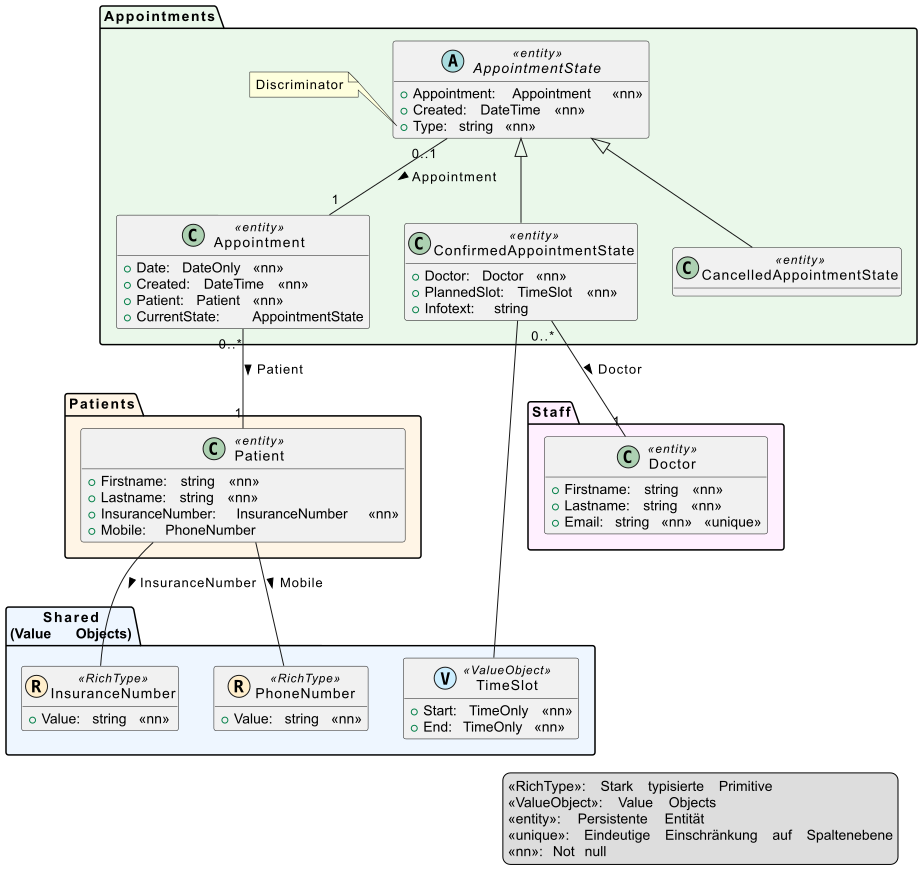
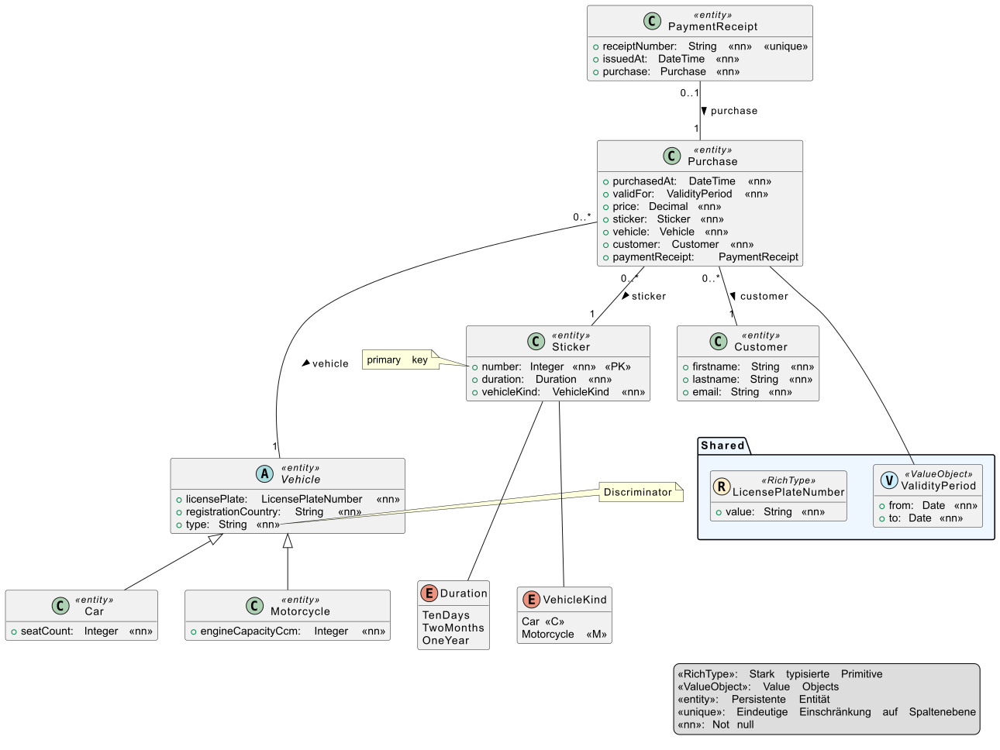
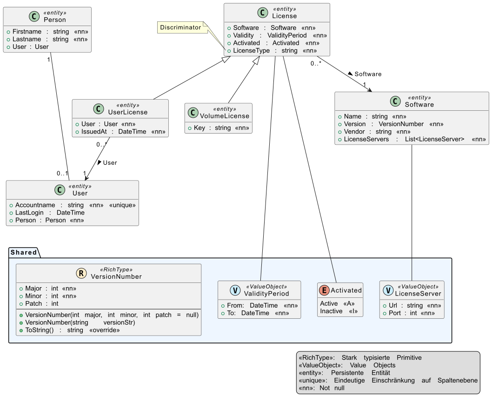

= Übungen zu Domain Modelling mit EF Core

== PLF vom 26.11.2025

Thema:: Domainmodel mit EF Core (Vererbung, 1:1, rich types und value objects) und Unittests
Modell:: 
Angabendatei:: link:Plf5akif_20251126/Angabe.pdf[Angabe.pdf]
Vorlagenprojekt:: link:Plf5akif_20251126/Plf5akif.7z[Plf5akif.7z]
Anmerkung:: Bei der Prüfung sind nur die Tests _T00_CanCreateDatabaseTest_ und _T00_SchemaTest_ in _GradingTests_ enthalten.
Hier sind zur Selbstkontrolle alle Tests enthalten.

== PLF vom 4.12.2025

Thema:: Domainmodel mit EF Core (Vererbung, 1:1, rich types und value objects) und Unittests
Modell:: 
Angabendatei:: link:Plf7abifcif_20251204/Angabe.pdf[Angabe.pdf]
Vorlagenprojekt:: link:Plf7abifcif_20251204/Plf7abifcif_20251204.7z[Plf7abifcif_20251204.7z]
Anmerkung:: Bei der Prüfung sind nur die Tests _T00_CanCreateDatabaseTest_ und _T00_SchemaTest_ in _GradingTests_ enthalten.
Hier sind zur Selbstkontrolle alle Tests enthalten.

== PLF vom 9.12.2025

Thema:: Domainmodel mit EF Core (Vererbung, 1:1, rich types und value objects) und Unittests
Modell:: 
Angabendatei:: link:Plf5caif_20251209/Angabe.pdf[Angabe.pdf]
Vorlagenprojekt:: link:Plf5caif_20251209/Plf5caif_20251209.7z[Plf5caif_20251209.7z]
Anmerkung:: Bei der Prüfung sind nur die Tests _T00_CanCreateDatabaseTest_ und _T00_SchemaTest_ in _GradingTests_ enthalten.
Hier sind zur Selbstkontrolle alle Tests enthalten.

