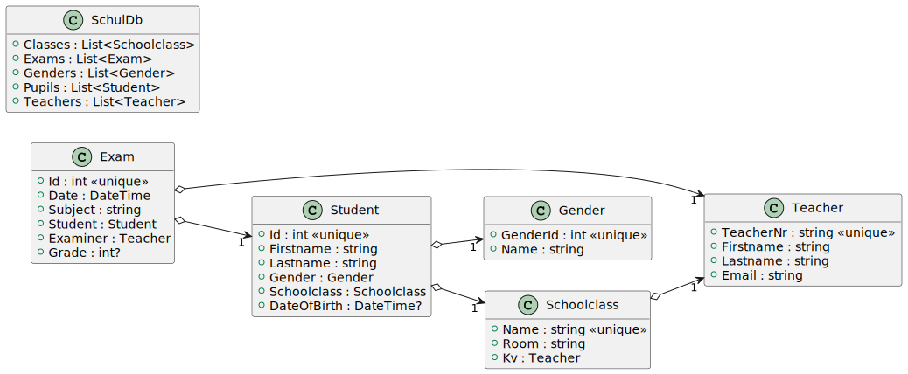

# Datenbankzugriff mit EF Core

> **Hinweis:** Die Inhalte aus dem Kapitel [EF Core](../../03%20EF%20Core) sind für das
> Verständnis nötig.

## Installation der NuGet Pakete

Um unsere Applikation aus dem Kapitel [Listen in XAML](../04_Lists) mit einer Datenbank zu verbinden,
müssen wir zuerst über die NuGet Packet Manager Console (Visual Studio: *Tools - NuGet Packet
Manager Console*) das Paket für Entity Framework Core installieren. Danach werden die Provider für
die einzelnen Datenbanksysteme (hier SQLite und SQL Server) ebenfalls als Paket installiert.
Wir können auch die Projektdaten [ListDemo.csproj](EfCoreDemo/ListDemo.csproj) direkt editieren:

```xml
<ItemGroup>
    <PackageReference Include="AutoMapper" Version="11.*" />
    <PackageReference Include="Bogus" Version="34.*" />
    <PackageReference Include="Microsoft.EntityFrameworkCore" Version="6.*" />
    <PackageReference Include="Microsoft.EntityFrameworkCore.Sqlite" Version="6.*" />
</ItemGroup>
```

EF Core unterstützt fast alle relationalen Datenbanken. Eine Übersicht ist auf
[docs.microsoft.com](https://docs.microsoft.com/en-us/ef/core/providers/?tabs=dotnet-core-cli)
zu sehen.

## Anpassen des Projektes

### Speichern des Connection Strings

Zuerst erstellen wir eine neue Datei mit dem Namen *app.config*. Es ist eine XML Datei, die
über den Configuration Manager in der Applikation angesprochen werden kann.

```xml
<?xml version="1.0" encoding="utf-8"?>
<configuration>
	<connectionStrings>
		<add name="ExamDatabase" connectionString="Data Source=Exams.db" />
	</connectionStrings>
</configuration>
```

### Anpassen der Klasse SchulDb

Unsere Klasse *SchoolDb* wird jetzt von *DbContext* abgeleitet und registriert die nötigen
Tabellen. Die Methode *OnConfiguring()* holt sich über den Configuration Manager den Connection
String aus der Datei *app.config*. Die Methode *OnConfiguring()* wird zur Konfiguration verwendet,
da wir die Optionen nicht im Konstruktor übergeben.

Unsere Modelklassen wurden mit Annotations und Konstruktoren versehen, damit EF Core daraus eine
Datenbank erzeugen kann. Die Details werden im Kapitel [EFCore](../../03%20EF%20Core) erklärt.

```c#
public class SchoolDb : DbContext
{
    public DbSet<Student> Pupils => Set<Student>();
    public DbSet<Schoolclass> Classes => Set<Schoolclass>();
    public DbSet<Teacher> Teachers => Set<Teacher>();
    public DbSet<Gender> Genders => Set<Gender>();
    public DbSet<Exam> Exams => Set<Exam>();
    protected override void OnConfiguring(DbContextOptionsBuilder optionsBuilder)
    {
        // Aus der Datei app.config den Connection String laden.
        optionsBuilder.UseSqlite(ConfigurationManager.ConnectionStrings["ExamDatabase"].ConnectionString);
    }
    // ...
}
```

Das Klassendiagramm hat sich zum vorigen Kapitel nicht verändert:



<sup>[Zum PlantUML Diagramm](http://www.plantuml.com/plantuml/uml/fL7BJkim4DtdAqRTNdLnjr4LAcX1YAeWw0-uoRGPv4TnnWXKyU_4s76jDc93LvrpdFEOcNSiB3ib2uax1ZPWQTyoD6InPZAwQAb1G7NWJr38hMcwegYbw3guGzsWXMC1_UzVcEuRA84qmspcDBqvhAf0huN2dkhOajuNNuF61aNTdaJYkBRfALmetPBjMETo0L-9KNYf1CaHvvUwDKQ6_yUHZ1U-pyQeC-s7ToY72buvrpJJQGMJ_vE1Jxxi6jGyUAQ5_RLdl4OPpnB0F52PLmxqGZ0-xgx9SjlJVjgGmYjV9SPCDVAFByde6IikFuJwjLyoprnZOBTznPhFkWr-vR2z07iVqcYp8uHLMD5WiFtfujzbHQ94GaUlLBTEBhP3YniFej_XYZgUPRkeJb4IxOSglqfYmXYv9tSWcQWOAt8nJcBZNFLrvhs6K_8R)
</sup>

### Anpassen der Klasse App

Damit unsere Datenbank beim Programmstart erstellt und mit Musterdaten befüllt wird, überschreiben
wir die Methode *OnStartup()* der Klasse *App*:

```c#
public partial class App : Application
{
    protected override void OnStartup(StartupEventArgs e)
    {
        base.OnStartup(e);

        using (var db = new SchoolDb())
        {
            db.Database.EnsureDeleted();
            db.Database.EnsureCreated();
            db.Seed();
        }
    }
}
```

## CRUD Operationen mit EF Core

### Zugriff auf die Datenbank mit dem ViewModel

In [MainViewModel](EfCoreDemo/ViewModels/MainViewModel.cs) wird eine private Variable definiert,
die die Instanz des Datenbankkontextes speichert:

```c#
private readonly SchoolDb _db = new SchoolDb();
```

Diese Technik erzeugt eine *langlebige* (persistente) Verbindung zur Datenbank. Im Bereich
der Webtechniken wird die Verbindung bei jeder Anfrage aufgebaut, damit nicht hunderte
Verbindungen offen bleiben. Da unsere WPF Applikation nicht von hunderten Clients bedient wird,
können wir diese Technik verwenden.

Ansonsten ergeben sich fast keine Unterschiede zum vorigen Beispiel. Da EF Core die Daten als
Collections bereitstellt, können wir sie mit gewohnten Mitteln nutzen.

> **Hinweis:** Speichere deine Daten aus Datenbanktabellen im ViewModel immer als List. Bei Abfragen
> wird daher *ToList()* aufgerufen. Dies stellt
> sicher, dass alle Daten im Speicher sind. Dadurch erspart man sich einige Probleme mit dem Binding
> und eventuell geschlossenen Datenbankcontexten.

### Einfügen und Editieren von Daten mit Automapper und EF Core

Im letzten Beispiel haben wir Automapper kennengelernt. Da wir nicht direkt die Modelklassen
editieren, müssen wir vor dem Einfügen in die Datenbank auf Basis der *StudentDto* Klasse zuerst
eine Instanz von *Student* erstellen. Der folgende Code zeigt ein INSERT/UPDATE Szenario in
[MainViewModel](EfCoreDemo/ViewModels/MainViewModel.cs):

```c#
SavePupilCommand = new RelayCommand(
    () =>
    {
        if (CurrentStudent is null) { return; }
        try
        {
            var studentDb = _db.Pupils.FirstOrDefault(p => p.Id == CurrentStudent.Id);  // (1)
            if (studentDb is null)                                                      // (2)
            {
                var student = App.Mapper.Map<Student>(CurrentStudent);                  // (3)
                _db.Pupils.Add(student);
            }
            else
            {
                App.Mapper.Map(CurrentStudent, studentDb);                              // (4)
            }
            _db.SaveChanges();                                                          // (5)
            ReadStudents();
            // Die Felder für die Schülerbearbeitung werden wieder geleert.
            CurrentStudent = null;
        }
        catch (ApplicationException e)                                                  // (6)
        {
            MessageBox.Show(e.Message, "Fehler", MessageBoxButton.OK, MessageBoxImage.Error); return;
        }
        catch (DbUpdateException e)                                                     // (7)
        {
            MessageBox.Show(e.Message, "Fehler", MessageBoxButton.OK, MessageBoxImage.Error); return;
        }
    }, () => CurrentStudent is not null);
```

1. Zuerst wird mit dem Primärschlüssel versucht, den originalen Schüler aus der Datenbank zu lesen.
2. Finden wir keinen Schüler, handelt es sich wohl um einen neuen Schüler, wir müssen also eine
   INSERT Logik durchführen.
3. Mit Automapper wird wie gewohnt aus einer Instanz von *StudentDto* eine Instanz von *Student*
   erzeugt.
4. Bei einem Update nutzen wir eine Überladung von *Map()*, die 2 Parameter verwendet. Diese
   Methode kann das destination object (2. Argument) mit den Daten des source object (1. Argument)
   ergänzen. Dabei werden wieder gleiche Property Namen gemappt.
5. **Vergiss nie auf SaveChanges()!**
6. Unsere *BeforeMap()* Methode in [DtoMappingProfile](EfCoreDemo/Dto/DtoMappingProfile.cs)
   wirft eine *ApplicationException*, falls Werte NULL sind. Das müssen wir natürlich prüfen.
7. Beim Einfügen können natürlich datenbankspezifische Fehler passieren (constraint violations, ...)
   die erst beim Einfügen auftreten. Das fangen wir mit der *DbUpdateException* ab.

### Die ProjectTo() Methode von Automapper

Unsere ObservableCollection vom Typ *StudentDto* braucht - wenn sie mit den Schülern aus der
Datenbank befüllt werden soll - natürlich ein Mapping. In Zusammenhang mit EF Core gibt es
im Namespace *AutoMapper.QueryableExtensions* die Methode *ProjectTo()*. Sie erzeugt schon
datenbankseitig ein SELECT, welches die StudentDto Klassen erzeugen kann. Somit wird vermieden,
dass unnötig Daten abgefragt werden. Als Parameter braucht die Methode den *ConfigurationProvider*.
Auf diesen können wir über unsere globale Automapper Instanz in *App.Mapper* zugreifen.

Da die Darstellung der Schülerliste auch eine Navigation Property (*Gender*) verwendet, müssen wir 
natürlich mit *Include()* eine entsprechende JOIN Anweisung in EF Core konfigurieren.

```c#
using AutoMapper.QueryableExtensions;
// ...
private void ReadStudents()
{
    // ...
    var students = _db.Pupils
        .Include(p => p.Gender)
        .Where(p => p.Schoolclass.Name == CurrentClass.Name)
        .OrderBy(p => p.Lastname).ThenBy(p => p.Firstname);
    Pupils.ReplaceAll(students.ProjectTo<StudentDto>(App.Mapper.ConfigurationProvider));
}
```

## Übung

Die Aufgaben sind ident mit der Übung aus dem Kapitel *Listen in XAML*, allerdings soll hier in die
Datenbank geschrieben werden. Ausgangsbasis ist die neue Solution [EfCoreDemo](EfCoreDemo)
im aktuellen Kapitel, die schon eine SQLite Datenbank samt Musterdaten erzeugt.

Starte zuerst das Musterprogamm und analysiere es mit dem Debugger. Arbeite dabei auch mit
falschen Eingaben (z. B. Schüler wird erzeugt, danach wird gleich auf Speichern geklickt).

Betrachte außerdem die erzeugte SQLite Datenbank mit [DBeaver](https://dbeaver.io/) oder einem 
anderen SQL Editor. Die Datenbank liegt im Ausgabeverzeichnis des Programmes
(*bin/Debug/net6.0-windows/Exams.db*). Betrachte durch *SELECT* Anweisungen den Inhalt der 
Tabellen.

### Das Programm erweitern


1. Zeige in der Liste nicht nur den Schülernamen, sondern auch den Namen des Klassenvorstandes an.
2. Der Button *Schüler löschen* ist noch ohne Funktion. Beim Drücken darauf soll der aktuelle Schüler
   entfernt werden. Achte darauf, dass er aus der ListBox, aus der *Pupils* Collection der Datenbank
   und der *Pupils* Collection der aktuellen Klassen entfernt wird.
3. In XAML Code haben die Prüfungen noch statische Werte zur Demonstration. Gestalte die ListBox
   so, dass der Prüfungsgegenstand, das Datum der Prüfung, das Lehrerkürzel und die Note nett
   aufbereitet ausgegeben werden.
4. Der Bereich *Neue Prüfung* besteht im Moment noch aus Textboxen ohne Binding. Um eine
   Prüfung anlegen zu können, muss eine DTO Klasse *ExamDto* definiert werden. Vergiss nicht,
   das Mappingprofil zu definieren. Die Liste der Prüfungen bindet sich dann an eine Collection
   vom Typ *ExamDto*. Erzeuge die
   entsprechenden Bindings und die benötigten Properties im ViewModel.

   (a) Der Prüfer soll aus einer Liste von Lehrern gewählt werden, die über die Datenbank
   bereitgestellt wird.
5. Beim Klicken auf Prüfung speichern soll die Prüfung zur Liste der Prüfungen des Schülers
   hinzugefügt werden. Achte auch darauf, dass sich die Liste der Prüfungen sofort aktualisiert.
