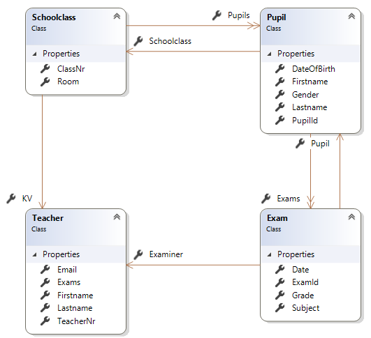
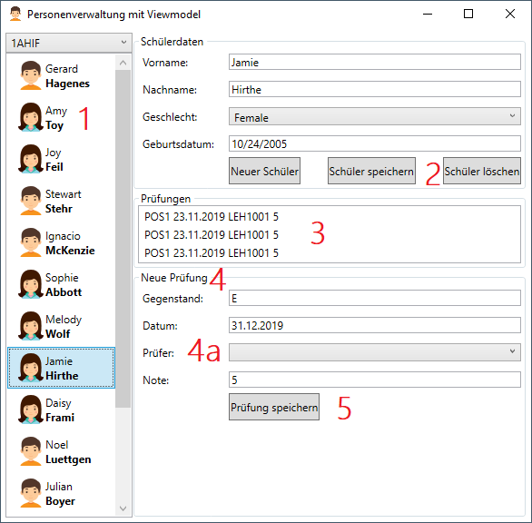

# Datenbankzugriff mit EF Core

Der erste Teil beschreibt das Speichern der vorhandenen Modelklassen in einer Datenbank. Diese
Logik ist in der Solution in [EfCoreDemo](EfCoreDemo) bereits fertig implementiert.

Der zweite Teil (CRUD Operationen mit EF Core) befasst sich dann mit dem Zugriff auf die Datenbank
vom ViewModel heraus. Die Übungen betreffen diesen Punkt.

## Installation der NuGet Pakete

Um unsere Applikation aus dem Kapitel [Listen in XAML](../04_Lists) mit einer Datenbank zu verbinden,
müssen wir zuerst über die NuGet Packet Manager Console (Visual Studio: *Tools - NuGet Packet
Manager Console*) das Paket für Entity Framework Core installieren. Danach werden die Provider für
die einzelnen Datenbanksysteme (hier SQLite und SQL Server) ebenfalls als Paket installiert:

```ps
Install-Package Microsoft.EntityFrameworkCore
Install-Package Microsoft.EntityFrameworkCore.Sqlite
Install-Package Microsoft.EntityFrameworkCore.SqlServer
```

EF Core unterstützt fast alle relationalen Datenbanken. Eine Übersicht ist auf
[docs.microsoft.com](https://docs.microsoft.com/en-us/ef/core/providers/?tabs=dotnet-core-cli)
zu sehen.

### Anpassen des Projektfiles

Durch Doppelklick auf das Projekt (Eintrag *ListDemo* im Solution Explorer) öffnet sich die Datei
[ListDemo.csproj](EfCoreDemo/ListDemo.csproj). Sie ist eine XML Datei,
die alle Einstellungen und die installierten Pakete (Dependencies) als XML Datei anzeigt.

Wenn ein Paket installiert wird, wird immer eine fixe Version angegeben. Es besteht auch die Möglichkeit,
mit einem Wildcard (Stern) zu arbeiten. Hier wird immer die neueste Version geladen. In unserem
Projekt wurde dies umgesetzt:

```xml
<ItemGroup>
    <PackageReference Include="Bogus" Version="*" />
    <PackageReference Include="Microsoft.EntityFrameworkCore" Version="3.*" />
    <PackageReference Include="Microsoft.EntityFrameworkCore.SqlServer" Version="3.*" />
    <PackageReference Include="Microsoft.EntityFrameworkCore.Sqlite" Version="3.*" />
</ItemGroup>
```

Stern ohne Version bedeutet, dass generell die neueste Version geladen wird. 3.* bedeutet, dass
die neueste Version mit der major version 3 geladen wird. Somit werden beim Kompilieren immer
die aktuellen Pakete eingebunden. Natürlich ist das bei breaking changes problematisch, deswegen
verwenden wir für Entity Framework auch die Einschränkung mit Version 3.

## Erstellen der Datenbank von den Modelklassen aus

In unserem Programm gibt es bereits datenhaltende Klassen (Modelklassen), die zur Demonstration
angelegt wurden. Dies sind sogenannten POCO (plain old clr object) Klasse. Sie haben keine Methoden,
sondern nur default properties mit offenem setter.



### Ein- und beidseitige Navigations

Die Klassen stehen auch in Beziehung zueinander. So besitzt die Klasse [Exam](EfCoreDemo/Model/Exam.cs)
eine Navigation zu Teacher (Property Examiner). In der Klasse [Teacher](EfCoreDemo/Model/Teacher.cs)
gibt es allerdings keine Liste von Prüfungen. Dies wird als *einseitige Navigation* bezeichnet.

Die Klasse [Schoolclass](EfCoreDemo/Model/Schoolclass.cs) besitzt eine Liste von Schülern (`List<Pupil>`),
die Klasse [Pupil](EfCoreDemo/Model/Pupil.cs) verweist mit dem Property *Schoolclass* auf die
Instanz der Klasse vom Typ *Schoolclass*. Dies bezeichnet man als *beidseitige Navigation*.

Je nach Zugriff im Programm hat jeder Programmierer es selbst in der Hand, ein- oder beidseitige
Navigations anzulegen. EF Core wird diese automatisch befüllen.

### Erzeugen der Datenbank ohne Create Table

Jetzt können wir diese Klassen mit *CREATE TABLE* in einer Datenbank umsetzen. Mit EF Core gibt
es allerdings auch die Möglichkeit, die Datenbank zu erzeugen. Dieses Prinzip nennt sich *Code first*
und ist gerade bei agilen Projekten eine Option, da die Modelklassen während der Entwicklung leicht
geändert werden können.

Zum Erzeugen der Datenbank reicht allerdings die Information in den Modelklassen nicht aus. Es fehlen
z. B. folgende Informationen:

- Wie heißen die Tabellen- und Spaltennamen?
- Was ist der Primärschlüssel?
- Sind die Felder nullable?
- Welcher SQL Datentyp mit welcher Länge wird verwendet?
- Was ist die maximale Länge bei Stringfeldern?
- Werden die Werte durch eine Auto-ID automatisch erzeugt?

Wir müssen allerdings nicht alles im Detail angeben. EF Core folgt dem Prinzip *convention over
configuration*. Es werden bestimmte Annahmen getroffen:

| Topic                            | Convention                                                                                                                                                                                                        |
| -------------------------------- | ----------------------------------------------------------------------------------------------------------------------------------------------------------------------------------------------------------------- |
| Including types in the model     | Types that are exposed in DbSet properties on your context are included in the model as entities.                                                                                                                 |
| Included and excluded properties | All public properties with a getter and a setter will be included in the model.                                                                                                                                   |
| Column names                     | When using a relational database, entity properties are mapped to table columns having the same name as the property.                                                                                             |
| Key                              | A property named Id or (type name)Id will be configured as the primary key of an entity.                                                                                                                          |
| Autoincrement                    | Non-composite primary keys of type short, int, long, or Guid are set up to have values generated for inserted entities,                                                                                           |
| Relationships                    | A relationship will be created when there is a navigation property discovered on a type. See https://docs.microsoft.com/en-us/ef/core/modeling/relationships?tabs=fluent-api%2Cfluent-api-simple-key%2Csimple-key |

#### Erstellen der Contextklasse

Um die zusätzlichen Einstellungen angeben zu können, muss der Datenbankcontext erstellt werden.
In unserem Beispiel haben wir bereits mit der Klasse [SchoolDb](EfCoreDemo/Model/SchoolDb.cs)
eine Klasse, über die wir auf die Daten zugegriffen haben

**Schritt 1: Ableiten von DbContext.** Wir leiten unsere Klasse [SchoolDb](EfCoreDemo/Model/SchoolDb.cs)
nun von *DbContext* ab. Diese Klasse liegt im Napespace *Microsoft.EntityFrameworkCore* und muss
daher über *using* eingebunden werden.

```c#
public class SchoolDb : DbContext
{
    ...
}
```

**Schritt 2: Erstellen der Properties vom Typ *DbSet.*** Nun definieren wir alle Tabellen, wie wir in unserer
Datenbank erstellen wollen, als public Property vom Typ `DbSet<T>` in dieser Klasse. In unserem Fall
erstellen wir ein DbSet für jedes unserer Modelkalssen:

```c#
public DbSet<Gender> Genders { get; set; }
public DbSet<Teacher> Teachers { get; set; }
public DbSet<Schoolclass> Classes { get; set; }
public DbSet<Pupil> Pupils { get; set; }
public DbSet<Exam> Exams { get; set; }
```

**Schritt 3: Überschreiben der Methode *OnConfiguring***. Noch haben wir nirgends angegeben, welches
Datenbanksystem wir verwenden wollen und wie die Datenbank heißt. Diese Information stellt der
*Connection string* bereit. Bereits im Kapitel [EF Core](https://github.com/schletz/Pos3xhif/tree/master/03%20EF%20Core)  
wurde bei *dotnet ef dbcontext scaffold* ein String mitgegeben, damit das Skript die Modelklassen
erzeugen kann. Dieser String wird auch hier verwendet.

Zur Erinnerung: Der Connection String unterscheidet sich nach Datenbanksystem. Beispiele für die
verschiedenen Datenbanksysteme sind:

| System               | Paket                                   | Connection String                                                              |
| -------------------- | --------------------------------------- | ------------------------------------------------------------------------------ |
| SQLite               | Microsoft.EntityFrameworkCore.Sqlite    | Data Source=aaa.db                                                             |
| LocalDb (SQL Server) | Microsoft.EntityFrameworkCore.SqlServer | Server=(localdb)\mssqllocaldb;Database=aaa;Trusted_Connection=True;            |
| MySQL                | Pomelo.EntityFrameworkCore.MySql        | Server=aaaaa;Database=bbbbb;User=ccccc;Password=ddddd;TreatTinyAsBoolean=true; |

Achtung: Der Backslash ist bei der Verwendung in C# entweder zu escapen (2x schreiben) oder in einem
Verbatim String mit *@"MyString"* zu schreiben.

Nun überschreiben wir die Methode OnConfiguring(). Da wir SQLite verwenden, geben wir die Methode
*UseSqlite()* an. Sie steht zur Verfügung, da wir das Paket *Microsoft.EntityFrameworkCore.Sqlite*
installiert haben.

```c#
protected override void OnConfiguring(DbContextOptionsBuilder optionsBuilder)
{
    optionsBuilder.UseSqlite(@"Data Source=School.db");
}
```

**Schritt 4: Überschreiben der Methode *OnModelCreating()***. In dieser Methode werden alle
Zusatzinformationen angegeben, die wir überschreiben möchten. Das ist notwendig, da wir nicht immer
den conventions von EF Core folgen. So soll z. B. die Spalte *GenderNr* zum Primärschlüssel werden.
EF Core definiert aber nur Felder mit dem Namen Id oder GenderId automatisch als Primärschlüssel.
Die im Musterprogramm durchgeführten Anpassungen werden im Punkt
*Definition des Modells mit der Fluent Api* erklärt.

**Schritt 5: Erstellen einer Methode *CreateDatabase()***. Wenn wir die Datenbank nun erzeugen wollen,
stehen uns 2 Methoden von EF Core zur Verfügung: *EnsureDeleted()* und *EnsureCreated()*. Die
Methode *EnsureDeleted()* löscht die Datenbank. Dies ist zum Testen sinnvoll, wenn beim Programmstart
die Datenbank wieder einen definierten Zustand haben soll. Die Methode *Database.EnsureCreated()*
prüft, ob die Datenbank vorhanden ist. Ist sie das nicht, generiert EF Core die *CREATE TABLE*
Anweisungen aufgrund der Definition in *OnModelCreating()*

Außerdem generiert die Methode Musterdaten mit dem Musterdatengenerator *Bogus*. Bogus ist ein NuGet
Paket, welches Daten für verschiedene Profile (Namen, Städte, ...) generieren kann. Die Methode
ist in der Klasse [SchoolDb](EfCoreDemo/Model/SchoolDb.cs) für unser Musterprogramm fertig implementiert.

**Schritt 6: Aufrufen der Mehode in *MainWindow()***. In der Klasse
[MainWindow](EfCoreDemo/MainWindow.xaml.cs) wird nun die Methode *CreateDatabase()* aufgerufen.
Dadurch ist sichergestellt, dass beim Programmstart die Datenbank erzeugt wurde.

```c#
public MainWindow()
{
    using (SchoolDb db = new SchoolDb())
    {
        db.CreateDatabase();
    }

    InitializeComponent();
}
```

## Definition des Modells mit der Fluent Api

Folgen wir in unseren Modelklassen nicht den Konventionen von EF Core, oder möchten wir Zusatzinformationen
angeben, so überschreiben wir in der Contextklasse die Methode *OnModelCreating()*.

Es gibt 2 Arten, die Zusatzinformationen im Code zu platzieren:

- Mit data annotations direkt über den Properties der Modelklassen.
- Mit der Fluent API in der Methode *OnModelCreating()*.

Wir wählen die Fluent API, da sie mächtiger ist. Außerdem bleiben dann die Modelklassen ohne
Abhängigkeiten zu den EF Core Annotations und können leicht in ein Modul ausgelagert oder
wiederverwendet werden. In der Klasse [SchoolDb](EfCoreDemo/Model/SchoolDb.cs) sieht unsere
Definition des Modelles so aus:

```c#
protected override void OnModelCreating(ModelBuilder modelBuilder)
{
    // Primärschlüssel definieren.
    modelBuilder.Entity<Gender>().HasKey(g => g.GenderNr);
    modelBuilder.Entity<Teacher>().HasKey(t => t.TeacherNr);
    modelBuilder.Entity<Schoolclass>().HasKey(s => s.ClassNr);
    modelBuilder.Entity<Pupil>().HasKey(p => p.PupilId);
    modelBuilder.Entity<Exam>().HasKey(e => e.ExamId);
    // Auto ID Werte aktivieren oder deaktivieren (bei int Schlüssel standardmäßig aktiv)
    modelBuilder.Entity<Gender>().Property(g => g.GenderNr).ValueGeneratedNever();

    // Unique Felder definieren.
    modelBuilder.Entity<Gender>().HasIndex(g => g.Name).IsUnique();

    // NOT NULL Constraints für Referenztypen (die ja null sein können). Wertetypen sind immer NOT
    // NULL, außer es wird ein nullable type wie int? verwendet.
    modelBuilder.Entity<Exam>().Property(e => e.Subject).IsRequired();
    modelBuilder.Entity<Gender>().Property(g => g.Name).IsRequired();
    modelBuilder.Entity<Pupil>().Property(p => p.Firstname).IsRequired();
    modelBuilder.Entity<Pupil>().Property(p => p.Lastname).IsRequired();
    modelBuilder.Entity<Teacher>().Property(t => t.Firstname).IsRequired();
    modelBuilder.Entity<Teacher>().Property(t => t.Lastname).IsRequired();

    // Stringlängen definieren.
    modelBuilder.Entity<Teacher>().Property(t => t.TeacherNr).HasMaxLength(16);
    modelBuilder.Entity<Schoolclass>().Property(s => s.ClassNr).HasMaxLength(16);

    // Die Navigations konfigurieren. Wir setzen, wenn sie NOT NULL sein müssen und dass
    // das beim Löschen ein Fehler geworfen wird, wenn der Wert als Fremdschlüssel in der
    // n Tabelle verwendet wird.
    modelBuilder.Entity<Schoolclass>().HasOne(s => s.KV).WithMany().OnDelete(DeleteBehavior.Restrict).IsRequired();
    modelBuilder.Entity<Pupil>().HasOne(p => p.Gender).WithMany().OnDelete(DeleteBehavior.Restrict).IsRequired();
    modelBuilder.Entity<Pupil>().HasOne(p => p.Schoolclass).WithMany(s => s.Pupils).OnDelete(DeleteBehavior.Restrict).IsRequired();
    modelBuilder.Entity<Exam>().HasOne(e => e.Examiner).WithMany(t => t.Exams).OnDelete(DeleteBehavior.Restrict).IsRequired();
    modelBuilder.Entity<Exam>().HasOne(e => e.Pupil).WithMany(p => p.Exams).OnDelete(DeleteBehavior.Restrict).IsRequired();
}
```

Der Code der Fluent API ist durch die Methodennamen schon sehr selbsterklärend. Auf
https://docs.microsoft.com/en-us/ef/core/modeling/ befindet sich eine Beschreibung aller Möglichkeiten.

## CRUD Operationen mit EF Core

### Zugriff auf die Datenbank mit dem ViewModel

In [MainViewModel](EfCoreDemo/ViewModels/MainViewModel.cs) wird eine private variable definiert,
die die Instanz des Datenbankkontextes speichert:

```c#
private readonly SchoolDb _db = new SchoolDb();
```

Ansonsten ergeben sich fast keine Unterschiede zum vorigen Beispiel. Da EF Core die Daten als
Collections bereitstellt, können wir sie mit gewohnten Mitteln nutzen.

> **Hinweis:** Speichere deine Daten aus Datenbanktabellen im ViewModel immer als List. Bei Abfragen
> wird daher *ToList()* aufgerufen. Dies stellt
> sicher, dass alle Daten im Speicher sind. Dadurch erspart man sich einige Probleme mit dem Binding
> und eventuell geschlossenen Datenbankcontexten.

### Anlegen eines neuen Datensatzes: Der Entry State und Transaktionen

Wie im Kapitel [EF Core - CRUD](https://github.com/schletz/Pos3xhif/tree/master/03%20EF%20Core/04_Crud)
bereits beschrieben, läuft das Hinzufügen von Daten im Wesentlichen durch ein *Add()* im DbSet und
*SaveChanges()* ab. Im Command *SavePupilCommand* in
[MainViewModel](EfCoreDemo/ViewModels/MainViewModel.cs) wird über den Entry State gearbeitet.

```c#
using (var transaction = _db.Database.BeginTransaction())        // (1)
{
    try
    {
        if (_db.Entry(CurrentPupil).State == Microsoft.EntityFrameworkCore.EntityState.Detached)  // (2)
        {
            _db.Entry(CurrentPupil).State = Microsoft.EntityFrameworkCore.EntityState.Added;
        }
        if (_db.Entry(CurrentPupil).State == Microsoft.EntityFrameworkCore.EntityState.Added)
        {
            _db.SaveChanges();
            Pupils.Add(CurrentPupil);   // (3)
        }
        else if(_db.Entry(CurrentPupil).State == Microsoft.EntityFrameworkCore.EntityState.Modified)
        {
            _db.SaveChanges();
        }
        transaction.Commit();           // (4)
    }
    catch (Exception e)                 // (5)
    {
        transaction.Rollback();
        _db.Entry(CurrentPupil).Reload();
        MessageBox.Show("Der Schüler konnte nicht gespeichert werden." + e?.InnerException, "Fehler", MessageBoxButton.OK, MessageBoxImage.Error);
    }
}
```

**(1)** Eine Transaktion ist eine Abfolge von SQL Anweisungen. Eine Datenbank kann diese
zur Gänze rückgängig machen, um wieder einen definierten Ausgangszustand zu erhalten. Sonst würden
Fälle eintreten, wo im Fehlerfall einige *INSERT* Anweisungen schon geschrieben wurden, andere
nicht. Ein beliebtes Beispiel ist eine Kontobuchung mit 2 INSERT Anweisungen. Es darf nie vorkommen,
dass von Konto A abgebucht, aber durch einen Fehler bei Konto B nie gutgeschrieben wird.

**(2)** Beim Klick auf *Neuer Schüler* wird mit *new* ein neuer Schüler angelegt. Diesen Schüler
hat EF Core natürlich noch nicht im DbSet erfasst. Er hat also den Status *Detached*. Mit dieser
Abfrage erkennen wir, ob es sich um einen neu angelegten Schüler handelt. Wenn dem so ist, setzen
wir den State auf *Added*. Dadurch nimmt ihn EF Core auf und vermerkt, dass bei *SaveChanges()*
ein *INSERT* geschrieben werden muss.

**(3)** Ein Speichern in der Datenbank bewirkt noch keine Aktualisierung der *ObservableCollection*.
Diese ist losgelöst vom DbSet und muss von uns daher auf den aktuellen Stand gebracht werden.

**(4)** Wenn der Code bis zu dieser Zeile kommt, dann hat offenbar alles funktioniert und wir können
mit *Commit* die Transaktion abschließen. Damit wird die Änderung in der Datenbank für alle Benutzer
sichtbar. Nach *SaveChanges()* wäre sie nur für unseren Datenbankuser sichtbar.

**(5)** Wichtig ist eine Fehlerbehandlung. Wenn etwas nicht funktioniert (ungültige Daten, Probleme
mit Fremdschlüssel), so machen wir mit *Rollback()* alle Änderungen rückgängig. Die *Reload()*
Anweisung liest das Entity wieder aus der Datenbank, um den Originalzustand auch im DbSet wieder
herzustellen.

## Löschen eines Datensatzes

Das Löschen arbeitet nach der gleichen Grundlogik wie die vorige Methode, die einen Schüler
hinzugefügt hat. Auch hier wird wieder eine Transkation erstellt, damit im Fehlerfall alles
Rückgängig gemacht werden kann.

Auch hier ist die Fehlerbehandlung wieder sehr wichtig, da wir sonst Schüler aus unserer
*ObservableCollection()* löschen wurden, obwohl bei *SaveChanges()* ein Fehler auftetreten ist.

Der folgende Code funktioniert nur, wenn ein Schüler keine Semesterprüfungen eingetragen hat.
Diese Ergänzung wird Teil der Übung sein.

```c#
using (var transaction = _db.Database.BeginTransaction())
{
    try
    {
        _db.Pupils.Remove(CurrentPupil);
        _db.SaveChanges();
        Pupils.Remove(CurrentPupil);
        transaction.Commit();
    }
    catch (Exception e)
    {
        transaction.Rollback();
        _db.Entry(CurrentPupil).Reload();
        MessageBox.Show("Der Schüler konnte nicht gelöscht werden." + e?.InnerException, "Fehler", MessageBoxButton.OK, MessageBoxImage.Error);
    }
}
```

## Übung

Die Aufgaben sind ident mit der Übung aus dem Kapitel *Listen in XAML*, allerdings soll hier in die
Datenbank geschrieben werden. Ausgangsbasis ist die neue Solution [EfCoreDemo](EfCoreDemo)
im aktuellen Kapitel, die schon eine SQLite Datenbank samt Musterdaten erzeugt.

Starte zuerst das Musterprogamm und analysiere es mit dem Debugger. Arbeite dabei auch mit
falschen Eingaben (z. B. Schüler wird erzeugt, danach wird gleich auf Speichern geklickt).

Betrachte außerdem die erzeugte SQLite Datenbank mit DBeaver (Informationen unter
[Arbeiten mit DBeaver Community](https://github.com/schletz/Dbi2Sem/blob/master/01_OracleVM/01_Dbeaver/README.md)). Die Datenbank liegt im Ausgabeverzeichnis des Programmes (*bin\Debug\netcoreapp3.1\School.db*).
Betrachte durch *SELECT* Anweisungen den Inhalt der Tabellen.



1. Zeige in der Liste nicht nur den Schülernamen, sondern auch den Namen des Klassenvorstandes an.
   Beachte, dass in EF Core mit *Include()* dafür zusätzliche Daten ausgelesen werden müssen.
2. Der Button *Schüler löschen* löscht zwar einen Schüler, bei eingetragenen Prüfungen
   entsteht allerdings ein Fehler. Es sollen daher alle Prüfungen des Schülers aus der Datenbank
   gelöscht werden. Achte auf eine korrekte Synchronisation mit den Listen.
3. In XAML Code haben die Prüfungen noch statische Werte zur Demonstration. Gestalte die ListBox
   so, dass der Prüfungsgegenstand, das Datum der Prüfung, das Lehrerkürzel und die Note nett
   aufbereitet ausgegeben werden.
4. Der Bereich *Neue Prüfung* besteht im Moment noch aus Textboxen ohne Binding. Erzeuge die
   entsprechenden Bindings und die benötigten Properties im ViewModel.

   (a) Der Prüfer soll aus einer Liste von Lehrern gewählt werden, die über die Datenbank
   bereitgestellt wird.
5. Beim Klicken auf Prüfung speichern soll die Prüfung zur Liste der Prüfungen des Schülers
   hinzugefügt werden. Achte auch darauf, dass sich die Liste der Prüfungen sofort aktualisiert.
