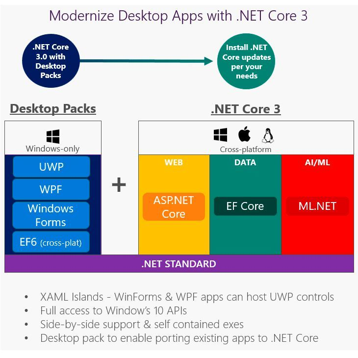

# WPF unter .NET Core 3



<sup>Quelle: https://www.dev-insider.de/wpf-und-windows-forms-in-net-core-30-nutzbar-a-717831/</sup>

Windows Presentation Foundation (WPF) ist ein UI-Framework, mit dem Desktop-Client-Anwendungen für
Microsoft Windows erstellt werden können. Mit der Version 3 von .NET Core steht es auch unter dieser
Plattform zur Verfügung. Die erstellen Programme sind allerdings nur unter Windows ausführbar.

WPF verwendet die Extensible Application Markup Language (XAML), um ein deklaratives Modell für die
Anwendungsprogrammierung bereitzustellen.

## WPF unter .NET Framework vs .NET Core

Viele Beispiele auf YouTube basieren noch auf .NET Framework. Hier muss bei der Erstellung darauf
geachtet werden, dass eine .NET Core WPF Anwendung erzeugt wird. Der weitere Code kann in der Regel
1:1 übernommen werden, in den Toturials werden sehr selten .NET Framework spezifische Funktionen
verwendet.

Alle Beispiele in diesem Repository basieren auf .NET Core 3.1.

## Erstellen einer neuen WPF Anwendung für .NET Core

Entweder wird mit Visual Studio ein neues Projekt vom Typ *WPF App (.NET Core)* erzeugt, oder es
wird in der Konsole ein Ordner erstellt und mit *dotnet new* wird eine leere Anwendung erstellt:

```text
md MyFirstWpfAll
cd MyFirstWpfAll
dotnet new wpf
start MyFirstWpfAll.csproj
```
