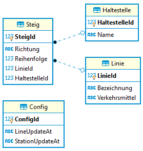

# Anzeigeprogramm für Daten der Wiener Linien

## Intro

Auf
[data.gv.at](https://www.data.gv.at/katalog/dataset/stadt-wien_wienerlinienechtzeitdaten)
stehen die Daten der Wiener Linien (Haltestellen, Linien, Steige) als
CSV Datei zur Verfügung. Die Dateien sind UTF-8 codiert, haben als
Trennzeichen ein Semikolon (;) und Strings sind unter Anführungszeichen
gesetzt. Zeilenumbruch ist der Windows Standard CR+LF. Sie können von
folgenden Adressen bezogen werden:

  - **csv-linien**:
    *<https://data.wien.gv.at/csv/wienerlinien-ogd-linien.csv>*
  - **csv-haltestellen**:
    *<https://data.wien.gv.at/csv/wienerlinien-ogd-haltestellen.csv>*
  - **csv-steige**:
    *<https://data.wien.gv.at/csv/wienerlinien-ogd-steige.csv>*

Schreibe ein Programm, welches diese Dateien asynchron lädt, parst in in
einer Datenbank speichert. Die geladenen Linien werden in einer Liste
angezeigt. Beim Klick auf eine Linie sollen alle Haltestellen dieser
Linien in einer weiteren Liste angezeigt werden.

Dafür werden 3 Datensätze benötigt: Die Linien, die Steige und die
Haltestellen. Haltestellen und Linien stellen eine n:m Beziehung dar, da
eine Linie mehrere Haltestellen anfährt, und von einer Haltestelle
mehrere Linien abfahren. Die Auflösungstabelle ist die Datei Steige. Sie
gibt an, welche Linien pro Haltestelle abfahren.

### Die CSV Datei der Linien

Jede Linie hat in der Datei *wienerlinien-ogd-linien.csv* in der Spalte
*LINIEN\_ID* eine ID, die als Fremdschlüssel in der Datei
*wienerlinien-ogd-steige.csv* in der Spalte *FK\_LINIEN\_ID* verwendet
wird. Daneben gibt es bei den Steigen noch die Spalte
*FK\_HALTESTELLEN\_ID*, die auf die entsprechende Haltestelle in der
Datei *wienerlinien-ogd-haltestellen.csv* verweist. Anbei die ersten 5
Zeilen der Liniendatei, nicht benötigte Spalten werden nicht angezeigt:

| LINIEN\_ID | BEZEICHNUNG | VERKEHRSMITTEL |
| ---------: | :---------- | :------------- |
|  214433831 | 19A         | ptBusCity      |
|  230831064 | 76B         | ptBusCity      |
|  214433869 | 40A         | ptBusCity      |
|  214433731 | 26          | ptTram         |
|  214434095 | 92A         | ptBusCity      |

### Die CSV Datei der Steige

Wollen wir nun alle Haltestellen der Linie 12A (ID 214433815) wissen,
müssen wir die ID in der Datei Steige suchen und erfahren dort, dass
folgende Datensätze zugeordnet sind. Es wird bei der Reihenfolge
zwischen Hin (Richtung H) und Retour (Reichtung R) unterschieden. Anbei
die ersten 5 Steige der Linie 12A, nicht benötigte Spalten werden nicht
angezeigt:

| STEIG\_ID | FK\_LINIEN\_ID | FK\_HALTESTELLEN\_ID | RICHTUNG | REIHENFOLGE | STEIG |
| --------: | -------------: | -------------------: | :------- | ----------: | :---- |
| 231475367 |      214433815 |            214461699 | H        |           1 | 48A-R |
| 231475368 |      214433815 |            214461699 | H        |           2 | 10A-H |
| 231475369 |      214433815 |            214460117 | H        |           3 | 10A-H |
| 231475370 |      214433815 |            214461744 | H        |           4 | 12A-H |
| 231475371 |      214433815 |            214460711 | H        |           5 | 12A-H |
| 231475428 |      214433815 |            214460372 | R        |           1 | 12A   |
| 231475429 |      214433815 |            214461309 | R        |           2 | 12A   |
| 231475430 |      214433815 |            214460695 | R        |           3 | 12A   |
| 231475431 |      214433815 |            214461152 | R        |           4 | 12A   |
| 231475432 |      214433815 |            214461310 | R        |           5 | 12A-R |

### Die CSV Datei der Haltestellen

Die Verknüpfung mit der Haltestellendatei gibt uns nun die Namen der
Haltestellen zurück. Folgendes Beispiel liefert die ersten 5
Haltestellen der Linie 12A in der Richtung “H” in der korrekten
Reihenfolge:

| HALTESTELLEN\_ID | NAME                    | REIHENFOLGE | STEIG |
| ---------------: | :---------------------- | ----------: | :---- |
|        214461699 | Schmelz, Gablenzgasse   |           1 | 48A-R |
|        214461699 | Schmelz, Gablenzgasse   |           2 | 10A-H |
|        214460117 | Auf der Schmelz         |           3 | 10A-H |
|        214461744 | Schanzstraße/Akkonplatz |           4 | 12A-H |
|        214460711 | Johnstraße              |           5 | 12A-H |

## 1 Datenbank und Modelklassen

Im Ordner Model liegen bereits Modelklassen sowie eine Contextklasse für EF Core. Als Datenbank
wird eine SQLite Datenbank mit dem Namen *Linien.db* verwendet. Es wird folgendes Datenmodell
erzeugt:



Im Konstruktor von MainWindow wird die Datenbank - falls sie noch nicht vorhanden ist - auf Basis
des Models erzeugt:

```c#
public MainWindow()
{
    // Erstellt die Datenbank, falls sie noch nicht vorhanden ist.
    using (LinienContext db = new LinienContext())
    {
        // So kann die Datenbank gelöscht werden:
        // db.Database.EnsureDeleted();
        db.Database.EnsureCreated();
    }
    ...
}
```

## 2 Erstellen der WPF Applikation


In der Mustersolution [WienerLinien.sln](WienerLinien.sln) ist bereits ein XAML Layout, allerdings
ohne Bindings, enthalten. Realisiere darauf aufbauend folgende Aufgaben

**(1)** Erstelle ein ViewModel, welches für die Bindingfelder verwendet wird. Da die Daten zur
Laufzeit geändert werden, eigenen sich Observable Collections für die Listenfelder.

**(2)** Im Code Behind von [MainWindow.xaml.cs](MainWindow.xaml.cs) soll in der Methode
*Window_Initialized()* die Liniendaten geladen werden. Der Event wird automatisch aufgerufen, wenn
das Fenster aufgebaut wurde. Folgende Methode gibt den Rumpfcode an, wie diese Aufgabe erledigt
werden könnte.

```c#
public async Task LoadLinien()
{
    // Besser ein Member des Clients in der Klasse erstellen und immer wieder verwenden.
    var client = new HttpClient();

    using var stream = await client.GetStreamAsync("https://data.wien.gv.at/csv/wienerlinien-ogd-linien.csv");
    using var s = new StreamReader(stream, Encoding.UTF8);

    while (!s.EndOfStream)
    {
        var line = s.ReadLine();
        // TODO: Zeilen verarbeiten (Split, Typecast, ...)
        // TODO: In die Linientabelle schreiben

    }
    // TODO: Änderungen in der DB speichern. Aktualisierungsdatum in der Tabelle Config (erster Eitnrag)
    //       setzen.
}
```

Es soll ein Vollimport durchgeführt werden. Das bedeuetet, dass die lokalen Linien vollständig
gelöscht und danach aus der Textdatei neu geladen werden. Damit nicht bei jedem Start die Daten
geladen werden, soll für einem Zeitraum von einer Stunde auf die lokale Datenbank zugegriffen werden.

Wichtig ist, dass das Userinterface während des Ladevorganges nicht einfriert. Deswegen muss mit
*await* und *async* gearbeitet werden.

**(3)** Klickt der Benutzer auf eine Linie, sollen die Haltestellen und Steige nachgeladen werden.
Sind die Daten jünger als 1 Stunde, werden die lokalen Daten verwendet. Sind sie älter oder noch nicht
vorhanden, so muss geladen werden.

Verwende zum Laden einen Eventhandler, da Setter (und Getter) bei Properties in C# nicht async sein
können. Somit fällt der Ansatz über das Binding von *SelectedValue* aus. Wählt ein Benutzer ein
Element aus der List, wird das *Selected* Event aufgerufen. Der Eventhandler kann so aufgebaut werden:

```c#
private void ListBox_Selected(object sender, RoutedEventArgs e)
{
    MainViewModel vm = DataContext as MainViewModel
    Linie selectedItem = LinieList.SelectedItem as Linie;
    // Methoden im Viewmodel aufrufen.
}
```

Vergiss nicht, das Feld *StationUpdateAt* in der Tabelle Config auf *DateTime.UtcNow* zu setzen. So
kann die Methode herausfinden, wann zuletzt importiert wurde.

Hinweis: Die Haltestellen- und Steigdatei umfasst alle Datensätze. Für diese ist auch ein Vollimport
durchzuführen. Das dauert beim ersten Klicken auf die Linie zwar, jedoch können die nachfolgenden
Linien sehr schnell (nämlich aus der lokalen Datenbank) angezeigt werden.

Wichtig ist, dass das Userinterface während des Ladevorganges nicht einfriert. Deswegen muss mit
await und async gearbeitet werden.

**(4)** Der Reload Button soll die 3 Textdateien neu aus dem Netz laden und in die Datenbank
speichern. Dabei ist es egal, wie alt die lokalen Daten sind. Achte darauf, dass der User nicht
während des Importvorganges noch einmal auf den Button klicken kann. Nach erfolgreichem Import
soll in der Statusbar die Anzahl der Linien, Haltestelle und Steige ausgegeben werden.
