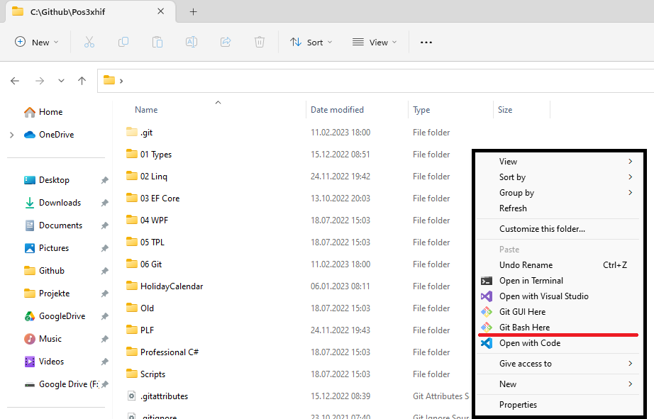

# Git installieren und einrichten

## Git installieren

Git ist ein Programm für die Kommandozeile. Damit verwaltest du ein Repository.

- **Windows:** Lade Git von https://git-scm.com/downloads und installiere es. Du kannst bei allen
  Dialogen die Standardeinstellung verwenden.
- **macOS:** Gib im Terminal `git --version` ein. Ist Git noch nicht installiert, bietet macOS an,
  die *Command Line Developer Tools* zu installieren. Diese enthalten Git.

Prüfe danach in einer neuen Konsole, ob Git funktioniert:

```bash
git --version
```

## Git konfigurieren

Gib in der Konsole diese Befehle ein. Ersetze vorher die Werte in spitzen Klammern `< >` durch
deine eigenen Daten:

```bash
git config --global user.name "<Vorname> <Nachname>"
git config --global user.email "<deine E-Mail-Adresse>"
git config --global init.defaultBranch main
git config --global pull.rebase true
git config --global push.autoSetupRemote true
git config --global core.editor "code --wait"
```

| Einstellung                 | Bedeutung                                                                                                  |
| --------------------------- | ---------------------------------------------------------------------------------------------------------- |
| `user.name`                 | Dein echter Name. Git speichert ihn in jedem Commit.                                                        |
| `user.email`                | Deine E-Mail-Adresse. Verwende dieselbe Adresse wie bei GitHub. Dann verknüpft GitHub die Commits mit deinem Account. |
| `init.defaultBranch`        | Neue Repositories, die du mit `git init` anlegst, starten mit dem Branch `main`.                            |
| `pull.rebase`               | `git pull` macht einen Rebase statt eines Merge. Ohne diese Einstellung bricht `git pull` mit einem Fehler ab, wenn dein lokaler Branch und der Branch auf GitHub unterschiedliche Commits haben. |
| `push.autoSetupRemote`      | Beim ersten `git push` eines neuen Branches legt Git den Branch automatisch auf GitHub an. Du brauchst dann kein `git push -u origin <branch>`. |
| `core.editor`               | Braucht Git einen Editor (z. B. für eine Commit Message), öffnet es VS Code. Schließe den Tab, wenn du fertig bist. Ohne diese Einstellung öffnet Git oft den Editor *Vim*, der für Anfänger schwer zu bedienen ist. |

Mit `git config --global --list` siehst du alle Einstellungen. Details findest du unter
[Git Commands - Setup and Config](https://git-scm.com/book/en/v2/Appendix-C%3A-Git-Commands-Setup-and-Config).

> Die Einstellung `core.editor` funktioniert nur, wenn VS Code installiert ist und der Befehl `code`
> in der Konsole funktioniert (siehe Kapitel [Arbeiten mit Git](02_work_with_git.md)).

## Die Git Bash (Windows)

Unter Windows installiert Git auch die **Git Bash**. Das ist eine Konsole mit der Shell *Bash*.
Die Bash ist die Standard-Shell unter Linux. Unter macOS verwendest du stattdessen das Programm
*Terminal*. Die Befehle in diesem Kurs funktionieren dort genauso.

### Die Git Bash öffnen

Klicke im Windows Explorer mit der rechten Maustaste in einen freien Bereich eines Ordners und wähle
*Git Bash Here*. Die Git Bash startet dann direkt in diesem Ordner.



> Unter Windows 11 findest du *Git Bash Here* eventuell erst unter *Weitere Optionen anzeigen*.

Du kannst die Git Bash auch über das Startmenü öffnen (Suche nach *Git Bash*).

### Befehle in der Bash

Wir besprechen hier nicht alle Befehle der Bash, dafür gibt es viele Anleitungen im Internet. Kennst
du die Windows-Kommandozeile (`cmd.exe`), hilft dir diese Tabelle. In der Bash heißen viele Befehle
anders:

| **cmd.exe**            | **Bash**   | **Bedeutung**                                    |
| ---------------------- | ---------- | ------------------------------------------------ |
| `dir`                  | `ls`       | Dateien und Ordner im aktuellen Ordner anzeigen. |
| `cd` (ohne Parameter)  | `pwd`      | Den aktuellen Ordner anzeigen.                   |
| `cd <ordner>`          | `cd <ordner>` | In einen anderen Ordner wechseln.             |
| `md <ordner>`          | `mkdir <ordner>` | Einen Ordner erstellen.                    |
| `copy`, `xcopy`        | `cp`       | Dateien kopieren.                                |
| `move`, `ren`          | `mv`       | Dateien verschieben oder umbenennen.             |
| `del`                  | `rm`       | Dateien löschen.                                 |
| `rd /S`                | `rm -r`    | Einen Ordner mit Inhalt löschen.                 |
| `type`                 | `cat`      | Den Inhalt einer Datei anzeigen.                 |
| `cls`                  | `clear`    | Die Konsole leeren.                              |

### Warum die Git Bash?

- Die Git Bash zeigt im Prompt an, in welchem Branch du gerade bist.
- Du kannst Shellskripte (`.sh`-Dateien) schreiben und ausführen. Sie können viel mehr als
  `.bat`-Dateien unter Windows.
- Shellskripte laufen auch unter macOS und Linux. So kann das ganze Team dieselben Skripte
  verwenden.
- Die Bash ist sehr verbreitet, z. B. auf Linux-Servern, in Docker-Containern und in CI-Pipelines.
  Was du hier lernst, brauchst du später oft.

> Die Git Bash ist kein vollständiges Linux. Sie enthält die Bash und viele typische Programme wie
> `grep`, `sed` oder `curl`. Ruft ein Skript Programme auf, die es nur unter Linux gibt
> (z. B. `apt`), funktioniert es in der Git Bash nicht.

### Shellskripte im Explorer starten

Klicke im Explorer mit der rechten Maustaste auf eine `.sh`-Datei. Wähle bei *Öffnen mit* den Punkt
*Git for Windows*. Braucht ein Skript Parameter, starte es stattdessen in der Git Bash, z. B. mit
`bash script.sh <parameter>`.

## Die Git Bash als Terminal in VS Code

VS Code hat ein eingebautes Terminal. So stellst du die Git Bash als Standard ein:

1. Öffne in VS Code mit *F1* oder *Ctrl + Shift + P* die Command Palette.
2. Gib `Terminal: Select Default Profile` ein und wähle den Befehl aus.
3. Wähle *Git Bash*.

Neue Terminals in VS Code (*Terminal → New Terminal*) starten danach mit der Git Bash.

## Optional: einen kürzeren Prompt einstellen

Der Prompt ist der Text links vom Cursor. In der Git Bash zeigt er standardmäßig Benutzer,
Rechnername, Ordner und Branch an und braucht dafür zwei Zeilen. Möchtest du einen kürzeren Prompt
wie `(main)@/c/Github/first_repo>`, gehe so vor:

1. Erstelle in der Git Bash den Ordner für die Einstellung und öffne die Datei in VS Code:

   ```bash
   mkdir -p ~/.config/git
   code ~/.config/git/git-prompt.sh
   ```

2. Kopiere diesen Inhalt in die Datei und speichere sie:

   ```bash
   # Compact Git Bash prompt, e.g. (main)@/c/Github/first_repo>
   COMPLETION_PATH="$(git --exec-path)"
   COMPLETION_PATH="${COMPLETION_PATH%/libexec/git-core}/share/git/completion"
   . "$COMPLETION_PATH/git-completion.bash"
   . "$COMPLETION_PATH/git-prompt.sh"

   PS1='\[\033]0;$MSYSTEM:$PWD\007\]'   # window title
   PS1="$PS1"'\n\[\033[36m\]'           # new line, cyan
   PS1="$PS1"'`__git_ps1 "(%s)"`@\w>'   # (branch)@directory>
   PS1="$PS1"'\[\033[0m\]'              # reset color
   ```

3. Öffne die Git Bash neu.

Die Git Bash lädt diese Datei automatisch, wenn es sie gibt. Du brauchst dafür keine
Administratorrechte, und die Einstellung bleibt auch nach einem Update von Git erhalten. Willst du
wieder den normalen Prompt, lösche die Datei.
