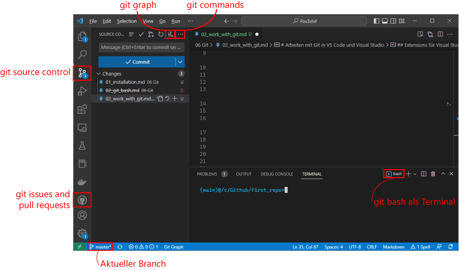
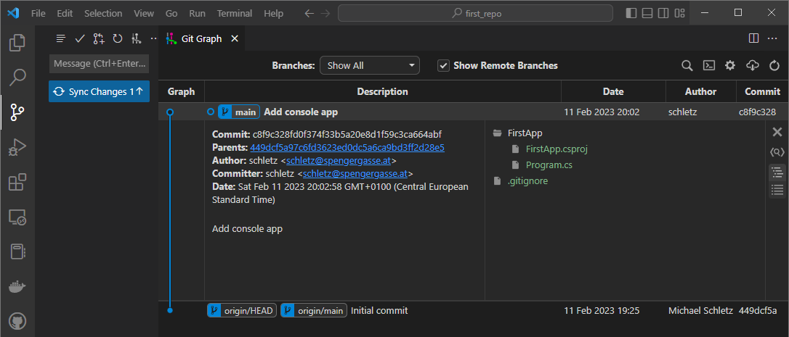
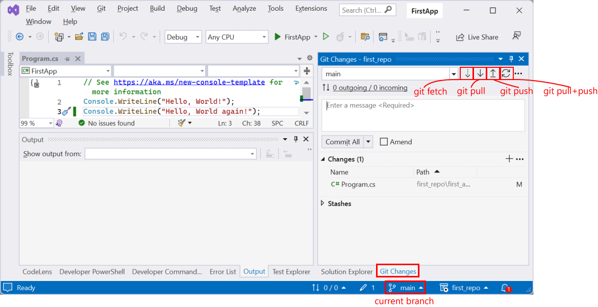
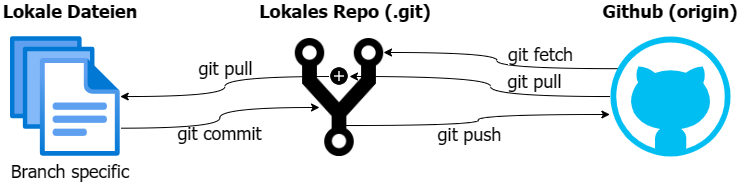

# Arbeiten mit Git in VS Code und Visual Studio

## Erstellen und Klonen eines Repositories

Um mit Git zu arbeiten, brauchen wir natürlich einmal ein Repository. Gehe hierfür auf
https://github.com und melde dich an. Danach kannst du unter *Repositories* ein neues Repository
erstellen (grüner *New* Button). Wähle die folgenden Einstellungen:

- **Repository name:** Kannst du frei wählen, in diesem Beispiel verwenden wir first_repo
- **Visibility:** Private
- **Add a README file:** enable

Erstelle nun z. B. einen Ordner *C:\Github* (Windows) bzw. */Users/(username)/Github* (macOS).
Starte nun die Git Bash wie im vorigen Kapitel beschrieben in diesem Ordner.

Dein Repository hat die URL https://github.com/(github_username)/(reponame). Du kannst die URL aus
dem Browser kopieren. Nun starte *git clone*

```bash
git clone https://github.com/(github_username)/first_repo
```

Es wird automatisch ein Ordner mit dem Namen des Repositories erstellt, in diesem Fall *first_repo*.
Wechsle in dieses Verzeichnis. In der Git Bash siehst du nun, dass der *Branch main* angezeigt wird.

## Extensions für Visual Studio Code

Installiere - wenn du es nicht schon gemacht hast - [Visual Studio Code](https://code.visualstudio.com/).
Das Programm bietet neben den Editorfunktionen auch gute Features für die Verwaltung von Repositories.
Nach der Installation installiere folgende Extensions:

- [Git Graph](https://marketplace.visualstudio.com/items?itemName=mhutchie.git-graph)
- [GitHub Pull Requests and Issues](https://marketplace.visualstudio.com/items?itemName=GitHub.vscode-pull-request-github)

Öffne nun mit *File - Open Folder...* den Ordner des Repositories. Wenn du wie im vorigen Schritt
die Standardshell von VS Code auf die Git Bash umgestellt hast, sollte das Userinterface so wie auf
dem Screenshot aussehen:



## Die ersten Schritte in Visual Studio Code

Lege im Terminal von VS Code (Git Bash) einen Ordner *first_app* an. Es soll eine .NET 8 Anwendung sein.

```bash
mkdir first_app
cd first_app
dotnet new console -f net8.0 -n FirstApp -o .
```

Wenn du nun unter *Source Control* die Änderungen ansiehst, meldet VS Code bereits Änderungen
im Repository. Nun wollen wir eine besondere Datei anlegen: Die Datei *.gitignore*.

### Anlegen der Datei *.gitignore*

Lege im Hauptordner deines Repositories die Datei *.gitignore* an. Diese Datei legt fest, welche
Dateien oder Verzeichnisse *nicht* in das Repository kommen. Achte auf den Punkt. Kopiere
die folgenden Zeilen in die Datei und speichere ab:

```
**/.vs
**/.vsode
**/bin
**/obj
```

Diese Ordner erstellt Visual Studio beim Kompilieren des Programmes und zum Speichern von lokalen
Einstellungen. Die zwei Sterne bedeuten, dass das Verzeichnis in jedem Unterverzeichnis sein kann.

> **Merke:** Builds und lokale Konfiguration werden nie in das Repository geladen.

### Der erste Commit

Gehe nun in VS Code auf *Source Control* und gib den Test *Add console app* als Commit Message
ein. Klicke danach auf *Commit*. Beim ersten Commit kommt die Frage, ob alle Dateien direkt
commited werden oder sie "staged" werden. Gib ab, dass VS Code alle Dateien committen soll.

Nun hast du die Änderung in das *lokale Repository* geschrieben. Klicke nun auf den Punkt
*git graph*. Du siehst, dass das lokale Repository dem *origin* (also dem Repo auf Github) um
einen Commit voraus ist. Klickst du auf den Commit, dann kannst du die Details und die Dateien,
die geändert wurden, ansehen. Beim Klick auf eine Datei werden die Änderungen angezeigt.



### Sync Changes

Um die Änderung in das Github Repo (dem *origin*) zu übertragen, klicke auf *Sync Changes*.

## Arbeiten mit Git in Visual Studio

Wir haben eine .NET Applikation angelegt, nun wollen wir natürlich in Visual Studio unseren
Programmcode schreiben. Öffne dafür die angelegte Datei *first_app/FirstApp.csproj* in Visual
Studio. Wenn du nun eine Zeile Programmcode hinzufügst und auf die Palette *Git Changes* wechselst,
siehst du eine ähnliche Darstellung wie in VS Code. Falls du die Palette nicht hast, kannst du sie
mit *View* - *Git Changes* aktivieren.



Wir können nun die Änderung wieder committen (z. B. mit *Add output*). Wie in VS Code wird die
Änderung nach dem Commit nicht direkt an Github übertragen. Dafür drücken wir den Pfeil hinauf
(*git push*). Erst jetzt sind die Änderungen in Github sichtbar.

## Die Grundoperationen: fetch, pull und push

Die Buttons in VS Code, Visual Studio oder jeder anderen IDE starten im Prinzip git Kommandos.
Für das Verständnis ist es wichtig zu wissen, dass dein Programmcode an 3 Orten gespeichert ist.

- Zuerst steht der Code einmal als Datei im lokalen Dateisystem. Hier werden die Dateien mit dem
  Editor bearbeitet, gespeichert oder gelöscht.
- Versteckt gibt es in jedem geklonten Repository einen Ordner *.git*. Wenn du die versteckten Dateien
  im Explorer aktivierst, siehst du diesen Ordner. Erst dieser Ordner macht aus einem gewöhnlichen
  Verzeichnis ein Repository. Es wird als *lokales Repo* bezeichnet.
- In Github ist der Programmcode im Web gespeichert. Dieser Ort wird auch als *origin* (Quelle)
  bezeichnet.

Die beschriebenen Operationen regeln den Transfer zwischen diesen 3 Stellen:



- **git fetch** lädt die Änderungen in das lokale Repository, aber ohne die lokalen Dateien zu ändern.
- **git pull** "zieht" die Änderungen aus der Quelle (Github) in das lokale Repository (wie *git fetch*)
  und wendet zusätzlich die Änderung auch an. Es ist üblicherweise der erste Befehl, bevor du neuen
  Code schreibst.
- **git commit** schreibt die Änderung in das lokale Repository. Es wird noch nichts an Github
  übertragen. Neu erstellte Dateien müssen mit *git add -A* hinzugefügt werden. Das erledigt aber
  die IDE automatisch.
- **git push** übertragt die Änderungen nach Github, aber nur wenn sie vorher mit *commit* auch
  in das lokale Repository geschrieben wurden.

> **Merke 1:** Bevor du mit der Arbeit beginnst, starte mit *git pull* oder dem entsprechenden Button
  in deiner IDE. Nachdem du die Arbeit beendet hast, übertrage die Änderungen in das Remote Repository.

> **Merke 2:** Prüfe vor einem Commit immer die Änderungen, die in der IDE oder im Editor in der
  entsprechenden Git Palette angezeigt werden. So verhinderst du, dass ungewollte Änderungen
  oder gar heikle Dateien mit Zugangsdaten in das Repository geladen werden.

Nun wird dieses Plakat schon viel verständlicher:

