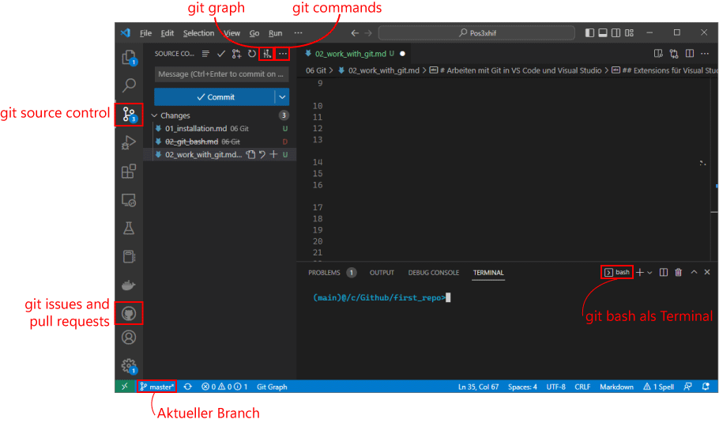
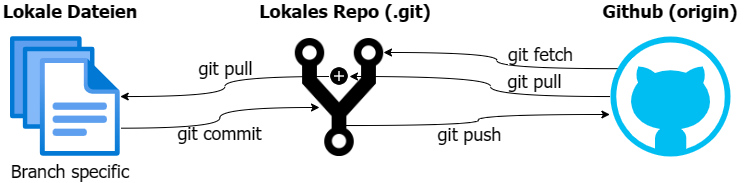
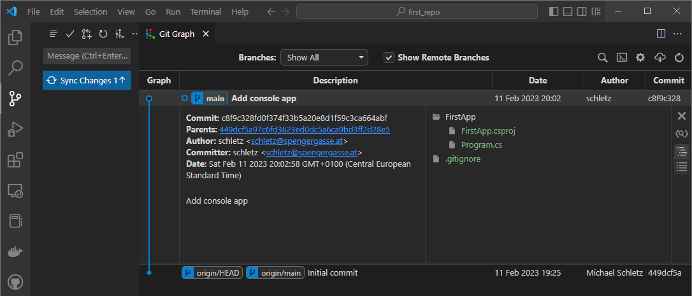

# Arbeiten mit Git in VS Code

## Ein Repository erstellen und klonen

Zuerst brauchst du ein Repository auf GitHub:

1. Gehe auf https://github.com und melde dich an.
2. Klicke unter *Repositories* auf den grünen Button *New*.
3. Wähle diese Einstellungen:
   - **Repository name:** frei wählbar. In diesem Beispiel verwenden wir `first_repo`.
   - **Visibility:** *Private*
   - **Add a README file:** aktivieren

Lege danach auf deinem Rechner einen Ordner für deine Repositories an, z. B. `C:\Github` (Windows)
oder `/Users/<username>/Github` (macOS). Öffne in diesem Ordner die Git Bash, wie im Kapitel
[Installation](01_installation.md) beschrieben.

Die URL deines Repositories kopierst du aus dem Browser. Sie hat die Form
`https://github.com/<github-username>/first_repo`. Mit `git clone` lädst du das Repository auf
deinen Rechner:

```bash
git clone https://github.com/<github-username>/first_repo
cd first_repo
```

`git clone` erstellt automatisch einen Ordner mit dem Namen des Repositories, hier `first_repo`.
Nach `cd first_repo` zeigt die Git Bash im Prompt den Branch `main` an.

> Das Repository ist privat. Git fragt deshalb beim ersten Mal nach deinem GitHub-Login. Meist
> öffnet sich dafür ein Fenster zur Anmeldung im Browser.

## VS Code einrichten

Installiere [Visual Studio Code](https://code.visualstudio.com/), falls du es noch nicht hast.
VS Code hat eingebaute Funktionen für Git. Zwei Extensions machen die Arbeit noch einfacher:

- [Git Graph](https://marketplace.visualstudio.com/items?itemName=mhutchie.git-graph) zeigt Commits
  und Branches als Graph.
- [GitHub Pull Requests](https://marketplace.visualstudio.com/items?itemName=GitHub.vscode-pull-request-github)
  erstellt und verwaltet Pull Requests direkt in VS Code.

Installiere die beiden Extensions in der Konsole:

```bash
code --install-extension mhutchie.git-graph
code --install-extension GitHub.vscode-pull-request-github
```

> Unter macOS musst du den Befehl `code` zuerst aktivieren. Öffne dafür in VS Code mit
> *⌘ + Shift + P* die Command Palette und wähle *Shell Command: Install 'code' command in PATH*.

Öffne dann mit *File → Open Folder...* den Ordner deines Repositories. Hast du im Kapitel
[Installation](01_installation.md) die Git Bash als Standard-Terminal eingestellt, sieht VS Code
so aus:



## Die drei Orte und die Grundoperationen

Bevor du den ersten Commit machst, musst du wissen, wo dein Code gespeichert ist. Es gibt drei Orte:

- **Lokale Dateien:** die Dateien in deinem Ordner. Diese Dateien bearbeitest du im Editor.
- **Lokales Repository:** der Ordner `.git` in deinem Repository. Hier speichert Git alle Commits.
  Erst dieser Ordner macht aus einem normalen Ordner ein Repository. Der Ordner ist versteckt. Im
  Explorer siehst du ihn nur, wenn du versteckte Dateien anzeigen lässt.
- **Remote Repository (`origin`):** das Repository auf GitHub. `origin` ist der Standardname dafür.

Die Git-Befehle übertragen Änderungen zwischen diesen drei Orten:



- **`git add`** merkt Änderungen für den nächsten Commit vor (englisch *staging*). `git add -A`
  merkt alle Änderungen vor, auch neue und gelöschte Dateien.
- **`git commit`** speichert die vorgemerkten Änderungen als neuen Commit im lokalen Repository.
  Auf GitHub ist danach noch nichts zu sehen.
- **`git push`** überträgt deine Commits vom lokalen Repository auf GitHub. Änderungen, die du
  noch nicht committet hast, überträgt `git push` nicht.
- **`git fetch`** lädt neue Commits von GitHub in das lokale Repository. Deine Dateien ändern sich
  dabei nicht.
- **`git pull`** macht zuerst ein `git fetch`. Danach übernimmt es die neuen Commits in deinen
  aktiven Branch. Jetzt sind auch deine Dateien aktuell.

Die Git-Buttons in VS Code und Visual Studio führen genau diese Befehle aus.

> **Merke: der Ablauf bei jeder Arbeit**
>
> 1. **Zuerst Pull:** Hole mit `git pull` den aktuellen Stand von GitHub, bevor du etwas änderst.
> 2. **Arbeiten:** Ändere den Code und committe deine Änderungen.
> 3. **Dann Push:** Übertrage deine Commits mit `git push` auf GitHub.
>
> Gewöhne dir diesen Ablauf von Anfang an. Durch den Pull am Anfang arbeitest du immer mit dem
> neuesten Stand. So entstehen weniger Konflikte.

## Die ersten Schritte in VS Code

In den folgenden Schritten übst du den Ablauf *Pull → Arbeiten → Push* gleich zum ersten Mal.

### Zuerst: Pull

Starte mit einem Pull, auch wenn du das Repository gerade erst geklont hast. Klicke in VS Code in
der Ansicht *Source Control* oben auf das Menü *...* und wähle *Pull*. In der Konsole gibst du ein:

```bash
git pull
```

### Die Datei `.gitignore` anlegen

Die Datei `.gitignore` legt fest, welche Dateien und Ordner Git **nicht** in das Repository
aufnimmt. Lege die Datei in VS Code im Hauptordner deines Repositories an. Achte auf den Punkt am
Anfang des Dateinamens. Kopiere diese Zeilen in die Datei und speichere sie:

```
**/.vs
**/.vscode
**/bin
**/obj
.DS_Store
.env
```

| Eintrag                  | Warum ignorieren?                                                                 |
| ------------------------ | --------------------------------------------------------------------------------- |
| `**/.vs`, `**/.vscode`   | Lokale Einstellungen von Visual Studio und VS Code.                               |
| `**/bin`, `**/obj`       | Ergebnisse beim Kompilieren. Jede Person erzeugt sie auf ihrem Rechner neu.       |
| `.DS_Store`              | Eine versteckte Datei, die macOS in Ordnern anlegt.                               |
| `.env`                   | Enthält oft Passwörter und andere Zugangsdaten.                                   |

`**/` bedeutet: Git ignoriert den Ordner in jedem Unterordner, egal wie tief er liegt.

> **Merke:** Kompilierte Dateien, lokale Einstellungen und Zugangsdaten gehören nie in das
> Repository.

### Der erste Commit

1. Öffne in VS Code die Ansicht *Source Control*. Dort siehst du die Datei `.gitignore` als Änderung.
2. Gib als Commit Message `Add .gitignore` ein und klicke auf *Commit*.
3. VS Code fragt, ob es alle Änderungen vormerken (*stage*) und direkt committen soll. Wähle *Yes*.
   Mit *Always* fragt VS Code in Zukunft nicht mehr.

Der Commit ist jetzt im lokalen Repository gespeichert, aber noch nicht auf GitHub. Klicke in
*Source Control* auf das Symbol *Git Graph*. Du siehst, dass dein Branch `main` dem Branch
`origin/main` um einen Commit voraus ist. Klickst du auf den Commit, siehst du seine Details und
die geänderten Dateien. Klickst du auf eine Datei, zeigt VS Code die Änderungen an.



> **Merke:** Prüfe vor jedem Commit die Liste der Änderungen, in VS Code unter *Source Control*,
> in Visual Studio unter *Git Changes*. So verhinderst du, dass ungewollte Dateien oder Dateien mit
> Zugangsdaten in das Repository kommen. Hast du ein Passwort schon auf GitHub gepusht, ändere das
> Passwort sofort. Die Datei im nächsten Commit zu löschen reicht nicht, denn das Passwort bleibt in
> der History.

### Dann: Push

Klicke in *Source Control* oben auf das Menü *...* und wähle *Push*. In der Konsole gibst du ein:

```bash
git push
```

Auf GitHub siehst du jetzt die Datei `.gitignore` in deinem Repository.

> **Verwende nicht den Button *Sync Changes*.** Du siehst ihn im Screenshot oben. Er macht Pull und
> Push in einem Schritt, also erst **nach** deiner Arbeit. Neue Commits von anderen Personen
> bekommst du dann erst am Ende, und Konflikte fallen erst spät auf. Mache den Pull stattdessen
> immer **vor** der Arbeit und den Push **danach**.

Jetzt verstehst du auch dieses bekannte Plakat:


