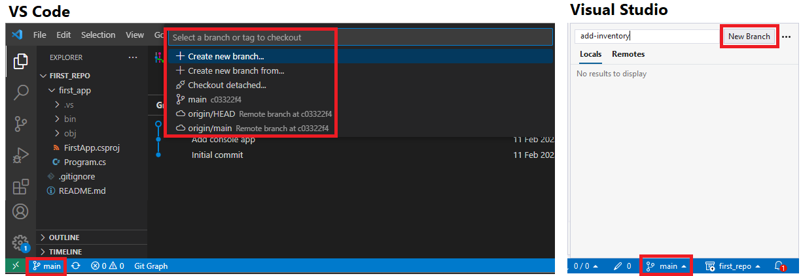
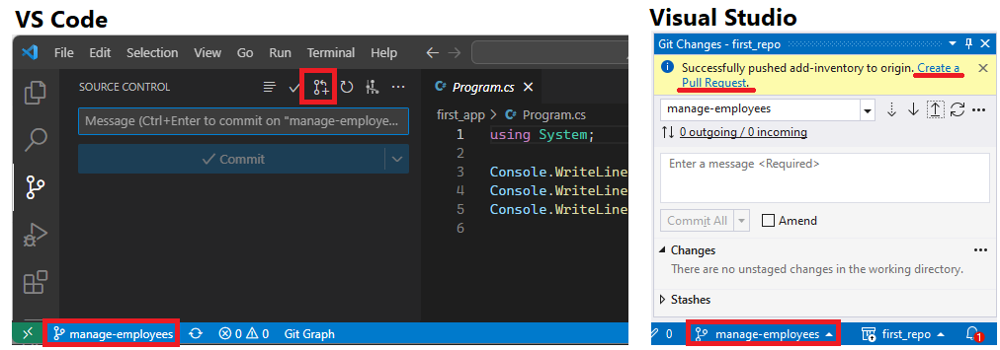
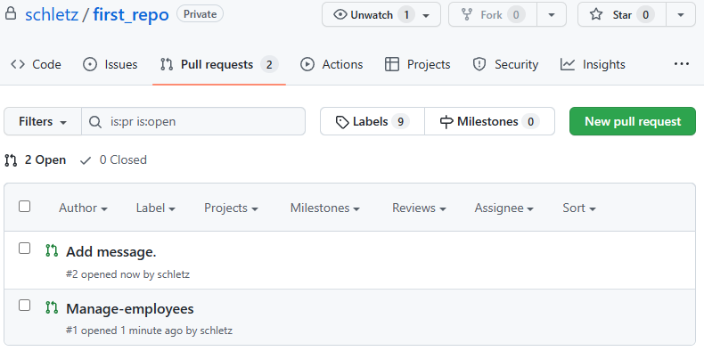
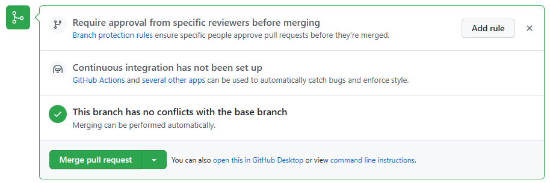

# Wir arbeiten nicht alleine: Umgang mit Branches

Wenn mehrere Leute im Team arbeiten, braucht es noch eine zusätzliches Feature. Folgende Situation
ist der Alltag in Entwicklerteams: A soll in der Applikation das Feature "Inventar erfassen" implementieren.
B soll sich in dieser Zeit um das Feature "Mitarbeiter verwalten" kümmern. Da es größere Tasks
sind, werden A und B sich nicht hinsetzen und den Code in einem Zug schreiben und dann einen
einzigen Commit ausführen.

A und B werden also die Arbeit auf mehrere Commits verteilen. Würde jeder Commit direkt automatisch
bei allen anderen Teammitgliedern sichtbar werden, sorgt das für große Verwirrung. Denn der Stand
ist natürlich noch nicht "ready for production" sondern ein Zwischenstand am Ende eines Arbeitstages.

Daher brauchen wir das Konzept der *Branches*. Jede/r, der sich mit Git schon beschäftigt hat,
hat schon die Darstellung der Commits als *Graph* gesehen.


<small>https://www.atlassian.com/git/tutorials/using-branches</small>

Der Sinn von Branches ist der, dass A und B unabhängig an ihren Features arbeiten können, ohne
andere im Team zu stören. Wenn das Feature fertig getestet ist, wird der Stand in den Main Branch
integriert. Wir bezeichnen diese Branches daher als **Featurebranches**.

## Anlegen eines Branches

Ein Branch kann mit VS Code oder in Visual Studio leicht erstellt werden, indem du auf den
Namen des aktuellen Branches (hier *main*) in der Fußzeile klickst. Falls du ungespeicherte
Änderungen hast, bieten dir die Programme an, diese Änderungen in den neuen Branch zu übernehmen.



In der Konsole kannst du mit *git checkout -b add-inventory* den Branch *add-inventory* erstellen.

Nun kannst du wie gewohnt deine Commits absetzen, ohne die anderen im Team zu stören. Du kannst jederzeit
zwischen den Branches hin- und herschalten. Die Änderungen im Branch *add-inventory* sind dann
im Branch *main* nicht sichtbar. Wenn du wieder zurück wechselst, dann tauschen sie wieder auf.

> Branches sind "Sichten" auf das (lokale) Repository. Beim Umschalten siehst du die Dateien
> des aktiven Branches. Deswegen ist in der Git Bash die Angabe des aktiven Branches sehr wichtig,
> um nicht aus Versehen im falschen Branch zu arbeiten.

Mit *git branch* kannst du in der Bash alle Branches auflisten.

### Übertragen eines Branches nach Github

Wenn du zum ersten Mal im neuen Branch das *git push* Kommando über die IDE aufrufst, wird der
neue Branch automatisch in Github erstellt bzw. es gibt einen Button *Puslish Branch*. Wenn
du mit der Bash arbeitest und *git push* eingibst, kommt ein Hinweis:

```
fatal: The current branch manage-employees has no upstream branch.
To push the current branch and set the remote as upstream, use

    git push --set-upstream origin manage-employees
```

Kopiere einfach das Kommando aus der Fehlermeldung, dann kannst du auch in der Bash den Branch
nach Github übertragen. Im Repo auf https://github.com siehst du nun auf der Webseite deine
Branches.

## Integrieren der Änderungen in den main Branch: Der Pull Request

Das Wort *Pull Request* haben manche vielleicht schon gehört. So wie wir mit *git pull* die Änderungen
aus Github in unser Repository "hineinziehen" ist der Pull Request eine Anfrage, die Änderungen des
Featurebranches in den Main Branch "hineinzuziehen".



Nach dem Senden des Pull Requests erscheint er auf Github unter *Pull requests*:



Klicken wir auf einen Pull Request, bietet Github mit *Merge pull request* an, die Änderungen
in den Main Branch aufzunehmen.



Nach dem Merge Vorgang hat dann der Branch *Main* alle Änderungen des Featurebranches integriert.
Dieses Beispiel hatte (noch) keine Konflikte. Im nächsten Kapitel geht es dann um den Umgang mit
sogenannten *Merge Konflikten*.
