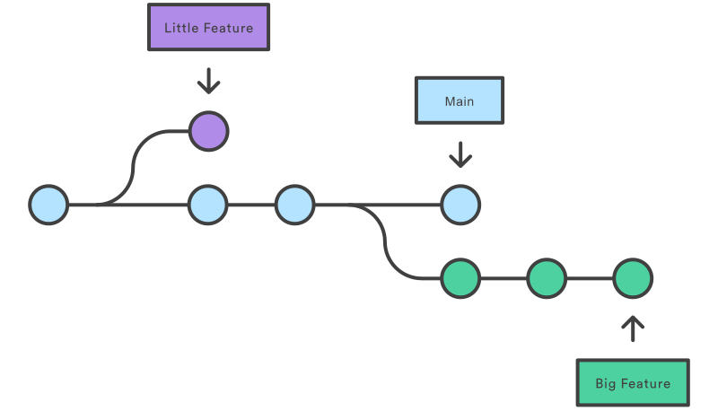
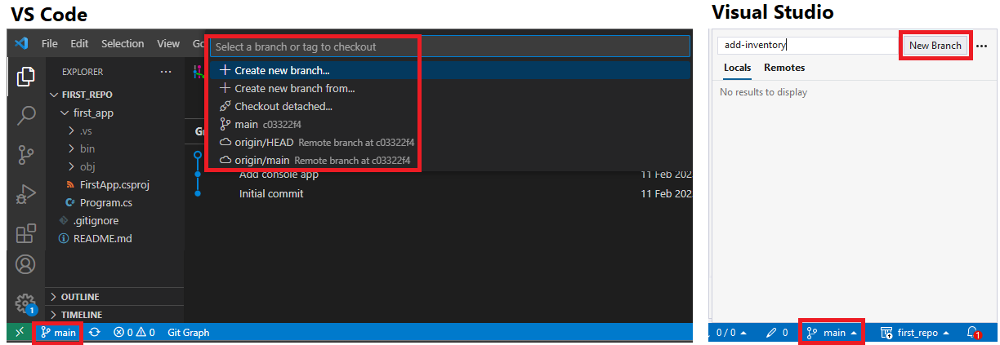
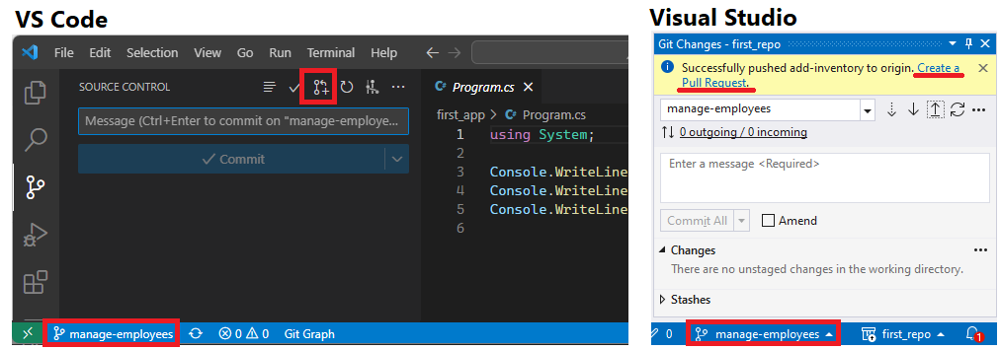
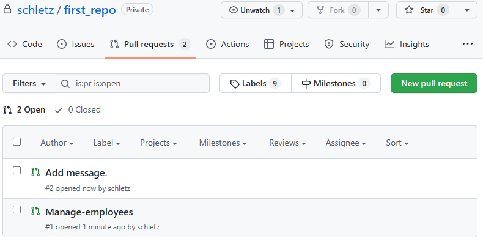
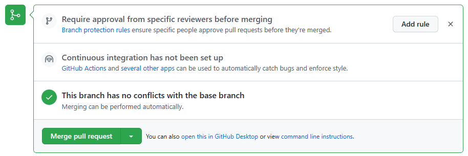
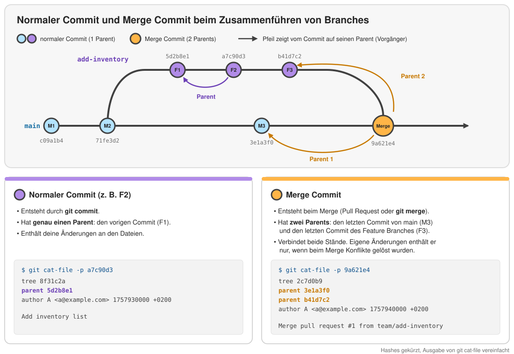

# Im Team arbeiten: Branches

## Wichtige Begriffe

| Begriff                        | Bedeutung                                                                                                          |
| ------------------------------ | ------------------------------------------------------------------------------------------------------------------ |
| **Commit**                     | Ein gespeicherter Stand deiner Dateien. Jeder Commit hat eine eindeutige ID, den *Hash* (z. B. `a7c90d3`).          |
| **Parent**                     | Der Vorgänger eines Commits.                                                                                       |
| **Branch**                     | Ein Name, der auf einen Commit zeigt. Bei jedem neuen Commit im Branch zeigt der Name auf den neuen Commit.         |
| **`main`**                     | Der Haupt-Branch. Er enthält den fertigen und getesteten Stand des Projekts.                                       |
| **Feature Branch**             | Ein Branch, in dem du genau ein Feature entwickelst.                                                               |
| **Remote Repository, `origin`** | Das Repository auf GitHub. `origin` ist der Standardname dafür.                                                   |
| **Upstream**                   | Der Branch auf GitHub, mit dem dein lokaler Branch verbunden ist (z. B. `origin/add-inventory`).                   |
| **Merge**                      | Zwei Branches zusammenführen.                                                                                      |
| **Pull Request (PR)**          | Eine Anfrage auf GitHub, einen Feature Branch in `main` zu mergen.                                                 |

## Warum brauchen wir Branches?

In einem Team arbeiten mehrere Personen gleichzeitig am selben Projekt. Ein typisches Beispiel:

- A programmiert das Feature "Inventar erfassen".
- B programmiert zur selben Zeit das Feature "Mitarbeiter verwalten".

Beide Features sind große Aufgaben. A und B machen daher nicht einen einzigen Commit, sondern
viele kleine Commits. Am Ende eines Arbeitstages ist der Code oft noch nicht fertig. Trotzdem
sollen A und B ihre Commits auf GitHub pushen, damit ihre Arbeit gesichert ist.

Pushen A und B direkt in `main`, bekommt das ganze Team diesen unfertigen Code. Vielleicht lässt
sich das Programm dann nicht mehr kompilieren, und niemand weiß, welcher Stand funktioniert.

Die Lösung sind **Branches**. Die folgende Grafik zeigt Commits und Branches als *Graph*:


<small>https://www.atlassian.com/git/tutorials/using-branches</small>

Jedes Feature bekommt einen eigenen Branch. So arbeiten A und B unabhängig voneinander und stören
das restliche Team nicht. Ist ein Feature fertig und getestet, kommen seine Änderungen in den
Branch `main`. Solche Branches heißen **Feature Branches**.

## Einen Branch anlegen

### In der IDE

In VS Code und in Visual Studio klickst du unten in der Statusleiste auf den Namen des aktiven
Branches (hier `main`). Danach kannst du einen neuen Branch erstellen.



### In der Konsole

In der Git Bash legst du den Branch `add-inventory` mit diesen Befehlen an:

```bash
git checkout main
git pull
git checkout -b add-inventory
```

- `git checkout main` wechselt in den Branch `main`. Von hier aus soll der neue Branch starten.
- `git pull` holt den aktuellen Stand von GitHub. So startet dein Branch nicht mit einem alten Stand.
- `git checkout -b add-inventory` erstellt den Branch `add-inventory` und wechselt sofort hinein.
  Ohne `-b` wechselt `git checkout` nur in einen Branch, den es schon gibt.

> Neuere Git-Versionen haben dafür auch den Befehl `git switch`: `git switch -c add-inventory`
> erstellt einen Branch, `git switch main` wechselt in einen bestehenden Branch.

Mit `git branch` siehst du alle lokalen Branches. Der aktive Branch ist mit `*` markiert.

## Zwischen Branches wechseln

Im neuen Branch machst du deine Commits wie gewohnt. Du kannst jederzeit in einen anderen Branch
wechseln:

```bash
git checkout main
git checkout add-inventory
```

Nach dem Wechsel zeigt Git die Dateien so, wie sie im gewählten Branch gespeichert sind. Die Commits
aus `add-inventory` siehst du in `main` also nicht. Wechselst du zurück, sind sie wieder da.

> **Achtung:** Das gilt nur für Änderungen, die du schon committet hast. Nicht committete
> Änderungen nimmt Git beim Wechsel in den anderen Branch mit. Würden dabei Änderungen verloren
> gehen, bricht Git den Wechsel mit einer Fehlermeldung ab. Committe deine Änderungen daher,
> bevor du den Branch wechselst.

Die Git Bash zeigt den aktiven Branch in Klammern an, z. B. `(add-inventory)`. Prüfe vor jedem
Commit, ob du im richtigen Branch bist.

## Einen Branch auf GitHub übertragen

**In der IDE:** Beim ersten Push eines neuen Branches zeigt VS Code den Button *Publish Branch*.
Visual Studio erstellt den Branch beim Push automatisch auf GitHub.

**In der Konsole:** Hast du Git wie im Kapitel [Installation](01_installation.md) konfiguriert
(`push.autoSetupRemote`), reicht auch beim ersten Mal:

```bash
git push
```

Git legt den Branch dann automatisch auf GitHub an und verbindet deinen lokalen Branch mit dem Branch
`origin/add-inventory`. Danach funktionieren in diesem Branch `git push` und `git pull`.

Ohne diese Einstellung brauchst du beim ersten Push den Parameter `-u` (lang: `--set-upstream`):

```bash
git push -u origin add-inventory
```

Vergisst du `-u`, zeigt Git einen Fehler mit dem richtigen Befehl:

```
fatal: The current branch add-inventory has no upstream branch.
To push the current branch and set the remote as upstream, use

    git push --set-upstream origin add-inventory
```

Kopiere den Befehl aus der Fehlermeldung und führe ihn aus. Auf https://github.com siehst du
danach deinen Branch im Repository.

## Änderungen in `main` übernehmen: der Pull Request

Ist dein Feature fertig, sollen die Änderungen in den Branch `main`. Dafür erstellst du einen
**Pull Request** (kurz *PR*). Ein Pull Request ist eine Anfrage an das Team: "Bitte übernehmt die
Änderungen aus meinem Feature Branch in `main`." Andere Personen im Team können die Änderungen
vorher ansehen und kommentieren.

Einen Pull Request kannst du direkt in der IDE erstellen:



Danach erscheint der Pull Request auf GitHub unter *Pull requests*:



Öffnest du den Pull Request, kannst du ihn mit dem Button *Merge pull request* abschließen.
GitHub übernimmt dann die Änderungen in `main`.



> Nach dem Merge ist `main` zuerst nur auf GitHub aktuell. Alle im Team (auch du) holen den
> neuen Stand mit `git checkout main` und `git pull` auf ihren Rechner.

### Der Merge Commit

Beim Merge erstellt GitHub in `main` einen besonderen Commit: den **Merge Commit**.

- Ein normaler Commit hat genau **einen** Parent.
- Ein Merge Commit hat **zwei** Parents: den letzten Commit von `main` und den letzten Commit des
  Feature Branches.

Der Merge Commit verbindet also die beiden Branches. Mit `git cat-file -p <hash>` siehst du in der
Konsole die Parents eines Commits.



> Hat sich `main` seit dem Anlegen des Feature Branches nicht verändert, macht `git merge` in der
> Konsole normalerweise einen **Fast-Forward**: Git setzt `main` einfach auf den letzten Commit des
> Feature Branches. Dann entsteht kein Merge Commit. Der Button *Merge pull request* auf GitHub
> erstellt dagegen immer einen Merge Commit.

### Den Feature Branch nach dem Merge löschen

Nach dem Merge zeigt GitHub den Button *Delete branch*. Viele Personen zögern hier, weil sie Angst
haben, ihre Arbeit zu verlieren. Du verlierst dabei aber keine Daten. Die Grafik oben zeigt, warum:

- **Ein Branch ist nur ein Name für einen Commit.** Git speichert die Commits unabhängig von den
  Branches. Der Branch `add-inventory` zeigt nur auf seinen letzten Commit (F3).
- **Jeder Commit kennt seine Parents.** Über die Parents findet Git alle Vorgänger eines Commits.
  Von F3 kommt Git so zu F2, F1 und M2.
- **Der Merge Commit verbindet `main` mit dem Feature Branch.** Über *Parent 2* des Merge Commits
  findet Git von `main` aus den Commit F3 und damit auch F2 und F1. Alle Commits des Feature
  Branches sind also Teil der History von `main`.

Beim Löschen des Branches entfernt Git daher nur den Namen `add-inventory`. Die Commits F1 bis F3
bleiben erhalten. Du findest sie mit `git log` im Branch `main`.

Lösche Feature Branches nach dem Merge. So bleibt die Liste der Branches übersichtlich, und niemand
arbeitet aus Versehen im alten Branch weiter. Für das nächste Feature legst du einen neuen Branch
von `main` an.

Um den Branch auch auf deinem Rechner zu löschen, gibst du in der Git Bash diese Befehle ein:

```bash
git checkout main
git pull
git branch -d add-inventory
git fetch --prune
```

- `git pull` holt den Merge Commit von GitHub auf deinen Rechner. Erst dann enthält dein lokaler
  Branch `main` die Commits des Feature Branches.
- `git branch -d add-inventory` löscht den lokalen Branch. Der Parameter `-d` schützt dich: Git
  löscht den Branch nur, wenn seine Commits schon gemerged sind. Sonst bricht der Befehl mit der
  Meldung `error: the branch 'add-inventory' is not fully merged` ab.
- `git fetch --prune` entfernt die lokale Referenz `origin/add-inventory`, wenn der Branch auf
  GitHub schon gelöscht ist. Hast du ihn auf GitHub noch nicht gelöscht, geht das mit
  `git push origin --delete add-inventory`.

> Wurde der Pull Request mit *Squash and merge* oder *Rebase and merge* abgeschlossen, gibt es
> keinen Merge Commit, der auf F3 zeigt. GitHub hat die Änderungen als neue Commits in `main`
> geschrieben. `git branch -d` meldet dann `not fully merged`, obwohl die Änderungen in `main` sind.
> Prüfe in diesem Fall auf GitHub, ob der Pull Request wirklich gemerged wurde. Lösche den Branch
> erst dann mit `git branch -D add-inventory`.

In diesem Beispiel gab es keine Konflikte. Im nächsten Kapitel [Merge Konflikte](04_conflicts.md)
lernst du, was du bei Konflikten machst.
