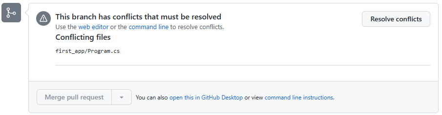
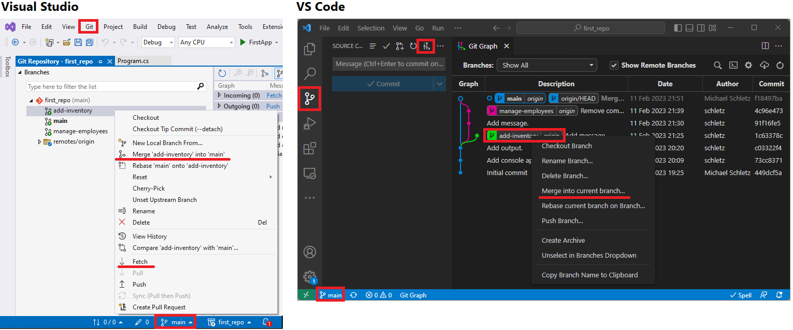
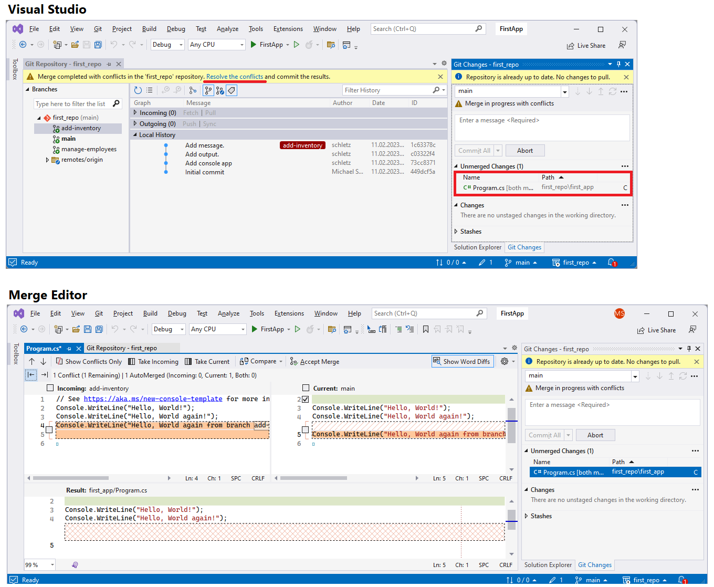
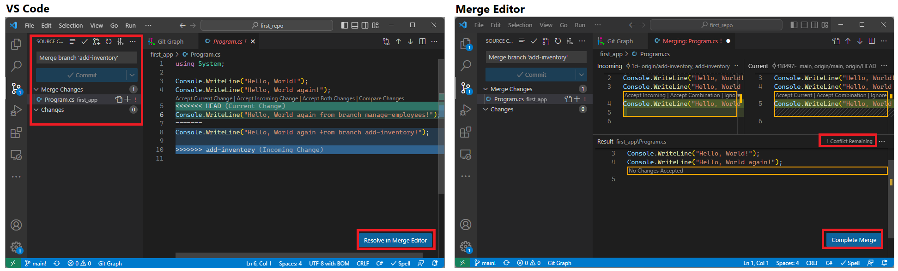

# Konflikte im Team: der Merge Konflikt

Konflikte (im Repository) entstehen, wenn die gleiche Datei von 2 Personen editiert wird.
Sehen wir uns einen Verlauf an:

| **Aktion**                                                                                        | **Hash von Program.cs in *main* vor der Operation** |
| ------------------------------------------------------------------------------------------------- | --------------------------------------------------- |
| A erstellt den Feature Branch *manage-employees* durch checkout von *main*                        | 3e1a3...                                            |
| B erstellt den Feature Branch *add-inventory* durch checkout von *main*                           | **3e1a3...**                                        |
| A committed eine neue Version der Datei *Program.cs*                                              | 3e1a3...                                            |
| B committed eine neue Version der Datei *Program.cs*                                              | 3e1a3...                                            |
| (Merge 1) Der Feature Branch *manage-employees* wird durch Merge in den *main* Branch integriert. | **3e1a3...**                                        |
| (Merge 2) Der Feature Branch *add-inventory* wird durch Merge in den *main* Branch integriert.    | **9a621...**                                        |

Wird ein Feature Branch erstellt, dann merkt sich das Repository, von welchem Hashwert weg gearbeitet
wird. Soll nun durch ein Merge eine Änderung integriert werden, so prüft das System, ob sich der
Hashwert in der Zwischenzeit geändert hat. Der Fall *Merge 1* kann ohne Konflikt durchgeführt werden,
da sich der Hashwert der Datei *Program.cs* *im Branch main* in der Zwischenzeit nicht verändert hat.
Keiner hat also die Datei im Branch *main* angerührt. Daher kann sie durch die neue Version
ohne Bedenken ersetzt werden.

Merge 2 findet aber jetzt eine geänderte Datei *Program.cs* in *main*. Es entsteht ein
**Merge Konflikt**, der behoben werden muss. Github erkennt beim entsprechenden Pull Request diese
Situation und bietet kein Merge mehr an:



## Lösen von Merge Konflikten

Am Besten werden Merge Konflikte in der entsprechenden IDE gelöst. Dafür wird zuerst der aktuelle
Stand des Branches *main* und des Branches *add-inventory* mit *git pull* bzw. *git fetch*
auf den lokalen Rechner übertragen. Danach kann der Merge Prozess in der IDE gestartet werden.

In Visual Studio gibt es hierfür im Menü *Git* den Punkt *Manage Branches*. In Visual Studio
Code kann mit der Extension *git Graph* gearbeitet werden.



Nachdem der Merge Prozess gestartet wurde, erkennt die IDE dass ein Merge Konflikt vorliegt. Durch
Klick auf die entsprechende Datei öffnet sich der *Merge Editor*. Mit dem Merge Editor können wir
angeben, welche Inhalte übernommen werden sollen.

Wenn es im Konflikte in C# Dateien geht, ist der Merge Editor von Visual Studio die bessere
Wahl. Er "versteht" die Syntax und erkennt, ob z. B. Methoden in der Mitte dazugekommen sind.



Mit Visual Studio Code kann ebenfalls ein Merge Konflikt gelöst werden. Er ist ein gutes allgemeines
Werkzeug für alle Dateitypen, die spezifischeren IDEs bieten jedoch in der Regel mehr Möglichkeiten.



## Vermeiden von Konflikten

Wie du gesehen hast ist das Beheben von Merge Konflikten auch mit IDE Unterstützung eine
aufwändige Sache. Die Programme müssen nachher schließlich auch durchgetestet werden. Daher ist ein
Vermeiden im Voraus immer die Beste Strategie.

Wie auch im realen Leben können Konflikte im Team nie vermieden werden. Auch Merge Konflikte werden
sich nicht zu 100% verhindern lassen, denn dass jede Datei einen "Eigentümer" hat der sie ändern
darf ist in Projekten nicht machbar. Es gibt aber Fehler, die oft auftreten und dann zu Problemen
führen können:

- **Zu frühe Erstellung von Featurebranches.** Bevor Feature Branches angelegt werden, sollte die
  Projektstruktur soweit aufgebaut sein, dass von der Datenbank bis zum Frontend ein "Durchstich"
  gemacht wurde. Erst dann können Features unabhängiger implementiert werden.
- **Arbeit in Schichten statt in Features.** Oft ist die Einteilung in "Backend", "Frontend" und
  "Datenbank" noch immer in den Köpfen von vielen Schülern und Studierenden. Das setzt aber
  Voraus, dass die Modelklassen (Datenbank) zu 100% fertig sind, dann ein Merge gemacht wird,
  und der Nächste arbeitet am Backend. Das ist realitätsfern. Branches werden daher für Features wie
  z. B. "Manage employees" für die Verwaltung der Mitarbeiter, "View appointments in calendar"
  für die Anzeige der Termine als Kalender, ... erstellt.
- **Zu lange offene Branches.** Gerade in Verbindung mit dem vorigen Punkt bleiben Branches im
  Extremfall über die gesamte Projektlaufzeit "offen", d. h. es findet kein Merge in den main Branch
  statt. Das erhöht natürlich die Wahrscheinlichkeit von Merge Konflikten.
- **Zu viele Personen für zu wenig Arbeit.** Dieser Punkt ist sicher schulspezifisch, in der Realität
  ist es wohl umgekehrt. Gerade bei Schulprojekten finden sich 4 Personen, die eine Webapplikation
  zum Hinzufügen, Ändern und Löschen von Personen schreiben. Solche Projekte können natürlich nicht
  vernünftig auf mehrere Personen aufgeteilt werden, da dies ein einziges Feature in einem
  realen Projekt ist.
- **Kein durchgeführtes rebase vor dem merge.** Siehe nächster Punkt.

## Änderungen von *main* in den Feature Branch übertragen

Manchmal möchte man auch in die umgekehrte Richtung Änderungen übertragen: Vom Branch *main* in
den Featurebranch. Um Commits zu kopieren, gibt es den Befehl *git rebase*. Im Gegenstatz zum
Merge werden alle Commits, die nach der "Abspaltung" stattgefunden haben, in den Branach kopiert.

Um einen Rebase durchzuführen, nehmen wir am Besten die Git Bash. Gehe in den Featurebranch, den
du aktualisieren möchtest, z. B. mit *git checkout (featurebranch)*. Gib danach den folgenden
Befehl ein:

```bash
git pull origin main --rebase
```

Diese Befehle holen sich den neuesten Stand des Branches *main* auf den Rechner. Danach werden
mit *git rebase main* die Commits *von main in den Feature Branch* kopiert. Falls es Merge Konflikte
gibt, kannst du sie mit der IDE lösen.

Nach dem Lösen des Konfliktes kannst du mit folgendem Befehl den nächsten Commit übertragen bzw. den rebase Modus verlassen:

```bash
git rebase --continue
```

Danach wird der neue feature Branch mit *push --force* an den Server übertragen.

```bash
git push --force
```

den neuen Stand des Featurebranches nach Github übertragen. Der Parameter *--force* gibt an, dass
auch übertragen wird, wenn die History nicht deckungsgleich ist.

### Rebase in den Feature Branch vor dem Merge

Die Technik hilft auch, um Konflikte vor dem Pull Request schon lösen zu können. Wenn wie am Anfang
erwähnt der Entwickler des Branches *add-inventory* ein *git rebase main* abgesetzt hätte, so
würde er selbst die Merge Konflikte haben und lösen. Wird dann ein Pull Request abgesetzt, kann dieser
ohne Konflikte verarbeitet werden.

## Änderungen des Feature Branches in main mit *rebase* übertragen

Bisher haben wir mit dem Pull Request und der Merge Operation eine Möglichkeit kennengelernt, um die Änderungen des Feature Branches in den main Branch zu integrieren.
Durch diese Operation entsteht ein sogenannter *merge commit* im Branch *main*.
Die beschriebene Technik des *rebase* kann auch dazu verwendet werden, um die neu dazugekommenen Features aus dem Feature Branch in den main Branch zu integrieren.
Im Gegensatz zum *merge* werden dabei die einzelnen Commits des Feature Branches in den Branch main integriert.
Es entsteht also die selbe History, wie wenn du die Änderungen immer direkt in den Branch main commitet hast.
Viele halten diesen Ansatz für "sauberer", da die History im Branch main dann alle Commits des Feature Branches umfasst.

Um den main Branch mit *rebase* zu aktualisieren, führe folgende Schritte durch:

1. Gehe mit `git checkout main` in den Branch main.
1. Stelle mit `git pull --rebase` sicher, dass du die neuesten Änderungen aus dem Remote Repository auf deinem Rechner hast.
   Die Option *rebase* sorgt dafür, dass bei Konflikten kein merge Commit für die Auflösung entsteht.
2. Danach kannst du mit `git rebase <featurebranch>` die Änderungen in den main Branch integrieren.
3. Mit `git push` überträgst du den neuen Stand in das Remote Repository.

> Hinweis: Die Operation `git push --force` sollte im main Branch sehr gut überlegt werden.
> In vielen Repositories ist diese Operation aus Sicherheitsgründen vom Eigentümer deaktiviert worden.
> Wenn du wie beschrieben vorher die Änderungen von main in den Feature Branch integrierst, brauchst du diese Operation auch nicht.