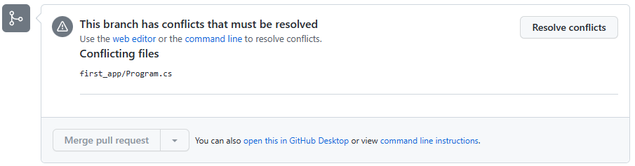
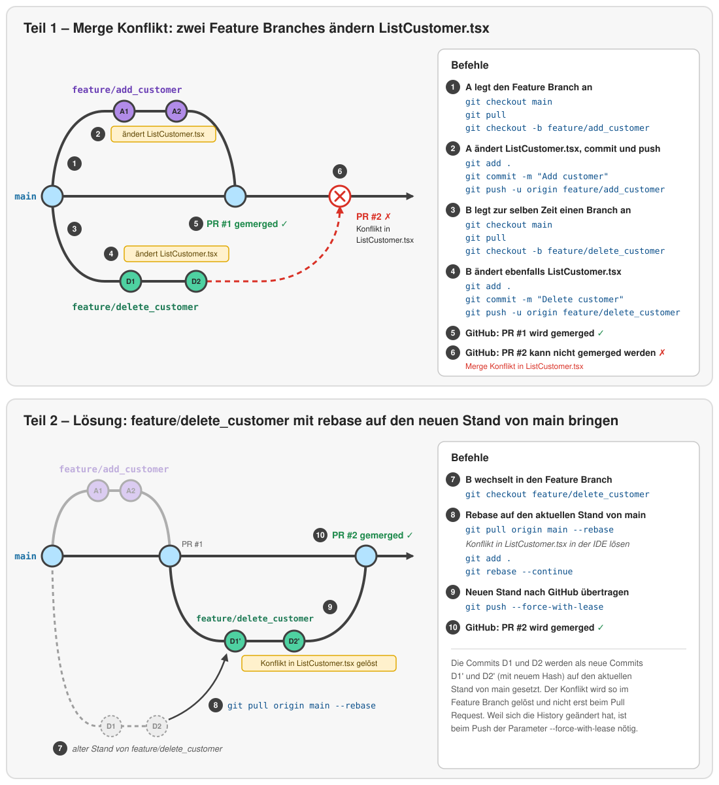
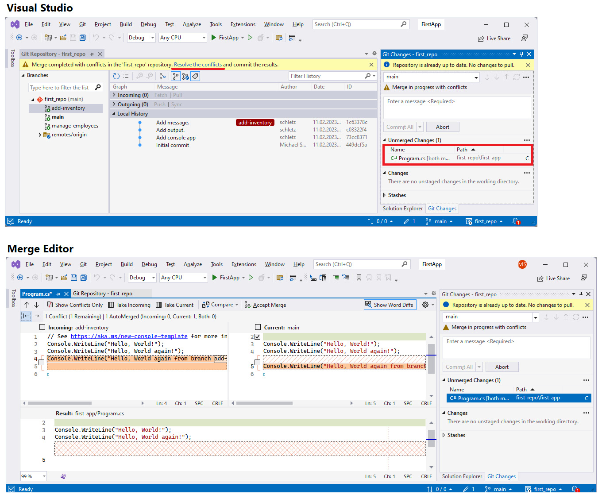
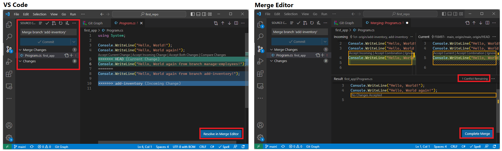

# Merge Konflikte

## Wann entsteht ein Merge Konflikt?

Meistens kann Git die Änderungen aus zwei Branches automatisch zusammenführen. Dafür vergleicht
Git drei Stände einer Datei:

1. den Stand, von dem beide Branches gestartet sind (der gemeinsame Vorgänger, englisch *merge base*),
2. den Stand im ersten Branch,
3. den Stand im zweiten Branch.

Git vergleicht die Datei dabei Zeile für Zeile:

- Hat nur **ein** Branch eine Stelle geändert, übernimmt Git diese Änderung automatisch.
- Haben beide Branches **verschiedene Stellen** derselben Datei geändert, übernimmt Git beide
  Änderungen automatisch.
- Haben beide Branches **dieselbe Stelle** unterschiedlich geändert, weiß Git nicht, welche Version
  richtig ist. Das ist ein **Merge Konflikt**. Diesen Konflikt musst du selbst lösen.

Ein Konflikt entsteht auch, wenn ein Branch eine Datei löscht und der andere Branch sie ändert.

### Ein Beispiel

Wir verwenden das Beispiel aus dem Kapitel [Branches](03_branches.md): A arbeitet im Branch
`add-inventory`, B im Branch `manage-employees`.

| Schritt | Was passiert?                                                                                              |
| ------- | ---------------------------------------------------------------------------------------------------------- |
| 1       | A erstellt den Feature Branch `add-inventory` von `main`.                                                  |
| 2       | B erstellt den Feature Branch `manage-employees` vom selben Stand von `main`.                              |
| 3       | A ändert in `Program.cs` eine Zeile und committet.                                                         |
| 4       | B ändert in `Program.cs` **dieselbe** Zeile, aber anders, und committet.                                   |
| 5       | Der Pull Request von B wird gemerged. Das klappt ohne Konflikt, weil sich `main` seit Schritt 2 nicht verändert hat. |
| 6       | A erstellt einen Pull Request. Die Zeile wurde in `main` (von B) und in `add-inventory` (von A) unterschiedlich geändert: **Merge Konflikt**. |

GitHub erkennt den Konflikt im Pull Request von A und bietet keinen Merge an:



## Einen Merge Konflikt lösen: zuerst Rebase, dann die IDE

> **Die Regel:** Du löst Konflikte immer **in deinem Feature Branch**, nie in `main`.
> 1. Zuerst startest du in der Konsole einen **Rebase** auf den aktuellen Stand von `main`.
> 2. Erst dann löst du die Konflikte in der **IDE** (Visual Studio oder VS Code).

Beim **Rebase** nimmt Git die Commits deines Feature Branches und setzt sie neu auf den aktuellen
Stand von `main`. Das Ergebnis sieht so aus, als hättest du deinen Branch erst jetzt vom neuesten
`main` erstellt. Deine Commits bekommen dabei neue Hashes. Findet Git einen Konflikt, hält der
Rebase an, und du löst den Konflikt in der IDE.

Das hat mehrere Vorteile:

- Du löst die Konflikte selbst, in deinem eigenen Branch. Du kennst deinen Code am besten.
- Danach kann GitHub den Pull Request ohne Konflikt mergen.
- Die History bleibt übersichtlich, weil kein zusätzlicher Merge Commit im Feature Branch entsteht.

> Mache den Rebase nicht erst, wenn GitHub einen Konflikt meldet. Mache ihn **vor jedem Pull
> Request** und auch zwischendurch, wenn sich `main` geändert hat.

Die folgende Grafik zeigt den ganzen Ablauf an einem zweiten Beispiel: Die Branches
`feature/add_customer` und `feature/delete_customer` ändern beide die Datei `ListCustomer.tsx`.
Teil 1 zeigt, wie der Konflikt entsteht. Teil 2 zeigt die Lösung mit Rebase.



### Schritt 1: In den Feature Branch wechseln

Committe vorher alle offenen Änderungen. Sonst startet der Rebase nicht.

```bash
git checkout add-inventory
```

### Schritt 2: Den Rebase in der Konsole starten

```bash
git pull origin main --rebase
```

Der Befehl holt den aktuellen Stand von `main` von GitHub und setzt deine Commits darauf. Dein
lokaler Branch `main` bleibt dabei **unverändert**.

Gibt es keinen Konflikt, ist der Rebase sofort fertig. Mach dann mit Schritt 5 weiter.

Gibt es einen Konflikt, hält Git beim betroffenen Commit an und meldet:

```
CONFLICT (content): Merge conflict in first_app/Program.cs
error: could not apply 1c63378... Add message.
```

### Schritt 3: Die Konflikte in der IDE lösen

Lass die Konsole offen und wechsle in die IDE. Die IDE zeigt dir die Dateien mit Konflikten an.
Klickst du auf eine Datei, öffnet sich der **Merge Editor**. Für jeden Konflikt wählst du, welche
Version du übernimmst: *Incoming*, *Current* oder beide. Unten siehst du das Ergebnis (*Result*).
Du kannst das Ergebnis dort auch direkt bearbeiten.

> **Achtung, beim Rebase gilt:**
> - *Current* ist der Stand von `main`, also die Änderungen der anderen Personen.
> - *Incoming* ist dein eigener Commit, den Git gerade auf `main` setzt.
>
> Lies im Merge Editor daher genau, welche Seite von welchem Branch kommt.

**Visual Studio:** Die Dateien stehen im Fenster *Git Changes* unter *Unmerged Changes*. Mit einem
Doppelklick öffnest du den Merge Editor. Wenn alle Konflikte in der Datei gelöst sind, klickst du
auf *Accept Merge*.



**VS Code:** Die Dateien stehen unter *Source Control* bei *Merge Changes*. Öffne die Datei und
klicke auf *Resolve in Merge Editor*. Wenn alle Konflikte in der Datei gelöst sind, klickst du auf
*Complete Merge*.



> Die Screenshots zeigen den Merge Editor bei einem Merge. Beim Rebase sieht er genauso aus und
> funktioniert gleich. Nur die Seiten *Current* und *Incoming* sind wie oben beschrieben belegt.

#### Was steht in der Datei?

Ohne Merge Editor siehst du den Konflikt direkt in der Datei. Git schreibt beide Versionen hinein
und markiert sie:

```
<<<<<<< HEAD
Console.WriteLine("Hello, World again from branch manage-employees!");
=======
Console.WriteLine("Hello, World again from branch add-inventory!");
>>>>>>> 1c63378 (Add message.)
```

- Zwischen `<<<<<<<` und `=======` steht der Stand von `main` (*Current*).
- Zwischen `=======` und `>>>>>>>` steht dein eigener Commit (*Incoming*).

Bearbeite die Datei so, wie sie am Ende aussehen soll. Danach dürfen die Zeilen mit `<<<<<<<`,
`=======` und `>>>>>>>` nicht mehr in der Datei stehen.

### Schritt 4: Den Rebase in der Konsole fortsetzen

Sind alle Konflikte gelöst, wechselst du zurück in die Konsole:

```bash
git add .
git rebase --continue
```

Git setzt dann den nächsten Commit auf `main`. Gibt es dabei wieder einen Konflikt, wiederholst du
Schritt 3 und Schritt 4, bis der Rebase fertig ist.

Öffnet Git in VS Code die Commit Message, schließe den Tab einfach. Git verwendet dann die
vorgeschlagene Message. Wie du VS Code als Editor für Git einstellst, steht im Kapitel
[Installation](01_installation.md).

### Schritt 5: Testen und auf GitHub übertragen

> **Wichtig:** Kompiliere und teste das Programm, bevor du pushst. Git prüft nur den Text, nicht
> ob der Code funktioniert. Auch ein Rebase ohne Konflikt kann Code erzeugen, der nicht kompiliert.

Danach überträgst du den neuen Stand auf GitHub:

```bash
git push --force-with-lease
```

Deine Commits haben durch den Rebase neue Hashes. Die History auf GitHub passt daher nicht mehr zu
deiner lokalen History, und ein normales `git push` wird abgelehnt. Mit `--force-with-lease`
überschreibst du den Branch auf GitHub. Anders als `--force` bricht `--force-with-lease` ab, wenn
jemand anderer in der Zwischenzeit in diesen Branch gepusht hat. So überschreibst du nicht aus
Versehen fremde Commits.

> **Force Push nur im eigenen Feature Branch!** Verwende ihn nie in `main` oder in Branches, in
> denen andere Personen arbeiten. Wie du den Force Push in der IDE aktivierst, steht im Kapitel
> [History](06_history.md).

Jetzt kann GitHub deinen Pull Request ohne Konflikt mergen.

### Wenn etwas schiefgeht

- **Du willst den Rebase abbrechen:** Mit `git rebase --abort` ist dein Branch wieder genau so wie
  vor Schritt 2. Du kannst dann in Ruhe neu beginnen.
- **Du weißt nicht, in welchem Zustand du bist:** `git status` zeigt dir, ob gerade ein Rebase läuft
  und welche Dateien noch Konflikte haben.

> Verwende **nicht** den Button *Resolve conflicts* im Pull Request auf GitHub. Er löst den Konflikt
> mit einem Merge von `main` in deinen Branch, nicht mit einem Rebase. Außerdem kannst du das
> Programm im Browser nicht kompilieren und testen.

## Merge Konflikte vermeiden

Konflikte zu lösen kostet Zeit. Danach musst du das Programm auch noch testen. Ganz vermeiden kannst
du Konflikte im Team nicht. Einige typische Fehler führen aber besonders oft zu Konflikten:

- **Feature Branches zu früh erstellen.** Baut zuerst gemeinsam die Grundstruktur des Projekts auf.
  Ein erstes, kleines Feature soll von der Datenbank bis zur Oberfläche funktionieren (englisch
  *vertical slice*). Erst danach könnt ihr Features unabhängig voneinander entwickeln.
- **In Schichten statt in Features arbeiten.** Teilt die Arbeit nicht in "Datenbank", "Backend" und
  "Frontend" auf. Das setzt voraus, dass zum Beispiel die Modellklassen komplett fertig sind, bevor
  jemand am Backend arbeitet. In echten Projekten funktioniert das nicht. Erstellt Branches für
  Features, z. B. `manage-employees` (Mitarbeiter verwalten) oder `view-appointments-calendar`
  (Termine im Kalender anzeigen). Ein Feature umfasst dabei alle Schichten.
- **Branches zu lange offen lassen.** Je länger ein Branch nicht in `main` gemerged wird, desto mehr
  ändert sich in der Zwischenzeit in `main`. Damit steigt das Risiko für Konflikte. Mergt lieber
  kleine Features und dafür oft.
- **Keinen Rebase machen.** Mache regelmäßig einen Rebase auf `main`, vor allem vor dem Pull Request.
  So siehst du Konflikte früh, solange sie noch klein sind.
- **Zu viele Personen für ein kleines Projekt.** Eine Webapplikation, die nur Personen anlegt, ändert
  und löscht, ist in echten Projekten *ein einziges* Feature. Vier Personen können daran kaum
  gleichzeitig arbeiten, ohne sich zu stören. Plant bei Projekten in der Ausbildung genug Features
  für alle Personen ein.

## Für Fortgeschrittene: eine lineare History in `main`

Beim Button *Merge pull request* entsteht in `main` für jeden Feature Branch ein Merge Commit.
Manche Teams wollen stattdessen eine **lineare History**: Alle Commits liegen in einer Reihe,
ohne Merge Commits. Das erreichst du ebenfalls mit Rebase.

**Mit Pull Request (empfohlen):** Mache zuerst den Rebase deines Feature Branches wie oben
beschrieben. Wähle dann im Pull Request auf GitHub über den Pfeil neben dem Merge-Button die Option
*Rebase and merge*. GitHub setzt die Commits des Feature Branches dann einzeln auf `main`, ohne
Merge Commit.

**Ohne Pull Request in der Konsole:**

1. Mache den Rebase deines Feature Branches wie oben beschrieben und pushe ihn. Danach enthält der
   Feature Branch alle Commits von `main`.
2. Übernimm den Feature Branch in `main`:

   ```bash
   git checkout main
   git pull
   git merge --ff-only add-inventory
   git push
   ```

`--ff-only` erlaubt nur einen Fast-Forward: Git setzt `main` auf den letzten Commit des Feature
Branches, ohne einen Merge Commit zu erstellen. Ist der Feature Branch nicht aktuell, bricht Git mit
einem Fehler ab. Mach dann zuerst Schritt 1.

> Ändere die History von `main` nie nachträglich, und verwende in `main` keinen Force Push. Alle
> anderen Feature Branches bauen auf der History von `main` auf. In vielen Repositories ist ein
> Force Push auf `main` deshalb gesperrt.
