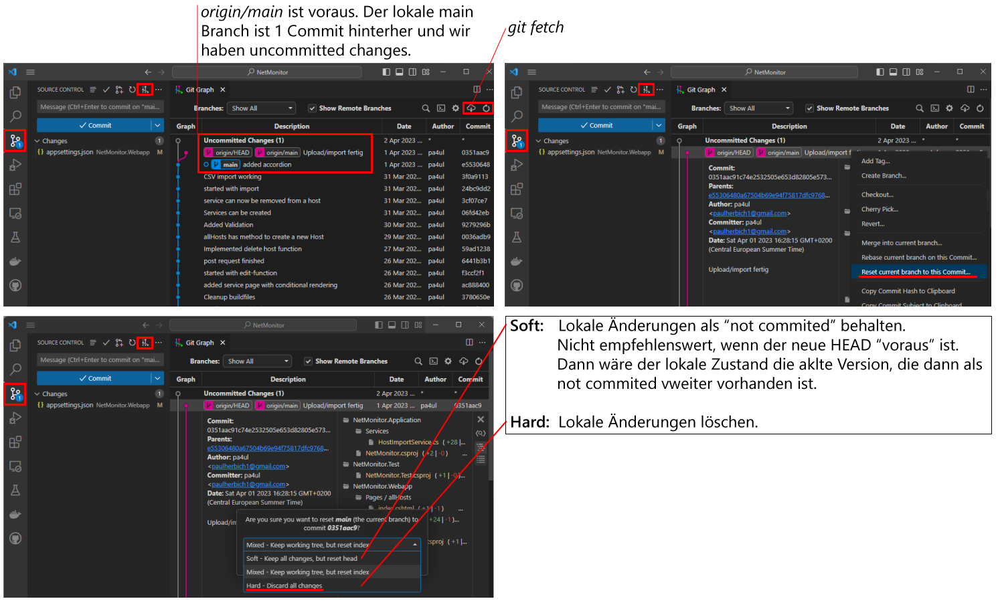

# git reset

Wenn ein Branch im remote Repository "voraus" ist (weil er auf einem anderen Rechner verändert wurde), wird der lokale Branch normalerweise durch ein *git pull --rebase* auf den aktuellen Stand gebracht.
Manchmal möchte man den lokalen Branch "ohne Rücksicht auf Verluste" auf den Stand des remote Repositories bringen und lokale Änderungen verwerfen.
Dafür kann *git reset* verwendet werden.
Betrachten wir folgendes Beispiel in der Graphansicht in VS Code:



Zuerst laden wir den neuen Stand mit dem Wolkensymbol (*git fetch*) auf den Rechner und aktualisieren die Ansicht.
Wir erkennen, dass der Branch *main* auf einem anderen Rechner verändert wurde.
Daher ist *origin/main* voraus.
Nun können wir auf den Text des Commits klicken und im Kontextmenü *Reset current branch* abrufen.
Achte darauf, dass du im richtigen Branch bist!
Da wir lokal nichts verändert haben, können wir die Option *Hard* verwenden.

### Konsolenbefehle

Natürlich kann auch in der git bash ein *git reset* durchgeführt werden.
Der Parameter *@{u}* verwendet den *upstream*, also das remote Repository.

```
git fetch
git reset --hard @{u}
```

## Andere Einsatzmöglichkeiten: Rückgängig machen von Commits

Natürlich kann *git reset* auch dazu verwendet werden, um Commits rückgängig zu machen.
Du kannst deinen lokalen Branch mit der Git Graph Extension in VS Code auch auf einen vorigen Commit zurücksetzen.
Wenn du die Option *soft* wählst, bleiben deine Änderungen in den Dateien erhalten.
Bei *hard* werden auch die Änderungen physisch entfernt.
Beim Übertragen in das Remote Repository muss dann ein *force push* gemacht werden.
Details zum *force push* sind im Kapitel [History](06_history.md) nachzulesen.

## Reset aller lokalen Branches

Oft möchte man auf Knopfdruck den lokalen Stand des Repositories auf den Stand des remote Repositories
"ohne Rücksicht auf Verluste" bringen. Das bedeutet, dass lokale Änderungen gegebenenfalls gelöscht
werden. Das ist nützlich, wenn man z. B. am Laptop arbeitet, in das remote Repo committed und
zu Hause am PC weiterarbeiten will.

Lege dafür ein Skript im Hauptverzeichnis des Repositories an und kopiere den nachfolgenden
Inhalt dorthin.

**resetGit.sh**
```bash
#!/bin/bash
# Setzt alle lokalen Branches zurück

git fetch --all --prune
current_branch=$(git branch --show-current)
for branch in $(git branch | tr '*' ' ')
do
    echo Reset branch $branch
    git checkout $branch &> /dev/null
    # git clean -df
    git reset --hard @{u} &> /dev/null
done

git checkout $current_branch &> /dev/null
echo "You are in Branch $current_branch" &> /dev/null
```

Committe danach diese Datei und spiele sie ins remote Repository. Wenn du die Datei zum Testen
ohne commit ausführst, wird sie natürlich verschwinden, da lokale Änderungen zurückgesetzt werden.

## Was passiert mit diesen Befehlen

- Zuerst wird mit *git fetch* der Stand des remote Repos auf den Rechner geladen, allerdings ohne
  die Dateien zu verändern (das ist der Unterschied zu *git pull*). Die Option *prune* löscht
  Branches, die es nicht mehr im remote Repository gibt.
- Danach durchläuft die Schleife alle branches, die von *git branch* zurückgegeben werden.
- Mit *git checkout* wird in jeden Branch gewechselt.
- *git clean -df* ist auskommentiert!
  Der Befehl löscht alle lokalen Dateien, die nicht unter Versionsverwaltung stehen.
  Vorsicht: Es werden auch die Dateien gelöscht, die im *.gitignore* ignoriert werden (z. B. Configs).
  Deswegen ist dieser Schritt auskommentiert.
  Du kannst ihn natürlich aktivieren wenn du möchtest.
- Mit *git reset --hard* wird auf den Stand des remote Repos (origin) gesetzt.
- Am Ende wird in den vorher aktiven Branch gewechselt.

