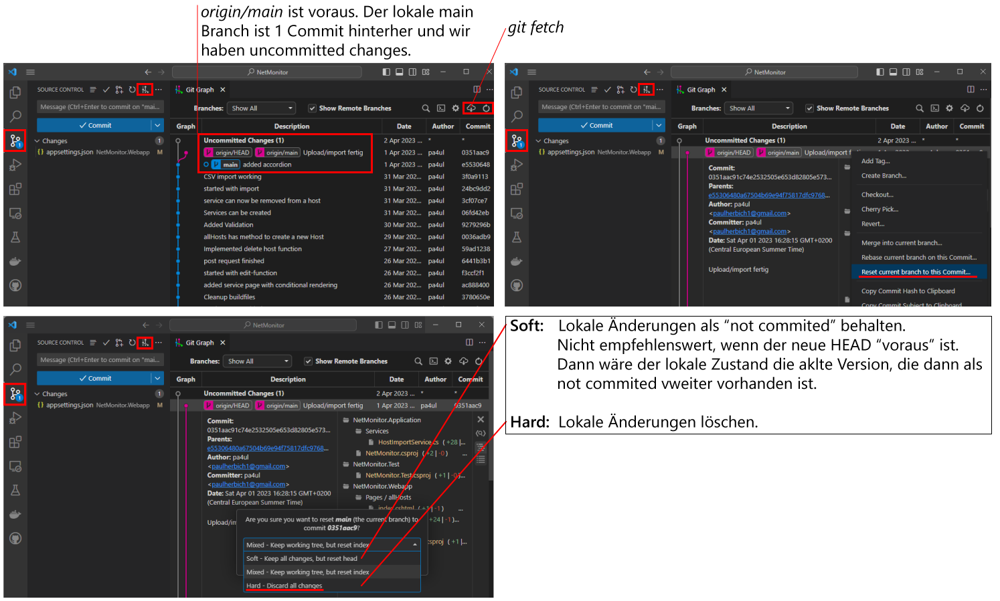

# Einen Branch zurücksetzen: git reset

Mit `git reset` setzt du einen Branch auf einen anderen Commit. Das brauchst du vor allem in zwei
Fällen:

1. Du willst deinen lokalen Stand verwerfen und den Stand von GitHub übernehmen.
2. Du willst deine letzten Commits rückgängig machen.

`git reset` hat drei Modi. Sie unterscheiden sich darin, was mit deinen Änderungen passiert:

| Modus                | Befehl                      | Was passiert mit den Änderungen?                                                                  |
| -------------------- | --------------------------- | ------------------------------------------------------------------------------------------------- |
| **Soft**             | `git reset --soft <commit>` | Sie bleiben in den Dateien und sind schon für den nächsten Commit vorgemerkt (*staged*).           |
| **Mixed** (Standard) | `git reset <commit>`        | Sie bleiben in den Dateien, sind aber nicht vorgemerkt.                                           |
| **Hard**             | `git reset --hard <commit>` | Sie werden gelöscht. Die Dateien sehen danach genau so aus wie im angegebenen Commit.             |

> **Achtung:** `--hard` löscht nicht committete Änderungen endgültig. Git kann sie nicht
> wiederherstellen.

## Den Stand von GitHub übernehmen

Neue Commits von GitHub holst du normalerweise mit `git pull --rebase`. Manchmal willst du deinen
lokalen Stand aber komplett verwerfen, z. B. weil du etwas ausprobiert hast, das nicht funktioniert.
Dann setzt du den Branch mit `git reset --hard` auf den Stand von GitHub.

### In VS Code

Das folgende Beispiel zeigt die Ansicht *Git Graph* in VS Code:



1. Lade mit dem Wolkensymbol (`git fetch`) den aktuellen Stand von GitHub.
2. Im Beispiel wurde `main` auf einem anderen Rechner verändert. `origin/main` ist deshalb einen
   Commit voraus. Außerdem gibt es eine nicht committete Änderung in `appsettings.json`. Diese
   Änderung wollen wir verwerfen.
3. Prüfe, ob du im richtigen Branch bist. Git Graph setzt immer den aktiven Branch zurück.
4. Klicke mit der rechten Maustaste auf den Commit von `origin/main` und wähle
   *Reset current branch to this Commit...*.
5. Wähle die Option *Hard - Discard all changes*.

### In der Konsole

```bash
git fetch
git reset --hard @{u}
```

`@{u}` steht für den *Upstream* des aktiven Branches, also z. B. `origin/main`. Git verwendet dabei
den Stand vom letzten `git fetch`. Deshalb kommt `git fetch` zuerst.

> `git reset --hard` löscht keine neuen Dateien, die noch nie committet wurden (*untracked files*).
> Diese Dateien löscht nur der Befehl `git clean` (siehe Skript unten).

## Commits rückgängig machen

### Commits, die noch nicht gepusht sind: `git reset`

Hast du Commits gemacht, aber noch nicht gepusht, machst du sie mit `git reset` rückgängig.
`HEAD~1` bedeutet "ein Commit vor dem aktuellen Commit".

```bash
git reset --soft HEAD~1
```

Der letzte Commit ist weg, seine Änderungen bleiben aber in deinen Dateien. So kannst du sie z. B.
korrigieren und neu committen.

```bash
git reset --hard HEAD~1
```

Der letzte Commit ist weg, und seine Änderungen sind auch aus den Dateien gelöscht.

In VS Code geht das auch mit *Git Graph*: Klicke mit der rechten Maustaste auf den Commit, zu dem
du zurück willst, und wähle *Reset current branch to this Commit...*.

### Commits, die schon gepusht sind

Waren die Commits schon auf GitHub, hat sich durch `git reset` die History geändert. Du brauchst
dann einen Force Push (`git push --force-with-lease`). Das ist nur in deinem **eigenen Feature
Branch** in Ordnung. Details zum Force Push stehen im Kapitel [History](06_history.md).

In `main` und in Branches, in denen andere Personen arbeiten, verwendest du stattdessen
`git revert`:

```bash
git revert <hash>
git push
```

`git revert` löscht keinen Commit. Git erstellt einen **neuen** Commit, der die Änderungen des
angegebenen Commits umkehrt. Die History bleibt erhalten, deshalb reicht ein normales `git push`.
In VS Code findest du den Befehl in *Git Graph* im Kontextmenü eines Commits (*Revert...*).

### Aus Versehen gelöscht? `git reflog`

Auch nach `git reset --hard` sind deine Commits nicht sofort verloren. Git merkt sich auf deinem
Rechner für einige Zeit (mindestens 30 Tage), auf welchen Commit dein Branch gezeigt hat. Diese
Liste zeigt `git reflog`:

```
a7c90d3 HEAD@{0}: reset: moving to HEAD~1
b41d7c2 HEAD@{1}: commit: Add inventory list
```

Mit `git reset --hard b41d7c2` holst du den Commit *Add inventory list* zurück. Nicht committete
Änderungen kann aber auch `git reflog` nicht wiederherstellen.

## Alle lokalen Branches zurücksetzen

Du arbeitest z. B. am Laptop, pushst deine Commits und willst dann zu Hause am PC weiterarbeiten.
Am PC sollen alle Branches genau den Stand von GitHub haben. Dafür kannst du ein Skript verwenden.

> **Achtung:** Das Skript löscht in **allen** lokalen Branches die Commits, die du noch nicht
> gepusht hast. Im aktiven Branch löscht es auch alle nicht committeten Änderungen. Pushe vorher
> alles, was du behalten willst.

Lege im Hauptordner des Repositories die Datei `resetGit.sh` an und kopiere den folgenden Inhalt
hinein:

**resetGit.sh**
```bash
#!/bin/bash
# Resets all local branches to the state of their upstream branches on the remote.
# WARNING: Unpushed commits and uncommitted changes are lost.

git fetch --all --prune
current_branch=$(git branch --show-current)

for branch in $(git branch --format='%(refname:short)')
do
    # Skip branches without an upstream (never pushed or deleted on the remote).
    if ! git rev-parse --verify --quiet "$branch@{u}" > /dev/null 2>&1; then
        echo "Skip branch $branch (no upstream)"
        continue
    fi

    echo "Reset branch $branch"
    if [ "$branch" = "$current_branch" ]; then
        # The checked out branch also needs its files reset.
        git reset --quiet --hard "@{u}"
        # git clean -df
    else
        # Other branches are moved without checking them out.
        git branch --quiet --force "$branch" "$branch@{u}"
    fi
done

echo "You are in branch $current_branch"
```

Committe und pushe die Datei danach, damit du sie auf allen Rechnern hast. In der Git Bash startest
du das Skript mit `bash resetGit.sh`.

### Was macht das Skript?

- `git fetch --all --prune` lädt den Stand von GitHub, ohne deine Dateien zu ändern. `--prune`
  entfernt Referenzen wie `origin/add-inventory`, wenn der Branch auf GitHub gelöscht wurde. Deine
  lokalen Branches löscht `--prune` nicht.
- `git branch --format='%(refname:short)'` liefert die Namen aller lokalen Branches. Die Schleife
  geht sie der Reihe nach durch.
- `git rev-parse --verify --quiet "$branch@{u}"` prüft, ob der Branch einen Upstream hat. Branches
  ohne Upstream überspringt das Skript. Das sind Branches, die du nie gepusht hast oder die auf
  GitHub gelöscht wurden.
- Im aktiven Branch setzt `git reset --hard @{u}` den Branch und die Dateien auf den Stand von GitHub.
- Alle anderen Branches setzt `git branch --force` auf den Stand von GitHub. Dafür muss das Skript
  nicht in diese Branches wechseln.
- `git clean -df` ist auskommentiert. Der Befehl löscht alle Dateien und Ordner, die nicht
  versioniert sind (*untracked files*). Dateien, die in `.gitignore` stehen (z. B. lokale
  Konfigurationen), löscht er nicht. Das macht erst die Option `-x`. Entferne das `#` nur, wenn du
  auch neue, nicht committete Dateien löschen willst.
