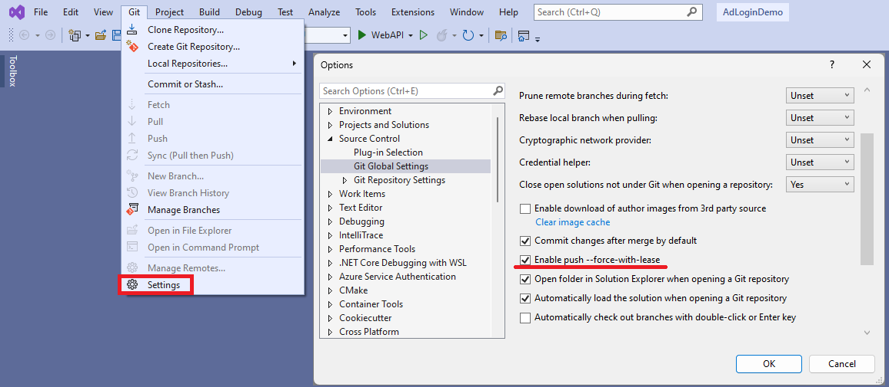
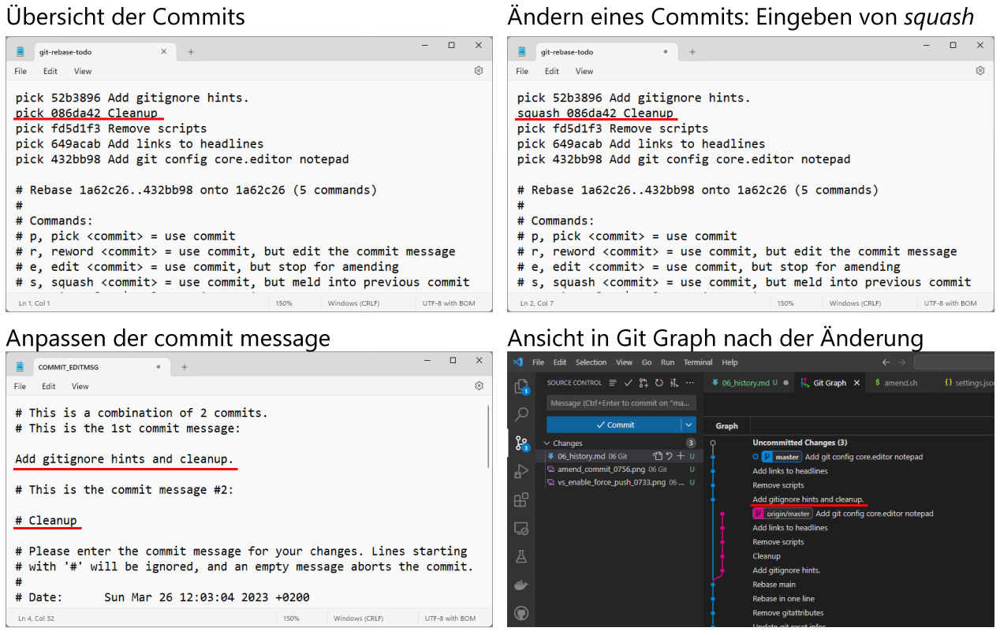

# Die History bearbeiten: Amend commit und interaktives rebase

Als History bezeichnen wir alle bisherigen Commits in das Repository.
Es gibt Operationen, die diese History nachträglich bearbeiten.

> **Vorsicht:** Ändere die History nur in deinen Feature Branches.
> Achte darauf, dass dein Feature Branch auf dem letzten Stand ist.
> Eine Änderung der History im Branch *main* soll nur in seltenen Ausnahmefällen geschehen, wenn auf bestehende Feature Branches geachtet wird.
> Grund: Bestehende Feature Branches, die von *main* ausgehen, haben dann eine divergierende History, die dann Probleme bereitet.

## Vorbereitung: Aktivieren von *force push* in VS Code oder Visual Studio

Wenn die History neu geschrieben wird, reicht ein normales *git push* nicht mehr aus.
Erst der Parameter *--force* ermöglicht aus Sicherheitsgründen ein Neuschreiben der History.
In der IDE kann diese Option auch gesetzt werden.

### VS Code

Öffne in Visual Studio Code mit *F1* oder *⌘ + Shift + P* die Command Palette.
Gib dann die Option *Open User Settings (JSON)* ein.
Es öffnet sich die Datei *settings.json*, in der du die folgende Option einfügen kannst:

```javascript
"git.allowForcePush": true
```

### Visual Studio

In Visual Studio muss der *force push* ebenfalls aktiviert werden.
Gehe dazu im Menü *Git* auf den Punkt *Settings* und aktiviere *force push*:



### Setzen des Editors für git

Manche der gezeigten Operationen erfordern eine Eingabe über einen Editor.
Git öffnet - wenn es nicht anders konfiguriert wurde - den Editor *vi*.
Möchtest du unter Windows den gewohnten Windows Editor verwenden, kann folgender Befehl in der Konsole eingegeben werden:

```
git config core.editor notepad
```

## Den letzten Commit neu schreiben: Der amend commit

Manchmal wurde eine Änderung bereits durch einen Commit in das Repository geschrieben, es muss aber noch eine Änderung vorgenommen werden.
Anstatt eines neuen Commits gibt es die Möglichkeit, den letzten Commit neu zu schreiben.
Dies bezeichnet man als *amend commit*.
Speichere deine Änderung in den Dateien normal ab.
Danach kannst du in Visual Studio oder Visual Studio Code den *amend commit* auswählen:


Da die History neu geschrieben wurde, ist ein *force push* notwendig.
In Visual Studio Code muss unter *Pull, Push* der entsprechende Punkt ausgewählt werden.
In Visual Studio fragt die IDE beim Klicken auf den push Button, ob ein *force push* durchgeführt werden soll.

In Visual Studio Code wird in einem Editor noch die Nachricht des letzten Commits angezeigt.
Diese kannst du - wenn nötig - ändern.
Falls nicht, schließe einfach den Tab bzw. den Editor.
Erst dann wird der Commit durchgeführt.

#### In der Konsole

Natürlich gibt es auch in der git bash die Möglichkeit, einen *amend commit* zu erstellen.
Zuerst werden mit *git add* neue Dateien zur Versionsverwaltung hinzugefügt.
Danach wird mit *git commit* und der Option *amend* der Commit erstellt.
Die Option *no-edit* gibt an, dass wir die commit message nicht verändern wollen.
Danach wird mit *git push* die Änderung in das remote Repository geschrieben.

```
git add -A && git commit --amend --no-edit && git push --force
```

## Mehr von der History bearbeiten: Der interaktive Rebase, squash commits

Mit dem *interaktiven rebase* können wir eine Liste aller Commits im Editor öffnen.
Danach können wir verschiedene Operationen starten. Wir wollen mit einem *squash* 2 Commits nachträglich zusammenführen.
Dafür wollen wir die letzten 5 Commits bearbeiten.
Durch den folgenden Befehl wird der Editor mit den letzten 5 Commits geöffnet:

```
git rebase -i HEAD~5
```

Nun können wir den Commit *Cleanup* mit dem Commit *Add gitignore hints* zusammenführen.
Die Commits werden von oben nach unten verarbeitet, d. h. wir wählen den zweiten Commit (*Cleanup*).
Danach schreiben wir statt *pick* den Befehl *squash*.
Nun wird der Editor geschlossen und die Änderung gespeichert.
Nach dem Speichern fragt git, welche neue Commit Message verwendet werden soll.
Dafür kommentieren wir die zweite (alte) Commit Message mit Raute (#) aus und passen die erste Nachricht an.
Nach dem Speichern sind die Commits nun zusammengeführt.



Zum Übertragen ist ein *force push* nötig, da wir die History geändert haben.

Sollen alle Commits ausgewählt werden, kann statt HEAD auch *root* verwendet werden.
Es ist aber meist fraglich, ob wirklich alle Commits neu geschrieben werden sollen.
Sinnvoll wäre dieser Befehl nur in einem sehr frühen Stadium des Projektes, wo mehrere Schritte zusammengefasst werden sollen.

```
git rebase -i --root
```
