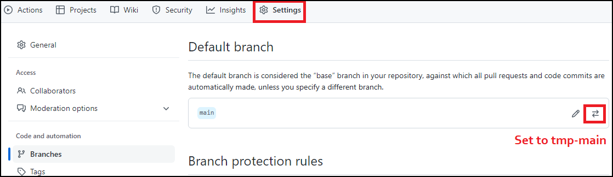
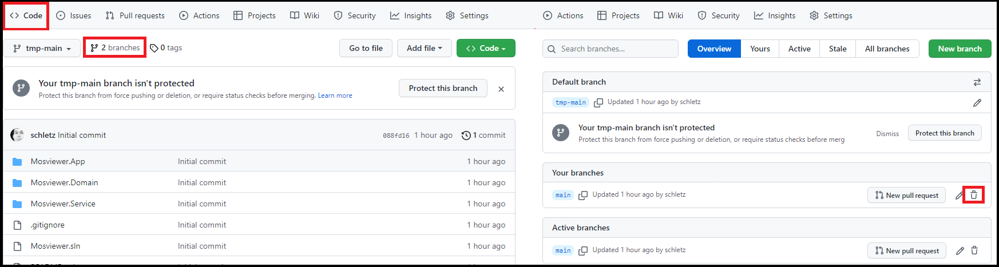
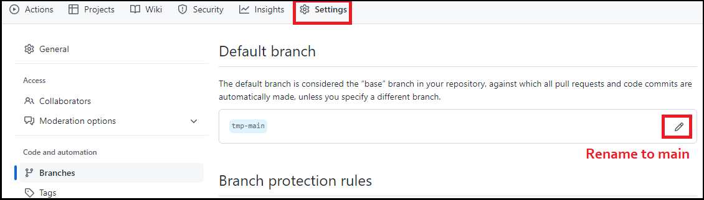

# Git History löschen, Autor ändern

> **Achtung:** Dies ist eine destruktive Operation, d. h. sie kann nicht rückgängig gemacht werden.

## Gesamte History löschen

Die History eines git repos umfasst viele commits, branches, ... Am Ende eines Semesters möchtest
du vielleicht mit dem aktuellen Stand "wieder von 0" beginnen. Um die gesamte History zu löschen,
wird so vorgegangen:

- Es wird ein neuer Branch (z. B. *tmp-main*) erstellt, der "orphaned" (losgelöst) ist.
- Der Branch *tmp-main* wird in das remote Repository (zum "origin") übertragen.
- In Github wird der Branch als neuer default Branch definiert.
- Der alte main Branch wird gelöscht.
- Der Branch *tmp-main* wird in main umbenannt.

Das ist natürlich eine sehr drastische Maßnahme. Als Konsequenz

- haben alle bestehenden feature Branches eine ungültige History, daher sind sie wertlos.
- werden die lokalen Repositories sozusagen "ungültig", sprich: sie können nicht mehr in das
  remote Repository übertragen werden.

Diese Operationen werden wir im Terminal durchführen. Achte vorher, dass das lokale Repository
auf dem letzten Stand ist.

**1 Kontrolliere deinen lokalen Branch**

Öffne das Terminal im Verzeichnis deines lokalen Repositories. Prüfe mit `git branch`, ob du
auch im richtigen Branch bist.

**2 Anlegen von *tmp-main* und committen aller Dateien**

Die folgenden 4 Befehle erstellen einen losgelösten (orphaned) Branch *tmp-main*. Er hat
keine History, deswegen musst du mit *git add -A* einmal alle Dateien unter Versionskontrolle stellen.
Die Commitmeldung bei *git commit* musst du natürlich anpassen, z. B. *Final state 1st term* wenn
nach dem Semesterschluss das Projekt einen Zwischenstand erreicht hat.

Am Schluss wird mit *git push* der Branch in das remote Repository übertragen, damit er auf
Github auch zur Verfügung steht.

```
git checkout --orphan tmp-main
git add -A
git commit -m "Wer alles 1:1 kopiert dem kann nicht mehr geholfen werden."
git push --set-upstream origin tmp-main
```

**3 Setzen des neuen main Branches**

Öffne im Browser dein Repository auf https://github.com.
Zuerst musst du unter *Settings* - *Branches* den Branch *tmp-main* zum default Branch machen.



Danach lösche unter *Code* den alten *main* Branch, indem du die Branches auflistet und auf löschen klickst.



Nun kannst du den Branch *tmp-main* auf main umbenennen.



**4 Löschen aller feature Branches**

Lösche auch alle feature Branches in Github. Sie können sowieso nicht mehr in den neuen *main* branch commited werden, da die History gelöscht wurde.

**5 Löschen und neues Klonen des lokalen Repos**


Am Besten alle Leute im Team löschen nun ihr lokales Repo und klonen mit *git clone* das Repo erneut auf ihren Rechner.

## Den Autor ändern

Möchtest du den Autor **aller** Commits im Repository ändern, starte die git bash im Hauptverzeichnis deines Repositories.
Danach führe die folgenden Befehle aus.
Natürlich müssen die Variablen *CORRECT_NAME* und *CORRECT_EMAIL* angepasst werden.

```bash
export FILTER_BRANCH_SQUELCH_WARNING=1 && git filter-branch -f --env-filter '
  CORRECT_NAME="Firstname Lastname"
  CORRECT_EMAIL="ichbinauchfürsschummelnzudumm@spengergasse.at"
  export GIT_AUTHOR_NAME="$CORRECT_NAME"
  export GIT_AUTHOR_EMAIL="$CORRECT_EMAIL"
  export GIT_COMMITTER_NAME="$CORRECT_NAME"
  export GIT_COMMITTER_EMAIL="$CORRECT_EMAIL"
' --tag-name-filter cat -- --branches --tags

git push --force --tags origin 'refs/heads/*'
```

Eine Abwandlung, nämlich das Ändern eines einzelnen Autors, ist auf [Stackoverflow](https://stackoverflow.com/questions/3042437/how-to-change-the-commit-author-for-a-single-commit) dokumentiert.

```bash
export FILTER_BRANCH_SQUELCH_WARNING=1 && git filter-branch --env-filter '
  OLD_EMAIL="your-old-email@example.com"
  CORRECT_NAME="Firstname Lastname"
  CORRECT_EMAIL="ichbinauchfürsschummelnzudumm@spengergasse.at"
  if [ "$GIT_COMMITTER_EMAIL" = "$OLD_EMAIL" ]
  then
      export GIT_COMMITTER_NAME="$CORRECT_NAME"
      export GIT_COMMITTER_EMAIL="$CORRECT_EMAIL"
  fi
  if [ "$GIT_AUTHOR_EMAIL" = "$OLD_EMAIL" ]
  then
      export GIT_AUTHOR_NAME="$CORRECT_NAME"
      export GIT_AUTHOR_EMAIL="$CORRECT_EMAIL"
  fi
' --tag-name-filter cat -- --branches --tags

git push --force --tags origin 'refs/heads/*'
```

Hinweis: Das Datum kann mit den Variablen *GIT_AUTHOR_DATE* und *GIT_COMMITTER_DATE* ebenfalls gesetzt werden, siehe https://git-scm.com/docs/git-commit-tree.
